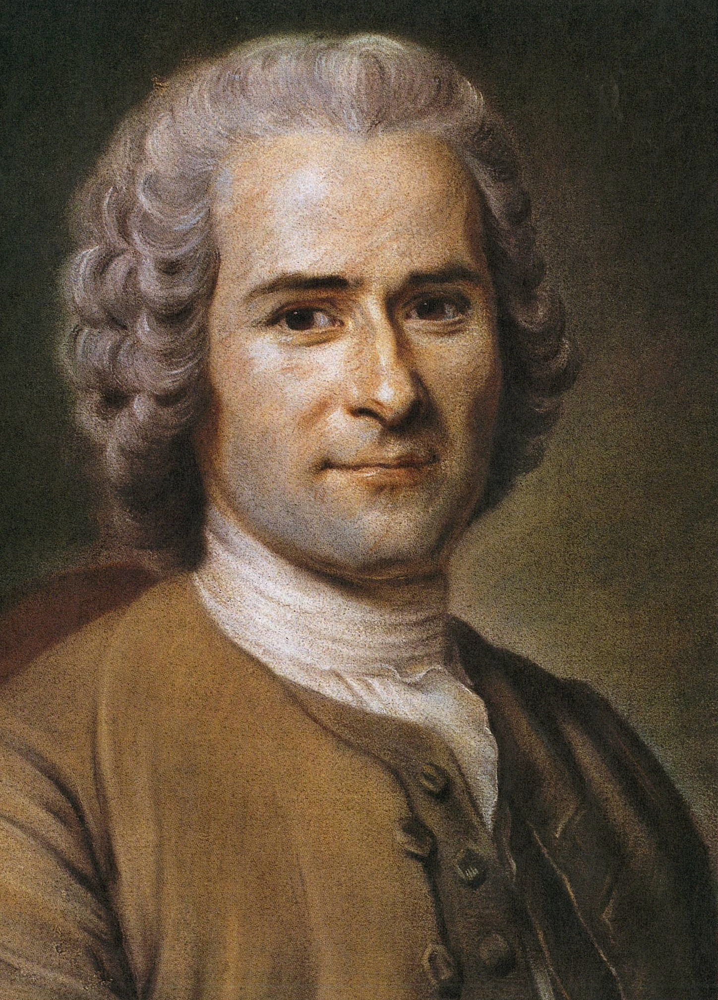

# Rousseau's Discourse on Inequality Theory

## Natural good
- Humans begin as "noble savages," prioritizing natural goods: tranquility, happiness, love, and contentment with simple pleasures.

## Social good
- Social comparison creates artificial hierarchies. When people see others' possessions and status, they develop desires for "social goods" (wealth, prestige, luxury, mating status) and prioritize these over natural goods.
- [MYTAKE] When you gain clear awareness of ranking criteria and see people positioned above you in social hierarchies, this exposure instantly generates a necessity to acquire more social goods and improve your ranking position.
- [KEY] Degree of necessity of status improvement = Status Distance × Exposure Frequency x Belief Weight × Metric Intelligibility

## Why These Goods Conflict
- This creates perpetual meaningless of life: because pursuing social goods end up (in practice) making you deprioritize and even forget the natural goods, for example a corporate leader that focus too much in their career and end up getting divorced

# Syllogistic Argument

**Major Premise**: Social comparison intensifies when people are constantly exposed to status symbols and have numerous opportunities for comparison with others. 
**More comparison increases conflict** because each exposure creates new desires for social goods, which are inherently scarce and require outcompeting others, thus directly opposing natural goods that come from contentment with what one already has.

**Minor Premise**: Redmond provides fewer status symbols and comparison opportunities than New York:

**Status Symbol Density:**
- **New York**: Elite universities (Columbia, NYU), luxury brands on every street, Michelin-starred restaurants, high-end galleries, exclusive clubs, designer boutiques—each encounter sparks desire for social positioning
- **Redmond**: Fewer prestigious institutions, limited luxury retail, suburban uniformity reduces visible status markers that trigger competitive desires

**Population Density & Comparison Opportunities:**
- **New York**: 8.3 million people create endless daily encounters with wealth disparities—seeing thousands of strangers daily provides constant SUBCONSCIOUS comparison points that accumulate into perpetual dissatisfaction
- **Redmond**: ~70,000 people means fewer daily encounters, familiar faces replace anonymous competition, smaller social circles limit comparison scope and allow natural contentment to persist

**Conclusion**: Therefore, Redmond's lower density of status symbols and reduced population density create fewer opportunities for the social comparison that corrupts natural contentment, making it less morally corrupting than New York.