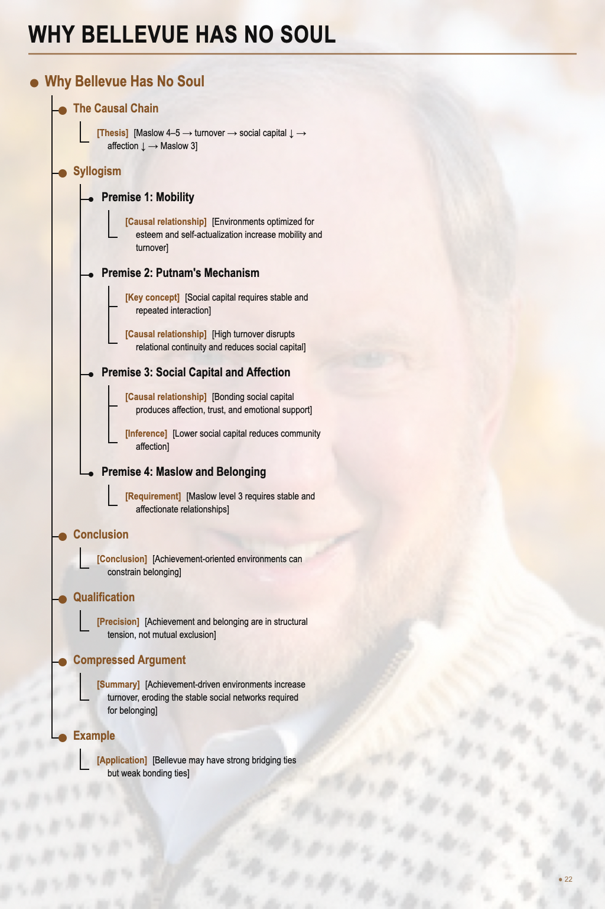

# Why Bellevue Has No Soul

## The Causal Chain

- [Thesis] [Maslow 4–5 → turnover → social capital ↓ → affection ↓ → Maslow 3]

## Syllogism

### Premise 1: Mobility

- [Causal relationship] [Environments optimized for esteem and self-actualization increase mobility and turnover] Places that strongly satisfy Maslow levels 4–5 attract ambition and career optimization.

### Premise 2: Putnam's Mechanism

- [Key concept] [Social capital requires stable and repeated interaction] In Robert Putnam's *Bowling Alone*, social capital consists of networks, trust, and norms sustained through repeated interaction among the same groups. This is the argument's only non-obvious premise.
- [Causal relationship] [High turnover disrupts relational continuity and reduces social capital] The loss is especially pronounced in bonding and network ties.

### Premise 3: Social Capital and Affection

- [Causal relationship] [Bonding social capital produces affection, trust, and emotional support]
- [Inference] [Lower social capital reduces community affection]

### Premise 4: Maslow and Belonging

- [Requirement] [Maslow level 3 requires stable and affectionate relationships] Love and belonging depend on relational continuity.

## Conclusion

- [Conclusion] [Achievement-oriented environments can constrain belonging] Environments optimized for Maslow levels 4–5 tend to increase turnover, weakening the stable relationships needed for social capital and thereby constraining Maslow level 3.

## Qualification

- [Precision] [Achievement and belonging are in structural tension, not mutual exclusion] The claim is not that Maslow levels 3, 4, and 5 cannot coexist; it is that maximizing levels 4–5 tends to undermine level 3.

## Compressed Argument

- [Summary] [Achievement-driven environments increase turnover, eroding the stable social networks required for belonging]

## Example

- [Application] [Bellevue may have strong bridging ties but weak bonding ties] A high-mobility city can offer opportunity networks while providing less deep affection than a more stable community.
