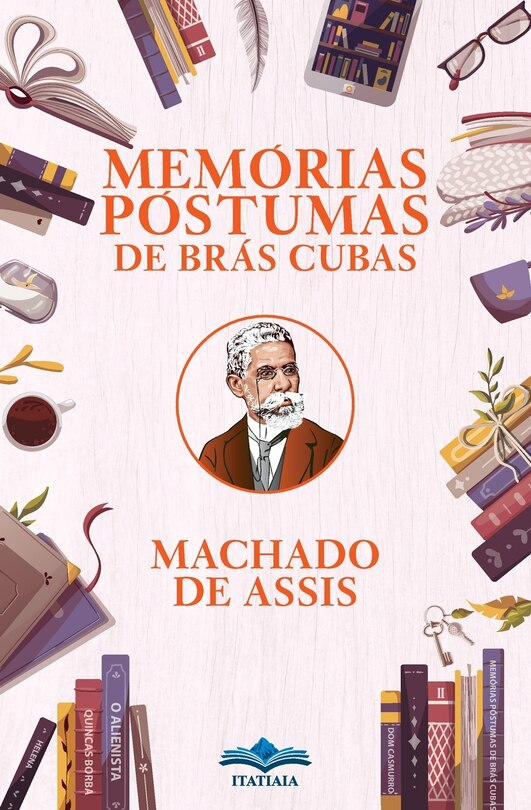
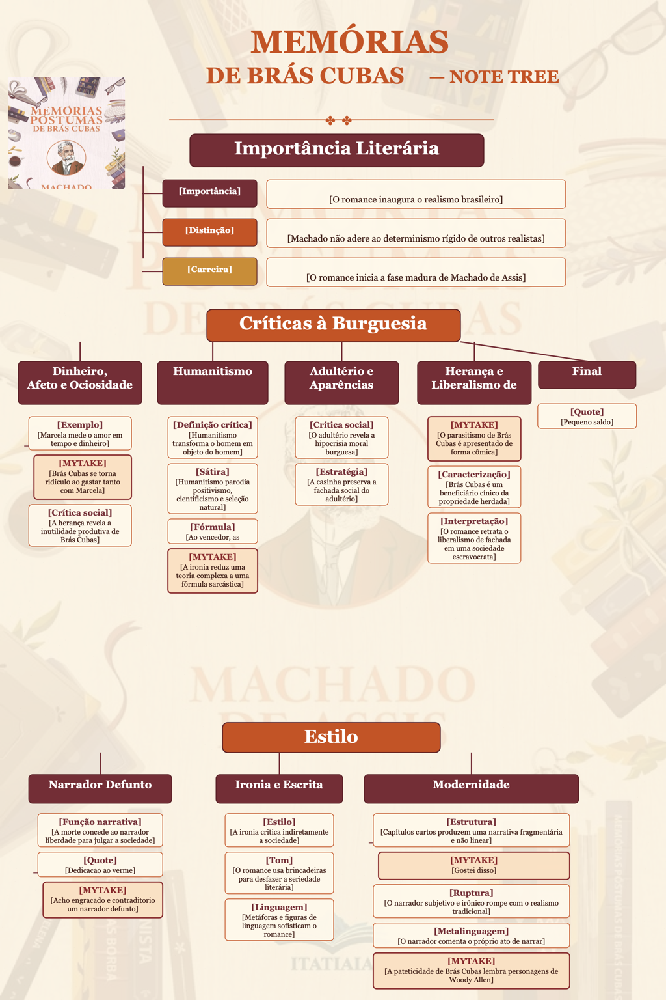

# Importância Literária

- [Importância] [O romance inaugura o realismo brasileiro] *Memórias Póstumas de Brás Cubas* é considerado um marco do realismo brasileiro e inaugura essa escola literária no país.
- [Distinção] [Machado não adere ao determinismo rígido de outros realistas] Machado de Assis não adere ao determinismo rígido característico de outros autores realistas. Machado de Assis é diferente. Ele reconhece a importância da classe, do dinheiro e das convenções sociais, mas seus personagens não são simples produtos mecânicos do ambiente. Brás Cubas também é formado por vaidade, autoengano, desejo, ressentimento e escolhas pessoais. Sua conduta não pode ser explicada por uma única causa.
- [Carreira] [O romance inicia a fase madura de Machado de Assis] 

# Críticas à Burguesia

## Dinheiro, Afeto e Ociosidade

- [Exemplo] [Marcela mede o amor em tempo e dinheiro] “Marcela amou-me durante quinze meses e onze contos de réis.”
  - [MYTAKE] [Brás Cubas se torna ridículo ao gastar tanto com Marcela] É meio ridículo o fato de ele ter dado todo aquele dinheiro.
- [Crítica social] [A herança revela a inutilidade produtiva de Brás Cubas] Após a morte de seu pai, Brás Cubas briga temporariamente com sua irmã Sabina e seu cunhado Cotrim por causa da herança. Até esse momento, o narrador-personagem não produziu nada próprio: apenas elaborou planos fracassados, como o casamento, e desfrutou do dinheiro paterno. Machado de Assis parece mostrar a inutilidade social do personagem, uma espécie de sanguessuga que nada produz e em nada contribui para o crescimento da nação.

## Humanitismo

- [Definição crítica] [Humanitismo transforma o homem em objeto do homem] Para os críticos, o Humanitismo constitui a ideia do “império da lei do mais forte, do mais rico e do mais esperto”.[4] Antonio Candido escreveu que a essência do pensamento machadiano é “a transformação do homem em objeto do homem”, uma das maldições ligadas à falta de verdadeira liberdade econômica e espiritual.[5]
- [Sátira] [Humanitismo parodia positivismo, cientificismo e seleção natural] Os críticos observam que o Humanitismo de Machado é uma sátira ao positivismo de Auguste Comte, ao cientificismo do século XIX e à teoria de Charles Darwin sobre a seleção natural.[6]
- [Fórmula] [Ao vencedor, as batatas] A teoria do “ao vencedor, as batatas” parodia a ciência da época de Machado e sua divulgação, desnudando ironicamente o caráter desumano e antiético da “lei do mais forte”.
- [MYTAKE] [A ironia reduz uma teoria complexa a uma fórmula sarcástica] É interessante como Machado compara o Humanitismo à teoria da evolução, que, apesar de sua complexidade, pode ser resumida sarcasticamente na expressão “ao vencedor, as batatas”.

## Adultério e Aparências

- [Crítica social] [O adultério revela a hipocrisia moral burguesa] O adultério é recorrente nos romances realistas do século XIX e aparece como crítica à hipocrisia burguesa: a classe defendia valores morais e familiares que, ao que parece, serviam apenas para manter as aparências.
- [Estratégia] [A casinha preserva a fachada social do adultério] Brás Cubas pensa em fugir com a amante, mas encontra uma solução que preserva melhor as aparências: alugar uma “casinha” para os encontros. Como fachada, D. Plácida é escolhida para morar ali como se a casa fosse dela.

## Herança e Liberalismo de Fachada

- [MYTAKE] [O parasitismo de Brás Cubas é apresentado de forma cômica] KKKKKKKKKKKKKKKKK.
- [Caracterização] [Brás Cubas é um beneficiário cínico da propriedade herdada] Brás Cubas seria um beneficiário cínico que, como escreve no capítulo final, não trabalhou nem pagou o pão com o suor do rosto,[45] em alusão ao Gênesis: “No suor do teu rosto comerás o teu pão”.[46]
- [Interpretação] [O romance retrata o liberalismo de fachada em uma sociedade escravocrata] Roberto Schwarz descreve a obra como um retrato do liberalismo de fachada que convivia com o regime escravocrata.[48]

# Final
- [Quote] [Pequeno saldo] “Este último capítulo é todo de negativas. Não alcancei a celebridade do emplasto, não fui ministro, não fui califa, não conheci o casamento. Verdade é que, ao lado dessas faltas, coube-me a boa fortuna de não comprar o pão com o suor do meu rosto. Mais; não padeci a morte de D. Plácida, nem a semidemência do Quincas Borba. Somadas umas coisas e outras, qualquer pessoa imaginará que não houve míngua nem sobra, e conseguintemente que saí quite com a vida. E imaginará mal; porque ao chegar a este outro lado do mistério, achei-me com um pequeno saldo, que é a derradeira negativa deste capítulo de negativas: — Não tive filhos, não transmiti a nenhuma criatura o legado da nossa miséria.”

# Estilo

## Narrador Defunto

- [Função narrativa] [A morte concede ao narrador liberdade para julgar a sociedade] Críticos sociológicos entendem que a condição de protagonista morto permite a Brás narrar sua vida com “total isenção” e inteiramente “desvinculado de qualquer relação com a sociedade”. O descomprometimento proporcionado pela morte lhe dá o poder de dizer, falar, zombar e criticar quem e o que quiser.
- [Quote] [Dedicacao ao verme] “Ao verme que primeiro roeu as frias carnes do meu cadáver dedico como saudosa lembrança estas memórias póstumas”
- - [MYTAKE] [Acho engracado e contraditorio um narrador defunto]

## Ironia e Escrita

- [Estilo] [A ironia critica indiretamente a sociedade] Machado de Assis emprega a ironia de forma magistral, com um tom debochado e indireto para criticar a sociedade e os valores da época.
- [Tom] [O romance usa brincadeiras para desfazer a seriedade literária] Apesar de sua profundidade, o livro não se leva a sério: suas brincadeiras e ironias desconstroem a seriedade tradicional da literatura da época.
- [Linguagem] [Metáforas e figuras de linguagem sofisticam o romance] A obra é rica em metáforas e figuras de linguagem que contribuem para sua beleza e sofisticação estilística.

## Modernidade

- [Estrutura] [Capítulos curtos produzem uma narrativa fragmentária e não linear] A narrativa é composta por capítulos curtos e não segue uma ordem linear, refletindo a complexidade da vida real e a maneira como histórias são contadas no cotidiano.
- - [MYTAKE] [Gostei disso] Acho legal esses capitulos curtos, pois as vezes na vida se passam muito tempo com besteiras assim como o livro. Me parece um livro bem realista de certa forma. Principalmente femenologicamente
- [Ruptura] [O narrador subjetivo e irônico rompe com o realismo tradicional] Diferentemente da objetividade característica do narrador em obras de Flaubert, Machado rompe com essa tradição por meio de um narrador subjetivo e irônico.
- [Metalinguagem] [O narrador comenta o próprio ato de narrar] Machado comenta frequentemente o ato de narrar, estabelece uma relação direta com o leitor e evidencia a artificialidade da narrativa.
- [MYTAKE] [A pateticidade de Brás Cubas lembra personagens de Woody Allen] A pateticidade de Brás Cubas lembra, em certa medida, os personagens de Woody Allen: suas reflexões irônicas e autodepreciativas expõem as fragilidades humanas de maneira cômica e melancólica. Muitas vezes preferio personagens assim do que personagens que se levam a sério demais, como os de Dostoiévski, por exemplo. Da um tom mais leve e divertido a vida.
