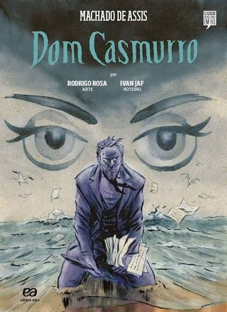
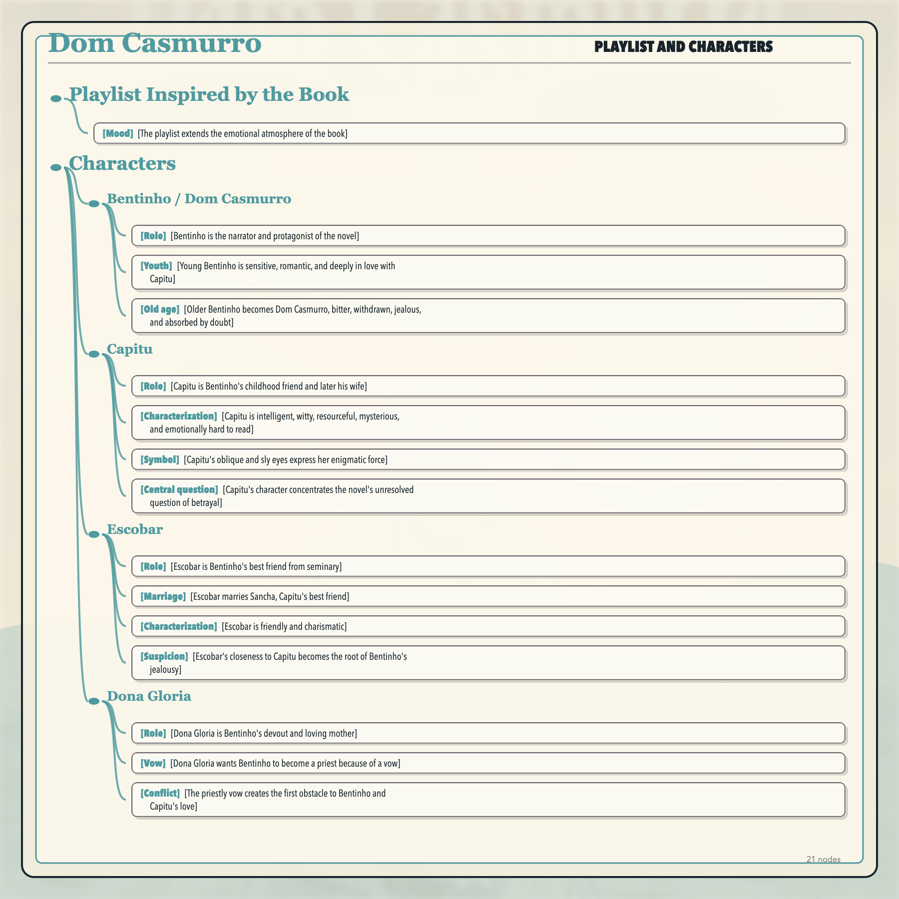
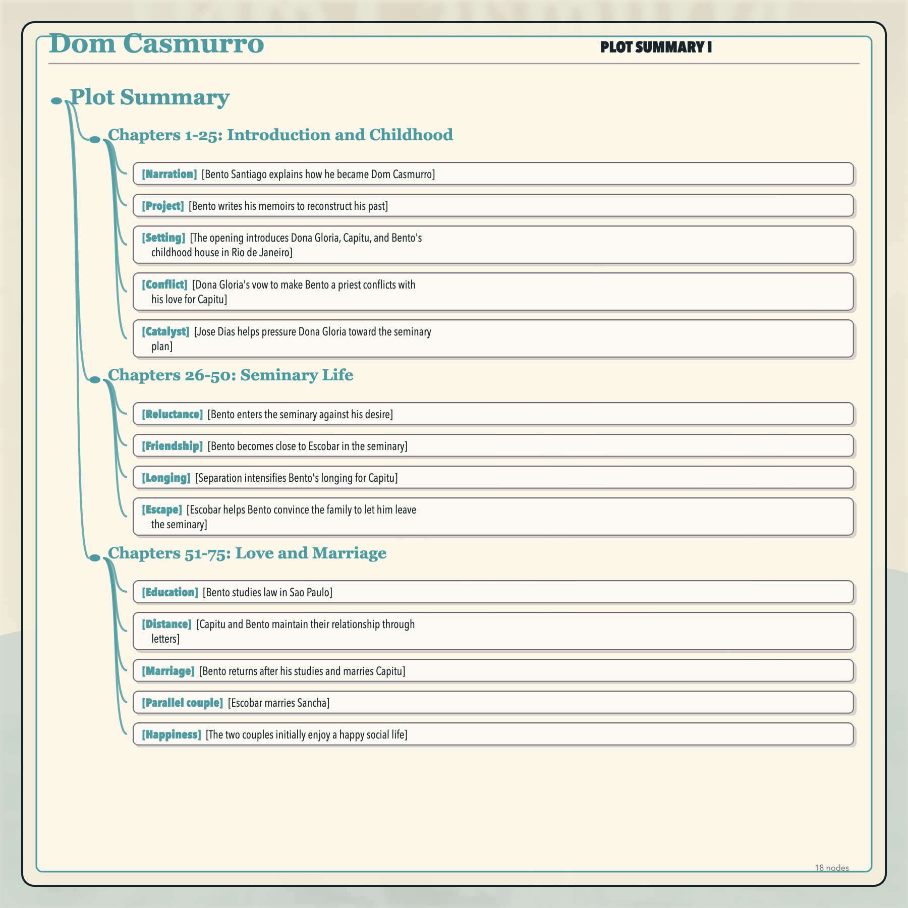
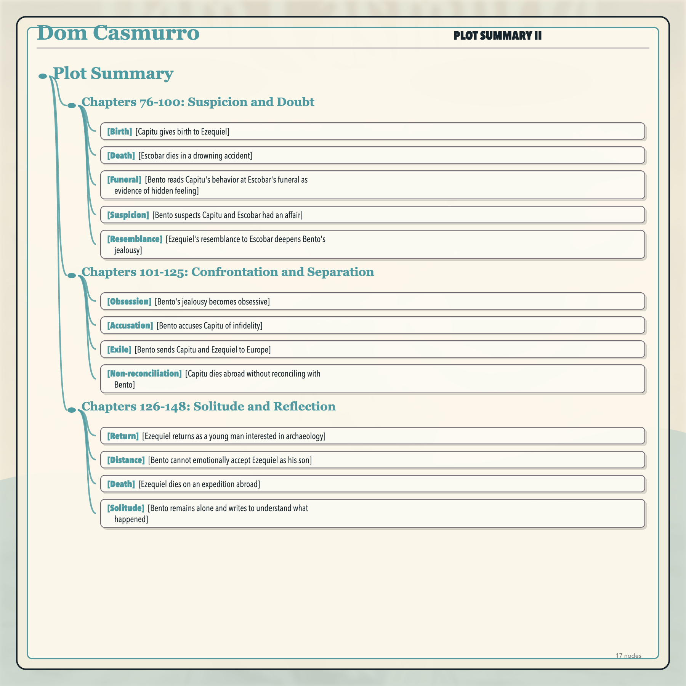
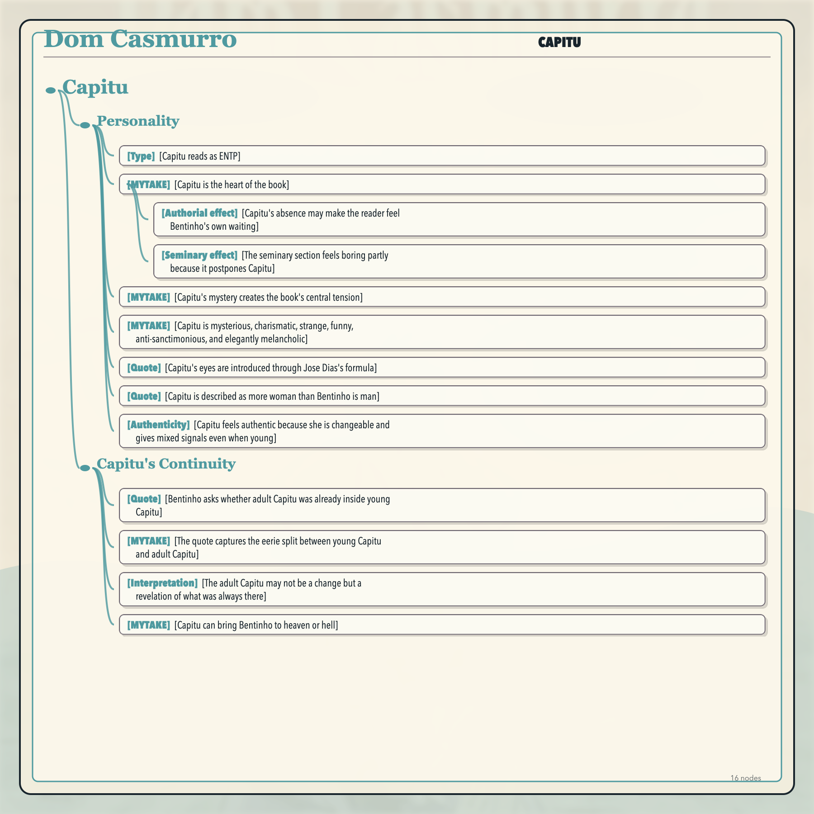
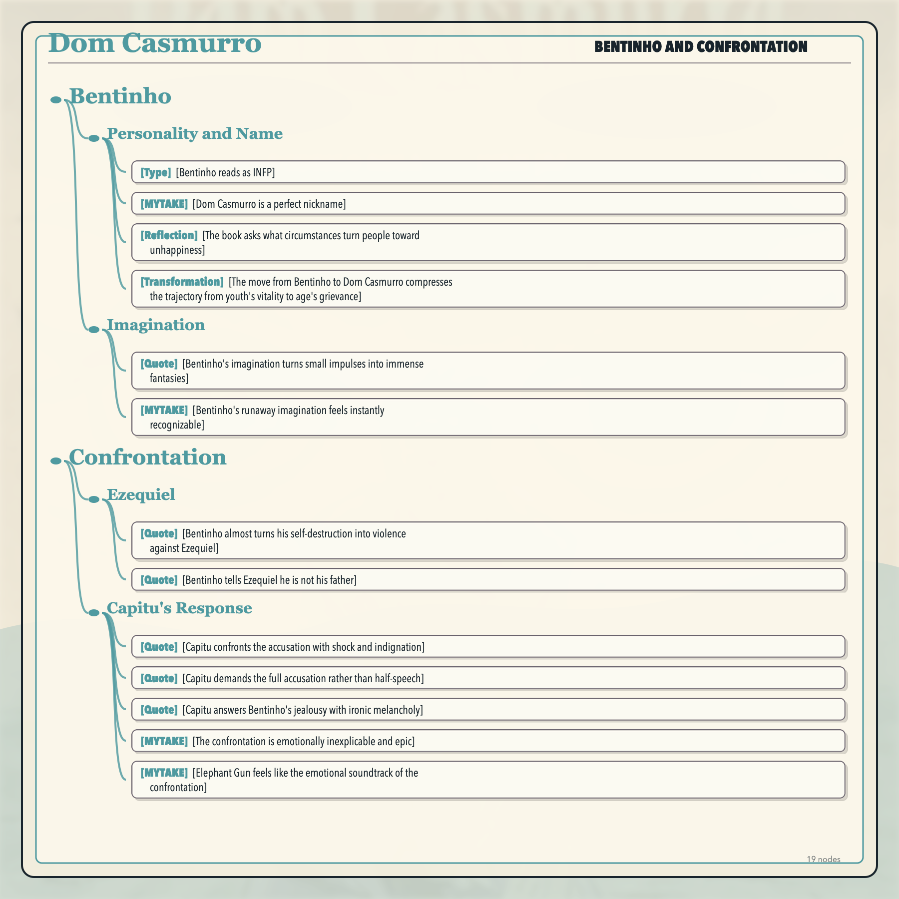
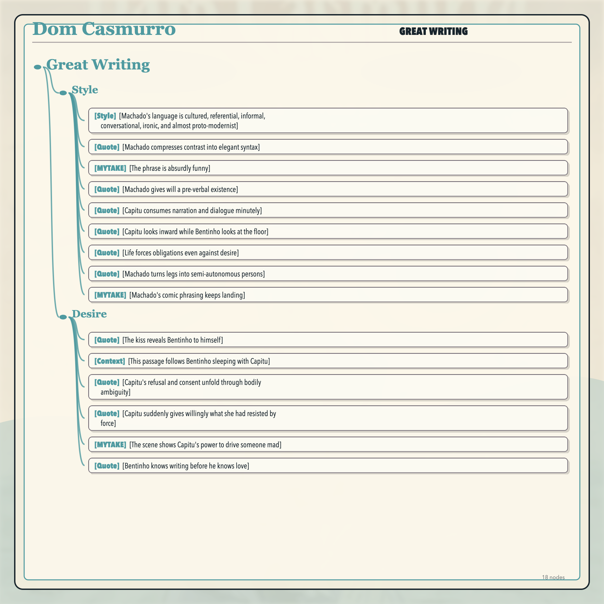
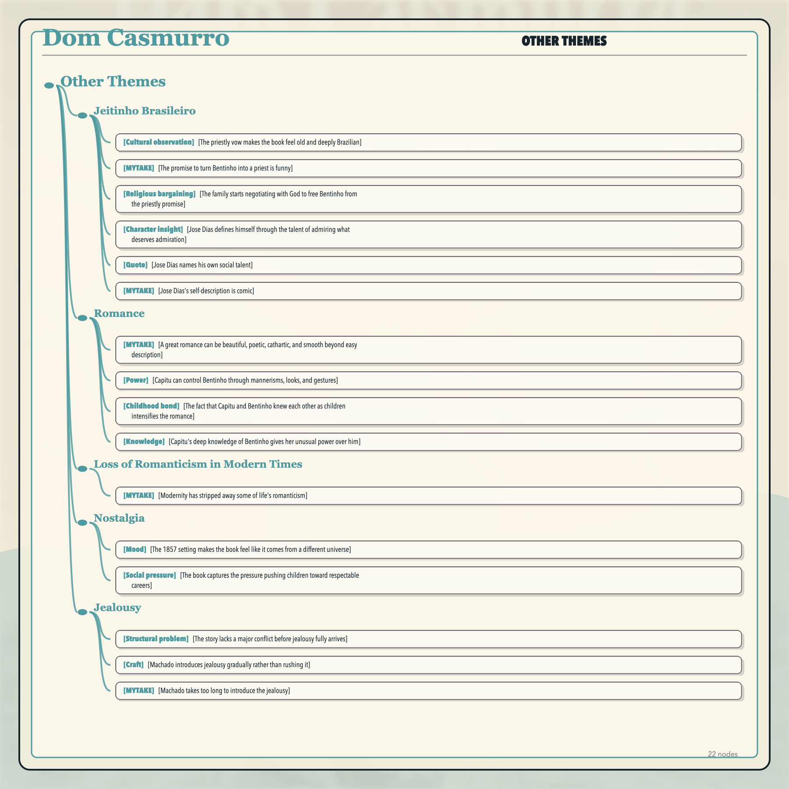
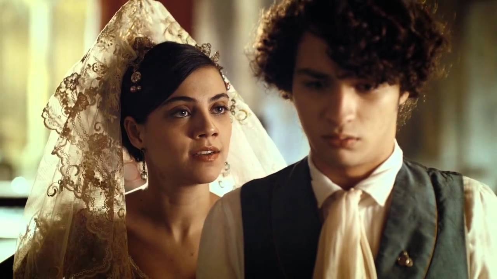

## Playlist Inspired by the Book

- [Mood] [The playlist extends the emotional atmosphere of the book]

<iframe style="border-radius:12px" src="https://open.spotify.com/embed/playlist/3jEjdddMHaoNmCyHNOmtfN?utm_source=generator" width="100%" height="352" frameBorder="0" allowfullscreen="" allow="autoplay; clipboard-write; encrypted-media; fullscreen; picture-in-picture" loading="lazy"></iframe>

# Characters

## Bentinho / Dom Casmurro

- [Role] [Bentinho is the narrator and protagonist of the novel]
- [Youth] [Young Bentinho is sensitive, romantic, and deeply in love with Capitu]
- [Old age] [Older Bentinho becomes Dom Casmurro, bitter, withdrawn, jealous, and absorbed by doubt]

## Capitu

- [Role] [Capitu is Bentinho's childhood friend and later his wife]
- [Characterization] [Capitu is intelligent, witty, resourceful, mysterious, and emotionally hard to read]
- [Symbol] [Capitu's oblique and sly eyes express her enigmatic force]
- [Central question] [Capitu's character concentrates the novel's unresolved question of betrayal]

## Escobar

- [Role] [Escobar is Bentinho's best friend from seminary]
- [Marriage] [Escobar marries Sancha, Capitu's best friend]
- [Characterization] [Escobar is friendly and charismatic]
- [Suspicion] [Escobar's closeness to Capitu becomes the root of Bentinho's jealousy]

## Dona Gloria

- [Role] [Dona Gloria is Bentinho's devout and loving mother]
- [Vow] [Dona Gloria wants Bentinho to become a priest because of a vow]
- [Conflict] [The priestly vow creates the first obstacle to Bentinho and Capitu's love]

# Plot Summary

## Chapters 1-25: Introduction and Childhood

- [Narration] [Bento Santiago explains how he became Dom Casmurro]
- [Project] [Bento writes his memoirs to reconstruct his past]
- [Setting] [The opening introduces Dona Gloria, Capitu, and Bento's childhood house in Rio de Janeiro]
- [Conflict] [Dona Gloria's vow to make Bento a priest conflicts with his love for Capitu]
- [Catalyst] [Jose Dias helps pressure Dona Gloria toward the seminary plan]

## Chapters 26-50: Seminary Life

- [Reluctance] [Bento enters the seminary against his desire]
- [Friendship] [Bento becomes close to Escobar in the seminary]
- [Longing] [Separation intensifies Bento's longing for Capitu]
- [Escape] [Escobar helps Bento convince the family to let him leave the seminary]

## Chapters 51-75: Love and Marriage

- [Education] [Bento studies law in Sao Paulo]
- [Distance] [Capitu and Bento maintain their relationship through letters]
- [Marriage] [Bento returns after his studies and marries Capitu]
- [Parallel couple] [Escobar marries Sancha]
- [Happiness] [The two couples initially enjoy a happy social life]

## Chapters 76-100: Suspicion and Doubt

- [Birth] [Capitu gives birth to Ezequiel]
- [Death] [Escobar dies in a drowning accident]
- [Funeral] [Bento reads Capitu's behavior at Escobar's funeral as evidence of hidden feeling]
- [Suspicion] [Bento suspects Capitu and Escobar had an affair]
- [Resemblance] [Ezequiel's resemblance to Escobar deepens Bento's jealousy]

## Chapters 101-125: Confrontation and Separation

- [Obsession] [Bento's jealousy becomes obsessive]
- [Accusation] [Bento accuses Capitu of infidelity]
- [Exile] [Bento sends Capitu and Ezequiel to Europe]
- [Non-reconciliation] [Capitu dies abroad without reconciling with Bento]

## Chapters 126-148: Solitude and Reflection

- [Return] [Ezequiel returns as a young man interested in archaeology]
- [Distance] [Bento cannot emotionally accept Ezequiel as his son]
- [Death] [Ezequiel dies on an expedition abroad]
- [Solitude] [Bento remains alone and writes to understand what happened]

# Capitu

## Personality

- [Type] [Capitu reads as ENTP]
- [MYTAKE] [Capitu is the heart of the book] When Capitu is absent, the book becomes less compelling; when she appears, the scene becomes alive.
  - [Authorial effect] [Capitu's absence may make the reader feel Bentinho's own waiting]
  - [Seminary effect] [The seminary section feels boring partly because it postpones Capitu]
- [MYTAKE] [Capitu's mystery creates the book's central tension] Her mysteriousness gives the reader the same pressure and fascination that Bentinho feels.
- [MYTAKE] [Capitu is mysterious, charismatic, strange, funny, anti-sanctimonious, and elegantly melancholic]
- [Quote] [Capitu's eyes are introduced through Jose Dias's formula] "Tinha-me lembrado a definição que José Dias dera deles, "olhos de cigana oblíqua e dissimulada." Eu não sabia o que era obliqua, mas dissimulada sabia, e queria ver se podiam chamar assim. Capitu deixou-se fitar e examinar. Só me perguntava o que era, se nunca os vira; eu nada achei extraordinário; a cor e a doçura eram minhas conhecidas."
- [Quote] [Capitu is described as more woman than Bentinho is man] "Capitu, isto é, uma criatura muito particular, mais mulher do que eu era homem".
- [Authenticity] [Capitu feels authentic because she is changeable and gives mixed signals even when young]

## Capitu's Continuity

- [Quote] [Bentinho asks whether adult Capitu was already inside young Capitu] "Agora, por que é que nenhuma dessas caprichosas me fez esquecer a primeira amada do meu coração? Talvez porque nenhuma tinha os olhos de ressaca, nem os de cigana oblíqua e dissimulada. Mas não é este propriamente o resto do livro. O resto é saber se a Capitu da Praia da Glória já estava dentro da de Mata-cavalos, ou se esta foi mudada naquela por efeito de algum caso incidente. Jesus, filho de Sirach, se soubesse dos meus primeiros ciúmes, dir-me-ia, como no seu cap. IX, vers. 1: "Não tenhas ciúmes de tua mulher para que ela não se meta a enganar-te com a malícia que aprender de ti". Mas eu creio que não, e tu concordarás comigo; se te lembras bem da Capitu menina, hás de reconhecer que uma estava dentro da outra, como a fruta dentro da casca. E bem, qualquer que seja a solução, uma cousa fica, e é a suma das sumas, ou o resto dos restos, a saber, que a minha primeira amiga e o meu maior amigo, tão extremosos ambos e tão queridos também, quis o destino que acabassem juntando-se e enganando-me... A terra lhes seja leve! Vamos à "História dos Subúrbios.""
- [MYTAKE] [The quote captures the eerie split between young Capitu and adult Capitu] Capitu begins as sexy and intriguing, but by the end she feels like a detached figure whose identity has become unreachable.
- [Interpretation] [The adult Capitu may not be a change but a revelation of what was always there]
- [MYTAKE] [Capitu can bring Bentinho to heaven or hell] A girl who cannot bring someone to heaven also cannot bring him to hell, but Capitu can do both.

# Bentinho

## Personality and Name

- [Type] [Bentinho reads as INFP]
- [MYTAKE] [Dom Casmurro is a perfect nickname] The nickname feels affectionate, ironic, and gloomy at the same time.
- [Reflection] [The book asks what circumstances turn people toward unhappiness]
- [Transformation] [The move from Bentinho to Dom Casmurro compresses the trajectory from youth's vitality to age's grievance]

## Imagination

- [Quote] [Bentinho's imagination turns small impulses into immense fantasies] "A imaginação foi a companheira de toda a minha existência, viva, rápida, inquieta, alguma vez tímida e amiga de empacar, as mais delas capaz de engolir campanhas e campanhas, correndo. Creio haver lido em Tácito que as éguas iberas concebiam pelo vento; se não foi nele, foi noutro autor antigo, que entendeu guardar essa crendice nos seus livros. Neste particular, a minha imaginação era uma grande égua ibera; a menor brisa lhe dava um potro, que saía logo cavalo de Alexandre; mas deixemos de metáforas atrevidas e impróprias dos meus quinze anos. Digamos o caso simplesmente. A fantasia daquela hora foi confessar a minha mãe os meus amores para lhe dizer que não tinha vocação eclesiástica. A conversa sobre vocação tornava-me agora toda inteira, e, ao passo que me assustava, abria-me uma porta de saída. "Sim, é isto, pensei; vou dizer a mamãe que não tenho vocação, e confesso o nosso namoro; se ela duvidar, conto-lhe o que se passou outro dia, o penteado e o resto...""
- [MYTAKE] [Bentinho's runaway imagination feels instantly recognizable]

# Confrontation

## Ezequiel

- [Quote] [Bentinho almost turns his self-destruction into violence against Ezequiel] "Se eu não olhasse para Ezequiel, é provável que não estivesse aqui escrevendo este livro, porque o meu primeiro ímpeto foi correr ao café e bebê-lo. Cheguei a pegar na xícara, mas o pequeno beijava-me a mão, como de costume, e a vista dele, como o gesto, deu-me outro impulso que me custa dizer aqui; mas vá lá, diga-se tudo. Chamem-me embora assassino; não serei eu que os desdiga ou contradiga; o meu segundo impulso foi criminoso."
- [Quote] [Bentinho tells Ezequiel he is not his father] "Ezequiel abriu a boca. Cheguei-lhe a xícara, tão trêmulo que quase a entornei, mas disposto a fazê-la cair pela goela abaixo, caso o sabor lhe repugnasse, ou a temperatura, porque o café estava frio... Mas não sei que senti que me fez recuar. Pus a xícara em cima da mesa, e dei por mim a beijar doidamente a cabeça do menino. — Papai! papai! exclamava Ezequiel. — Não, não, eu não sou teu pai!"

## Capitu's Response

- [Quote] [Capitu confronts the accusation with shock and indignation] "Grande foi a estupefação de Capitu, e não menor a indignação que lhe sucedeu, tão naturais ambas que fariam duvidar as primeiras testemunhas de vista do nosso foro."
- [Quote] [Capitu demands the full accusation rather than half-speech] "— Não, Bentinho, ou conte o resto, para que eu me defenda, se você acha que tenho defesa, ou peço-lhe desde já a nossa separação: não posso mais!"
- [Quote] [Capitu answers Bentinho's jealousy with ironic melancholy] "Capitu não pôde deixar de rir, de um riso que eu sinto não poder transcrever aqui; depois, em um tom juntamente irônico e melancólico: — Pois até os defuntos! Nem os mortos escapam aos seus ciúmes!"
- [MYTAKE] [The confrontation is emotionally inexplicable and epic] The scene raises the question of where the love went and why youth can become such an unpleasant adulthood.
- [MYTAKE] [Elephant Gun feels like the emotional soundtrack of the confrontation]

# Great Writing

## Style

- [Style] [Machado's language is cultured, referential, informal, conversational, ironic, and almost proto-modernist]
- [Quote] [Machado compresses contrast into elegant syntax] "Assim, apanhados pela mãe, éramos dois e contrários, ela encobrindo com a palavra o que eu publicava pelo silêncio."
- [MYTAKE] [The phrase is absurdly funny]
- [Quote] [Machado gives will a pre-verbal existence] "Mas a vontade aqui foi antes uma idéia, uma idéia sem língua, que se deixou ficar quieta e muda,"
- [Quote] [Capitu consumes narration and dialogue minutely] "Capitu quis que lhe repetisse as respostas todas do agregado, as alterações do gesto e até a pirueta, que apenas lhe contara. Pedia o som das palavras. Era minuciosa e atenta; a narração e o diálogo, tudo parecia remoer consigo."
- [Quote] [Capitu looks inward while Bentinho looks at the floor] "Mas eu creio que Capitu olhava para dentro de si mesma, enquanto que eu fitava deveras o chão,"
- [Quote] [Life forces obligations even against desire] "A vida é cheia de obrigações que a gente cumpre, por mais vontade que tenha de as infringir deslavadamente."
- [Quote] [Machado turns legs into semi-autonomous persons] "Que as pernas tambem sao pessoas, apenas inferiores ao bracos, e valem por si mesmas quando a cabeca nao rege por ideas."
- [MYTAKE] [Machado's comic phrasing keeps landing]

## Desire

- [Quote] [The kiss reveals Bentinho to himself] "— Sou homem! Quando repeti isto, pela terceira vez, pensei no seminário, mas como se pensa em perigo que passou, um mal abortado, um pesadelo extinto; todos os meus nervos me disseram que homens não são padres. O sangue era da mesma opinião. Outra vez senti os beiços de Capitu. Talvez abuso um pouco das reminiscências osculares; mas a saudade é isto mesmo; é o passar e repassar das memórias antigas. Ora, de todas as daquele tempo creio que a mais doce é esta, a mais nova, a mais compreensiva, a que inteiramente me revelou a mim mesmo."
- [Context] [This passage follows Bentinho sleeping with Capitu]
- [Quote] [Capitu's refusal and consent unfold through bodily ambiguity] "Ficamos naquela luta, sem estrépito, porque apesar do ataque e da defesa, não perdíamos a cautela necessária para não sermos ouvidos lá de dentro; a alma é cheia de mistérios. Agora sei que a puxava; a cabeça continuou a recuar, até que cansou; mas então foi a vez da boca. A boca de Capitu iniciou um movimento inverso, relativamente à minha, indo para um lado, quando eu a buscava do outro oposto. Naquele desencontro estivemos, sem que ousasse um pouco mais, e bastaria um pouco mais..."
- [Quote] [Capitu suddenly gives willingly what she had resisted by force] "Capitu, antes que o pai acabasse de entrar, fez um gesto inesperado, pousou a boca na minha boca, e deu de vontade o que estava a recusar à força. Repito, a alma é cheia de mistérios."
- [MYTAKE] [The scene shows Capitu's power to drive someone mad] The passage also suggests that apparently irrational behavior may have an inner logic too complex to explain.
- [Quote] [Bentinho knows writing before he knows love] "Conhecia as regras do escrever, sem suspeitar as do amar, tinha orgias do latim e era virgem de mulheres."

# Other Themes

## Jeitinho Brasileiro

- [Cultural observation] [The priestly vow makes the book feel old and deeply Brazilian]
- [MYTAKE] [The promise to turn Bentinho into a priest is funny]
- [Religious bargaining] [The family starts negotiating with God to free Bentinho from the priestly promise]
- [Character insight] [Jose Dias defines himself through the talent of admiring what deserves admiration]
- [Quote] [Jose Dias names his own social talent] "é o talento de saber o que é bom e digno de admiração e de apreço"
- [MYTAKE] [Jose Dias's self-description is comic]

## Romance

- [MYTAKE] [A great romance can be beautiful, poetic, cathartic, and smooth beyond easy description]
- [Power] [Capitu can control Bentinho through mannerisms, looks, and gestures]
- [Childhood bond] [The fact that Capitu and Bentinho knew each other as children intensifies the romance]
- [Knowledge] [Capitu's deep knowledge of Bentinho gives her unusual power over him]

## Loss of Romanticism in Modern Times

- [MYTAKE] [Modernity has stripped away some of life's romanticism] Bentinho could fake an illness and travel to Europe for one girl, while today romance is filtered through Tinder in huge cities.

## Nostalgia

- [Mood] [The 1857 setting makes the book feel like it comes from a different universe]
- [Social pressure] [The book captures the pressure pushing children toward respectable careers]

## Jealousy

- [Structural problem] [The story lacks a major conflict before jealousy fully arrives]
- [Craft] [Machado introduces jealousy gradually rather than rushing it]
- [MYTAKE] [Machado takes too long to introduce the jealousy]
