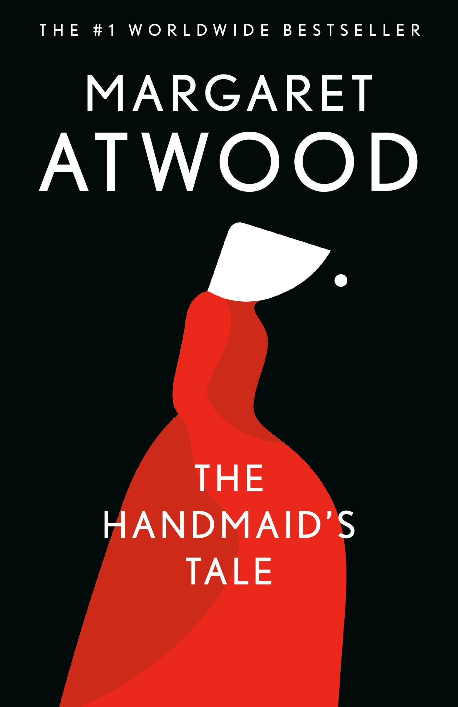

# Female Hierarchy
- [Definition] [Wives] A Wife is the spouse of a high-ranking man, usually a Commander. She has status, wears blue, manages the household, and may have a Handmaid assigned to bear children for her. Serena Joy is the main example.
- [Definition] [Econowives] She is the wife of a lower-ranking man. She does not have separate servants or a Handmaid, so she performs multiple roles herself: wife, housekeeper, and if fertile, mother.
- [Definition] [Handmaid] Handmaid is a fertile woman forced by the theocratic state of Gilead to bear children for elite, infertile couples.
- [Definition] [Aunt] An Aunt is a female authority figure in Gilead who helps enforce the regime’s control over other women, especially Handmaids.
- [Definition] [Martha] A Martha is a woman assigned to household labor, especially cooking, cleaning, and serving elite families.
- [Definition] [Jezebel’s] Jezebel’s is a secret nightclub/brothel used by the Commanders and other powerful men in Gilead.
- [Definition] [Unwoman] An Unwoman is a woman stripped of recognized female status in Gilead and treated as disposable.    
- - [MYTAKE] [Crucial concepts to understand the book]
- - [MYTAKE] [Maybe woman in Brazil are organized similarly]

# Characters

## Offred

- [Role] [Offred is the narrator and protagonist]
- [Social position] [Offred is a Handmaid assigned to reproduce for a Commander]
- [Characterization] [Offred is reflective and quietly rebellious] She remembers freedom, loss, and resistance while outwardly surviving within Gilead.

## The Commander

- [Role] [Fred Waterford is Offred's Commander]
- [Power] [The Commander is powerful but lonely] He has high rank in Gilead but breaks its rules to spend private time with Offred.

## Serena Joy

- [Role] [Serena Joy is the Commander's Wife]
- [Background] [Serena was once a conservative public figure]
- [Condition] [Serena is bitter inside the role she helped defend] Gilead has trapped her inside a restricted feminine ideal.
- [Motivation] [Serena's desperation for a child drives her risk-taking] She becomes jealous of Offred while also needing her.

## Nick

- [Role] [Nick is the Commander's chauffeur]
- [Ambiguity] [Nick may be connected to Mayday]
- [Relationship] [Nick becomes Offred's secret intimate partner] Their relationship gives Offred emotional complexity and danger.

## Moira

- [Relationship] [Moira is Offred's best friend from before Gilead]
- [Characterization] [Moira represents bold rebellion and sexual freedom]
- [Transformation] [Moira's broken spirit shows the cost of defiance]

## Luke

- [Relationship] [Luke is Offred's husband from before Gilead]
- [Uncertainty] [Luke's fate remains unknown after the failed escape]
- [Symbolism] [Luke represents Offred's lost love and former life]

## Aunt Lydia

- [Role] [Aunt Lydia indoctrinates Handmaids]
- [Ideology] [Aunt Lydia uses religious language to justify oppression]
- [Power] [Aunt Lydia is feared because she turns oppression into moral instruction]

# Plot Summary

## Indoctrination and Survival

- [Setting] [Gilead replaces the United States with a theocratic dictatorship] Infertility lets the regime justify enslaving fertile women as Handmaids.
- - [MYTAKE] [Reasonable originating driver] The dictatorship of Gilead is not reasonable, but the origin seems reasonable, after all, if infertility is overwhelmingly common, then the species might need some state control to surive on it.
- [Plot] [Offred is assigned to Commander Fred Waterford and Serena Joy]
- [Violence] [The Ceremony ritualizes state-sanctioned rape] Offred's reproductive role is turned into a religious and political performance.
- [Memory] [Flashbacks preserve Offred's selfhood] Memories of Luke, her daughter, work, Moira, and pre-Gilead life keep her from being reduced to her assigned role.
- - [MYTAKE] [Maybe 40-60% of her lived time is passive waiting or enforced idleness] Therefore she has plenty of time to think of how her life used to be before Gilead.
- [Training] [The Red Center teaches women to internalize Gilead] Aunt Lydia uses religion and discipline to make Handmaids accept subjugation.
- [Symbolism] [Moira's escape initially symbolizes hope] Her later fate also shows the consequences of open defiance.

## Rebellion and Risk

- [Conflict] [Offred obeys outwardly while desiring rebellion]
- [Plot] [The Commander invites Offred into forbidden private spaces] His office and Jezebel's reveal Gilead's hypocrisy.
- [Relationship] [Nick gives Offred genuine connection and partial bodily agency] Serena encourages the relationship because she suspects the Commander is infertile.
- [Resistance] [Ofglen connects Offred to Mayday] Ofglen's pressure makes resistance possible but terrifying.
- [Danger] [Ofglen's disappearance shows the lethal risk of defiance]
- [Escalation] [Offred's secret reading, lying, and intimacy make her position precarious]

## Uncertainty and Resistance

- [Serena's discovers relationship with commander] [Intensifies Offred's danger]
- - [The Road to her finding that] 1 - The Commander secretly takes Offred to Jezebel’s. 2 - He gives her a revealing sequined outfit to wear. 3- Offred returns and hides it. 4 - Serena later finds it. 5 - Serena confronts Offred with it.
- [Isolation] [Offred becomes unsure whom she can trust]
- [Plot] [A black van arrives for Offred]
- [Ambiguity] [Nick says the van belongs to Mayday, but Offred cannot verify him]
- [Ending] [Offred enters an unknown darkness or light]

## Historical Notes

- [Frame] [The epilogue presents Offred's story as a future academic object]
- [Irony] [Academic distance risks flattening Offred's suffering] The conference format shows how history can analyze horror while losing the human being inside it.
- [Uncertainty] [Offred's ultimate fate remains unresolved]

# Offred

## Narrative Mind

- [Characterization] [Offred's mind makes her an exceptional storyteller] She can feel intensely while articulating her experience with clarity.
- [Observation] [Offred reads subtle human behavior under pressure] She notices the Commander's gestures and interprets his curiosity as if she were a puzzle.
- [Curiosity] [Offred wants to know what is happening] Her desire to understand survives even when knowledge is dangerous.
- - [MYTAKE] [I have a relatable experience after leaving university]
- [Imagination] [Offred scripts imaginary fights and reconciliations] Her private mental life remains active under repression.
- [MYTAKE] [Offred might have had a scientist's mindset in another life] Her questioning and analytic restlessness suggest a mind oriented toward inquiry.

## Underground Economy

- [Observation] [Forbidden objects reveal an underground economy] The Commander's magazines and clothing show that Gilead never fully destroys the old world.
- [Symbolism] [A stained garment preserves traces of another woman's humanity] The used cloth makes prior women concrete rather than abstract.

# Harvard
- [Definition] [Salvaging] A Salvaging is a state-organized ritual where people, especially women, are publicly killed as punishment and warning.
- [Quote] [Harvard Yard is where Salvaging happens] "The Salvaging takes place in Harvard Yard, in front of what was Widener Library. As a university, Harvard once symbolized the free pursuit of knowledge; as the location for the Salvaging, it symbolizes the denial of access to knowledge. Gilead has turned the old world upside down, making a former liberal arts university the seat of the secret police."
- [MYTAKE] [Harvard's transformation shows the impermanence of institutions] In thousands of years, even revered places may represent something unrecognizable, including Harvard.
- [Irony] [A secular university becoming an authoritarian symbol exposes fragile progress]
- [Margaret Atwood studied at Harvard]

# Feminism

## Sex

- [Quote] [Unpleasant sex] "At least he's an improvement on the previous one, who smelled like a church cloackroom in the rain; like your mouth when the dentists starts pickinga at your teeth; like a nostril. THe COmmmander instead, smells of mothballs, or is this odour some punivitive form of aftershave? wHY DOES HE HAVE TO WEAR THAT STUPID UNIFORM? but would I like his white, tufted raw body any better?"
- [Quote] [Unpleasant sex part 2] 'My arms are raised; she holds my hands, each of mine in each of hers. This is supposed to signify that we are one flesh, one being. What it really means is that she is in control, of the process and thus of the product. If any. The rings of her left hand cut into my fingers. It may or may not be revenge"
- - [Violence] [The Ceremony removes pleasure, agency, and mutuality from sex] Serena's physical control over Offred makes the ritual a transfer of power over the reproductive product.
- [Quote] [Unpleasant sex part 3] "Fake it, I scream at myself inside my head. You must remember how. Let's get thsi over with or you' be here all night. bestir yourself. Move your flesh around, btreahe audibly. OIt's the least you can do."
- [MYTAKE] [Handmaids resemble nuns while reversing the purpose of religious chastity] Both groups wear habits and are consecrated to religious duty, but Handmaids are forced into reproduction rather than celibacy.
- [MYTAKE] [Offred's vagina is treated as government property] The number of rapes makes the state ownership of her body painfully concrete.
- [Category] [Patriarchy divides women into virgins and whores] Gilead restricts Wives, daughters, Marthas, and Handmaids while exploiting women at Jezebel's.

## Sex with Nick

- [Theme] [Sex becomes central because it is both controlled and desired] In patriarchy, sex can appear as women's only resource and men's central lack.
- [Relationship] [Sex with Nick merges passion, loneliness, resistance, and survival]
- - [MYTAKE] [Hard to meaning differentiate]
- [Control] [Offred's sexuality is useful to Gilead but not controlled by her] Her passion for Nick becomes one of the few things she can still choose.
- [Loneliness] [Offred's isolation makes intimacy with Nick emotionally overwhelming] Imagine being lonely all the time, for a decade maybe, not having human contact even with other woman, it just feels like Nick could be anyone and she would still fall in love with him, human desperateness is so touching.

## Woman's Objectification

- [Quote] [Women are reduced to containers] "We are containers, it's only the inside of our bodies that are important."
- - [MYTAKE] [Feels brutal]
- [Quote] [Phemenological or biological death] "Yes, I say. It's true, and I don'task why, because I know. Give me children, or else I die. There's more than one meaning to it."
- [Quote] [Nolite te bastardes carborundorum] "Even before she knew what it meant, Offred cherished the Latin scrawl Nolites te bastardes carborundorum as a connection between her and the previous Handmaid, and as a symbol of her resistance to Gilead. Now, thanks to the Commander, she learns that it means “don’t let the bastards grind you down”—an appropriate response to a totalitarian, patriarchal society. Offred and the other Handmaids must struggle to hold on to their humanity and to resist their oppressors. The translation of the phrase is not an entirely joyous moment, however, for it signals to Offred that someone came to the Commander’s study before her. It is not clear whether this upsets her because she feels jealous of her connection with the Commander, or because she worries about whether she will meet the same fate as the Handmaid before her."
- - [MYTAKE] [Sad and sweet] This quote was 'marcante' for me, it turns out that the only way to bond with other woman is by "sharing" a hidden message in a room.

## Enforced idleness
- [Quote] [Slowly exploring a room] "So. I explored this room, not hastily, then, like a hotel room, wasting it. I didn'tg want to do it all at once, i wanted to make it last. I divided the room into sections, in my head; I allowed myself one section a day. This one section I would examine with the greatest minuteness; the uneveness of the paster under the walllpaper."
- - [MYTAKE] [Pitty] For me, this was a big deal when I read it. We have literally an infinite access to entertainement (which I would argue is something bad). We don't have need to "divide the room into sections", it's infinite.
- [Quote] [Artificial loneliness due to the regime] "In the household, a mood of loneliness and isolation exists. As a Handmaid, Offred is not only denied friends, she is denied a family. She must eat dinner apart from the rest of the household; her baths and movements are regulated as if she is an animal; the servants hardly speak to her."

# Politics

- [MYTAKE] [Every ideology can be justified rhetorically] This book is about an existential trade off of consistency vs flexibility. In reality, both are important, what matters is the equilibrium, but the equilibrium is subjective, and therefore it doesn't matter how bad the situation is, as long the discourse is said multiple times and repeated it will be believed.
- [Quote] [Dying of too much choice] "These women could be gested the possibilities of the world  undone. These women could be undone or not. Thyseemed to be able tho choose. We seemed to be able to chosse, then. We were a society dying, said Aunt Lydia, of too much choice"
- - [MYTAKE] [Liquid modernity] Aunt Lydia is not completely wrong, we (in 2026) are dying from too much choice, we are losing our capabilities of bulding communities, and stable families. 
- [Quote] [How to substantially make peoples life worse?] “Truly amazing, what people can get used to, as long as there are a few compensations.”

## Political philosophy

- [Quote] [Two types of freedom] “There is more than one kind of freedom," said Aunt Lydia. "Freedom to and freedom from. In the days of anarchy, it was freedom to. Now you are being given freedom from. Don't underrate it.”
- - [MYTAKE] [Isaiah Berlin's Two Concepts of liberty] When I read this book for the first time, I felt like, this is just a bullshit execuse to prevent 'freedom to'. But after reading a bit from Isaiah Berlin's Two Concepts of liberty, I noticed that this is actually a fundamental political philosophical problem that is really hard to think of a right solution. Where is the equilibrium of 'negative liberties' and 'positive liberties'
- - [MYTAKE] [China as a great example of freedom from] Chinese people are free from a government that takes 10 years to make an important decision, and deliver results, being one of the countries that most reduced poverty in the history of the species. Which makes you think, Aunt Lydia's argument is very valid under certain scenarios
- - [MYTAKE] [Authoritarianism as double edged sword] As Brazilian, we are forced to envyy China, and contemplate the possibility of dictatorship. But in reality, ours could be more similar to Gilead than China.

# The Road to Gilead
- [Quote] [Machine gunned the Congress] "It was after the catastrophe, when they shot the President and machine-gunned the Congress and the army declared a state of emergency. They blamed it on the Islamic fanatics, at the time."
- [Quote] [Luke and Offred] "Luke was in the living room. He put his arms around me. We were both feeling miserable. How were we know we we were happye even then? Because we at least had that; arms, around."
- [Quote] "Offred’s extended flashback provides an explanation of how Gilead was created. The pre-Gilead United States is our world in the near future—all money has been computerized, and pornography and prostitution have become more accepted and available. Offred mentions “Pornomarts” and “Feels-on-Wheels” as if the terms needed no explanation, leaving the details to the imagination but conveying a sense of a society more sexually liberated than our own. The extent of this sexual liberation may prompt the extremism of the conservative backlash. Offred mentions “porn riots” and “abortion riots” that take place before Gilead—the conservative precursor to the uprising against the liberal government. In the epilogue, an expert on Gilead’s history says its founders used a “CIA pamphlet on the destabilization of foreign governments as a strategic handbook” to topple the U.S. government. First, governmental officials are assassinated; then martial law is declared “temporarily”; finally, the new regime consolidates its power and squashes dissent."

# Parralel with other Literary works

## Infinite Jest
- [MYTAKE] [Infinite Jest and The Handmaid's Tale expose opposite failures of meaning] Infinite Jest shows the logical consequences of treating pleasure as life's main source of meaning, while The Handmaid's Tale shows the danger of surrendering the mind entirely to ideology. If pleasure fails and ideology fails too, then the problem of meaning becomes much harder.
- [MYTAKE] [Life may require equilibrium between pleasure and imposed meaning] The question is where the equilibrium lies. One extreme is a world of permissive liberty that collapses into hedonism, addiction, and capitalist competition. The other extreme is a world of imposed meaning, where people are forced into a regime that may itself be senseless.
- [MYTAKE] [Standardized meaning risks becoming philosophical suicide] Any externally imposed meaning of life can become a kind of philosophical suicide if it asks the individual to stop thinking, stop doubting, and simply submit to the system.

## Mrs Dalloway
- [MYTAKE] [Offred and Mrs Dalloway have nothing but their memories] There is a striking parallel with *Mrs. Dalloway*, where both protagonists are deeply tethered to their memories. Offred clings to hers as a means of survival in the face of Gilead’s oppressive regime, while Clarissa Dalloway does so as she confronts the passage of time and her advancing age. For both women, this reliance on memory feels imposed by external forces—whether societal or natural. This deprivation of the ability to fully engage with the present reflects a universal human struggle: the tension between what has been lost and what can no longer be felt.
