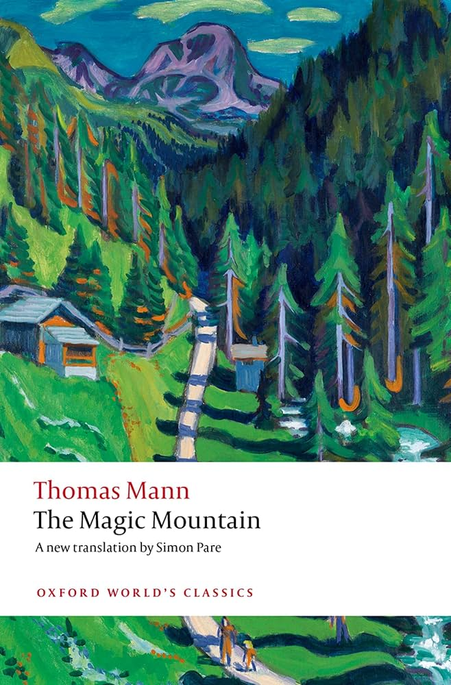
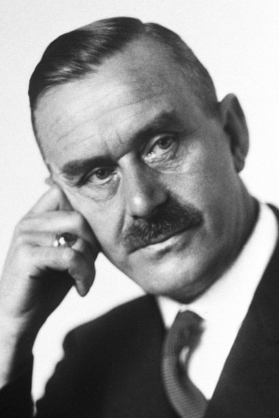

---

title: The Magic Mountain
order: 2
description: The book I want to read the most
types: Literature
publishDate: 2025-05-02
---

## Setting

- [Plot] [Hans Castorp is sent to the Berghof sanatorium] Hans Castorp, the protagonist, falls ill and is sent to a sanatorium called Berghof.
- [Atmosphere] [Time passes strangely within the sanatorium] In the sanatorium, time seems to pass in a strange and almost surreal manner.
- [Setting] [The sanatorium is isolated from society] The setting is completely isolated and detached from the rest of society, creating a unique atmosphere.

## Ideological Debate

- [Political microcosm] [The sanatorium embodies the conflicts preceding World War I] The novel presents a microcosm of the ideological conflicts leading up to World War I, with each character embodying a distinct ideology.
- [Ideologies] [The characters represent competing political and philosophical worldviews] These ideologies include Marxism, secularism, capitalism, and fascism.
- [Conflict] [The characters compete to shape Hans's worldview] Each character attempts to persuade Hans that their worldview is the correct one, creating a rich tapestry of philosophical and political discourse.

## Bildungsroman

- [Genre] [The novel parodies the traditional Bildungsroman] The novel is a parody of the traditional Bildungsroman, or coming-of-age story.
- [Subversion] [Hans reaches no definitive conclusion after seven years] Instead of discovering the “correct” way of life after experiencing various perspectives, Hans spends seven years in the sanatorium without reaching any definitive conclusions.
- [Theme] [Hans's unanswered questions reflect the complexity of life] This reflects the ambiguity and complexity of real life, leaving Hans with more questions than answers.
- [Critical assessment] [The novel represents the culmination of the Bildungsroman] *The Magic Mountain* is considered the “final word” on the Bildungsroman genre. In fact, there have been few innovative works in this genre since, as if it has reached its creative limits.

## Author

- [Recognition] [Thomas Mann received the 1929 Nobel Prize in Literature] Thomas Mann, the author of *The Magic Mountain*, was awarded the Nobel Prize in Literature in 1929 for his outstanding contributions to literature.

