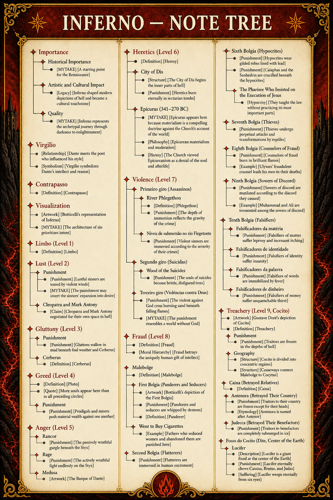

# Importance

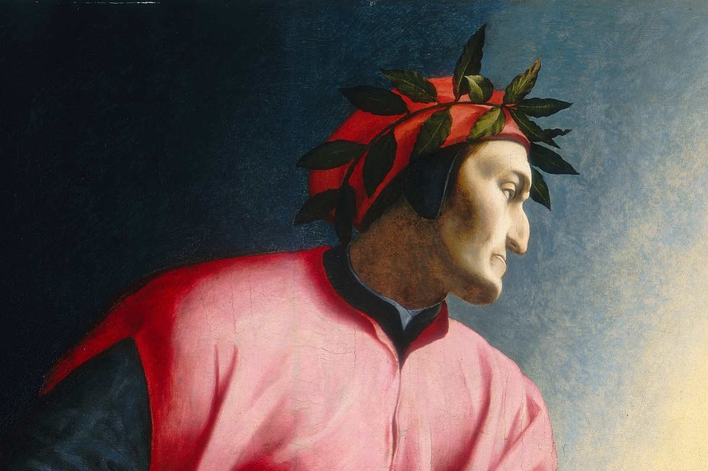

## Historical Importance

- [MYTAKE] [A starting point for the Renaissance]

  - Written even before the Renaissance (1300).
  - Much of Western thought continues Greek thought. This book is a starting point for reintegration with Greek culture, including Greek thought.

## Artistic and Cultural Impact

- [Legacy] [Inferno shaped modern depictions of hell and became a cultural touchstone]

  - Modern representations of hell, from T. S. Eliot to video games, are often based on Dante's.
  - It is a touchstone of medieval and classical morality expressed through Greek and Roman mythology.

## Quality

- [MYTAKE] [Inferno represents the archetypal journey through darkness to enlightenment] Dante’s *Inferno* has become a cultural touchstone representing the archetypal journey through darkness to enlightenment.

# Virgilio

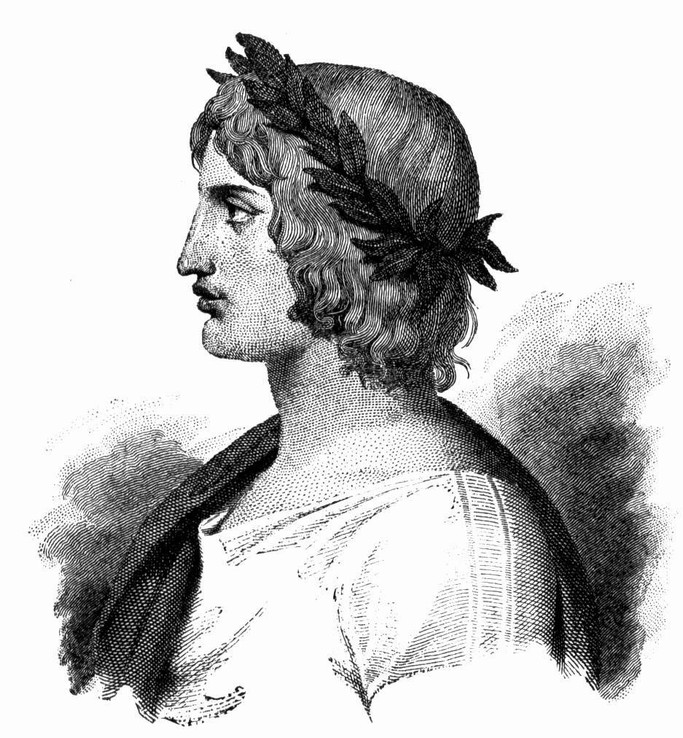

- [Relationship] [Dante meets the poet who influenced his style] Virgílio (70–19 a.C.) foi um grande poeta da Antiguidade e autor de várias obras, entre as quais as *Geórgicas* e a *Eneida*. Esta última conta a história da fundação de Roma pelo troiano Enéas (veja nota 4.11). Dante conhecia as obras de Virgílio e louva-o por ter influenciado seu estilo poético.

- [Symbolism] [Virgílio symbolizes Dante's intellect and reason] De acordo com vários dantólogos, Virgílio também tem um sentido alegórico: simboliza o intelecto, a razão do peregrino Dante (veja nota 1.1). É a razão “que apagada estivera, talvez por excessivo silêncio” que pode guiá-lo para fora da selva escura.

# Contrapasso

- [Definition] [Contrapasso] The punishment of souls through a process that either resembles or contrasts with the sin itself.

- [MYTAKE] [Contrapasso seems similar to karma] Contrapasso feels very similar to karma, but I thought Christianity did not believe in karma.

# Visualization

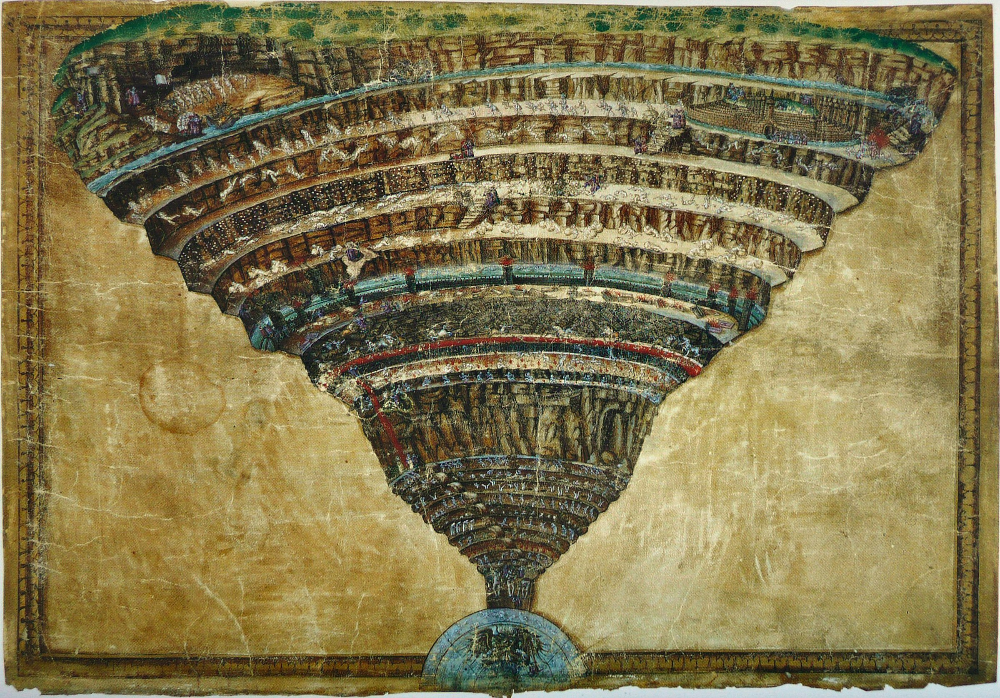

- [Artwork] [Botticelli's representation of Inferno] Illustration by Botticelli.

- [MYTAKE] [The architecture of sin prioritizes intent]

  - The main focus is on the intent behind the sin rather than on what was done.
  - Incontinência é menos grave porque tem culpa, mas não tem dolo.
  - Violência não é tão grave porque é de ocasião e não premeditada.
  - A traição é o pior de todos porque destrói a confiança de alguém que você conhece, em vez de um desconhecido.
  - Segue a *Ética a Nicômaco*.

# Limbo (Level 1)

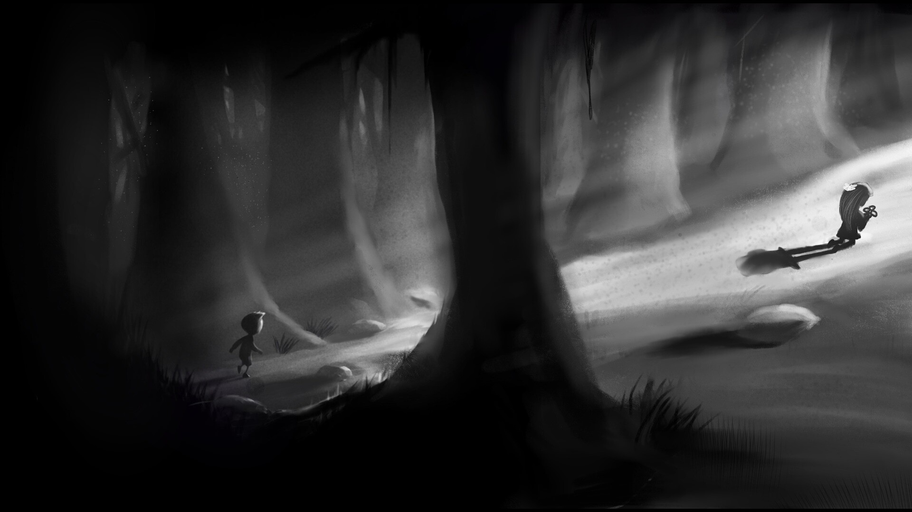

- [Definition] [Limbo] The first level of Inferno, home to the unbaptized and virtuous pagans who lived and died before the birth of Christ.

# Lust (Level 2)

## Punishment

- [Punishment] [Lustful sinners are tossed by violent winds] Lustful sinners, regardless of the duration of their sin, are tossed about eternally by violent winds in the Second Circle. This represents how their desires carried them away uncontrollably in life.

- [MYTAKE] [The punishment may invert the sinners' expansion into desire] Instead of expanding into their desires, they are forced into retraction.

## Cleopatra and Mark Antony

- [Claim] [Cleopatra and Mark Antony negotiated for their own space in hell] Even though they killed themselves, they negotiated with the devil to have their own space in hell.

# Gluttony (Level 3)

## Punishment

- [Punishment] [Gluttons wallow in mud beneath foul weather and Cerberus] They are forced to wallow in foul-smelling mud, constantly pelted by endless rain, sleet, snow, and hail, and attacked by Cerberus.

## Cerberus

- [Definition] [Cerberus] Cerberus, described as *il gran vermo* (“the great worm,” line 22), is the monstrous three-headed beast of Hell.

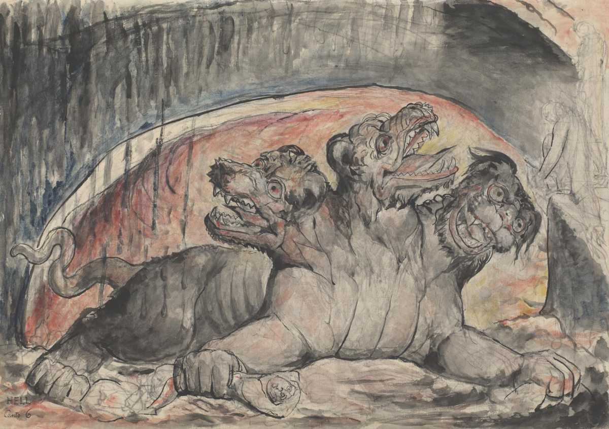

# Greed (Level 4)

- [Definition] [Pluto] Similar to Hades; deus infernal da riqueza.

- [Quote] [More souls appear here than in all preceding circles] “Lá vi mais almas que em todos os círculos precedentes.”

## Punishment

- [Punishment] [Prodigals and misers push material wealth against one another]

  - Há uma divisão entre os que gastaram demais e os avarentos.
  - Neste círculo repleto de montanhas, suas riquezas materiais se transformaram em grandes pesos de barras e moedas de ouro que um grupo deve empurrar contra o outro. Eles também trocam injúrias, pois suas atitudes em relação à riqueza foram opostas.

# Anger (Level 5)

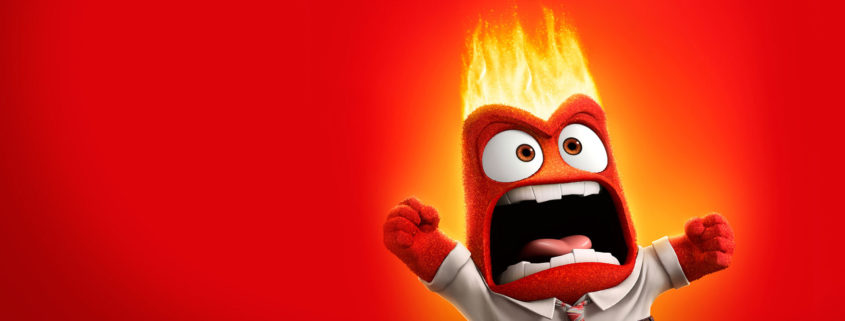

## Rancor

- [Punishment] [The passively wrathful gurgle beneath the Styx] “Filho”, disse o bom mestre, “aqui tu vês as almas dos vencidos pela ira, e vou dizer-te ainda, se me crês, que embaixo d'água há gente que suspira, fazendo-a borbulhar.” São aqueles vencidos pelo rancor, a ira contida e passiva, porém igualmente destrutiva. Eles gorgolam o lodo e formam as bolhas que pipocam sobre esta lama fétida.

## Rage

- [Punishment] [The actively wrathful fight endlessly on the Styx] They remain in a constant physical battle with one another on the surface of the River Styx.

## Medusa

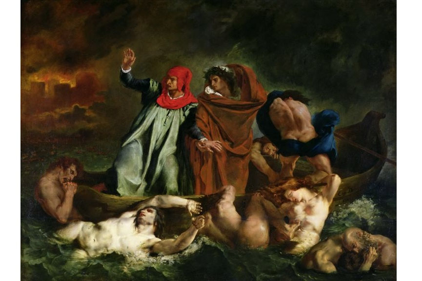

- [Artwork] [The Barque of Dante] Eugène Delacroix, 1822.

# Heretics (Level 6)

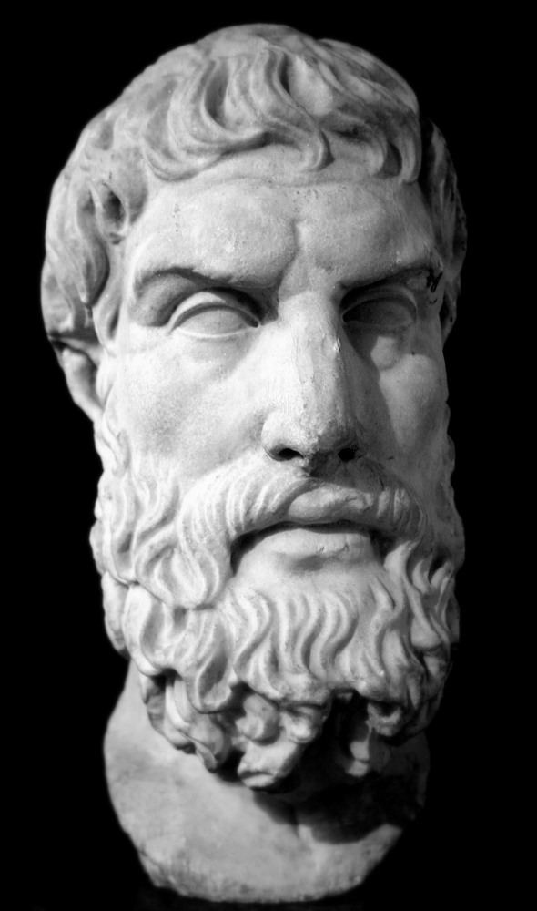

- [Definition] [Heresy] Teoria, ideia, prática etc. que nega ou contraria a doutrina estabelecida por um grupo — neste caso, a Igreja.

## City of Dis

- [Structure] [The City of Dis begins the inner parts of hell] It divides the inner and outer parts of hell. The outer part contains people who sinned through lack of self-control; the inner part contains people who deliberately betrayed God's directions. It makes sense to punish the latter more because they are a greater threat to the Church.

- [Punishment] [Heretics burn eternally in sectarian tombs] São os hereges e seus seguidores. Em cada tumba repousam os réus de uma mesma seita, torturados pelo fogo eterno.

## Epicurus (341–270 BC)

- [MYTAKE] [Epicurus appears here because materialism is a compelling doctrine against the Church's account of the world] It is interesting that Epicurus is here because materialism is the most convincing doctrine that explains the world against it.

- [Philosophy] [Epicurean materialism and moderation] Epicuro foi um filósofo grego que ensinou em Samos e Atenas. Sua filosofia materialista defende que todas as coisas são formadas por átomos cujas combinações dão ao mundo sua estrutura particular. Sua moral — diferentemente da reputação que adquiriu junto à Igreja — recomenda gozar os bens materiais e espirituais com ponderação e medida, de forma que seja possível perceber o que neles há de melhor.

- [Heresy] [The Church viewed Epicureanism as a denial of the soul and afterlife] O Epicurismo, na opinião da Igreja, era uma heresia, pois, considerando todas as coisas materiais, negava a existência da alma e da vida após a morte. [Larrousse 98]

# Violence (Level 7)

## Primeiro giro (Assassinos)

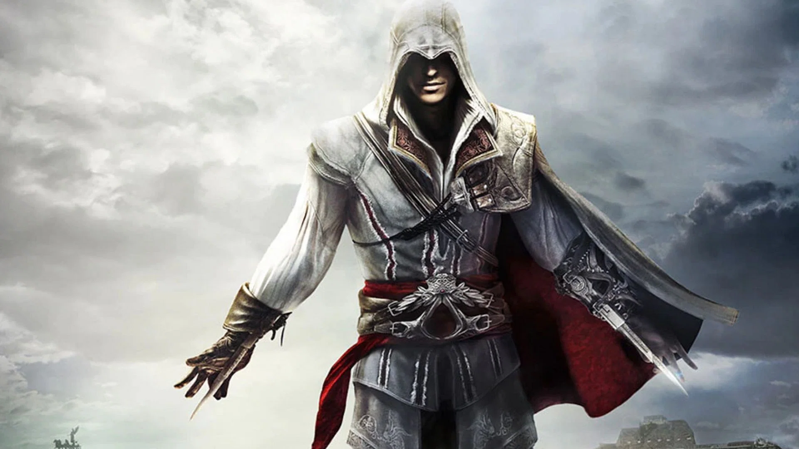

### River Phlegethon

- [Definition] [Phlegethon] A river of fire.

- [Punishment] [The depth of immersion reflects the gravity of the crime] Quanto mais grave o crime, maior a parte imersa. Como sua função era torturar as almas, ele tinha que preservá-las para torturá-las por mais tempo. Para isso, possuía águas curativas e, por isso, é chamado por alguns de “Rio da Cura”.

### Níveis de submersão no rio Flegetonte

- [Punishment] [Violent sinners are immersed according to the severity of their crimes]

  - Os violentos contra pessoas e seus bens estão mergulhados no rio de sangue daqueles que oprimiram; quanto mais grave o crime, maior a parte imersa.
  - Os assaltantes têm apenas o peito fora do rio; são punidos por terem praticado violência contra os bens de suas vítimas.
  - Os homicidas mantêm apenas a cabeça fora. Átila também está aqui.
  - Os tiranos mantêm somente as sobrancelhas acima da superfície; atentaram contra a vida e os bens de suas vítimas. Entre eles estão Alexandre, Dionísio, Azolino e Opizzo da Esti.

## Segundo giro (Suicidas)

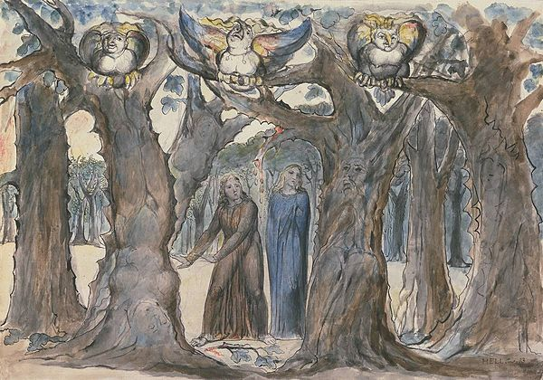

### Wood of the Suicides

- [Punishment] [The souls of suicides become brittle, disfigured trees] The souls are transformed into gnarled, disfigured, and brittle trees.

## Terceiro giro (Violências contra Deus)

- [Punishment] [The violent against God cross burning sand beneath falling flames] The third round of the seventh circle is a great Plain of Burning Sand, scorched by great flakes of flame falling slowly from the sky.

- [MYTAKE] [The punishment resembles a world without God] Supposing they have killed God, what world would they get? They receive that punishment: Hell itself, with burning flames. They are attacked by what the person they attacked would have protected them from.

# Fraud (Level 8)

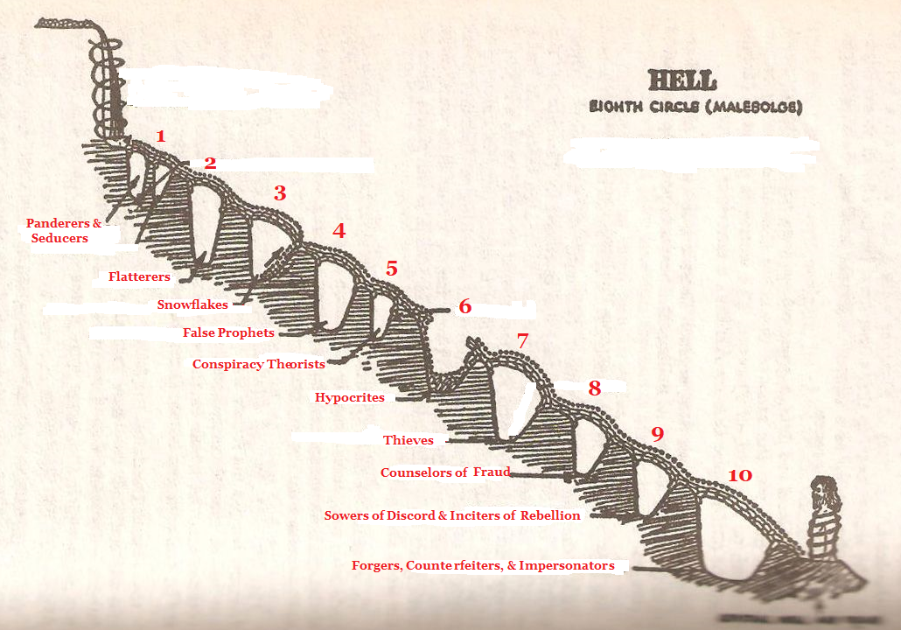

- [Definition] [Fraud] An abuse of intellect.

- [Moral Hierarchy] [Fraud betrays the uniquely human gift of intellect] Since fraud can only be committed by human beings, it betrays a gift from God, displeases God more, and therefore occupies a deeper circle than violence.

## Malebolge

- [Definition] [Malebolge] A large, funnel-shaped cavern divided into ten concentric circular trenches or ditches.

## First Bolgia (Panderers and Seducers)

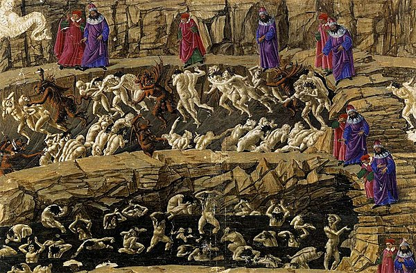

- [Artwork] [Botticelli's depiction of the First Bolgia] Illustration by Botticelli.

- [Punishment] [Panderers and seducers are whipped by demons] They march single file around the circumference of their circle, constantly lashed by horned demons.

- [Definition] [Panderer] A person who takes advantage of others' weaknesses or vices, especially for personal gain.

### Went to Buy Cigarettes

- [Example] [Fathers who seduced women and abandoned them are punished here] Fathers who seduced women and then left them to raise their children alone are in this part of hell.

## Second Bolgia (Flatterers)

- [Punishment] [Flatterers are immersed in human excrement] Sinners guilty of excessive flattery are immersed forever in a river of human excrement, resembling their flatteries. Thaïs the hetaera is found there.

## Sixth Bolgia (Hypocrites)

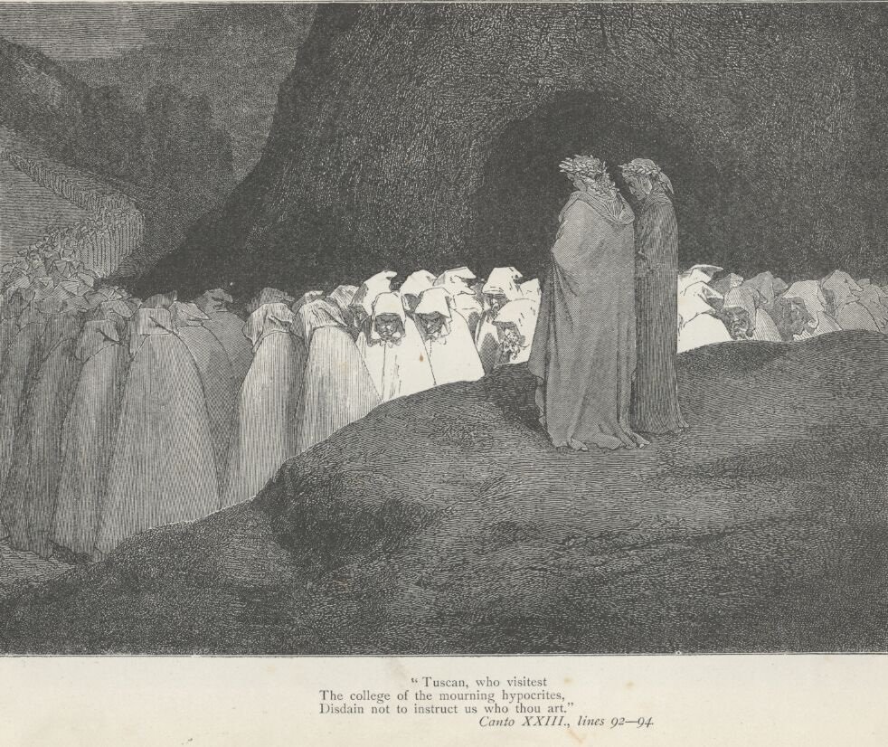

- [Punishment] [Hypocrites wear gilded robes lined with lead] They walk around the circumference of their circle in heavy lead robes. The robes are golden and resemble a monk's cowl, but their lead lining symbolically represents hypocrisy.

- [Punishment] [Caiaphas and the Sanhedrin are crucified beneath the hypocrites] Caiaphas, the Pharisee who insisted on the execution of Jesus, and all of the Sanhedrin are crucified in this circle, staked to the ground so that the ranks of lead-weighted hypocrites march across them.

### The Pharisee Who Insisted on the Execution of Jesus

- [Hypocrisy] [They taught the law without practicing its most important parts] They taught the law but did not practice some of its most important parts: justice, mercy, and faithfulness to God.

## Seventh Bolgia (Thieves)

- [Punishment] [Thieves undergo perpetual attacks and transformations by reptiles] In *Inferno* 24, thieves are trapped in a self-perpetuating cycle of being bitten and bound by serpents, dragons, and other vengeful reptiles.

## Eighth Bolgia (Counselors of Fraud)

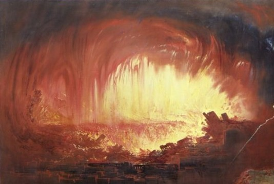

- [Punishment] [Counselors of fraud burn in brilliant flames] Their souls are burned in brilliant flames.

- [Example] [Ulysses' fraudulent counsel leads his men to their deaths] In Dante's account, Ulysses urges his men to sail with him past the Pillars of Hercules and leads them to their deaths.

## Ninth Bolgia (Sowers of Discord)

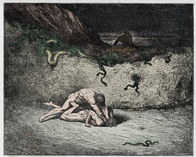

- [Punishment] [Sowers of discord are mutilated according to the discord they caused] They walk around the circle bearing horrible, disfiguring wounds inflicted by a great demon with a sword. Os semeadores de discórdias são esfaqueados pela espada de um demônio, que os pune causando mutilações em partes do corpo representativas do tipo de discórdia que provocaram. Eles estão com as entranhas para fora, aparecendo seus estômagos; alguns têm a cabeça cortada; outros, os braços e as pernas; outros, a língua, as orelhas ou o nariz.

- [Example] [Muhammad and Ali are tormented among the sowers of discord] Among those tormented here are Muhammad, prophet of Islam, and his son-in-law and successor Ali.

## Tenth Bolgia (Falsifiers)

### Falsificadores da matéria

- [Punishment] [Falsifiers of matter suffer leprosy and incessant itching] São cobertos de sardas, sofrem uma coceira incessante e exalam cheiro forte de carne podre por conta da lepra. As pessoas se coçam umas às outras, esfregando seus corpos.

### Falsificadores de identidade

- [Punishment] [Falsifiers of identity suffer insanity] Sofrem com insanidade e ficam correndo como loucos por essa bolgia.

### Falsificadores da palavra

- [Punishment] [Falsifiers of words are immobilized by fever] Sofrem uma febre tão intensa que ficam imóveis.

### Falsificadores de dinheiro

- [Punishment] [Falsifiers of money suffer unquenchable thirst] Sentem uma sede insaciável, mas em seus sonhos só veem rios, lagos e mares.

# Treachery (Level 9, Cocito)

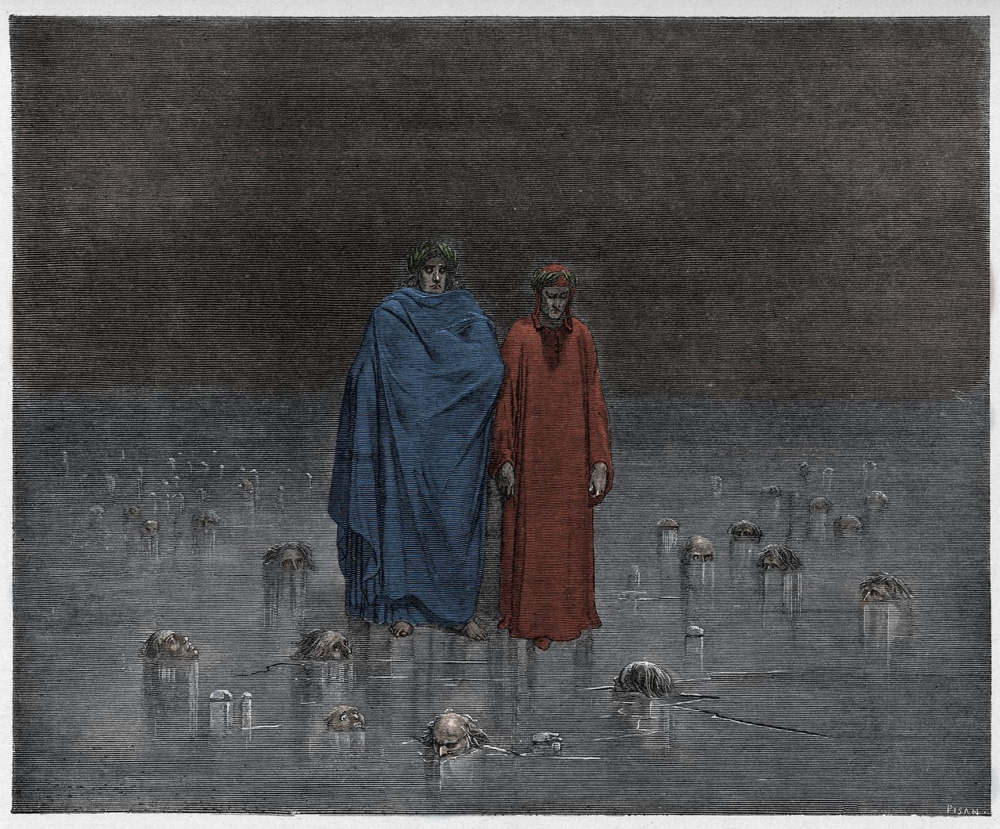

- [Artwork] [Gustave Doré's depiction of Cocito] Illustration by Gustave Doré.

- [Definition] [Treachery] Treachery is a conscious and premeditated act of betrayal. It is driven not by passion or impulse, but by a calculated decision to violate trust for personal gain, harm, or another selfish motive; it is calculated betrayal with malice in the heart.

## Punishment

- [Punishment] [Traitors are frozen in the depths of hell]

  - The deepest part of hell is ice, contrary to the expectation that it would be fire.
  - The sinners remain beneath the ice with only their heads and chests exposed.
  - This reflects the coldness of their hearts.

## Geography

- [Structure] [Cocito is divided into concentric regions] This part of hell is divided into outer circumferences, with Caina as the outermost one.

- [Structure] [Causeways connect Malebolge to Cocytus] Long causeway bridges run from the outer circumference of Malebolge to its center, like spokes on a wheel. At the center of Malebolge lies the ninth and final circle of hell, known as Cocytus.

## Caina (Betrayed Relatives)

- [Definition] [Caina] The region of Cocytus for those who betrayed their relatives.

## Antenora (Betrayed Their Country)

- [Punishment] [Traitors to their country are frozen except for their heads] The sinners remain with their whole bodies beneath the ice except for their heads.

- [Etymology] [Antenora is named after Antenor] It is inspired by Antenor, the prince of Troy who betrayed his country by conspiring with the Greeks.

## Judecca (Betrayed Their Benefactors)

- [Punishment] [Traitors to benefactors are completely submerged in ice] The sinners remain with their whole bodies beneath the ice, including their heads.

## Fosso do Cocito (Dite, Center of the Earth)

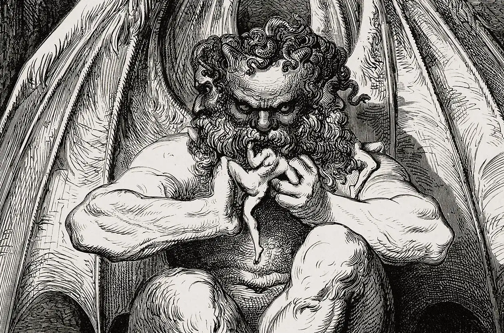

### Lucifer

- [Description] [Lucifer is a giant fixed at the center of the Earth]

  - He is so large that even his arm is the size of a giant.
  - His groin marks the center of the Earth.

- [Punishment] [Lucifer eternally chews Cassius, Brutus, and Judas] Lucifer has three mouths, each chewing one of the three sinners.

- [Suffering] [Lucifer weeps eternally from six eyes] The giant cries with his six eyes for all eternity.
