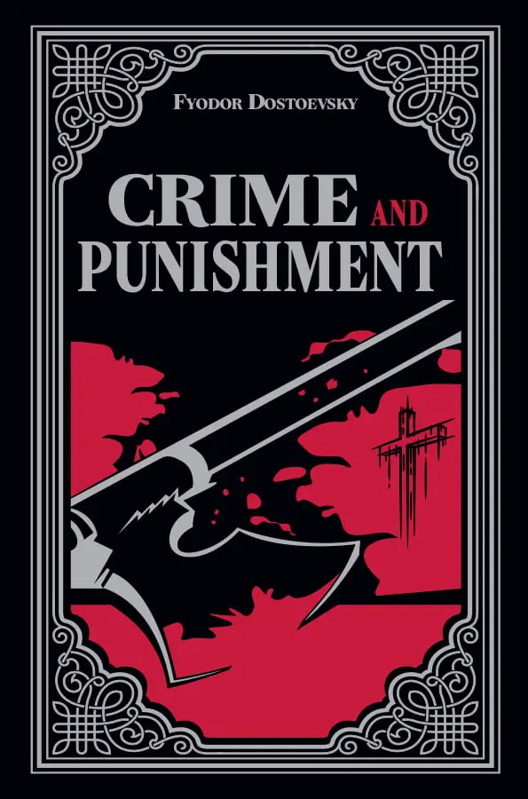
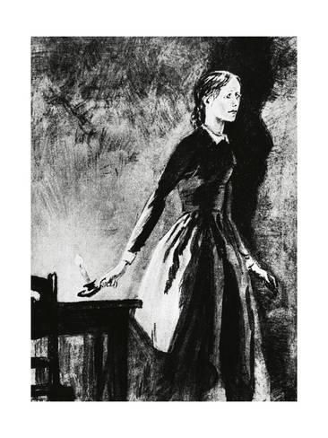

# [Characters] Main Characters

- [Protagonist] **Rodion Romanovich Raskolnikov** — a former student living in poverty who develops a theory that "extraordinary" people stand above the law and acts on it through murder.
- [Moral Compass] **Sofya Semyonovna Marmeladov (Sonya)** — a meek and devout young woman forced into prostitution to support her family; she becomes Raskolnikov's confidante and moral center.
- [Strength] **Avdotya Romanovna Raskolnikova (Dunya)** — Raskolnikov's proud and strong-willed sister, pursued by both Luzhin and Razumikhin.
- [Motherhood] **Pulcheria Alexandrovna Raskolnikova** — Raskolnikov's loving mother, deeply anxious about her son's future and emotional well-being.

# Plot Summary

## [Part One] The crime and collapse

- [Theory] Raskolnikov believes certain "extraordinary" people may commit crimes if doing so serves a higher good.
- [Murder] To test this theory, he kills Alyona Ivanovna, a pawnbroker, imagining that her money could be redirected toward better ends.
- [Accident] The plan collapses when he also kills Lizaveta, Alyona's innocent sister, after she unexpectedly walks in.
- [Unraveling] After the murders, he becomes physically ill and psychologically unstable under the force of guilt and paranoia.
- [Isolation] He withdraws from others and sinks into delirium, fear, and emotional chaos.

## [Part Two] Encounters and pressure

- [Sonya Bond] Raskolnikov is drawn to Sonya Marmeladov, whose humility and compassion make her a crucial emotional counterweight to his pride.
- [Investigator] Porfiry Petrovich suspects Raskolnikov and uses psychological pressure rather than direct accusation.
- [Friendship] Razumikhin remains loyal and practical, and his growing bond with Dunya introduces a healthier alternative to Raskolnikov's isolation.
- [Tension] Luzhin and Svidrigailov intensify the moral and emotional conflict surrounding Dunya and the family.

## [Part Three] Confession and renewal

- [Confession] As guilt becomes unbearable, Sonya urges Raskolnikov to confess and accept punishment.
- [Dark Mirror] Svidrigailov's suicide reveals a path of moral collapse that Raskolnikov might also have followed.
- [Sentence] Raskolnikov confesses and is sentenced to Siberian penal servitude.
- [Faithful Love] Sonya follows him to Siberia and continues to support him.
- [Redemption] In the epilogue, he begins to experience the first signs of spiritual awakening.

# Philosophical Lens

## Consequences of Darwin and modernity

- [Major Philosphical paradigm shift Historical Context] The book was written in a moment when religious certainty was weakening and modern theories were reshaping how people understood morality.
- - [MYTAKE] In my opinion this is the key of the book. My reading is that Dostoevsky sees moral relativism as spiritually destructive because it removes any stable frame of reference for good and evil.
- [Soul Damage] The novel dramatizes what happens when someone tries to replace moral truth with private justification.

## [Theory] The extraordinary man theory

- [Definition] The theory divides humanity into ordinary and extraordinary people, with the latter supposedly permitted to transgress moral rules for a higher purpose.
- [Self Test] Raskolnikov kills less to gain money than to test whether he belongs to that superior class.
- [Hug Guilty Evidence] One strong clue is that he barely makes practical use of the stolen money.
- [MYTAKE] I once resonated a lot with this theory, especially during university, when I resisted ordinary career paths because I wanted my life to mean something intellectually higher.
- [Self Correction] That personal reaction makes the novel feel unsettling, because it exposes how pride can disguise itself as destiny.

## [Christian Morality] Consequences of rejecting it

- [MYTAKE] [Christian Karma] Dostoevsky presents Christianity as the correct/true moral framework, and the novel suggests that rejecting it brings spiritual and psychological ruin. In this view, to turn away from Christian morality is not just a mistake but a form of moral self-destruction, producing inner disorder, despair, and a kind of bad spiritual karma.
- [MYTAKE] [Evaluation of Philosophies by the Whole-Lives They Produce] In some sense, different people in the book have different philosphies, and during the book we don't know exactly which philosophy is correct, but by the end of the book we see the end result of people lives, and we kind of assume that the quality of the end of their lives is proportional to truthful/good quality their philosophies were

### Philosophical archetypes in the characters

- [Raskolnikov] [Will to Power/ Nietzsche] Raskolnikov represents revolt against Christian morality and a will to self-authorization.
  - [End result] This path for Raskolnikov ended in collapse, guilt, confession, and a painful beginning of spiritual renewal.
- [Sonya] [Christianism] Sonya represents Christian love, forgiveness, and moral objectivism.
  - [End result] Through her love, she makes Raskolnikov go through a paradigm shift, and finalize the arch of redemption.
- [Svidrigailov] [Boundless hedonism] Svidrigailov represents hedonism and the exhaustion that follows a life of self-indulgence.
  - [End result] His philosophy leads to emptiness, despair, and suicide.
- [Luzhin] [Bourgeois Utilitarianism] Luzhin represents rational egoism and self-interest dressed up as reason.
  - [End result] He tries to use calculation, manipulation, and social strategy to secure Dunya and control the family’s future for his own advantage, but he fails because his schemes are exposed, his motives are seen through, and the people around him refuse to accept his moral pretenses.

# Psychological Lens

## [Punishment] The mind after murder

- [Realism] One reason the novel feels like a masterpiece is its realism about Raskolnikov's post-crime behavior.
- [Collapse] His health deteriorates rapidly after the murder, and his body seems to register the crime as much as his mind does.
- [Guilt] His neurotic tendencies generate guilt so intense that he begins to act as if he wants punishment before he consciously admits it.
- [Self Sabotage] He repeatedly behaves in ways that almost invite discovery, as though suffering might relieve the pressure inside him.
- [Paradox] In that sense, the desire for punishment is already present at the center of the crime itself.

## [Healing] Part one: confronting the problem

- [Isolation] A key theme in the novel is the danger of sealing pain inside a private mental world.
- [MYTAKE] Raskolnikov's arrogance and mistrust cause him to isolate himself and feed a single obsessive story about his own greatness and suffering.
- [Confession Step] He begins to heal only when he finally opens up to Sonya and speaks honestly about what he has done.

## [Love] Part two: the power of love

- [Redemption] Raskolnikov's redemption becomes possible through Sonya's unconditional love.
- [Resistance] Even after his sentence, he still wants to interpret the murder as a mistake in execution rather than a moral failure.
- [Transformation] Sonya's love gradually breaks through that rationalized self-image and opens the possibility of genuine repentance.
- - [MYTAKE] This is a key part of the book in my opinion. Only love can break down rationalism for someone completely immersed on enlightmnet values.

# Character Notes

## [Raskolnikov] Pride, theory, and guilt

- [MYTAKE] [Inner Conflict] I really like how Dostoievisky critiques rationalism in this book. Basically he creates a super rational character, and instead of trying to contradicto him, or in other words defeat him on his own game. He simply let his emotions and his suffering to prove that he was wrong.
- [Alienation] Alienation is central to his character: his pride cuts him off from society long before the murder does.
- [Moral Instinct] His final gestures, including kissing the ground, suggest that human beings carry an instinctive sense of right and wrong that survives abstract reasoning.

## [Question] Why did he kill her?

- [Sulking Pride] He becomes sulky and defensive when explaining himself to Sonya, which reveals how wounded pride fuels his reasoning.
- [Quoted Creed] "Then I saw, Sonia, that if one waits for everyone to get wiser it will take too long.... Afterwards I understood that that would never come to pass, that men won't change and that nobody can alter it and that it's not worth wasting effort over it.... Whoever is strong in mind and spirit will have power over them."
- [Quoted Daring] "I wanted to have the daring... and I killed her. I only wanted to have the daring, Sonia! That was the whole cause of it!"
- [Quoted Test] "I wanted to find out whether I was a louse like everybody else or a man.... whether I am a trembling creature or whether I have the right...."
- [Interpretation] These confessions make it clear that the murder is bound to pride, testing, and self-definition more than to material gain.

## Police Confession
- [MYTAKE] The materialization of god's love was strong enough in Sonya, to the point where that added by Svidragailov's suicide as the final consequence of the meaningless of hedonism, was strong enough to move Raskolnikov's belief system from rationalism and Nietzsche's will to power towards christianity

## [Svidrigailov] Hedonism and collapse

- [Character Proof] Dostoevsky uses Svidrigailov to show the consequences of a life guided almost entirely by appetite and pleasure.
- [Bad Acts] His history is marked by coercion, abuse, manipulation, and moral corruption.
- [Parallel] Svidrigailov and Raskolnikov both cross major moral lines, though Svidrigailov appears less openly tormented by guilt.
- [MYTAKE] [Meaning Collapse] His punishment is metaphysical as much as emotional: eventually nothing matters anymore.
- [MYTAKE] I read him as someone who is already spiritually dead before he dies physically.

## [Sonya] Love, contradiction, and grace

- [Christ Figure] Sonya can be read as a Christ-like figure because she embodies unconditional love, suffering, receptivity, and mercy.
- [Reality/Appearance Contrast] Internally she is pure and compassionate, while externally society reduces her to the role of a prostitute.
- [Allegory] Her willingness to receive confession and remain near Raskolnikov points strongly toward a Christ allegory.
- [Mutual Recognition] Rodya is one of the few characters who does not simply look down on her, and Sonya is one of the few who refuses to condemn him.
- [Shared Consolation] Their bond matters because both are socially humiliated and yet able to recognize dignity in one another.
- [MYTAKE] It as if her prositute symbolizes her suffering for the whole world. The Christian background also evokes the idea of substitutionary suffering: one person bearing pain for the sake of another. That may help explain why Sonya's suffering feels spiritually central rather than merely tragic.

## [Detail] Name

- [MYTAKE] The name Sonya etymologically means "reason" or "intellect," and the deeper point seems to be that wisdom is not the same thing as intellectual sharpness. Which is a little contradictory.

## [Marmeladov] The Self-Aware Fallen Man
- [Complexity] Marmeladov is a tragic figure because drunkenness has ruined him without erasing his humanity.
- [Eloquence] Even in collapse, his speech reveals intelligence, memory, and spiritual sensitivity.
- [Commentary] Through him, Dostoevsky reflects on addiction, poverty, shame, and the stubborn survival of dignity.

# [Symmetry] Character Symmetries

## Raskolnikov and Sonya
- [MYTAKE] I love them as couple. For sure one of my favourite couples in Literature.

- [Sin driven by choice vs necessity] He chooses crime, while she is driven into prostitution by circumstance.
- [Ethics] Moral relativism versus moral objectivism.
- [Salvation] He saves her socially at one moment, while she saves him spiritually over the longer arc of the novel.
- [Epistemology] Rational and modern versus religious and emotional.

## Raskolnikov and Razumikhin

- [Action] Murderer versus innocent helper.
- [Sociality] Isolated versus deeply social.
- [Truthfulness] Habitual concealment versus straightforward honesty.
