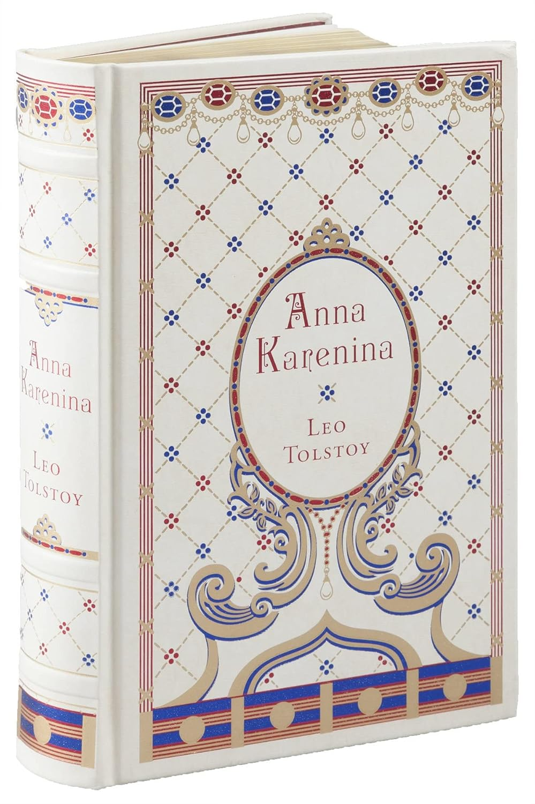

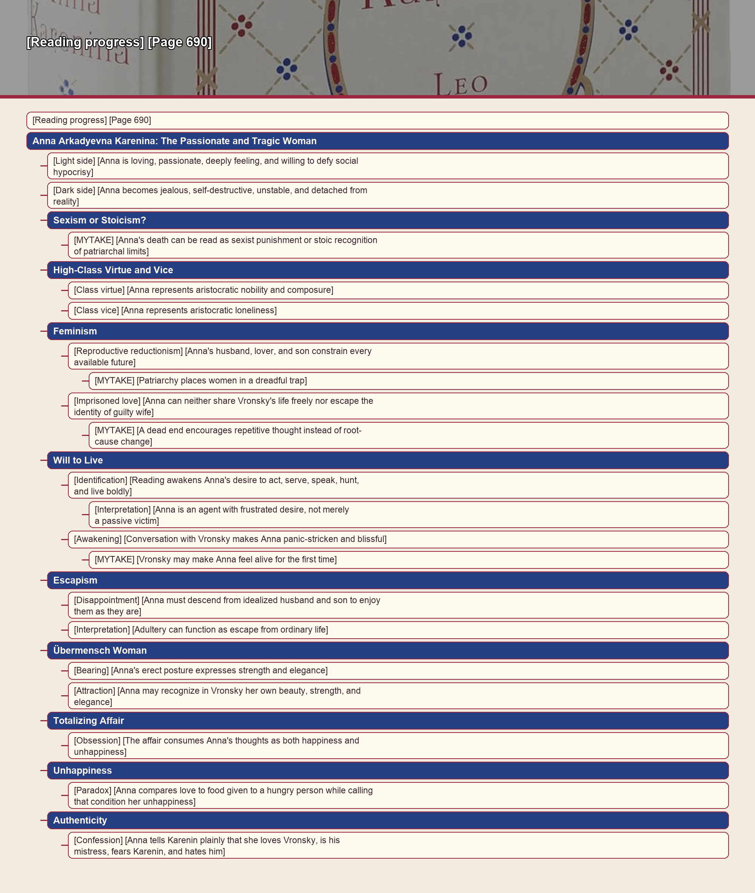

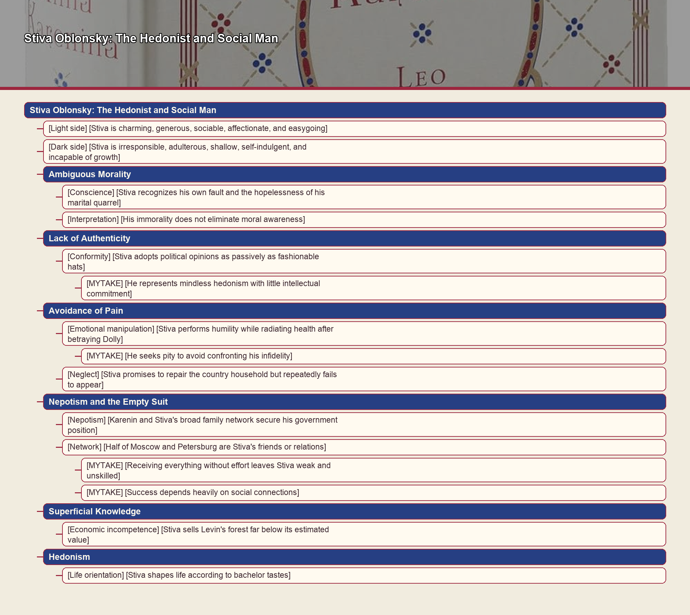

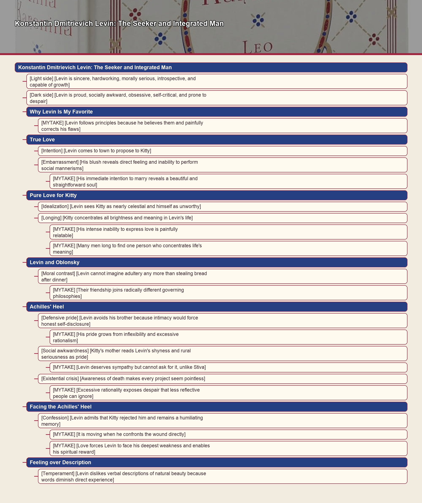

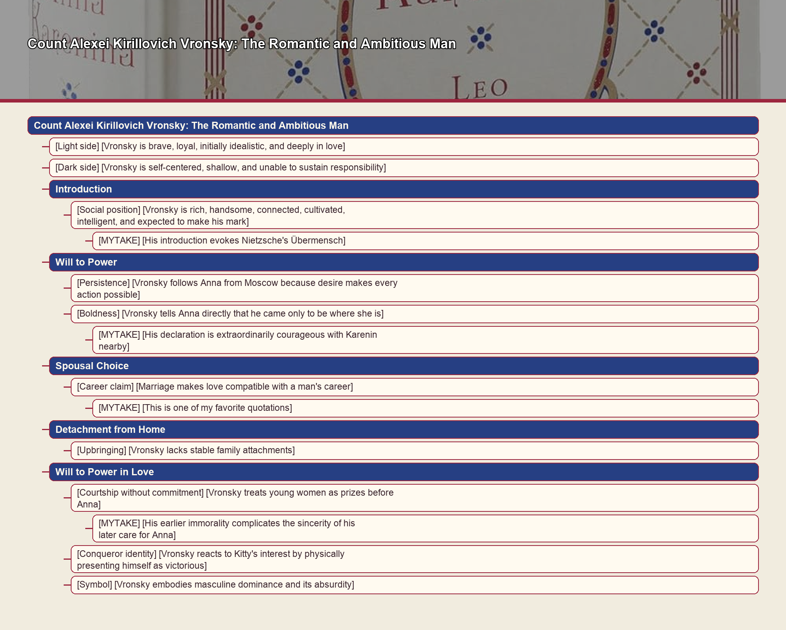

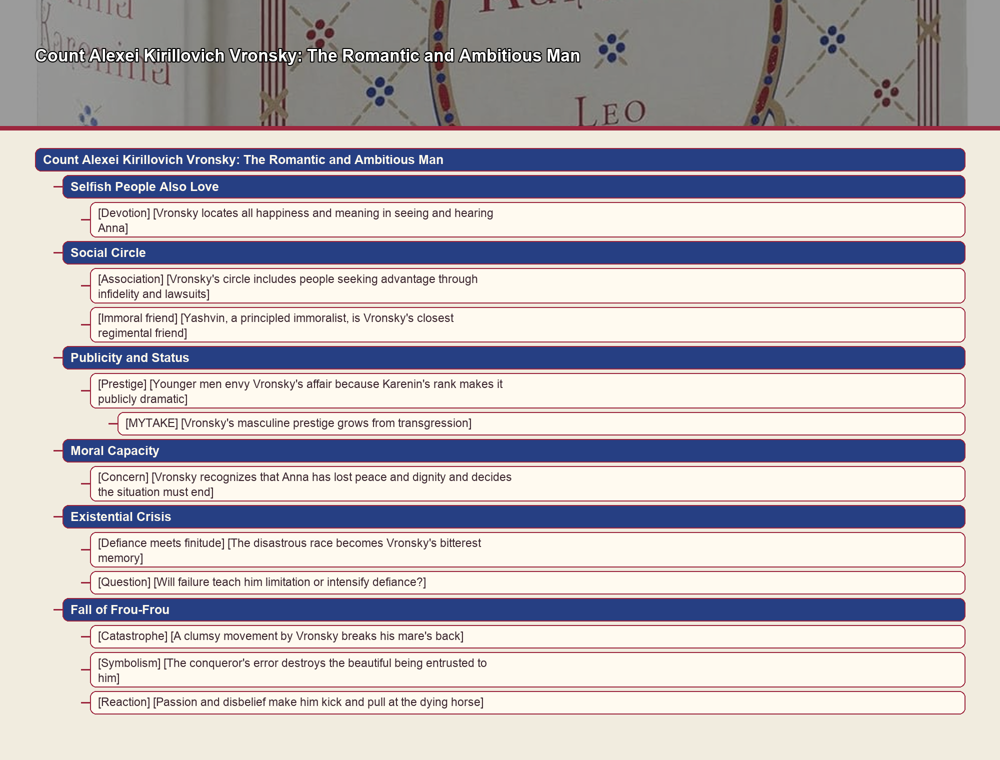

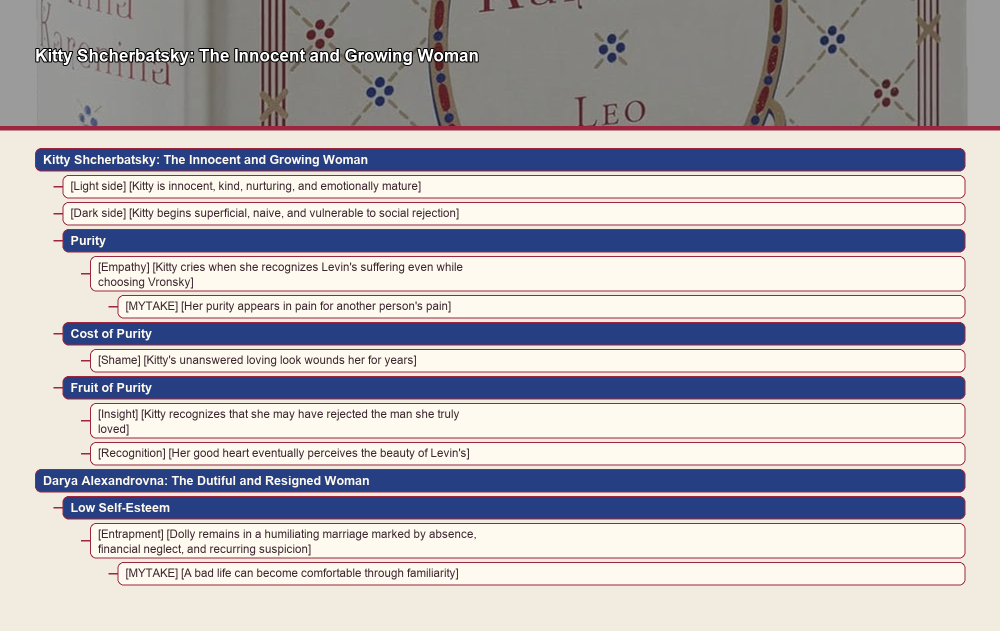

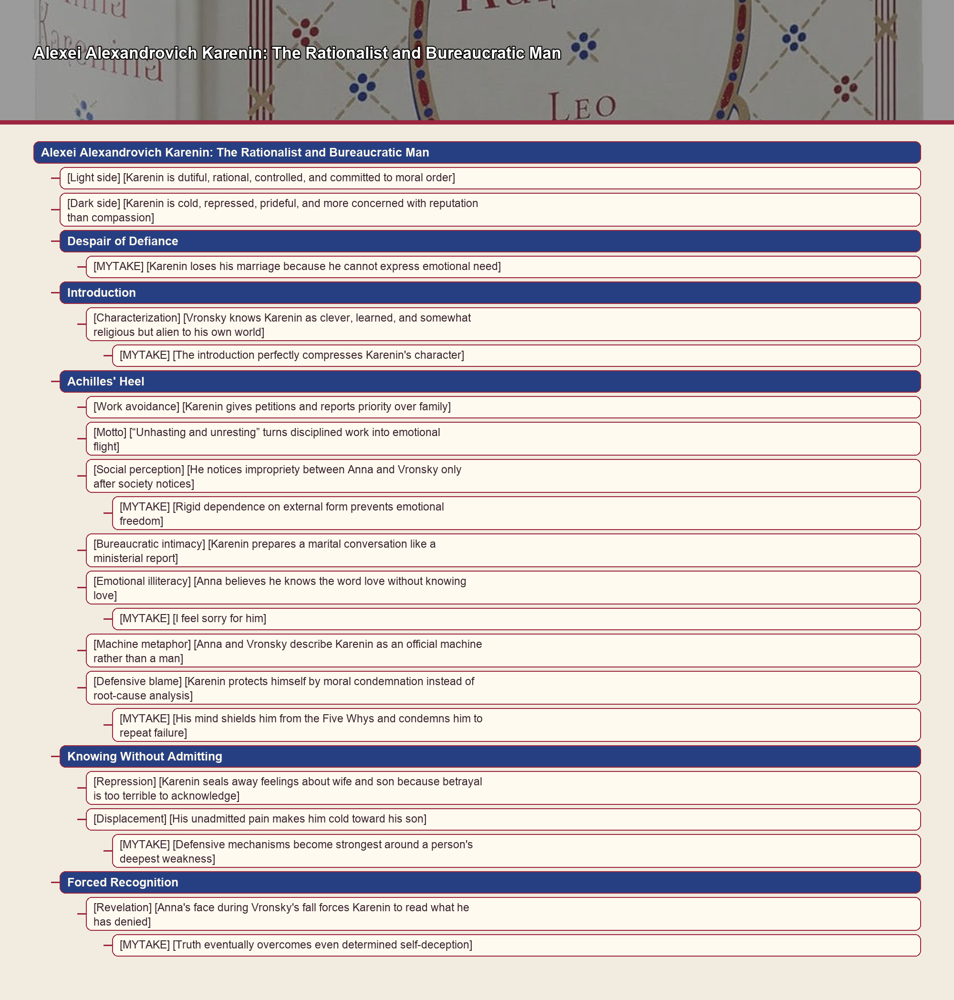

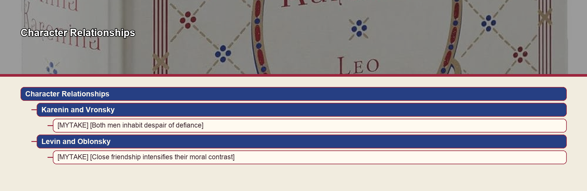

- [Reading progress] [Page 690]

# Anna Arkadyevna Karenina: The Passionate and Tragic Woman

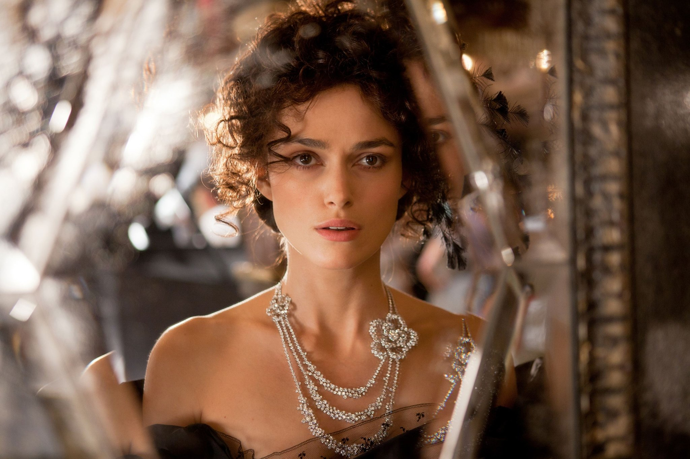

- [Light side] [Anna is loving, passionate, deeply feeling, and willing to defy social hypocrisy]
- [Dark side] [Anna becomes jealous, self-destructive, unstable, and detached from reality]

## Sexism or Stoicism?

- [MYTAKE] [Anna's death can be read as sexist punishment or stoic recognition of patriarchal limits] A woman with courage, intelligence, and authenticity might seem to deserve a reward rather than suicide; alternatively, Tolstoy may be arguing that a woman who challenges patriarchal structure is doomed within that society.

## High-Class Virtue and Vice

- [Class virtue] [Anna represents aristocratic nobility and composure]
- [Class vice] [Anna represents aristocratic loneliness]

## Feminism

- [Reproductive reductionism] [Anna's husband, lover, and son constrain every available future] Karenin may shame and expel her, Vronsky may leave, and she cannot abandon her son.
  - [MYTAKE] [Patriarchy places women in a dreadful trap]
- [Imprisoned love] [Anna can neither share Vronsky's life freely nor escape the identity of guilty wife]
  - [MYTAKE] [A dead end encourages repetitive thought instead of root-cause change] This resembles my own experience of endlessly iterating over the same problem.

## Will to Live

- [Identification] [Reading awakens Anna's desire to act, serve, speak, hunt, and live boldly]
  - [Interpretation] [Anna is an agent with frustrated desire, not merely a passive victim]
- [Awakening] [Conversation with Vronsky makes Anna panic-stricken and blissful]
  - [MYTAKE] [Vronsky may make Anna feel alive for the first time]

## Escapism

- [Disappointment] [Anna must descend from idealized husband and son to enjoy them as they are]
- [Interpretation] [Adultery can function as escape from ordinary life]

## Übermensch Woman

- [Bearing] [Anna's erect posture expresses strength and elegance]
- [Attraction] [Anna may recognize in Vronsky her own beauty, strength, and elegance]

## Totalizing Affair

- [Obsession] [The affair consumes Anna's thoughts as both happiness and unhappiness]

## Unhappiness

- [Paradox] [Anna compares love to food given to a hungry person while calling that condition her unhappiness]

## Authenticity

- [Confession] [Anna tells Karenin plainly that she loves Vronsky, is his mistress, fears Karenin, and hates him]

# Stiva Oblonsky: The Hedonist and Social Man

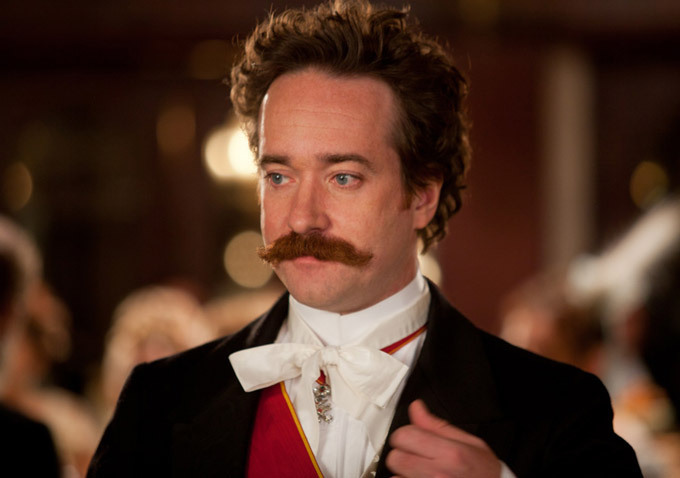

- [Light side] [Stiva is charming, generous, sociable, affectionate, and easygoing]
- [Dark side] [Stiva is irresponsible, adulterous, shallow, self-indulgent, and incapable of growth]

## Ambiguous Morality

- [Conscience] [Stiva recognizes his own fault and the hopelessness of his marital quarrel]
- [Interpretation] [His immorality does not eliminate moral awareness]

## Lack of Authenticity

- [Conformity] [Stiva adopts political opinions as passively as fashionable hats]
  - [MYTAKE] [He represents mindless hedonism with little intellectual commitment]

## Avoidance of Pain

- [Emotional manipulation] [Stiva performs humility while radiating health after betraying Dolly]
  - [MYTAKE] [He seeks pity to avoid confronting his infidelity]
- [Neglect] [Stiva promises to repair the country household but repeatedly fails to appear]

## Nepotism and the Empty Suit

- [Nepotism] [Karenin and Stiva's broad family network secure his government position]
- [Network] [Half of Moscow and Petersburg are Stiva's friends or relations]
  - [MYTAKE] [Receiving everything without effort leaves Stiva weak and unskilled]
  - [MYTAKE] [Success depends heavily on social connections]

## Superficial Knowledge

- [Economic incompetence] [Stiva sells Levin's forest far below its estimated value]

## Hedonism

- [Life orientation] [Stiva shapes life according to bachelor tastes]

# Konstantin Dmitrievich Levin: The Seeker and Integrated Man

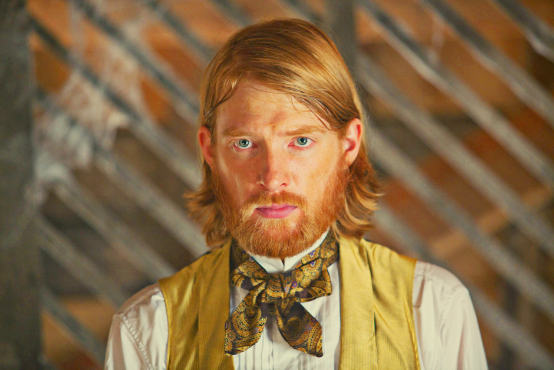

- [Light side] [Levin is sincere, hardworking, morally serious, introspective, and capable of growth]
- [Dark side] [Levin is proud, socially awkward, obsessive, self-critical, and prone to despair]

## Why Levin Is My Favorite

- [MYTAKE] [Levin follows principles because he believes them and painfully corrects his flaws] Unlike characters driven by ease, appetite, or convention, he pursues authenticity.

## True Love

- [Intention] [Levin comes to town to propose to Kitty]
- [Embarrassment] [His blush reveals direct feeling and inability to perform social mannerisms]
  - [MYTAKE] [His immediate intention to marry reveals a beautiful and straightforward soul]

## Pure Love for Kitty

- [Idealization] [Levin sees Kitty as nearly celestial and himself as unworthy]
- [Longing] [Kitty concentrates all brightness and meaning in Levin's life]
  - [MYTAKE] [His intense inability to express love is painfully relatable]
  - [MYTAKE] [Many men long to find one person who concentrates life's meaning]

## Levin and Oblonsky

- [Moral contrast] [Levin cannot imagine adultery any more than stealing bread after dinner]
  - [MYTAKE] [Their friendship joins radically different governing philosophies]

## Achilles' Heel

- [Defensive pride] [Levin avoids his brother because intimacy would force honest self-disclosure]
  - [MYTAKE] [His pride grows from inflexibility and excessive rationalism]
- [Social awkwardness] [Kitty's mother reads Levin's shyness and rural seriousness as pride]
  - [MYTAKE] [Levin deserves sympathy but cannot ask for it, unlike Stiva]
- [Existential crisis] [Awareness of death makes every project seem pointless]
  - [MYTAKE] [Excessive rationality exposes despair that less reflective people can ignore]

## Facing the Achilles' Heel

- [Confession] [Levin admits that Kitty rejected him and remains a humiliating memory]
  - [MYTAKE] [It is moving when he confronts the wound directly]
  - [MYTAKE] [Love forces Levin to face his deepest weakness and enables his spiritual reward]

## Feeling over Description

- [Temperament] [Levin dislikes verbal descriptions of natural beauty because words diminish direct experience]

# Count Alexei Kirillovich Vronsky: The Romantic and Ambitious Man

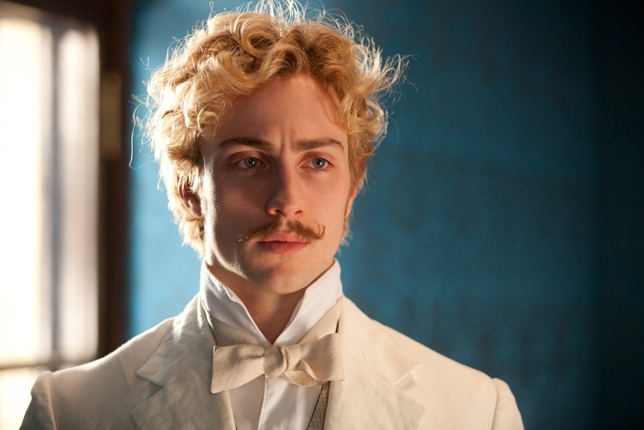

- [Light side] [Vronsky is brave, loyal, initially idealistic, and deeply in love]
- [Dark side] [Vronsky is self-centered, shallow, and unable to sustain responsibility]

## Introduction

- [Social position] [Vronsky is rich, handsome, connected, cultivated, intelligent, and expected to make his mark]
  - [MYTAKE] [His introduction evokes Nietzsche's Übermensch]

## Will to Power

- [Persistence] [Vronsky follows Anna from Moscow because desire makes every action possible]
- [Boldness] [Vronsky tells Anna directly that he came only to be where she is]
  - [MYTAKE] [His declaration is extraordinarily courageous with Karenin nearby]

## Spousal Choice

- [Career claim] [Marriage makes love compatible with a man's career]
  - [MYTAKE] [This is one of my favorite quotations] Tolstoy's stoic treatment of marriage resonates because finding a partner can demand more effort than a full-time job.

## Detachment from Home

- [Upbringing] [Vronsky lacks stable family attachments] His mother was notorious for affairs, he barely remembered his father, and the Corps of Pages educated him.

## Will to Power in Love

- [Courtship without commitment] [Vronsky treats young women as prizes before Anna]
  - [MYTAKE] [His earlier immorality complicates the sincerity of his later care for Anna]
- [Conqueror identity] [Vronsky reacts to Kitty's interest by physically presenting himself as victorious]
- [Symbol] [Vronsky embodies masculine dominance and its absurdity] Tolstoy mocks the Übermensch ideal rather than celebrating it.

## Selfish People Also Love

- [Devotion] [Vronsky locates all happiness and meaning in seeing and hearing Anna]

## Social Circle

- [Association] [Vronsky's circle includes people seeking advantage through infidelity and lawsuits]
- [Immoral friend] [Yashvin, a principled immoralist, is Vronsky's closest regimental friend]

## Publicity and Status

- [Prestige] [Younger men envy Vronsky's affair because Karenin's rank makes it publicly dramatic]
  - [MYTAKE] [Vronsky's masculine prestige grows from transgression]

## Moral Capacity

- [Concern] [Vronsky recognizes that Anna has lost peace and dignity and decides the situation must end]

## Existential Crisis

- [Defiance meets finitude] [The disastrous race becomes Vronsky's bitterest memory]
- [Question] [Will failure teach him limitation or intensify defiance?]

## Fall of Frou-Frou

- [Catastrophe] [A clumsy movement by Vronsky breaks his mare's back]
- [Symbolism] [The conqueror's error destroys the beautiful being entrusted to him]
- [Reaction] [Passion and disbelief make him kick and pull at the dying horse]

# Kitty Shcherbatsky: The Innocent and Growing Woman

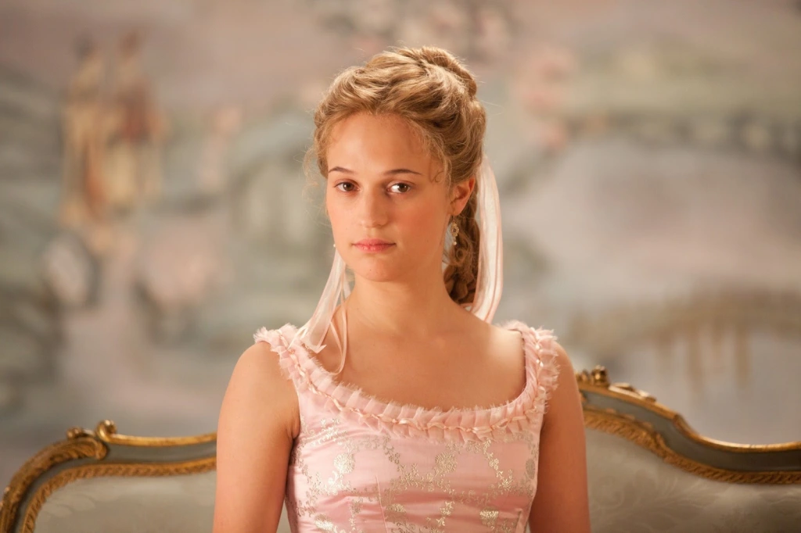

- [Light side] [Kitty is innocent, kind, nurturing, and emotionally mature]
- [Dark side] [Kitty begins superficial, naive, and vulnerable to social rejection]

## Purity

- [Empathy] [Kitty cries when she recognizes Levin's suffering even while choosing Vronsky]
  - [MYTAKE] [Her purity appears in pain for another person's pain]

## Cost of Purity

- [Shame] [Kitty's unanswered loving look wounds her for years]

## Fruit of Purity

- [Insight] [Kitty recognizes that she may have rejected the man she truly loved]
- [Recognition] [Her good heart eventually perceives the beauty of Levin's]

# Alexei Alexandrovich Karenin: The Rationalist and Bureaucratic Man

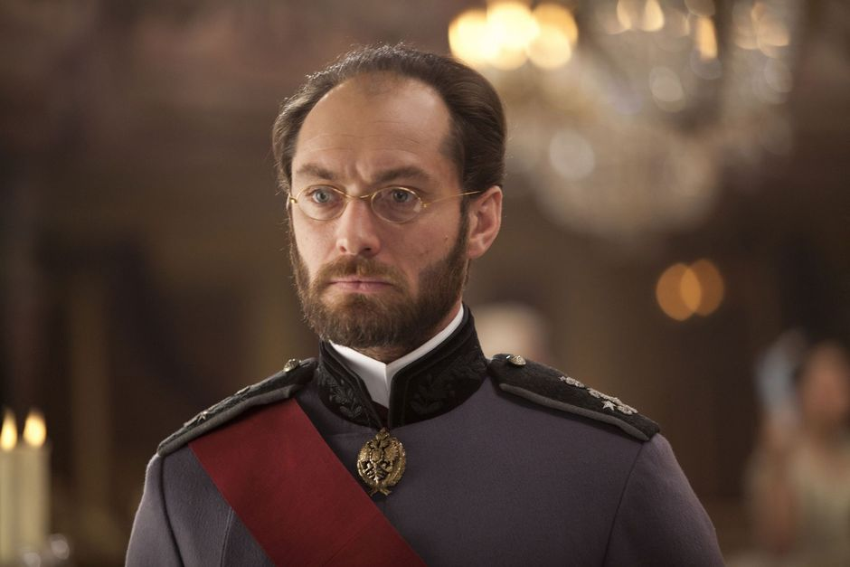

- [Light side] [Karenin is dutiful, rational, controlled, and committed to moral order]
- [Dark side] [Karenin is cold, repressed, prideful, and more concerned with reputation than compassion]

## Despair of Defiance

- [MYTAKE] [Karenin loses his marriage because he cannot express emotional need] His failure resembles an experience I had in Waterloo.

## Introduction

- [Characterization] [Vronsky knows Karenin as clever, learned, and somewhat religious but alien to his own world]
  - [MYTAKE] [The introduction perfectly compresses Karenin's character]

## Achilles' Heel

- [Work avoidance] [Karenin gives petitions and reports priority over family]
- [Motto] [“Unhasting and unresting” turns disciplined work into emotional flight]
- [Social perception] [He notices impropriety between Anna and Vronsky only after society notices]
  - [MYTAKE] [Rigid dependence on external form prevents emotional freedom]
- [Bureaucratic intimacy] [Karenin prepares a marital conversation like a ministerial report]
- [Emotional illiteracy] [Anna believes he knows the word love without knowing love]
  - [MYTAKE] [I feel sorry for him]
- [Machine metaphor] [Anna and Vronsky describe Karenin as an official machine rather than a man]
- [Defensive blame] [Karenin protects himself by moral condemnation instead of root-cause analysis]
  - [MYTAKE] [His mind shields him from the Five Whys and condemns him to repeat failure]

## Knowing Without Admitting

- [Repression] [Karenin seals away feelings about wife and son because betrayal is too terrible to acknowledge]
- [Displacement] [His unadmitted pain makes him cold toward his son]
  - [MYTAKE] [Defensive mechanisms become strongest around a person's deepest weakness]

## Forced Recognition

- [Revelation] [Anna's face during Vronsky's fall forces Karenin to read what he has denied]
  - [MYTAKE] [Truth eventually overcomes even determined self-deception]

# Darya Alexandrovna: The Dutiful and Resigned Woman

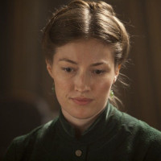

## Low Self-Esteem

- [Entrapment] [Dolly remains in a humiliating marriage marked by absence, financial neglect, and recurring suspicion]
  - [MYTAKE] [A bad life can become comfortable through familiarity] Dolly is likable, relatable, and painfully powerless.

# Character Relationships

## Karenin and Vronsky

- [MYTAKE] [Both men inhabit despair of defiance] Karenin refuses to admit emotional absence, while Vronsky resists the limitations and responsibility created by desire.

## Levin and Oblonsky

- [MYTAKE] [Close friendship intensifies their moral contrast] Levin is capable of true love and integrity, while Oblonsky is not.
