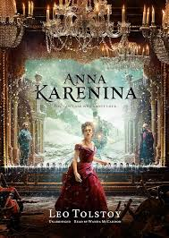
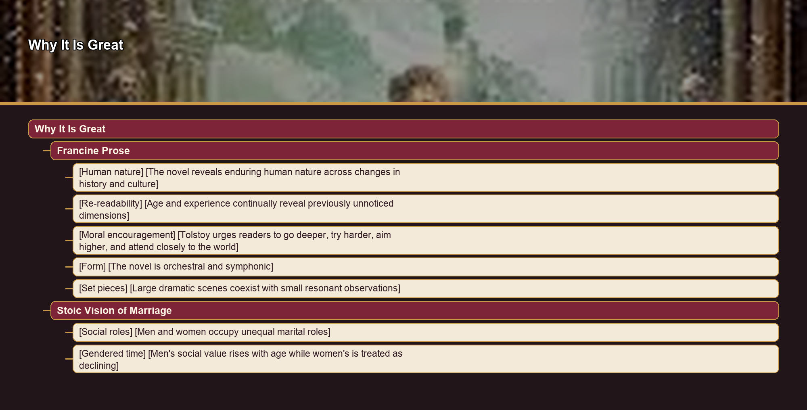
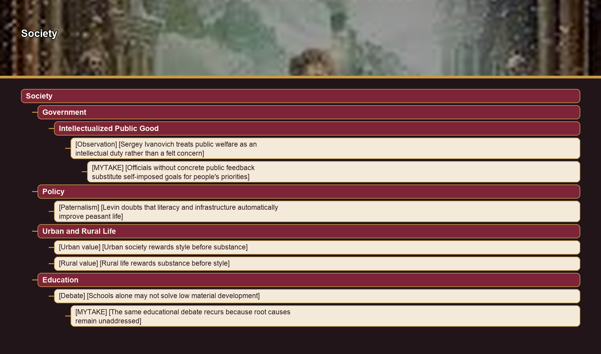
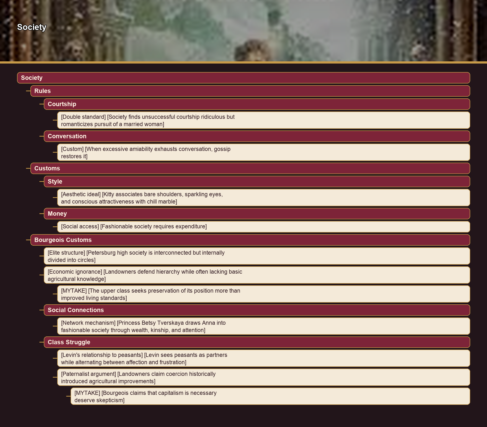
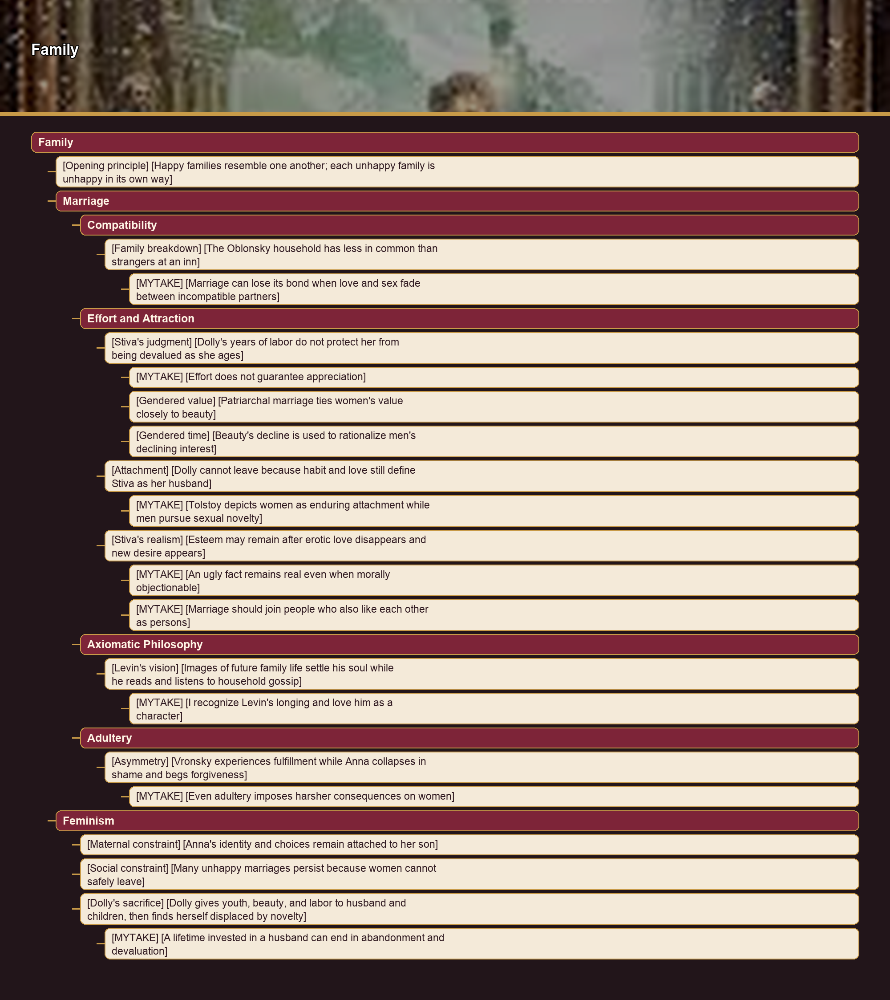
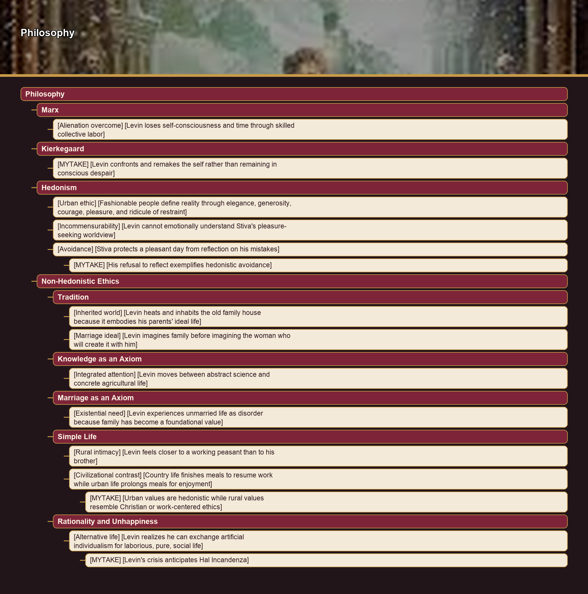

# Why It Is Great

## Francine Prose

- [Human nature] [The novel reveals enduring human nature across changes in history and culture]
- [Re-readability] [Age and experience continually reveal previously unnoticed dimensions]
- [Moral encouragement] [Tolstoy urges readers to go deeper, try harder, aim higher, and attend closely to the world]
- [Form] [The novel is orchestral and symphonic] Distinctive melodies, parallels, and variations work consciously and subconsciously.
- [Set pieces] [Large dramatic scenes coexist with small resonant observations] The skating party, ball, mushroom gathering, horse race, and Anna's sudden disgust with Karenin's ears exemplify its range.

## Stoic Vision of Marriage

- [Social roles] [Men and women occupy unequal marital roles]
- [Gendered time] [Men's social value rises with age while women's is treated as declining]

# Society

## Government

### Intellectualized Public Good

- [Observation] [Sergey Ivanovich treats public welfare as an intellectual duty rather than a felt concern] Public affairs and immortality interest him like chess problems or machines.
  - [MYTAKE] [Officials without concrete public feedback substitute self-imposed goals for people's priorities] This resembles left-wing leaders emphasizing issues the public may not prioritize because institutions lack mechanisms connecting civil servants to outcomes.

## Policy

- [Paternalism] [Levin doubts that literacy and infrastructure automatically improve peasant life] He claims literate laborers can be inferior workers and that bridges may be stolen.

## Urban and Rural Life

- [Urban value] [Urban society rewards style before substance] Princess Myakaya's plain remarks seem witty because simplicity is unusual in her circle.
- [Rural value] [Rural life rewards substance before style] Agafea Mihalovna discusses physics, agriculture, and philosophy, while practical knowledge exposes Levin's costly forest sale.

## Education

- [Debate] [Schools alone may not solve low material development]
  - [MYTAKE] [The same educational debate recurs because root causes remain unaddressed] This resembles Gabriel García Márquez's observation about history repeating unresolved problems.

## Rules

### Courtship

- [Double standard] [Society finds unsuccessful courtship ridiculous but romanticizes pursuit of a married woman]

### Conversation

- [Custom] [When excessive amiability exhausts conversation, gossip restores it]

## Customs

### Style

- [Aesthetic ideal] [Kitty associates bare shoulders, sparkling eyes, and conscious attractiveness with chill marble]

### Money

- [Social access] [Fashionable society requires expenditure] Anna abandons serious-minded friends for the expensive circle where she can meet Vronsky.

## Bourgeois Customs

- [Elite structure] [Petersburg high society is interconnected but internally divided into circles]
- [Economic ignorance] [Landowners defend hierarchy while often lacking basic agricultural knowledge]
  - [MYTAKE] [The upper class seeks preservation of its position more than improved living standards]

### Social Connections

- [Network mechanism] [Princess Betsy Tverskaya draws Anna into fashionable society through wealth, kinship, and attention]

### Class Struggle

- [Levin's relationship to peasants] [Levin sees peasants as partners while alternating between affection and frustration]
- [Paternalist argument] [Landowners claim coercion historically introduced agricultural improvements]
  - [MYTAKE] [Bourgeois claims that capitalism is necessary deserve skepticism]

# Family

- [Opening principle] [Happy families resemble one another; each unhappy family is unhappy in its own way]

## Marriage

### Compatibility

- [Family breakdown] [The Oblonsky household has less in common than strangers at an inn]
  - [MYTAKE] [Marriage can lose its bond when love and sex fade between incompatible partners] Children may remain the only durable connection.

### Effort and Attraction

- [Stiva's judgment] [Dolly's years of labor do not protect her from being devalued as she ages]
  - [MYTAKE] [Effort does not guarantee appreciation]
  - [Gendered value] [Patriarchal marriage ties women's value closely to beauty]
  - [Gendered time] [Beauty's decline is used to rationalize men's declining interest]
- [Attachment] [Dolly cannot leave because habit and love still define Stiva as her husband]
  - [MYTAKE] [Tolstoy depicts women as enduring attachment while men pursue sexual novelty]
- [Stiva's realism] [Esteem may remain after erotic love disappears and new desire appears]
  - [MYTAKE] [An ugly fact remains real even when morally objectionable]
  - [MYTAKE] [Marriage should join people who also like each other as persons]

### Axiomatic Philosophy

- [Levin's vision] [Images of future family life settle his soul while he reads and listens to household gossip]
  - [MYTAKE] [I recognize Levin's longing and love him as a character]

### Adultery

- [Asymmetry] [Vronsky experiences fulfillment while Anna collapses in shame and begs forgiveness]
  - [MYTAKE] [Even adultery imposes harsher consequences on women]

## Feminism

- [Maternal constraint] [Anna's identity and choices remain attached to her son]
- [Social constraint] [Many unhappy marriages persist because women cannot safely leave]
- [Dolly's sacrifice] [Dolly gives youth, beauty, and labor to husband and children, then finds herself displaced by novelty]
  - [MYTAKE] [A lifetime invested in a husband can end in abandonment and devaluation]

# Philosophy

## Marx

- [Alienation overcome] [Levin loses self-consciousness and time through skilled collective labor] Mowing becomes effortless and satisfying.

## Kierkegaard

- [MYTAKE] [Levin confronts and remakes the self rather than remaining in conscious despair]

## Hedonism

- [Urban ethic] [Fashionable people define reality through elegance, generosity, courage, pleasure, and ridicule of restraint]
- [Incommensurability] [Levin cannot emotionally understand Stiva's pleasure-seeking worldview]
- [Avoidance] [Stiva protects a pleasant day from reflection on his mistakes]
  - [MYTAKE] [His refusal to reflect exemplifies hedonistic avoidance]

## Non-Hedonistic Ethics

### Tradition

- [Inherited world] [Levin heats and inhabits the old family house because it embodies his parents' ideal life]
- [Marriage ideal] [Levin imagines family before imagining the woman who will create it with him] Marriage is the central affair on which happiness turns.

### Knowledge as an Axiom

- [Integrated attention] [Levin moves between abstract science and concrete agricultural life] He questions equations about heat and electricity while thinking about cattle.

### Marriage as an Axiom

- [Existential need] [Levin experiences unmarried life as disorder because family has become a foundational value]

### Simple Life

- [Rural intimacy] [Levin feels closer to a working peasant than to his brother] Shared food, family talk, prayer, outdoor rest, and labor create affection.
- [Civilizational contrast] [Country life finishes meals to resume work while urban life prolongs meals for enjoyment]
  - [MYTAKE] [Urban values are hedonistic while rural values resemble Christian or work-centered ethics]

### Rationality and Unhappiness

- [Alternative life] [Levin realizes he can exchange artificial individualism for laborious, pure, social life]
  - [MYTAKE] [Levin's crisis anticipates Hal Incandenza]
