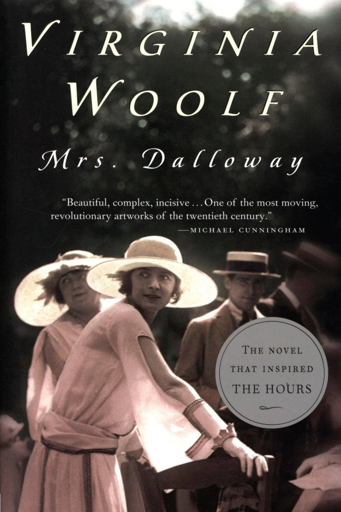
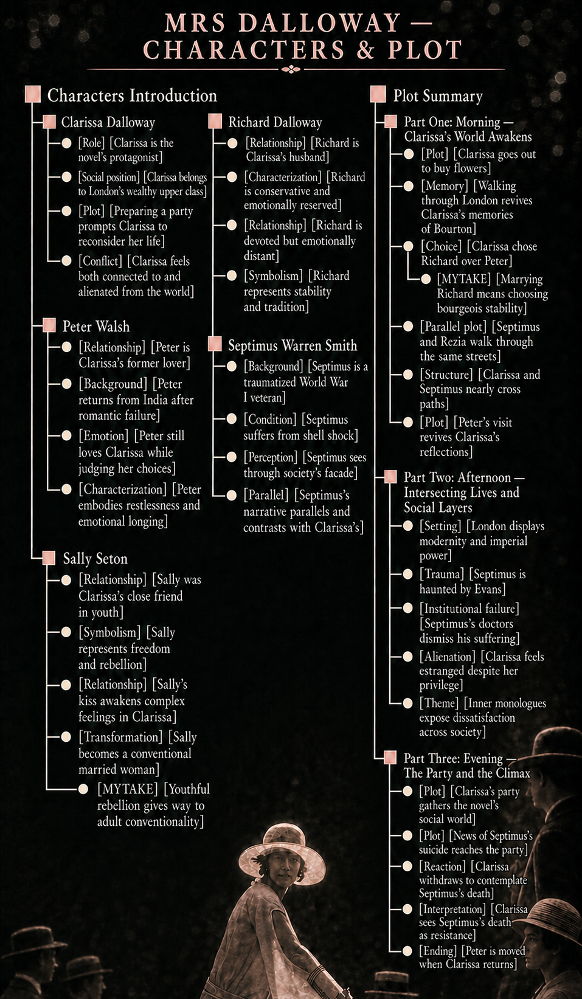
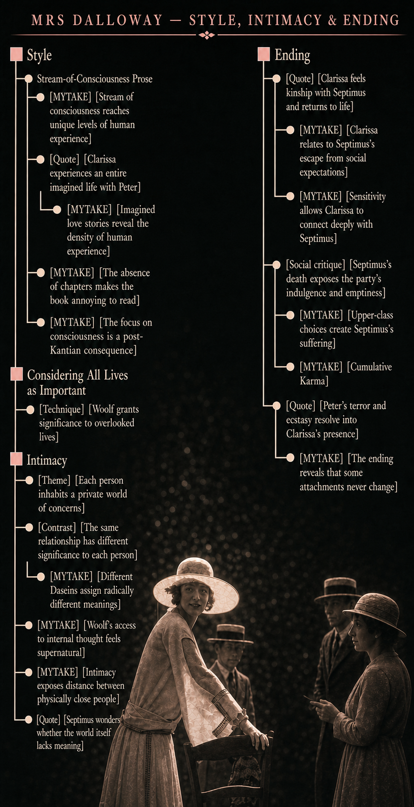
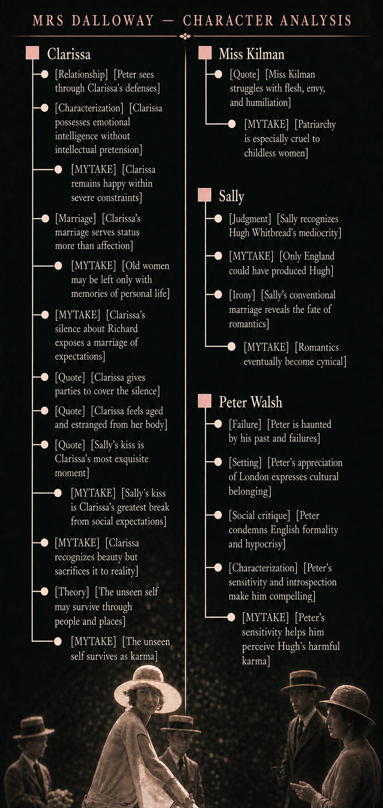

# Characters Introduction

## Clarissa Dalloway

- [Role] [Clarissa is the novel's protagonist]
- [Social position] [Clarissa belongs to London's wealthy upper class] She is a wealthy, upper-class woman living in post–World War I London.
- [Plot] [Preparing a party prompts Clarissa to reconsider her life] As she prepares to host a high-society party, Clarissa reflects on her youth, marriage, and missed opportunities.
- [Conflict] [Clarissa feels both connected to and alienated from the world] Alienated from 'Her husband, Richard', her past self, but connected to daily London life, and social rituals.

## Peter Walsh

- [Relationship] [Peter is Clarissa's former lover] Their relationship seems to have consisted of emotional intimacy, flirtation, arguments, and perhaps kissing—not a consummated sexual relationship.
- [Background] [Peter returns from India after romantic failure] It was a precarious, impractical, and possibly another of Peter’s romantic illusions.
- [Emotion] [Peter still loves Clarissa while judging her choices]
- [Characterization] [Peter embodies restlessness and emotional longing] 

## Sally Seton

- [Relationship] [Sally was Clarissa's close friend in youth] 
- [Symbolism] [Sally represents freedom and rebellion]
- [Relationship] [Sally's kiss awakens complex feelings in Clarissa] Sally once kissed Clarissa, sparking complex feelings.
- [Transformation] [Sally becomes a conventional married woman] Sally is now married and has become a conventional figure.
  - [MYTAKE] [Youthful rebellion gives way to adult conventionality] She is another example of a pattern than young people are rebel and full of eager to challenge the world, but as they grow older, they become more conventional and less rebellious.

## Richard Dalloway

- [Relationship] [Richard is Clarissa's husband]
- [Characterization] [Richard is conservative and emotionally reserved]
- [Relationship] [Richard is devoted but emotionally distant]
- [Symbolism] [Richard represents stability and tradition]

## Septimus Warren Smith

- [Background] [Septimus is a traumatized World War I veteran]
- [Condition] [Septimus suffers from shell shock] He suffers from shell shock, or PTSD, and is plagued by hallucinations and despair.
- [Perception] [Septimus sees through society's facade]
- [Parallel] [Septimus's narrative parallels and contrasts with Clarissa's]

# Plot Summary

## Part One: Morning — Clarissa's World Awakens

- [Plot] [Clarissa goes out to buy flowers] 
- [Memory] [Walking through London revives Clarissa's memories of Bourton] As Clarissa walks through London, memories of her youth resurface, especially her time at Bourton.
- [Choice] [Clarissa chose Richard over Peter] Clarissa reflects on her decision to marry Richard instead of her passionate but unstable friend Peter Walsh.
  - [MYTAKE] [Marrying Richard means choosing bourgeois stability] I enjoy these existential reflections, because marrying someone is like marrying an ideology. She didn't just choose to marry Richard, but she chose to marry stability, and bourgeois pretensious life.
- [Parallel plot] [Septimus and Rezia walk through the same streets] Meanwhile, Septimus Warren Smith, a World War I veteran suffering from trauma, walks the same streets with his wife, Rezia.
- [Structure] [Clarissa and Septimus nearly cross paths] Their paths nearly cross, establishing the novel’s dual narrative.
- [Plot] [Peter's visit revives Clarissa's reflections] Peter Walsh pays Clarissa an unexpected visit, triggering further reflection on her past choices.

## Part Two: Afternoon — Intersecting Lives and Social Layers

- [Setting] [London displays modernity and imperial power]
- [Trauma] [Septimus is haunted by Evans] Septimus continues to spiral into despair, haunted by hallucinations of his dead friend Evans (dead during war).
- [Institutional failure] [Septimus's doctors dismiss his suffering] His doctors, Holmes and Sir William Bradshaw, dismiss his suffering, symbolizing society’s failure to understand trauma.
- [Alienation] [Clarissa feels estranged despite her privilege] Clarissa hosts lunch and tea while thinking about her role as a wife and mother and feeling alienated despite her privilege.
- [Theme] [Inner monologues expose dissatisfaction across society] The characters’ inner monologues reveal dissatisfaction, repression, and longing across social classes and genders.

## Part Three: Evening — The Party and the Climax

- [Plot] [Clarissa's party gathers the novel's social world] Clarissa’s party brings together Peter, Sally Seton, Lady Bruton, Elizabeth, and even Sir William Bradshaw.
- [Plot] [News of Septimus's suicide reaches the party] Bradshaw brings news of Septimus’s suicide to the party.
- [Reaction] [Clarissa withdraws to contemplate Septimus's death] Clarissa retreats alone, shocked and contemplative.
- [Interpretation] [Clarissa sees Septimus's death as resistance] She sees Septimus’s death as an act of resistance—something she herself might never do.
- [Ending] [Peter is moved when Clarissa returns] The novel ends with Peter watching Clarissa re-enter the party, moved by her presence and the mystery of her inner life.

# Style

## Stream-of-Consciousness Prose

- [MYTAKE] [Stream of consciousness reaches unique levels of human experience] Woolf’s stream-of-consciousness style reaches unique levels of human experience.
- [Quote] [Clarissa experiences an entire imagined life with Peter] “Leve-me com você, pensou Clarissa num impulso, como se ele estivesse saindo imediatamente para uma longa viagem; e então, no instante seguinte, foi como se agora uma peça em cinco atos muito envolvente e empolgante tivesse se acabado e ela tivesse vivido ali uma existência inteira, tivesse fugido, tivesse vivido com Peter, e agora tivesse se acabado.”
  - [MYTAKE] [Imagined love stories reveal the density of human experience] The phemenology of the human always encapsulates a lot, imagine all of the love stories that have been imagined throughout history
- [MYTAKE] [The absence of chapters makes the book annoying to read] I hate the fact that this book has no chapters; it is so annoying to read.
- [MYTAKE] [The focus on consciousness is a post-Kantian consequence] Focusing on consciousness is a post-Kantian consequence: after moving on from noumena, all we have left is phenomena, and analyzing the depths and complex intricancies of it.

## Considering All Lives as Important

- [Technique] [Woolf grants significance to overlooked lives] Virginia Woolf highlights the importance of lives often overlooked, such as those of housemaids. Mrs. Walker’s perspective—“um primeiro ministro a mais ou menos não importava, o que importava era o salmão”—reflects Woolf’s feminist lens by giving value to what society might dismiss.

## Intimacy

- [Theme] [Each person inhabits a private world of concerns] Woolf emphasizes that each person is a world of their own, with concerns that seem crucial to them but may appear trivial from a distance.
- [Contrast] [The same relationship has different significance to each person] Woolf humorously contrasts how much an event matters to different characters: Clarissa and Peter’s affair means everything to Peter, little to Clarissa, and nothing to Richard.
  - [MYTAKE] [Different Daseins assign radically different meanings] In orther words, it shows the big discrepanchy of the Heideggerian Care of different Daseins in society. With these discrepant perspectives, all I can think of is that maybe things have meaning only in our head, but it's so hard to dettatch ourselves from that meaning. This also dialogues with Bhagavad Gita.
- [MYTAKE] [Woolf's access to internal thought feels supernatural] Her ability to delve into internal thoughts feels almost supernatural. She performs as if a true mind reader.
- [MYTAKE] [Intimacy exposes distance between physically close people] Because Woolf’s writing has so much intimacy, it reveals what is happening beneath the surface and how distant people can be even when they are physically close.
- [Quote] [Septimus wonders whether the world itself lacks meaning] “‘The English are so silent,’ Rezia said. She liked it, she said. She respected these Englishmen, and wanted to see London, and the English horses, and the tailor-made suits, and could remember hearing how wonderful the shops were, from an Aunt who had married and lived in Soho. It might be possible, Septimus thought, looking at England from the train window, as they left Newhaven; it might be possible that the world itself is without meaning.”

# Ending

- [Quote] [Clarissa feels kinship with Septimus and returns to life] “She felt somehow very like him—the young man who had killed himself. She felt glad that he had done it; thrown it away. The clock was striking. The leaden circles dissolved in the air. He made her feel the beauty; made her feel the fun. But she must go back. She must assemble.”
  - [MYTAKE] [Clarissa relates to Septimus's escape from social expectations] The ending is strong because Clarissa can relate to Septimus regarding societal expectations and recognizes that he was able to set himself free from the Heideggerian Das Man. Something that we all aspire to do, but few of us can do. It is a sad and beautiful ending. Maybe that could relate to my demission at Microsoft when I told Kanika that I loved her, I felt pretty happy by simply disobeying the social expectations.
  - [MYTAKE] [Sensitivity allows Clarissa to connect deeply with Septimus] One reason the ending is so great is that, although people are separated within their own little worlds, Septimus and Clarissa create a deep connection because she understands his pain. The KEY is that she has a lot empathy, a skill most of the people in high society and at thhat party don't have it. It is ironic and interesting that Septimus had to die, and news of his death had to travel through so many people, for his mind to be understood and heartfelt.
- [Social critique] [Septimus's death exposes the party's indulgence and emptiness] Septimus’s death makes Clarissa’s party appear even more indulgent. Elizabeth’s obsession with her dog, the men’s enjoyment of wine, and Clarissa’s gushing welcomes seem trivial in light of his suicide. More troublingly, the party entertains Septimus’s oppressors—the upholders of stifling British society—including Sir William. Most guests have failed in some way, and nearly all inhabit the bubble of upper-class England. Clarissa’s stuffy Aunt Helena, a botanist who suppresses emotion and interesting conversation, spent her life weighing flowers down with books to flatten them. Her hobby suggests a wish to squash the human soul to preserve English social mores and demonstrates the danger of applying analytic, scientific study to aesthetic values. The prime minister is a comical, slightly pathetic figure struggling to serve as a symbol for the public.
  - [MYTAKE] [Upper-class choices create Septimus's suffering] The social system is empty and ridiculous, yet Clarissa and her guests continue to uphold it. Virginia Wolf in a way that dialogues with Karma, IMO implicitly establishes of relationship of cause and effect between the decisions of the English upper class that created this war, and indirectly but tangibly caused Septimus's death. Nonetheless, they have no empathy and therefore don't care.
  - [MYTAKE] [Cumulative Karma] In my opinion the suicide of Septimus is trying to convey that this room killed Septimus, the war and the traumas weren't caused by one righ English man, it was caused by the whole upper class. It wasn't a murder it was a collective murder. But should any of them go to jail? Probably not.  
- [Quote] [Peter's terror and ecstasy resolve into Clarissa's presence] “‘Richard has improved. You are right,’ said Sally. ‘I shall go and talk to him. I shall say goodnight. What does the brain matter,’ said Lady Rosseter, getting up, ‘compared with the heart?’ ‘I will come,’ said Peter, but he sat on for a moment. What is this terror? What is this ecstasy? he thought to himself. What is it that fills me with extraordinary excitement? It is Clarissa, he said. For there she was.”
  - [MYTAKE] [The ending reveals that some attachments never change] The book ends with the realization that some things never change: Richard is still not worthy of love, and Peter still loves Clarissa.

# Clarissa

- [Relationship] [Peter sees through Clarissa's defenses] Clarissa shares a deep, unspoken connection with Peter, who always sees through her defenses.
- [Characterization] [Clarissa possesses emotional intelligence without intellectual pretension] Although she is not portrayed as highly intellectual, Clarissa demonstrates emotional intelligence: “Em todo caso não havia amargura nela; nada daquele senso de virtude moral que é tão desagradável nas mulheres bondosas.”
  - [MYTAKE] [Clarissa remains happy within severe constraints] I find Clarissa’s ability to be happy very impressive given the constraints of her life: she is married to someone she does not love and barely sees her children. Which is a great sign of emotional intelligence.
- [Marriage] [Clarissa's marriage serves status more than affection] Her marriage appears to concern social and economic status more than affection, since she rarely thinks about her husband. Patriarchy is also reflected in the title *Mrs Dalloway*: Richard barely matters to the novel, yet Clarissa’s title and social role are defined through him.
  - [MYTAKE] [Old women may be left only with memories of personal life] I think life can be viewed through professional and personal dimensions. When men grow old, they may lose their personal life but retain a professional one; women historically lacked a professional life and may also lose their personal one with age. The only thing left to old women may therefore be memories of their former personal lives. This thought is gloomy and sad.
- [MYTAKE] [Clarissa's silence about Richard exposes a marriage of expectations] One striking aspect of the book is that Clarissa barely mentions her husband, suggesting that a huge part of her life—her marriage and family—exists primarily to meet societal expectations.
- [Quote] [Clarissa gives parties to cover the silence] “Mrs Dalloway is always giving parties to cover the silence.”
- [Quote] [Clarissa feels aged and estranged from her body] “[F]eeling herself suddenly shriveled, aged, breastless, the grinding, blowing, flowering of the day, out of doors, out of the window, out of her body and brain which now failed...”
- [Quote] [Sally's kiss is Clarissa's most exquisite moment] "The most exquisite moment of Clarissa’s life occurred on the terrace at Bourton, when Sally picked a flower and kissed her on the lips. For Clarissa, the kiss was a religious experience. Peter interrupted them on the terrace, just as thoughts of him now interrupt Clarissa’s recollection of Sally."
  - [MYTAKE] [Sally's kiss is Clarissa's greatest break from social expectations] Maybe the opportunity where she violated social expectations the most in her life, even if it wasn't a lot.
- [MYTAKE] [Clarissa recognizes beauty but sacrifices it to reality] I relate strongly to Clarissa because, like me, she sees the beauty of the world but is forced by practical constraints not to pursue it.
- [Theory] [The unseen self may survive through people and places] Clarissa theorizes that visible appearances are momentary compared with the unseen self, which spreads widely and may survive by attaching itself to people or haunting places after death: “Clarissa had a theory in those days ... that since our apparitions, the part of us which appears, are so momentary compared with the other, the unseen part of us, which spreads wide, the unseen might survive, be recovered somehow attached to this person or that, or even haunting certain places after death ... perhaps—perhaps.”
  - [MYTAKE] [The unseen self survives as karma] This is exactly the concept of Karma. The essence of your life is the actions you take and the karma that it creates on others. The unseen part of us is the karma that we leave behind, and it can survive through people and places, as Clarissa theorizes.

# Miss Kilman

- [Quote] [Miss Kilman struggles with flesh, envy, and humiliation] “It was the flesh that she must control. Clarissa Dalloway had insulted her. That she expected. But she had not triumphed; she had not mastered the flesh. Ugly, clumsy, Clarissa Dalloway had laughed at her for being that; and had revived the fleshly desires, for she minded looking as she did beside Clarissa. Nor could she talk as she did. But why wish to resemble her? Why? She despised Mrs. Dalloway from the bottom of her heart. She was not serious. She was not good. Her life was a tissue of vanity and deceit. Yet Doris Kilman had been overcome. She had, as a matter of fact, very nearly burst into tears when Clarissa Dalloway laughed at her. ‘It is the flesh, it is the flesh,’ she muttered (it being her habit to talk aloud), trying to subdue this turbulent and painful feeling as she walked down Victoria Street. She prayed to God. She could not help being ugly; she could not afford to buy pretty clothes. Clarissa Dalloway had laughed—but she would concentrate her mind upon something else until she had reached the pillar-box. At any rate she had got Elizabeth. But she would think of something else; she would think of Russia; until she reached the pillar-box.”
  - [MYTAKE] [Patriarchy is especially cruel to childless women] I feel sorry for Miss Kilman throughout the book, especially because she reminds me of Doi. If patriarchy is bad for women with children, it is even worse for women without children.

# Sally
- [Judgment] [Sally recognizes Hugh Whitbread's mediocrity] Sally is the only character who recognizes Hugh Whitbread’s mediocrity: “um tratador de estábulos tinha mais vida em si do que Hugh, dizia Sally. Era um exemplar perfeito do aluno de internato, dizia ela. Nenhum país poderia tê-lo produzido a não ser a Inglaterra.”
- [MYTAKE] [Only England could have produced Hugh] I like this statement of no other country could have created him except England.
- [Irony] [Sally's conventional marriage reveals the fate of romantics] Sally’s marriage to a bald cotton-factory owner reflects the fate of romantics: 
  - [MYTAKE] [Romantics eventually become cynical] As Joni Mitchell would say “all romantics face the same fate some day, cynical and drunk, wandering in some dark café.”

# Peter Walsh

- [Failure] [Peter is haunted by his past and failures] Peter is haunted by the past and by his failures: “Oh sim, não tinha nenhuma dúvida a respeito; era um fracasso, comparado a tudo isso.”
- [Setting] [Peter's appreciation of London expresses cultural belonging] Peter appreciates London, unlike Rezia, demonstrating his deep connection to British culture.
- [Social critique] [Peter condemns English formality and hypocrisy] Peter critiques the formality and hypocrisy of English society, particularly Hugh Whitbread: “Peter Walsh não tinha misericórdia. Os violões precisam existir, e Deus sabe os cafajestes que são enforcados por esmigalhar os miolos de uma moça num trem causam menos mal ao todo que Hugh Whitbread e suas gentilezas!”
- [Characterization] [Peter's sensitivity and introspection make him compelling] Peter’s sensitivity and introspection make him a compelling character; his metaphorical switchblade represents his struggles.
  - [MYTAKE] [Peter's sensitivity helps him perceive Hugh's harmful karma] I like this character, because it shows that since Peter is more sensitive, he understands Karma better than the other characters, he undersatnads that Hugh is a bad person, a demon with good manners, and that he causes badness to whatever he touches. Whereas others are more used to normalize badness into good.
