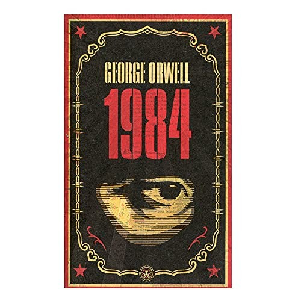
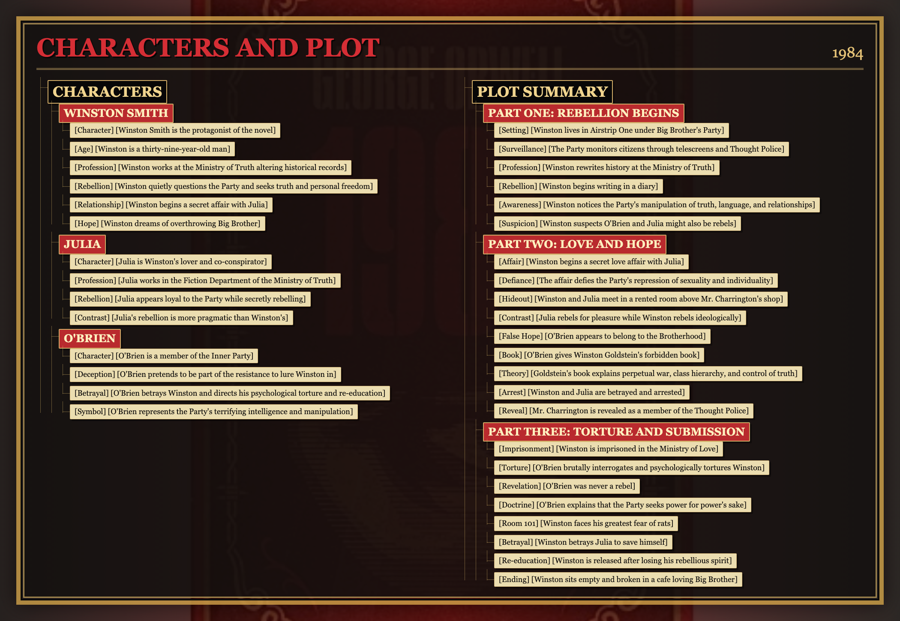
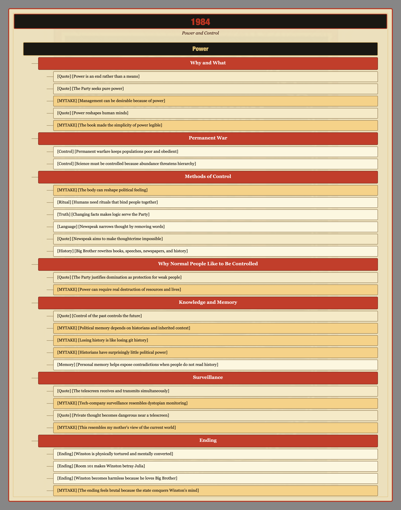
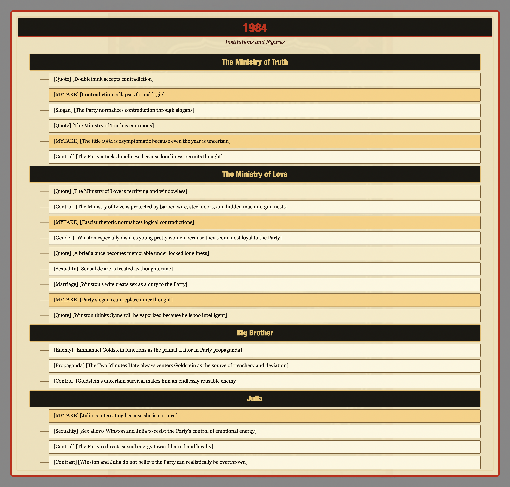
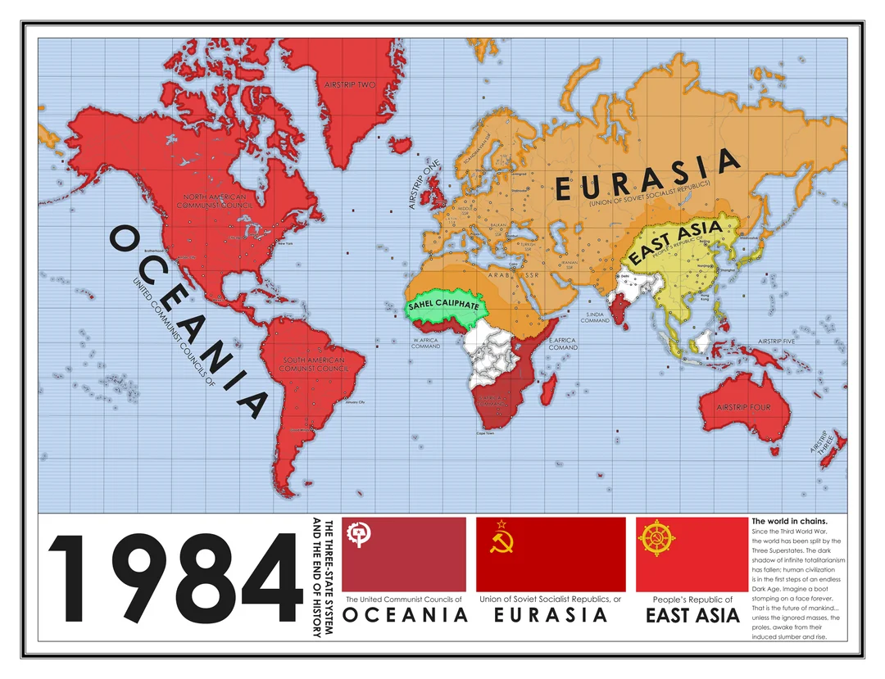

# Characters

## Winston Smith

- [Character] [Winston Smith is the protagonist of the novel]
- [Age] [Winston is a thirty-nine-year-old man]
- [Profession] [Winston works at the Ministry of Truth altering historical records] He rewrites records so they match Party propaganda.
- [Rebellion] [Winston quietly questions the Party and seeks truth and personal freedom]
- [Relationship] [Winston begins a secret affair with Julia]
- [Hope] [Winston dreams of overthrowing Big Brother]

## Julia

- [Character] [Julia is Winston's lover and co-conspirator]
- [Profession] [Julia works in the Fiction Department of the Ministry of Truth]
- [Rebellion] [Julia appears loyal to the Party while secretly rebelling]
- [Contrast] [Julia's rebellion is more pragmatic than Winston's] Her rebellion is driven more by personal pleasure than ideology.

## O'Brien

- [Character] [O'Brien is a member of the Inner Party]
- [Deception] [O'Brien pretends to be part of the resistance to lure Winston in]
- [Betrayal] [O'Brien betrays Winston and directs his psychological torture and re-education]
- [Symbol] [O'Brien represents the Party's terrifying intelligence and manipulation]

# Plot Summary

## Part One: Rebellion Begins

- [Setting] [Winston lives in Airstrip One under Big Brother's Party] Airstrip One is formerly Britain, now ruled by the Party.
- [Surveillance] [The Party monitors citizens through telescreens and Thought Police]
- [Profession] [Winston rewrites history at the Ministry of Truth]
- [Rebellion] [Winston begins writing in a diary] The diary is an illegal act of private thought.
- [Awareness] [Winston notices the Party's manipulation of truth, language, and relationships]
- [Suspicion] [Winston suspects O'Brien and Julia might also be rebels]

## Part Two: Love and Hope

- [Affair] [Winston begins a secret love affair with Julia]
- [Defiance] [The affair defies the Party's repression of sexuality and individuality]
- [Hideout] [Winston and Julia meet in a rented room above Mr. Charrington's shop]
- [Contrast] [Julia rebels for pleasure while Winston rebels ideologically]
- [False Hope] [O'Brien appears to belong to the Brotherhood]
- [Book] [O'Brien gives Winston Goldstein's forbidden book]
- [Theory] [Goldstein's book explains perpetual war, class hierarchy, and control of truth]
- [Arrest] [Winston and Julia are betrayed and arrested]
- [Reveal] [Mr. Charrington is revealed as a member of the Thought Police]

## Part Three: Torture and Submission

- [Imprisonment] [Winston is imprisoned in the Ministry of Love]
- [Torture] [O'Brien brutally interrogates and psychologically tortures Winston]
- [Revelation] [O'Brien was never a rebel]
- [Doctrine] [O'Brien explains that the Party seeks power for power's sake]
- [Room 101] [Winston faces his greatest fear of rats]
- [Betrayal] [Winston betrays Julia to save himself]
- [Re-education] [Winston is released after losing his rebellious spirit]
- [Ending] [Winston sits empty and broken in a cafe loving Big Brother]

# Power

## Why and What

- [Quote] [Power is an end rather than a means] "Power is not a means; it is an end."
- [Quote] [The Party seeks pure power] "The Party seeks power entirely for its own sake."
- [MYTAKE] [Management can be desirable because of power] The idea helps explain why someone might want a management job despite the role sounding terrible.
- [Quote] [Power reshapes human minds] "Power is in tearing human minds to pieces and putting them together again in new shapes of your own choosing."
- [MYTAKE] [The book made the simplicity of power legible] It felt obvious after reading, but the book made the idea newly understandable.

## Permanent War

- [Control] [Permanent warfare keeps populations poor and obedient] By directing production toward arms instead of consumer goods, each state prevents abundance from raising expectations.
- [Control] [Science must be controlled because abundance threatens hierarchy] If science produced a higher standard of living, the proles or Outer Party might expect more freedom.

## Methods of Control

- [MYTAKE] [The body can reshape political feeling] Repeating a slogan physically and vocally can produce emotional attachment to it.
- [Ritual] [Humans need rituals that bind people together] Family dinner is an example of a bonding ritual.
- [Truth] [Changing facts makes logic serve the Party] If the axioms are controlled by the Party, correct reasoning still reaches Party-approved conclusions.
- [Language] [Newspeak narrows thought by removing words]
- [Quote] [Newspeak aims to make thoughtcrime impossible] "Don't you see that the whole aim of Newspeak is to narrow the range of thought?"
- [History] [Big Brother rewrites books, speeches, newspapers, and history]

## Why Normal People Like to Be Controlled

- [Quote] [The Party justifies domination as protection for weak people] "The choice for mankind lay between freedom and happiness, and that, for the great bulk of mankind, happiness was better."
- [MYTAKE] [Power can require real destruction of resources and lives] Wealth concentration shows that scarcity and poverty are not only theoretical political tools.

## Knowledge and Memory

- [Quote] [Control of the past controls the future] "Who controls the past controls the future. Who controls the present controls the past."
- [MYTAKE] [Political memory depends on historians and inherited context] It is hard to understand politics without historical memory.
- [MYTAKE] [Losing history is like losing git history] Without preserved history, contradictions become harder to see.
- [MYTAKE] [Historians have surprisingly little political power] Western society does not seem to love intellectual authority very much.
- [Memory] [Personal memory helps expose contradictions when people do not read history]

## Surveillance

- [Quote] [The telescreen receives and transmits simultaneously] "Any sound that Winston made, above the level of a very low whisper, would be picked up by it."
- [MYTAKE] [Tech-company surveillance resembles dystopian monitoring] Google and other technology companies raise the question of whether we already live in a dystopian future.
- [Quote] [Private thought becomes dangerous near a telescreen] "It was terribly dangerous to let your thoughts wander when you were in any public place or within range of a telescreen."
- [MYTAKE] [This resembles my mother's view of the current world]

## Ending

- [Ending] [Winston is physically tortured and mentally converted] O'Brien refuses to let Winston die as a martyr with his beliefs intact.
- [Ending] [Room 101 makes Winston betray Julia] Faced with rats, he begs O'Brien to torture Julia instead.
- [Ending] [Winston becomes harmless because he loves Big Brother]
- [MYTAKE] [The ending feels brutal because the state conquers Winston's mind] If power means power over people, then breaking Winston is a major victory for the state.

# The Ministry of Truth

- [Quote] [Doublethink accepts contradiction] "Doublethink means the power of holding two contradictory beliefs in one's mind simultaneously, and accepting both of them."
- [MYTAKE] [Contradiction collapses formal logic] If A and not-A are both accepted, then the government can make anything true.
- [Slogan] [The Party normalizes contradiction through slogans] **WAR IS PEACE** - **FREEDOM IS SLAVERY** - **IGNORANCE IS STRENGTH**
- [Quote] [The Ministry of Truth is enormous] "The Ministry of Truth contained, it was said, three thousand rooms above ground level, and corresponding ramifications below."
- [MYTAKE] [The title 1984 is asymptomatic because even the year is uncertain] The most basic truth, the date, has already been corrupted.
- [Control] [The Party attacks loneliness because loneliness permits thought]

# The Ministry of Love

- [Quote] [The Ministry of Love is terrifying and windowless] "There were no windows in it at all."
- [Control] [The Ministry of Love is protected by barbed wire, steel doors, and hidden machine-gun nests]
- [MYTAKE] [Fascist rhetoric normalizes logical contradictions]
- [Gender] [Winston especially dislikes young pretty women because they seem most loyal to the Party]
- [Quote] [A brief glance becomes memorable under locked loneliness] "For a second, two seconds, they exchanged an equivocal glance, and that was the end of the story."
- [Sexuality] [Sexual desire is treated as thoughtcrime]
- [Marriage] [Winston's wife treats sex as a duty to the Party]
- [MYTAKE] [Party slogans can replace inner thought]
- [Quote] [Winston thinks Syme will be vaporized because he is too intelligent] "He is too intelligent. He sees too clearly and speaks too plainly."

# Big Brother

- [Enemy] [Emmanuel Goldstein functions as the primal traitor in Party propaganda]
- [Propaganda] [The Two Minutes Hate always centers Goldstein as the source of treachery and deviation]
- [Control] [Goldstein's uncertain survival makes him an endlessly reusable enemy]

# Julia

- [MYTAKE] [Julia is interesting because she is not nice] In a world where Party-defined goodness is mandatory, being bad becomes a form of opposition.
- [Sexuality] [Sex allows Winston and Julia to resist the Party's control of emotional energy]
- [Control] [The Party redirects sexual energy toward hatred and loyalty]
- [Contrast] [Winston and Julia do not believe the Party can realistically be overthrown]
