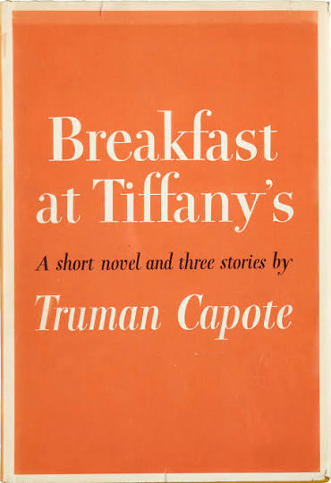
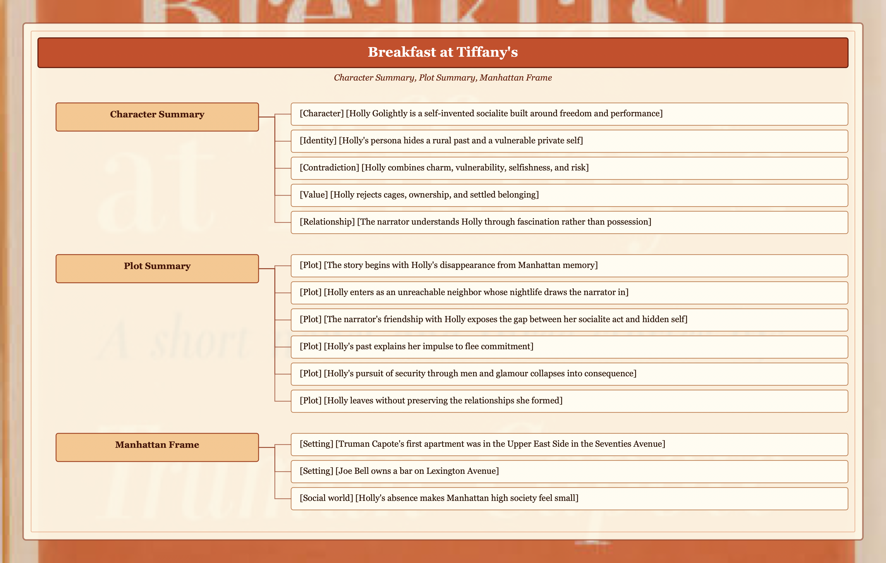
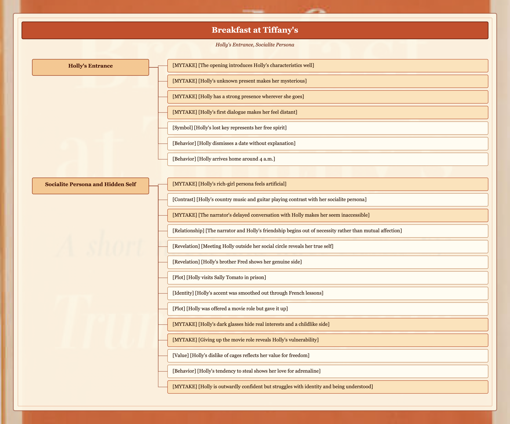
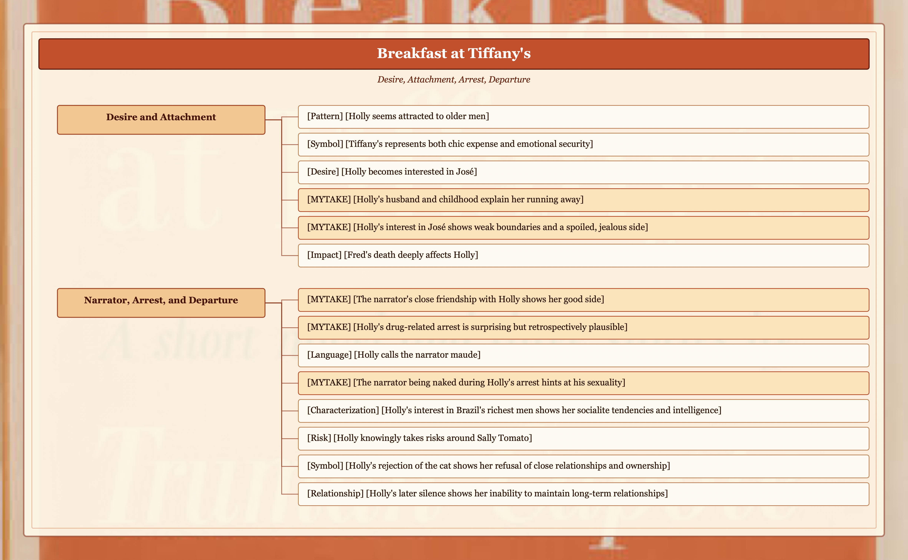

# Character Summary

- [Character] [Holly Golightly is a self-invented socialite built around freedom and performance] Her glamour, nightlife, accent, clothes, and inaccessible entrances make her feel deliberately made up.
- [Identity] [Holly's persona hides a rural past and a vulnerable private self] Her country music, guitar playing, brother Fred, and early marriage complicate the rich-girl image.
- [Contradiction] [Holly combines charm, vulnerability, selfishness, and risk] She can be generous and magnetic, but she also steals, crosses romantic boundaries, and accepts danger around Sally Tomato.
- [Value] [Holly rejects cages, ownership, and settled belonging] Her lost key, dislike of cages, rejection of the cat, and later silence all point toward a fear of attachment.
- [Relationship] [The narrator understands Holly through fascination rather than possession] His delayed access to her makes her mysterious, while their friendship reveals her better and more fragile sides.

# Plot Summary

- [Plot] [The story begins with Holly's disappearance from Manhattan memory] Joe Bell and the narrator look back on a woman they have not seen for twelve years.
- [Plot] [Holly enters as an unreachable neighbor whose nightlife draws the narrator in] Her late arrivals, lost key, and overheard dialogue make her vivid before she becomes available.
- [Plot] [The narrator's friendship with Holly exposes the gap between her socialite act and hidden self] Outside her social circle, she reveals her music, her brother Fred, her vulnerability, and her resistance to being understood.
- [Plot] [Holly's past explains her impulse to flee commitment] Her childhood, early marriage, and attraction to older men help explain her unstable attachments.
- [Plot] [Holly's pursuit of security through men and glamour collapses into consequence] José, Sally Tomato, Fred's death, and her arrest pressure the fantasy she has built.
- [Plot] [Holly leaves without preserving the relationships she formed] Her rejection of the cat and silence toward the narrator show her inability to accept durable belonging.

# Chapter 1

## Manhattan Frame

- [Setting] [Truman Capote's first apartment was in the Upper East Side in the Seventies Avenue]
- [Setting] [Joe Bell owns a bar on Lexington Avenue] This is where they stayed with the baby.
- [Social world] [Holly's absence makes Manhattan high society feel small] Capote says he has not seen her in twelve years.

## Holly's Entrance

- [MYTAKE] [The opening introduces Holly's characteristics well]
- [MYTAKE] [Holly's unknown present makes her mysterious]
- [MYTAKE] [Holly has a strong presence wherever she goes] Her presence comes through her walk, body, and clothes.
- [MYTAKE] [Holly's first dialogue makes her feel distant] The narrator hears her before he is in the room with her.
- [Symbol] [Holly's lost key represents her free spirit]
- [Behavior] [Holly dismisses a date without explanation] She simply says good night.
- [Behavior] [Holly arrives home around 4 a.m.] This suggests she had a lot of fun in New York high society.

## Socialite Persona and Hidden Self

- [MYTAKE] [Holly's rich-girl persona feels artificial]
- [Contrast] [Holly's country music and guitar playing contrast with her socialite persona]
- [MYTAKE] [The narrator's delayed conversation with Holly makes her seem inaccessible]
- [Relationship] [The narrator and Holly's friendship begins out of necessity rather than mutual affection]
- [Revelation] [Meeting Holly outside her social circle reveals her true self]
- [Revelation] [Holly's brother Fred shows her genuine side]
- [Plot] [Holly visits Sally Tomato in prison]
- [Identity] [Holly's accent was smoothed out through French lessons] This shows how much her agent made her up.
- [Plot] [Holly was offered a movie role but gave it up]
- [MYTAKE] [Holly's dark glasses hide real interests and a childlike side]
- [MYTAKE] [Giving up the movie role reveals Holly's vulnerability]
- [Value] [Holly's dislike of cages reflects her value for freedom]
- [Behavior] [Holly's tendency to steal shows her love for adrenaline]
- [MYTAKE] [Holly is outwardly confident but struggles with identity and being understood]

## Desire and Attachment

- [Pattern] [Holly seems attracted to older men] This may connect to marrying an older man at fourteen.
- [Symbol] [Tiffany's represents both chic expense and emotional security] At first it appeals to Holly for its cost and style, but it also gives her calmness.
- [Desire] [Holly becomes interested in José] José is another woman's boyfriend.
- [MYTAKE] [Holly's husband and childhood explain her running away]
- [MYTAKE] [Holly's interest in José shows weak boundaries and a spoiled, jealous side]
- [Impact] [Fred's death deeply affects Holly] This adds complexity to her character.

## Narrator, Arrest, and Departure

- [MYTAKE] [The narrator's close friendship with Holly shows her good side]
- [MYTAKE] [Holly's drug-related arrest is surprising but retrospectively plausible]
- [Language] [Holly calls the narrator maude] This was slang for gay at the time.
- [MYTAKE] [The narrator being naked during Holly's arrest hints at his sexuality]
- [Characterization] [Holly's interest in Brazil's richest men shows her socialite tendencies and intelligence]
- [Risk] [Holly knowingly takes risks around Sally Tomato] She suspects his dealings are shady.
- [Symbol] [Holly's rejection of the cat shows her refusal of close relationships and ownership]
- [Relationship] [Holly's later silence shows her inability to maintain long-term relationships] She does not contact the narrator after leaving.
