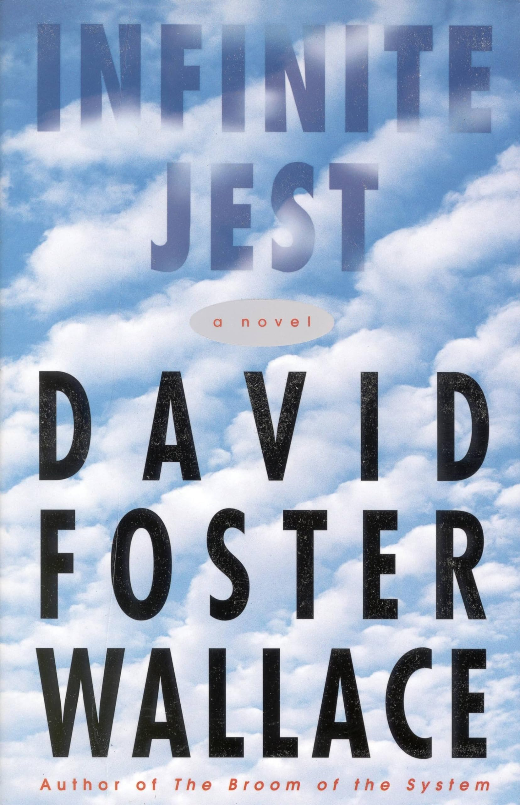
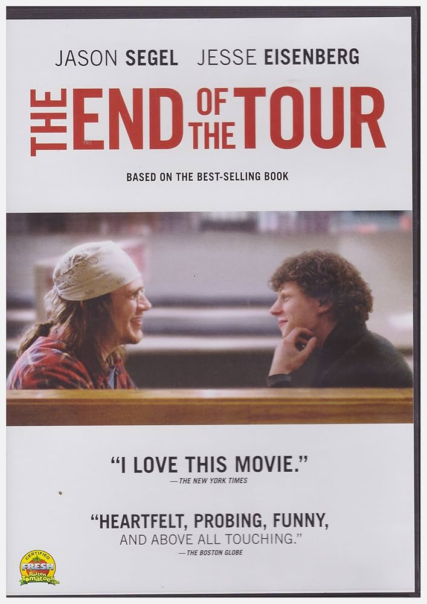
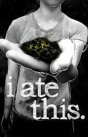

# Basics

- [Video] [Interpretation of Infinite Jest I like] https://www.youtube.com/watch?v=yPgANelYih0&ab_channel=CalebSmith

## What This Book Is About
- [Quote] [We are all dying to give our lives away to something] “We are all dying to give our lives away to something, maybe. God or Satan, politics or grammar, topology or philately - the object seemed incidental to this will to give ourselves away, utterly. To games or needles, to some other person. Something pathetic about it. A flight-from in the form of a plunging-into. Flight from exactly what? These rooms, blandly filled with excrement and heat? To what purpose?”
  - [MYTAKE] [Infinite Jest as a synthesis on how Americans give meaning to their lives] It could be more of a sensation rather than reality, but it still feels relatable. They give their meaning to drugs (entertainement, or drugs itself), or climbing the corporate ladder.

## Overall comments

### Literary Overdose
- [MYTAKE] [If I had to reduce Infinite Jest to 5 key terms, they would be Postmodernity, America, Excess, Totality, Interconnection] 
- [MYTAKE] [Reading this book feels like a Literary Overdose] I find this book "irritatingly perfect." When I say literary overdose, I really mean it. It has so much topics, and each topic is discussed to the point of exhaustion, which is concerning.

| Topic | Where It Appears |
|---|---|
| Addiction / Drugs | Ennet House, ETA |
| Entertainment | The lethal cartridge |
| Tennis | Enfield Tennis Academy |
| Depression | Kate, Hal, Joelle |
| Recovery | AA, Ennet House |
| Freedom | Marathe-Steeply debates |
| Willpower | Addicts and athletes |
| Irony | Hal, media culture |
| Sincerity | Mario, AA meetings |
| Communication Failure | Hal and James |
| Family Dysfunction | Incandenza family |
| Motherhood | Avril, Orin’s Subjects |
| Fatherhood | James, Gately, Wayne |
| Incest Anxiety | Avril, Orin, Wayne |
| Suicide | James, Joelle, Kate |
| Pain | Gately’s hospital bed |
| The Body | Tennis, addiction, disability |
| Beauty | Joelle / P.G.O.A.T. |
| Shame | Joelle, addicts, Hal |
| Nationalism | Quebec separatist plot |
| Terrorism | A.F.R. and Entertainment |
| Consumerism | Subsidized years |
| Corporate Dystopia | O.N.A.N. society |
| Waste / Toxicity | Great Concavity |
| Surveillance | ETA, O.U.S., A.F.R. |
| Institutions | ETA, rehab, hospitals |
| Games / Systems | Eschaton, tennis, politics |
| Language | Endnotes, jargon, grammar |
| Information Overload | Footnotes, filmography, data |
| Time | Nonlinear chronology |
| Death | James, wraith, Gately |
| Ghosts | James’s wraith |
| Pleasure | Entertainment, drugs, sex |
| Desire | Orin, Joelle, addicts |
| Loneliness | Hal, Joelle, Gately |
| Alienation | Hal’s inner life |
| Childhood Damage | Incandenza family |
| Discipline | Tennis training |
| Failure | ETA, recovery, family |
| Control | Avril, institutions |
| Passivity | Viewers, addicts |
| Attention | Tennis, AA, media |
| Escapism | Drugs, film, fantasy |
| Moral Choice | Gately’s refusal |
| Identity | Hal, Joelle, Mario |
| Masculinity | Orin, Gately, athletes |
| Femininity | Avril, Joelle, mothers |
| Class | ETA, Ennet, Boston |
| Disability | A.F.R., Mario, bodies |
| Religion | AA, surrender, faith |
| Cliché | AA recovery language |
| Secrecy | Avril, drugs, cartridges |
| Paranoia | A.F.R., O.U.S., ETA |
| Competition | Tennis rankings |
| Education | ETA instruction |
| Genius | Hal, James, Pemulis |
| Memory | Gately, Hal, Joelle |
| Trauma | War, family, addiction |

# Plot Summary

- [Chronology] [This summary follows story time rather than reading order] The novel is physically arranged as a fragmented, non-linear reading experience, but this plot summary orders events according to the implied real-time chronology of the fictional world.

## Part 1: Political Prehistory

- [Politics] [Johnny Gentle becomes president by promising to clean up America] Gentle runs as a celebrity outsider who rejects ordinary political categories and promises an extreme solution to national waste and discomfort.
- [Politics] [Gentle creates O.N.A.N. and turns North America into a corporate-sponsored order] The United States, Canada, and Mexico become the Organization of North American Nations, and years are sold to corporate sponsors.
- [Politics] [America gives its waste territory to Canada and creates the Great Concavity] The U.S. externalizes its waste problem by converting part of northeastern America and southeastern Canada into a massive toxic zone.
- [Politics] [Quebec separatists radicalize against O.N.A.N. and American domination] Les Assassins des Fauteuils Rollents emerge as a militant group willing to use terror against the new continental order.

## Part 2: Incandenza Prehistory

- [Family] [James Incandenza marries Avril and becomes the damaged center of the Incandenza family] The family history produces Hal, Orin, and Mario, and much of the novel's later damage radiates from this household.
- [Institution] [James Incandenza founds Enfield Tennis Academy] ETA becomes the institutional world where Hal and other gifted children turn achievement into an all-consuming discipline.
- [Relationship] [Orin dates Joelle Van Dyne before she becomes central to James's film world] Joelle enters the Incandenza orbit through Orin before becoming associated with James Incandenza's films.
- [Film] [James Incandenza makes the Entertainment with Joelle as its central image] The film later called **"Infinite Jest"** is so pleasurable that viewers lose the will to do anything except keep watching.
- [Death] [James Incandenza dies by suicide and leaves the film's master copy unresolved] His death turns the Entertainment into a political, familial, and metaphysical mystery rather than a solved plot device.

## Part 3: Main-Year Institutional Life

- [Structure] [The main action alternates between ETA and Ennet House]
- [Tennis] [Hal trains at ETA while secretly using marijuana and maintaining the appearance of excellence] Hal remains brilliant and high-performing, but his inner life is already detached from the image others have of him.
- - [MYTAKE] [Outwardly well, innerly bad] This seems to be something so ubiquitious thing in reality, when it comes to human beings. Almost like a backend vs front end.
- [Game] [The ETA students' Eschaton game breaks down into physical chaos] A hyper-intellectual war game turns into a fight, showing how abstract systems fail when bodies and egos enter the court.
- [Addiction] [Joelle tries to kill herself with freebase cocaine and enters Ennet House] After the failed suicide attempt, she enters the recovery world where Gately becomes increasingly important.
- [Addiction] [Ennet House residents survive by obeying boring recovery practices] Recovery appears less as heroic transformation than as repetition, meetings, honesty, dependence, and doing the next required thing.
- [Recovery] [Don Gately works at Ennet House after his own criminal and addict past] Gately's daily work in recovery makes communal discipline one of the novel's concrete alternatives to solitary pleasure.

## Part 4: Conspiracy and Convergence

- [Conspiracy] [The A.F.R. hunts the Entertainment as a terrorist weapon] The Quebec separatists want a reproducible master copy that can make American viewers destroy themselves through pleasure.
- [Counterterrorism] [The U.S. Office of Unspecified Services tries to prevent the Entertainment's dissemination] Government agents also search for the master copy, either to intercept it or to find a countermeasure.
- [Espionage] [Hugh Steeply approaches Orin while investigating the Incandenzas and the film] The political plot reaches the family plot through Orin's connection to Joelle and the Entertainment.
- [Espionage] [Marathe moves between A.F.R. and U.S. interests while seeking leverage for his wife] His conversations with Steeply turn the conspiracy into a philosophical argument about freedom, pleasure, and commitment.
- [Convergence] [Joelle's presence at Ennet House draws the Entertainment plot toward Gately's recovery plot] The film mystery, addiction plot, and political conspiracy begin to occupy the same human space.

## Part 5: Final Events and Aftermath

- [Violence] [Randy Lenz provokes an attack that leaves Gately gravely wounded] Gately is injured after Ennet House violence spills outward, and his refusal of narcotic pain relief makes recovery physically concrete.
- [Recovery] [Gately lies hospitalized while memory, hallucination, and possible visitation blur together] His hospital scenes mix childhood memory, addiction history, James Incandenza's ghostly presence, and the immediate pain of staying sober.
- [Inference] [Hal, Gately, and Joelle are implied to become involved in digging up James Incandenza's head] The novel does not narrate this directly, but the chronologically late opening points toward a later search for what may be buried with JOI.
- [Mystery] [The master copy may be buried with JOI's head but remains unresolved] The whereabouts of the master copy of **"Infinite Jest"** remain unknown.
- [Collapse] [Hal becomes outwardly inarticulate despite apparent inner clarity] In the chronologically late opening, Hal appears mentally lucid to himself but can no longer communicate intelligibly to the adults evaluating him.
- [Structure] [The plot resolution exists as reconstruction rather than direct narration] The book ends midstream, requiring readers to piece together its central events from scattered fragments.

# Addiction

## What Is Addiction?
- [Definition] [Addiction is anything a person depends on to make time pass] David Foster Wallace (DFW) broadens the definition of addiction, framing it as anything one relies on to make time pass.
  - [MYTAKE] [Under this definition I was addicted to maladaptive fantasy and maladaptive conceptualization]

## Overstimulation and Numbing
- [Addiction] [Repeated marijuana addiction suggests a world seeking numbness more than stimulation] Kate is now the third character in the book with a serious marijuana addiction, which is strange considering that (as Kate herself points out) marijuana is not considered to be a highly addictive or debilitating drug. The fact that so many characters are addicted to weed suggests that something about the world of the novel compels people to seek out a calming, numbing effect more than a stimulating one.

## Addiction’s Control
- [Quote] [Joelle reaches addiction's breaking point in a party bathroom] (Joelle is in a party bathroom using drugs) "Chega de apertar o coração toda noite. O que parece ser a saída da jaula é na verdade as barras da jaula. As malhas do entardecer. A entrada diz SAÍDA. Não há saída. A fusão anular final: entre animal exibido e jaula. O próprio Jaula III: Espetáculo gratuito. Foi a jaula que entrou nela, de alguma maneira. A engenhosidade da coisa toda está além da compreensão dela. A Diversão faz tempo abandonou o Demais. Ela perdeu a capacidade de mentir a si própria sobre a sua capacidade de parar ou até de gostar daquilo, ainda. Ela não delimita e preenche o buraco mais. Ela não delimita mais o buraco. Há um certo cheiro que têm os véus molhados de chuva. Alguma coisa de um telefonema e da lua, dizendo que a lua nunca virava a cara. Em revolução mas ainda assim não. Ela tinha saído correndo no último T da noite e ido para casa e pelo menos finalmente não tinha desviado o rosto da situação, da questão de que ela não amava mais aquilo, mas odiava e queria parar e também não conseguia parar ou imaginar parar ou viver sem aquilo. Ela tinha de certa forma feito como tinham feito o Jim fazer perto do fim e admitido a sua impotência diante dessa jaula, desse espetáculo ingratuito, chorando, literalmente apertando o coração, fumando primeiro os restos de esponja de aço que tinha usado para prender os vapores e formar uma resina fumável, depois pedacinhos de carpete e a calcinha de acetato com que tinha filtrado a solução horas antes, chorando, desvelada e descabelada, como um palhaço grotesco, em todos os quatro espelhos das paredes do seu quartinho."
- [Quote] [Joelle realizes she likes the drug more than someone can survive] (Joelle is in a party bathroom using drugs) "Foi quando as mãos dela começaram a tremer durante essa parte do procedimento de preparo que ela percebeu pela primeira vez que gostava disso mais do que alguém pode gostar de alguma coisa e ainda continuar vivo. Ela não é boba"
- [Quote] [Joelle recognizes fatal desire through the ritual of drug preparation] "Ela pega a vareta negra de arame do cabide e começa a mexer e amassar o conteúdo recém-borbulhado do tubo, sentindo ele se espessar rapidamente e crescer sua resistência aos minúsculos círculos do arame. Foi quando as mãos dela começaram a tremer durante essa parte do procedimento de preparo que ela percebeu pela primeira vez que gostava disso mais do que alguém pode gostar de alguma coisa e ainda continuar vivo. Ela não é boba."
- [Quote] [The substance becomes the false comfort for the losses it causes] "aí mais Perdas, com a Substância parecendo ser o único consolo para a dor das Perdas que se acumulam, e claro que você fecha os olhos para o fato de que é a Substância que está causando essas mesmas Perdas de que ela te consola"
  - [MYTAKE] [My experience with maladaptive daydreaming] I personally had a latent unment need, which is not having relationships with woman, and I compensated it with maladaptive day dreaming, including having relationships with imaginary woman in my brain. Through time, that became the solution and the cause of my problems, in a "Bondage Cycle" Hindu fashion.
- [Quote] [Addiction becomes a living death of wanting the opposite state] “Quando eu estava bêbado eu queria ficar sóbrio e quando eu estava sóbrio eu queria ficar bêbado”, John L. diz; “Eu vivi desse jeito durante anos, e eu digo a vocês que isso não é vida, isso é uma porra de uma morte-em-vida.”
  - [MYTAKE] [Conversation with Edwin in Sao Roque] God is the only thing that if you treat is as God, it doesn't "engole" you.
- [Quote] [The addiction spiral produces losses while offering shrinking relief] "aí ultimatos vocacionais, inempregabilidade, ruína financeira, pancreatite, uma culpa atordoante, vômito com sangue, neuralgia cirrótica, incontinência, neuropatia, nefrite, depressões profundas, uma dor lacerante, com a Substância concedendo períodos cada vez menores de alívio;"
- [Quote] [The phenomenology of addiction's unmasking] "aí você está ferrado, bem ferrado, e sabe, finalmente, totalmente ferrado, porque essa Substância que você achava que era o seu único amigo, pela qual você desistiu de tudo, feliz, que por tanto tempo te propiciou um alívio da dor das Perdas que o seu amor por esse alívio causou, a sua mãe, a sua amante e o seu deus e camarada, finalmente retirou sua máscara de smiley pra revelar olhos sem centro e uma bocona faminta, e caninos até aqui ó, é o Rosto no Chão, a sorridente face lívida dos seus piores pesadelos, e o rosto é o seu próprio rosto no espelho, agora, é você, a Substância devorou ou substituiu e virou você, e a camiseta encrustada de vômito, baba e Substância"
  - [MYTAKE] [Phenomenological exactness of addiction's unmasking] I love when DFW uses common/everyday language, and it shows how things actually feel. This is a great example, it shows exactly how it feels when you realize the addiction has taken over.

## Rehab

- [Quote] [Recovery begins with honesty, hopelessness, and desperation] "Pat told Gately that grim honesty and hopelessness were the only things you need to start recovering from Substance-addiction, but that without these qualities you were totally up the creek. Desperation helped also, she said."
- - [MYTAKE] [Time would prove they were right]

## God
- [Quote] [Gately practices faith as daily action without metaphysical certainty] "His sole experience so far is that he takes one of AA's very rare specific suggestions and hits the knees in the a.m. and asks for Help and then hits the knees again at bedtime and says Thank You, whether he believes he's talking to Anything/body or not, and he somehow gets through that day clean. This, after ten months of ear-smoking concentration and reflection, is still all he feels like he 'understands' about the 'God angle.' Publicly, in front of a very tough and hard-ass-looking AA crowd, he sort of simultaneously confesses and complains that he feels like a rat that's learned one route in the maze to the cheese and travels that route in a ratty-type fashion and whatnot. W/ the God thing being the cheese in the metaphor. Gately still feels like he has no access to the Big spiritual Picture. He feels about the ritualistic daily Please and Thank You prayers rather like like a hitter that's on a hitting streak and doesn't change his jock or socks or pre-game routine for as long as he's on the streak. W/ sobriety being the hitting streak and whatnot, he explains. The whole church basement is literally blue with smoke. Gately says he feels like this is a pretty limp and lame understanding of a Higher Power: a cheese-easement or unwashed athletic supporter. He says but when he tries to go beyond the very basic rote automatic get-me-through-this-day-please stuff, when he kneels at other times and prays or meditates or tries to achieve a Big-Picture spiritual understanding of a God as he can understand Him, he feels Nothing — not nothing but Nothing, an edgeless blankness that somehow feels worse than the sort of unconsidered atheism he Came In with. H"
- [Quote] [Prayer works for Gately before he understands why it works] "It was the first time he'd been out of this kind of mental cage since he was maybe ten. He couldn't believe it. He wasn't Grateful so much as kind of suspicious about it, the Removal. How could some kind of Higher Power he didn't even believe in magically let him out of the cage when Gately had been a total hypocrite in even asking something he didn't believe in to let him out of a cage he had like zero hope of ever being let out of? When he could only get himself on his knees for the prayers in the first place by pretending to look for his shoes? He couldn't for the goddamn life of him understand how this thing worked, this thing that was working. It drove him bats."
- [Quote] [Gately sustains sobriety through practice rather than comprehension] "That was months ago. Gately usually no longer much cares whether he understands or not. He does the knee-and-ceiling thing twice a day, and cleans shit, and listens to dreams, and stays Active, and tells the truth to the Ennet House residents, and tries to help a couple of them if they approach him wanting help. And when Ferocious Francis G. and the White Flaggers presented him, on the September Sunday that marked his first year sober, with a faultlessly baked and heavily frosted one-candle cake, Don Gately had cried in front of nonrelatives for"
- - [MYTAKE] [As Edwin told me, the AA was the best invention of the previous century] It's impressive the impact of these practices, you can also see with a materialistic historic dialectic approach.

## Addiction and Recovery
- [Addiction] [Wallace places dark comedy beside the extremity of addiction]
- [Observation] [AA members appear ridiculous and heroic at the same time] The Alcoholics Anonymous (AA) meetings are portrayed as gatherings of individuals who are, in their own way, "badasses." Many of them have contemplated suicide, yet they sit through the meetings, enduring what they perceive as politically correct platitudes.

# Tennis

- [MYTAKE] [Climbing the ladder as the meaning of life] Viktor E. Frankl argued that people cannot live without meaning. The students at E.T.A. seem to illustrate what happens when competitive achievement itself becomes that meaning. Many are already rich, can likely attend top universities anyway, and often don't even enjoy tennis. Yet they continue sacrificing everything—not because they need to, but because climbing the ladder has become the purpose of life. How can I blame them? In a society of hedonists, maybe climbing the ladder might be the best form to live life.

## Success as a Need
- [Quote] [Clipperton makes athletic failure into a public suicide threat] "Clipper-ton climbs up the rungs of the lifeguardish chair the umpire in his blue blazer158148 sits in and uses the umpire's mike to make public his intention of blowing his personal brains out all over the court with the hideous Clock, should he lose."
  - [MYTAKE] [Winning can move from virtue into moral obligation] Win is so high in the americans normative orders that, for some people, it can cross the virtue boundary and reach the moral and the ethical bucket. So for Clipperton winning is not virtue, win is as important in terms of priority as other people's lives

## Psychological Burdens of Success
- [Quote] [Clipperton's suicide turns competitive spectacle into irreversible reality] "Clipperton places to his right — not left — temple, as in with his good right stick-hand, closes his eyes and scrunches up his face and blows his legitimated brains out for real and all time, eradicates his map and then some; and there's just an ungodly subsequent mess in"
- [Humour] [The dark irony is that Clipperton kills himself instead of others] This is ironic and darkly humorous because everyone assumed he would end up killing others, but instead, he tragically killed himself.

- [Quote] [Suicide after reaching the No. 1 junior ranking] "With a ghastly mouthful of lethal Quik, and apparently his dad hears the thump. of the kid keeling over and rushes into the kitchen in his bathrobe and leather slippers and tries to give the kid mouth-to-mouth resuscitation, and but gets the odd bit of NaCN-laced Quik in his own mouth, from the kid, and also keels over and turns bright blue, and dies, and then the mom rushes in in a mud-mask and fluffy slippers and sees them both lying there bright blue and stiffening, and she tries giving the architect dad mouth-to-mouth and is of course in short order also lying there keeled over and blue, wherever she's not mud-colored, from the mask, and but anyway dead as a rivet. And since the family has six more variousaged kids who as the night wears on come in from dates or patter down the stairs in little pajamas with adorable little pajama-feet attached to them, drawn by the noise of all the cumulative keeling over, plus I should mention the odd agonized gurgle-sound, and but since all six kids had gone through a four-hour Rotary-sponsored CPR course at Fresno's YMCA, by the end of the night the whole family's lying there blue-hued and stiff as posts, with incrementally tinier amounts of lethal Quik smeared around their rictus-grimaced mouths; and in sum this whole instance of unprepared-goal-attaintment-trauma is unbelievably gruesome and sad, and it's one historical reason why all accredited tennis academies have to have a Ph.D.-level counselor on full-time staff, to screen student athletes"

## Competition

- [MYTAKE] [Elite achievement consumes countless unrealized lives] One striking aspect of this book is its portrayal of the immense suffering and emotional toll embedded in the pursuit of excellence within capitalist entertainment. For someone like Federer to emerge, countless young tennis players undergo grueling training, with only a rare few achieving greatness. It’s akin to squeezing 10,000 oranges to extract a single drop of exceptional talent, discarding all the rest in the process. We see clearly in this book how many high school tennis players gave their whole soul for the sport, and in the end they were never good enough to be really competitive

## Potential and Its Psychological Effects
- [Quote] [Unrealized potential becomes lifelong regret] Jim: "you either live up to it or it waves a hankie, receding forever. Use it or lose it, he say over the newspaper. I’m…I’m just afraid of having a tombstone that says HERE LIES A PROMISING OLD MAN. Potential maybe worse than none, Jim. Than no talent to fritter in the first place, lying around guzzling because I haven’t the balls to…God I’m I’m so sorry Jim. You don’t deserve to see me like this. I’m so scared, Jim. I’m so scared of dying without ever really being seen. Can you understand? Are you enough of a big thin prematurely stooped young bespectacled man, even with your whole life still ahead of you, to understand? Can you see I was giving it all I had?"
- - [MYTAKE] [Relatable as a former IMO unemployed] I think I used to suffer from that, the idea that I wanted to become a genius, no matter what. Now I guess I just want find a 'decent' wife, and if possible help society even in a small scale.

### Failure
- [MYTAKE] [Failure feels the abrupt collapse of a promising future] It is very emblematic and epic, that the moment where Jim's cold grand father sad "Eh, mas ele nunca vai ser grande" is the exact moment where he fails because he tropecou on something, as Jim's father sad: "Num minuto eu estava numa desbalada e linda carreira rumo a bola, no minuto segunite havia maos nas minhas costas e nada embaixo dos pes como um empurrao numa escadaria"

## Loneliness
- [MYTAKE] [Tennis mirrors the lonely status hierarchy of modern life in capitalism] The choice of tennis as the central sport is particularly insightful, as it mirrors the competitive nature of modern life—a relentless race where individuals strive to accumulate capital. In this isolating pursuit, the only semblance of community arises from shared struggles, such as skyrocketing rent prices, healthcare costs, and other systemic challenges. While the book hints at the possibility that these shared problems are intentionally designed to foster a sense of connection, I remain skeptical of such a deliberate orchestration.

# Philosophy

- [Critique of Hedonism] [Marathe argues that worshiping personal feeling makes people slaves to desire] "Then in such a case your temple is self sentiment. Then in such an instance you are fanatico of desire, a slave to your individual sentiment"

## Illusion of Freedom
- [Quote] [Freedom depends on what a society chooses to worship] "Marathe estava disposto a que a sua voz não se elevasse. 'Pois esta escolha determina todo o resto. Não? Todas as outras escolhas que vocês dizem que são livres decorrem disto: qual é o nosso templo. Qual é o templo, portanto, para os EUA? O que acontece, quando você teme ter que protegê-los de si mesmos, se os perversos quebequenses conspiram para trazer o entretenimento para seus lares acolhedores?"

## Genealogy of American Values
- [Quote] [Marathe identifies the American personality as utilitarian] "There was some silence for thinking until Marathe finally said, looking up and off to think: 'This U.S.A. type of person and desires appears to me like almost the classic, how do you say, uti-litaire."
- [Definition] [Utilitarinism] Mill’s utilitarianism judges actions by their tendency to produce the greatest happiness for the greatest number, where happiness means pleasure and the absence of pain.
- [Politics] [American philosophy inherits British utilitarianism through American culture]
- [Politics] [American utilitarianism treats private desire as a route to collective good] The American genius lies in the realization that, at some point in history, the pursuit of individual good by each American collectively contributes to maximizing the greater good for everyone.
- - [MYTAKE] [This is probably one of the greatest myths that sustain America] This reminds of my other blog post. A great case of 'empty myth'

## Criticism of American Philosophy
- [Observation] [What if someone's happiness matters more than others]
- [Quote] [Utilitarian delayed gratification doesn't happen] "Good. This is well. Delayed gratification. How does my U.S.A.-type mind calculate long-term overall pleasure and then decide to sacrifice this intense, immediate craving for soup in favor of the greater, long-term benefit?"

## Philosophical Value of the Entertainment
- [MYTAKE] [The Entertainment resembles Nozick's experience machine] I got introduced with Nozick's experience machine in a similar time as Infinite Jest, and the fact that he did that as a central theme of the book was very interesting
- [Quote] [A free choice culture can destroy itself when desire is strong enough] "Are you understanding? I am asking between only us. How could it be that A.F.R. malice could hurt all of the U.S.A. culture by making available something as momentary and free as the choice to view only this one Entertainment? You know there can be no forcing to watch a thing. If we disseminate the samizdat, the choice will be free, no? Free from force, no? Yes? Freely chosen?"
- - [MYTAKE] [This applicable to our society through debeuchery, social media and drugs]

# American Politics
- [Quote] [America's social crisis comes from forgetting how and what to choose] "Para manter vocês juntos, o ódio de um outro. Gentle é louco dentro da cabeça, mas nessa ‘culpa de alguém’ ele estava correto em dizer. Un ennemi commun. Mas não alguém fora de você, esse inimigo. Alguém ou algum povo dentro de sua própria história um dia matou já sua nação EUA, Hugh. Alguém que tinha autoridade, ou devia ter tido autoridade, e não exercitou autoridade. Eu não sei. Mas alguém em algum momento deixou vocês esquecerem como escolher, e o quê. Alguém deixou seus povos esquecerem que era a única coisa de importância, escolher. Tão completamente esquecendo que quando eu digo escolher para você você faz expressões com o rosto como que ‘Láááá se vamos nós’. Alguém ensinou que templos são para fanáticos só, tirou os templos e jurou que não havia necessidade de templos. E agora não há abrigo. E não há mapa para achar o abrigo de um templo. E vocês todos andam tateando no escuro, nessa confusão de permissões. A sem-fim busca da felicidade da qual alguém deixou vocês esquecerem as velhas coisas que possibilitam a felicidade. Como é que vocês dizem: ‘Está valendo tudo’?"
  - [MYTAKE] [Individual philosophy without communal non pleasure based formation collapses into hedonism] The type of hedonism varies: drugs, consumption, sex, what changes in essence how bad the karma is
  - [MYTAKE] [America's civilizational crisis comes from delegitimizing shared temples] Marathe's diagnosis is that American civilization is experiencing a civilizational crisis whose immediate symptoms are social fragmentation, addiction, and the inability to sustain meaningful commitments. Gentle proposes the ESTABLISHMENT as the crisis cause, but we know it's only a proximal cause. Marathe argues that the root cause is another. Over time, the cultural establishment—through education, media, public institutions, and broader social change—delegitimized the traditional "temples" that had historically formed individuals through shared moral and religious philosophies. Responsibility for constructing a philosophy of life shifted from institutions to the individual. Although this expansion of individual autonomy is not inherently harmful, in practice many people, lacking a compelling higher object of devotion, drift toward hedonism and the pursuit of pleasure. This leaves society without what might be called philosophical immunity: when confronted with the Entertainment (Infinite Jest), people possess no higher commitment capable of resisting infinite gratification, and the civilization becomes vulnerable to collapse.
  - [MYTAKE] [The establishment preserved justice morality while weakening virtue morality] Morality of justice: “Do not violate other people’s rights. Be fair. Do not discriminate. Do not coerce.” Morality of virtue: “Cultivate self-command, courage, temperance, devotion, responsibility, reverence, sacrifice, and a worthy object of love.”
    - [MYTAKE] [Traffic can be orderly while lacking a destination] If society is a transit, the establishment made sure no car hit each other (law enforcement), but it didn't teach where people should go

- [Quote] [Johnny Gentle anticipates outsider anti-establishment politics] "Johnny Gentle's campaign positions him as an outsider, rejecting traditional left or right political alignments. He claims that the real issue lies with the current political establishment and promises to bring entirely unconventional solutions."
  - [Prophetic fiction] [Johnny Gentle resembles Donald Trump]

- [Quote] [A culture that loves only the self cannot resist pleasurable death] "Marathe fazia pequenos círculos enfáticos e cortes no ar enquanto falava: “Esses fatos da situação, que dizem com tanta clareza o medo do seu Bureau desse samizdat: agora é o que aconteceu quando um povo não escolhe nada mais para amar além de si próprio, cada um. Um EUA que morreria — e deixaria seus filhos morrerem, cada um — pelo suposto perfeito Entretenimento, por esse filme. Que morreria por essa chance de receber de bandeja essa morte de prazer, em seus lares quentinhos, sozinhos, imóveis: Hugh Steeply, com completa seriosidade como cidadão de seu vizinho eu te digo: esqueça por um só momento o Entretenimento e pense em vez disso em EUA onde uma tal coisa pode ser possível a ponto de seu Escritório ter medo: será que tal EUA pode ter esperança de sobreviver muito tempo? De sobreviver como uma nação de povos? De menos ainda exercer um domínio sobre outras nações de outros povos? Se esses são outros povos que ainda sabem o que é escolher? que aceitam morrer por algo maior? Que sacrificam o lar quentinho, a mulher amada em casa, as pernas, até a vida, por uma coisa maior que os próprios desejos de sentimento deles? que escolheriam não morrer de prazer, sozinhos?”."
- [Question] [Why does American society survive if it is so vulnerable to hedonism?] He provided a great question, if the US is so immersed in hedonism then how come it doesn't easily crumble? Or maybe it has already crumbled to Instagram, TikTok, drugs and corporate. Maybe americans are already submissive to all of these.

# Style

## Chronology and Structure
- [Humour] [The book's structure itself is a source of humor and frustration] The book's structure itself is a source of humor and frustration
- [Structure] [The footnotes imitate tennis-like back-and-forth while reinforcing disconnection] The book employs extensive footnotes, which serve as a metafictional device. These footnotes mimic the back-and-forth rhythm of a tennis match, reflecting the book's recurring themes of competition and disconnection.
- - [MYTAKE] [His Commitment to absurdity and 'hardness' is remarkable] We have as examples of this: the lack of chronology.

## Satire of American Culture
- [Politics] [Wallace satirizes American culture through exaggerated but recognizable absurdity]
- [Politics] [O.N.A.N. literalizes American self-indulgence as continental political order] Canada and Mexico are merged with the United States into an organization called ONAN, a name that references masturbation, symbolizing a culture of self-indulgence.
- [Satire] [America externalizes its waste problem through absurd political spectacle] The U.S. produces so much garbage that it elects a president who promises to "clean up America." His solution? Dump all the waste into Canada and construct massive fans

## Hyperrealism

- [Quote] [The phenomenology of end of parties] "Você pode estar em certas festas e não estar lá de verdade. Você pode ouvir como certas festas têm os seus próprios fins implicados já embutidos na coreografia da própria festa. Um dos momentos mais tristes que Joelle van Dyne sente em qualquer lugar é aquele eixo invisível onde uma festa acaba — até uma festa ruim —, aquele instante de tácita aquiescência em que todo mundo começa a juntar isqueiros e namorados, jaqueta ou casacão, aquela última cerveja presa ao plástico que viu outras cinco saírem, diz certas coisas perfunctórias para a anfitriã de uma maneira que ela reconhece essa perfunctoriedade sem parecer insincera, e sai normalmente fechando a porta. Quando a voz de todo mundo vai sumindo no corredor. Quando a anfitriã se vira depois de fechar a porta e vê a bagunça e o V de silêncio total se expandindo na esteira da festa."
  - [MYTAKE] [Maximalist exact phemenelogical descriptions is canonical for DFW]

# Terrorists
- [Humour] [Terrorists become the novel's philosophers in a dark inversion of social roles] In the world of *Infinite Jest*, the philosophers of society are portrayed as terrorists. This is both a critique and a darkly humorous inversion of traditional roles.
- - [MYTAKE] [Practical philosophy against the status quo IS terrorism] Initially I found funny that in Infinite Jest, the terrorists have philosophical discussions, but I realized that it's not a coincidence, it's always like that. The status quo have dominant premises, and everything in it are conclusions of these premises. Trying to actively change is 'terror' because you are removing everyone from the comfort zones.
- [Absurdism] [The Wheelchair Assassins make the terrorist premise literally absurd] The terrorist groups, known as the "Wheelchair Assassins," are literally in wheelchairs.
- [Humour] [The wheelchair-assassin scene turns fear into comedy through literal contradiction] One particularly absurd yet chilling scene describes the assassins killing a cartridge shop owner in Quebec. The narrative builds tension by describing the eerie squeaking of their wheelchairs, which initially feels terrifying. However, upon reflection, the idea of wheelchair-bound assassins becomes darkly comedic due to its inherent contradiction.
- [Absurd humour] [Wallace turns philosophical dialogue into geopolitical slapstick] Wallace also parodies philosophical dialogues, reminiscent of Plato, through a bizarre conversation between a trans triple agent and a quadruple agent assassin in a wheelchair. This dialogue unfolds as they watch catapults hurl garbage into the northwest, adding another layer of absurdity.
  - [MYTAKE] [Wallace makes extreme absurdity feel narratively serious] I enjoyed reading this absurd, DFW is really competent in creating situations are absurd to a very extreme level, and still keep it serious enough to the point of being legit part of the story