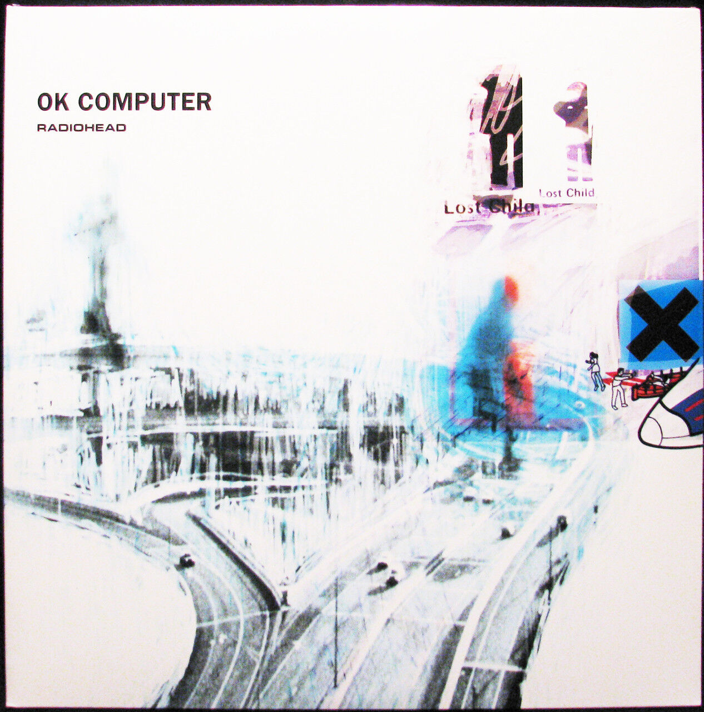
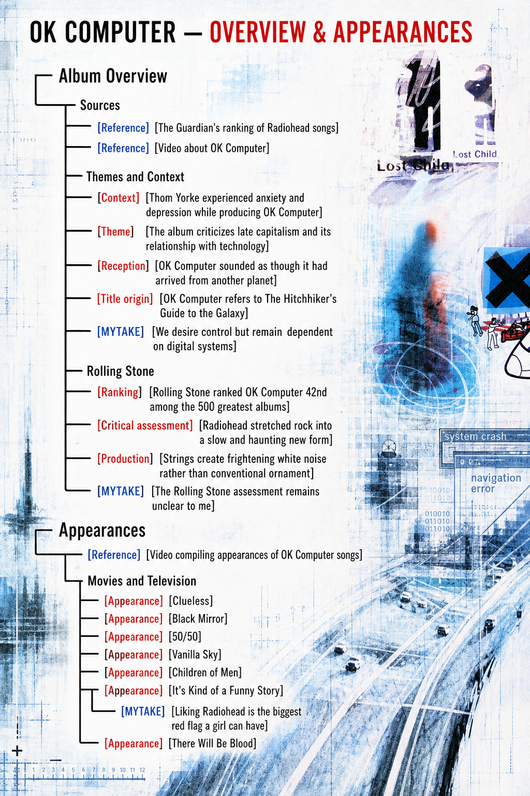
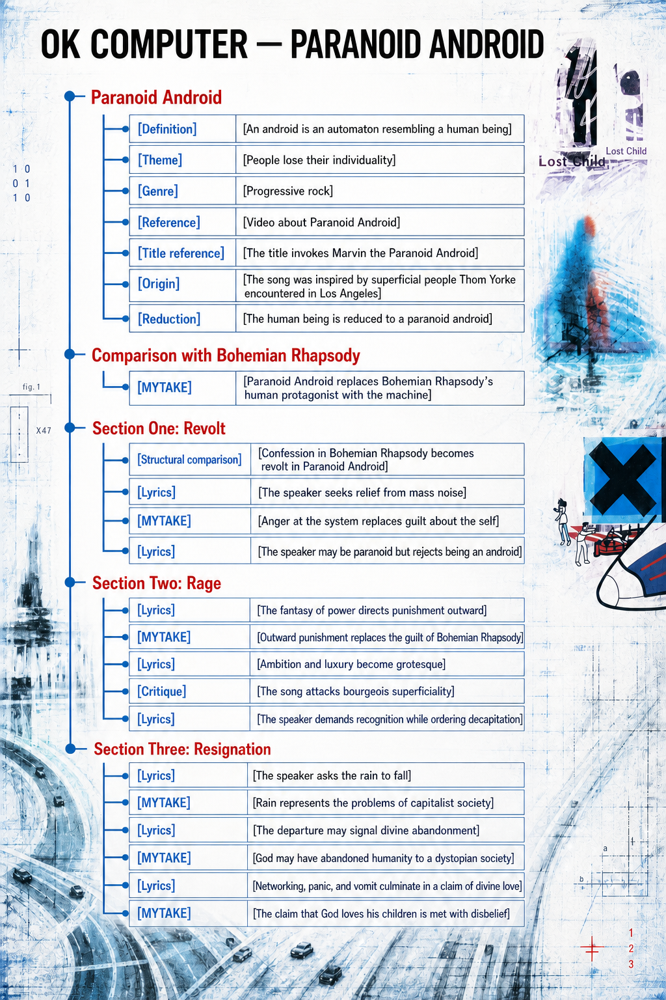
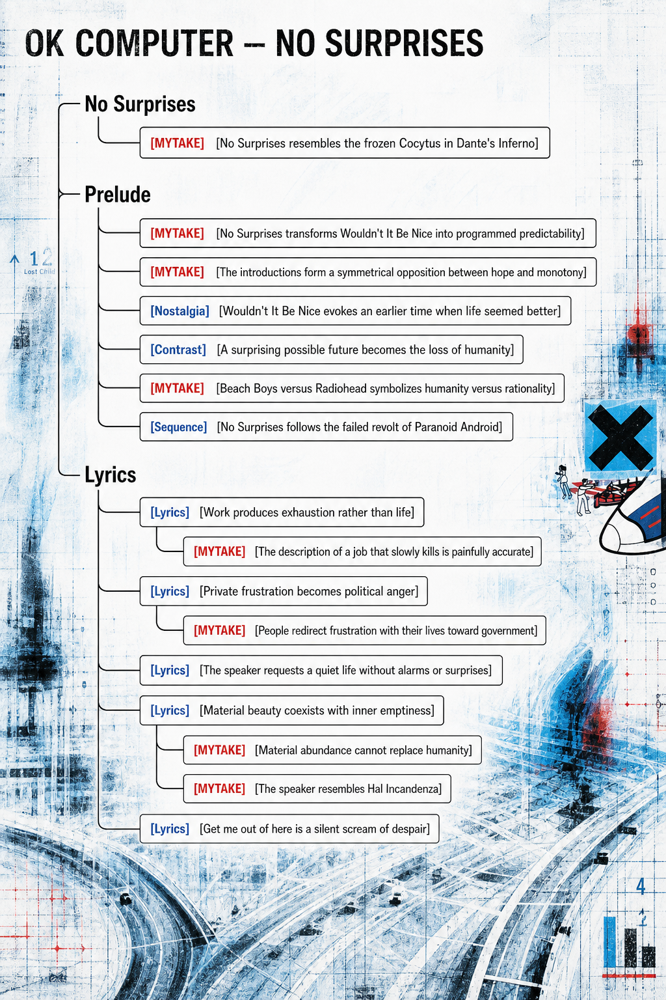
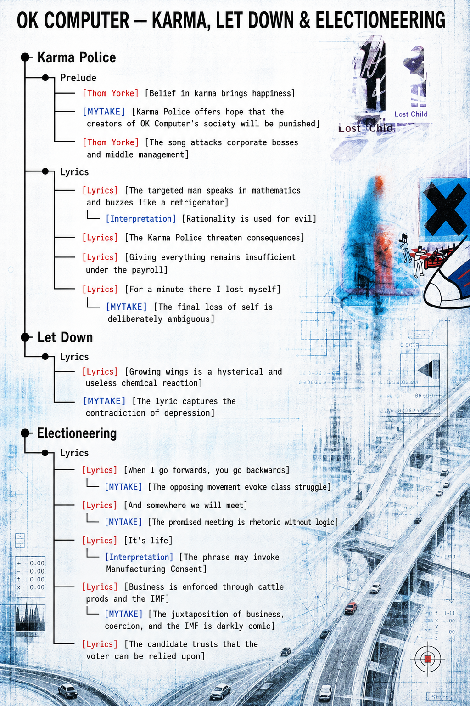
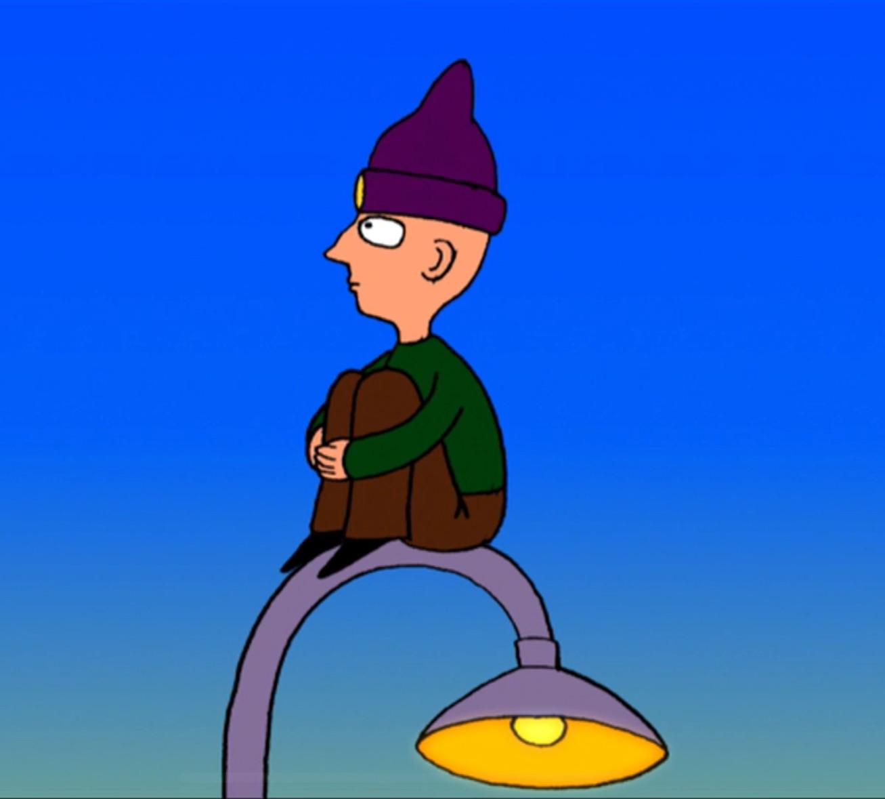
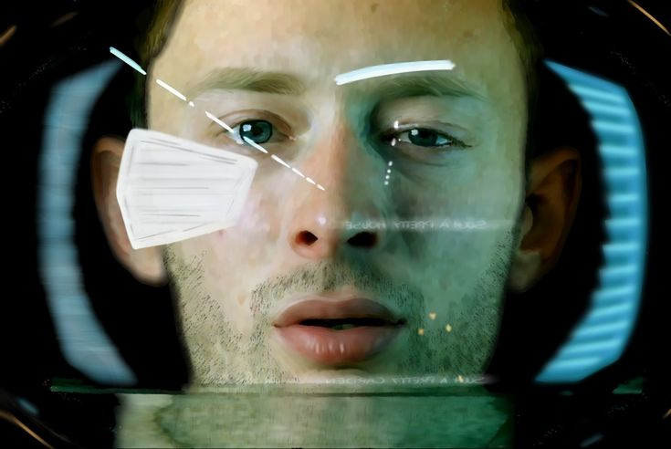
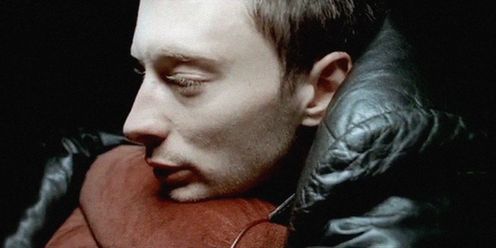

<iframe data-testid="embed-iframe" style="border-radius:12px" src="https://open.spotify.com/embed/album/6dVIqQ8qmQ5GBnJ9shOYGE?utm_source=generator" width="100%" height="352" frameBorder="0" allowfullscreen="" allow="autoplay; clipboard-write; encrypted-media; fullscreen; picture-in-picture" loading="lazy"></iframe>

# Album Overview

## Sources

- [Reference] [The Guardian's ranking of Radiohead songs] https://www.theguardian.com/music/2020/jan/23/radioheads-40-greatest-songs-ranked
- [Reference] [Video about OK Computer] https://www.youtube.com/watch?v=nYYMIYWEdwQ

## Themes and Context

- [Context] [Thom Yorke experienced anxiety and depression while producing OK Computer] The album is closely connected to his personal struggles.
- [Theme] [The album criticizes late capitalism and its relationship with technology]
- [Reception] [OK Computer sounded as though it had arrived from another planet]
- [Title origin] [OK Computer refers to The Hitchhiker's Guide to the Galaxy] The title comes from the 1978 radio series, in which Zaphod Beeblebrox says, “Okay, computer, I want full manual control now.”
- [MYTAKE] [We desire control but remain dependent on digital systems] We might like to demand full manual control of our lives, but addiction to Instagram, the internet, and related technologies prevents it.

## Rolling Stone

- [Ranking] [Rolling Stone ranked OK Computer 42nd among the 500 greatest albums]
- [Critical assessment] [Radiohead stretched rock into a slow and haunting new form] Rolling Stone describes the band pulling its sound “like taffy” without worrying whether the result remained rock, producing a slow, haunting album with unforgettable tracks such as “Karma Police.”
- [Production] [Strings create frightening white noise rather than conventional ornament] Jonny Greenwood contrasted the album's string arrangements with the model of “Eleanor Rigby” and cited the final chord of “Climbing Up the Walls.”
- [MYTAKE] [The Rolling Stone assessment remains unclear to me] I do not yet understand exactly what the magazine means, but I enjoy seeing an album I love receive such strong recognition.

# Paranoid Android

<iframe data-testid="embed-iframe" style="border-radius:12px" src="https://open.spotify.com/embed/track/6LgJvl0Xdtc73RJ1mmpotq?utm_source=generator" width="100%" height="352" frameBorder="0" allowfullscreen="" allow="autoplay; clipboard-write; encrypted-media; fullscreen; picture-in-picture" loading="lazy"></iframe>

## Basics

- [Definition] [An android is an automaton resembling a human being]
- [Theme] [People lose their individuality]
- [Genre] [Progressive rock]
- [Reference] [Video about Paranoid Android] https://www.youtube.com/watch?v=TGmh_6Yf5GI
- [Title reference] [The title invokes Marvin the Paranoid Android] The reference comes from *The Hitchhiker's Guide to the Galaxy*.
- [Origin] [The song was inspired by superficial people Thom Yorke encountered in Los Angeles]
- [Reduction] [The human being is reduced to a paranoid android]

## Comparison with Bohemian Rhapsody

- [MYTAKE] [Paranoid Android replaces Bohemian Rhapsody's human protagonist with the machine] The songs are opposites: where *Bohemian Rhapsody* centers anger about one's own act, *Paranoid Android* directs anger toward the system and transforms the human being into a supporting actor.

## Section One: Revolt

- [Structural comparison] [Confession in Bohemian Rhapsody becomes revolt in Paranoid Android]
- [Lyrics] [The speaker seeks relief from mass noise] “Please could you stop the noise? / I'm tryna get some rest.”
- [MYTAKE] [Anger at the system replaces guilt about the self] This is the key contrast with *Bohemian Rhapsody*: its character kills someone and becomes angry with himself, whereas this speaker is angry with the system.
- [Lyrics] [The speaker may be paranoid but rejects being an android] “I may be paranoid, but not an android.”

## Section Two: Rage

- [Lyrics] [The fantasy of power directs punishment outward] “When I am king / You will be first against the wall.”
- [MYTAKE] [Outward punishment replaces the guilt of Bohemian Rhapsody] The contrast again suggests that humankind has lost the protagonist's role.
- [Lyrics] [Ambition and luxury become grotesque] “Ambition makes you look pretty ugly / Kicking, squealing, Gucci little piggy.”
- [Critique] [The song attacks bourgeois superficiality]
- [Lyrics] [The speaker demands recognition while ordering decapitation] “Why don't you remember my name? / Off with his head, man.”

## Section Three: Resignation

- [Lyrics] [The speaker asks the rain to fall] “Rain down, rain down / Come on, rain down on me / From a great height.”
- [MYTAKE] [Rain represents the problems of capitalist society] Capitalism may separate humanity from God and then replace God itself; because capitalism ultimately exists within a world created by God, the rain can still be imagined as coming from God.
- [Lyrics] [The departure may signal divine abandonment] “That's it, sir, you're leaving.”
- [MYTAKE] [God may have abandoned humanity to a dystopian society]
- [Lyrics] [Networking, panic, and vomit culminate in a claim of divine love] “The yuppies networking / The panic, the vomit / God loves his children.”
- [MYTAKE] [The claim that God loves his children is met with disbelief] If God truly loved humanity, why would he leave it in a world like this?

# No Surprises

<iframe data-testid="embed-iframe" style="border-radius:12px" src="https://open.spotify.com/embed/track/10nyNJ6zNy2YVYLrcwLccB?utm_source=generator" width="100%" height="352" frameBorder="0" allowfullscreen="" allow="autoplay; clipboard-write; encrypted-media; fullscreen; picture-in-picture" loading="lazy"></iframe>

- [MYTAKE] [No Surprises resembles the frozen Cocytus in Dante's Inferno] The song feels cold and without the promise of emotion.

## Prelude

- [MYTAKE] [No Surprises transforms Wouldn't It Be Nice into programmed predictability] Its smooth and predictable version of the older song becomes a metaphor for lives programmed by computers.
- [MYTAKE] [The introductions form a symmetrical opposition between hope and monotony] *Wouldn't It Be Nice* evokes hope, whereas *No Surprises* evokes monotony.
- [Nostalgia] [Wouldn't It Be Nice evokes an earlier time when life seemed better]
- [Contrast] [A surprising possible future becomes the loss of humanity] *Wouldn't It Be Nice* imagines good things that could happen, whereas *No Surprises* depicts humanity's disappearance.
- [MYTAKE] [Beach Boys versus Radiohead symbolizes humanity versus rationality] The contrast between the band names and between *Wouldn't It Be Nice* and *No Surprises* reinforces the opposition.
- [Sequence] [No Surprises follows the failed revolt of Paranoid Android] The earlier song stages rebellion; here, the people have already surrendered.

## Lyrics

- [Lyrics] [Work produces exhaustion rather than life] “A heart that's full up like a landfill / A job that slowly kills you.”
  - [MYTAKE] [The description of a job that slowly kills is painfully accurate] KKKKKKKKKKKKK.
- [Lyrics] [Private frustration becomes political anger] “Bring down the government.”
  - [MYTAKE] [People redirect frustration with their lives toward government] This pattern appears during every election cycle in Brazil.
- [Lyrics] [The speaker requests a quiet life without alarms or surprises] The desired escape includes “a handshake of carbon monoxide,” transforming safety and predictability into death.
- [Lyrics] [Material beauty coexists with inner emptiness] “Such a pretty house / And such a pretty garden.”
  - [MYTAKE] [Material abundance cannot replace humanity]
  - [MYTAKE] [The speaker resembles Hal Incandenza] Like the character from *Infinite Jest*, he possesses everything required for material happiness but remains unhappy.
- [Lyrics] [Get me out of here is a silent scream of despair]

# Karma Police

<iframe data-testid="embed-iframe" style="border-radius:12px" src="https://open.spotify.com/embed/track/63OQupATfueTdZMWTxW03A?utm_source=generator" width="100%" height="352" frameBorder="0" allowfullscreen="" allow="autoplay; clipboard-write; encrypted-media; fullscreen; picture-in-picture" loading="lazy"></iframe>

## Prelude

- [Thom Yorke] [Belief in karma brings happiness] Yorke described “Karma Police” as a song dedicated to people who work for large companies and as a song against bosses.
- [MYTAKE] [Karma Police offers hope that the creators of OK Computer's society will be punished] This is a personal interpretation.
- [Thom Yorke] [The song attacks corporate bosses and middle management] “It's for someone who has to work for a large company… This is a song against bosses. Fuck the middle-management!”

## Lyrics

- [Lyrics] [The targeted man speaks in mathematics and buzzes like a refrigerator]
  - [Interpretation] [Rationality is used for evil]
- [Lyrics] [The Karma Police threaten consequences] “This is what you'll get / When you mess with us.”
- [Lyrics] [Giving everything remains insufficient under the payroll] “I've given all I can / It's not enough / But we're still on the payroll.”
- [Lyrics] [For a minute there I lost myself]
  - [MYTAKE] [The final loss of self is deliberately ambiguous] The speaker may be relieved because the guilty were punished, or he may have lost himself because the punishment never occurred and was only a dream.

# Let Down

<iframe data-testid="embed-iframe" style="border-radius:12px" src="https://open.spotify.com/embed/track/2fuYa3Lx06QQJAm0MjztKr?utm_source=generator" width="100%" height="352" frameBorder="0" allowfullscreen="" allow="autoplay; clipboard-write; encrypted-media; fullscreen; picture-in-picture" loading="lazy"></iframe>

## Lyrics

- [Lyrics] [Growing wings is a hysterical and useless chemical reaction] “I'm gonna grow wings / A chemical reaction / Hysterical and useless.”
- [MYTAKE] [The lyric captures the contradiction of depression] Depression can be understood as a chemical reaction and a primarily psychological struggle when no severe material deprivation is present, yet it still feels terrible. Its suffering feels hysterical while serving no reasonable purpose, which makes the experience ironic.

# Electioneering

## Lyrics

- [Lyrics] [When I go forwards, you go backwards]
  - [MYTAKE] [The opposing movement evokes class struggle] KKKKKKKKKKKK.
- [Lyrics] [And somewhere we will meet]
  - [MYTAKE] [The promised meeting is rhetoric without logic] The claim makes no sense, and that is the joke: the argument contains nothing beyond rhetoric.
- [Lyrics] [It's life]
  - [Interpretation] [The phrase may invoke Manufacturing Consent] It suggests that political conditions are natural and that nothing can be done about them.
- [Lyrics] [Business is enforced through cattle prods and the IMF]
  - [MYTAKE] [The juxtaposition of business, coercion, and the IMF is darkly comic] KKKKKKKKKKKKKKKKKKKK.
- [Lyrics] [The candidate trusts that the voter can be relied upon]

# Appearances

- [Reference] [Video compiling appearances of OK Computer songs] https://www.youtube.com/watch?v=1wIkL0tPi-o

## Movies and Television

- [Appearance] [Clueless]
- [Appearance] [Black Mirror]
- [Appearance] [50/50]
- [Appearance] [Vanilla Sky]
- [Appearance] [Children of Men]
- [Appearance] [It's Kind of a Funny Story]
  - [MYTAKE] [Liking Radiohead is the biggest red flag a girl can have]
- [Appearance] [There Will Be Blood]
