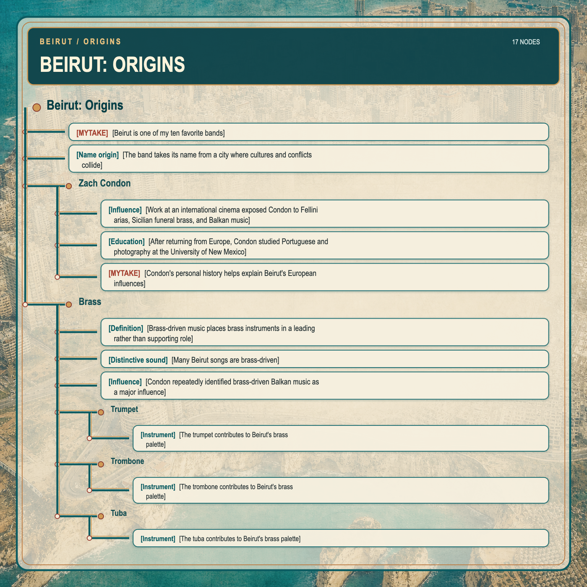
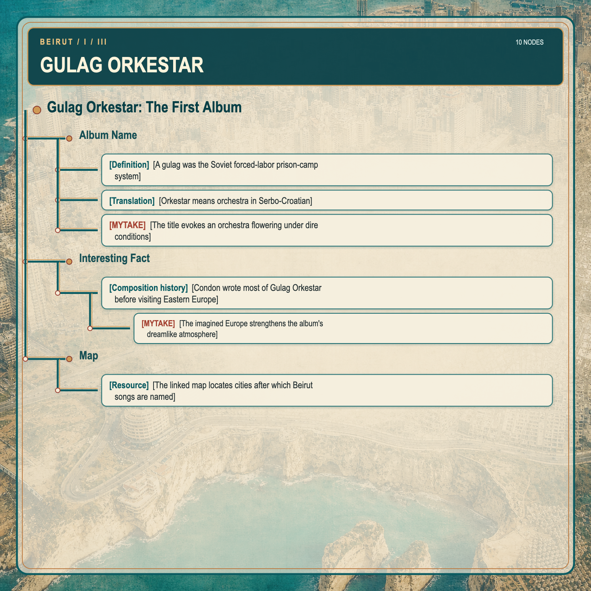
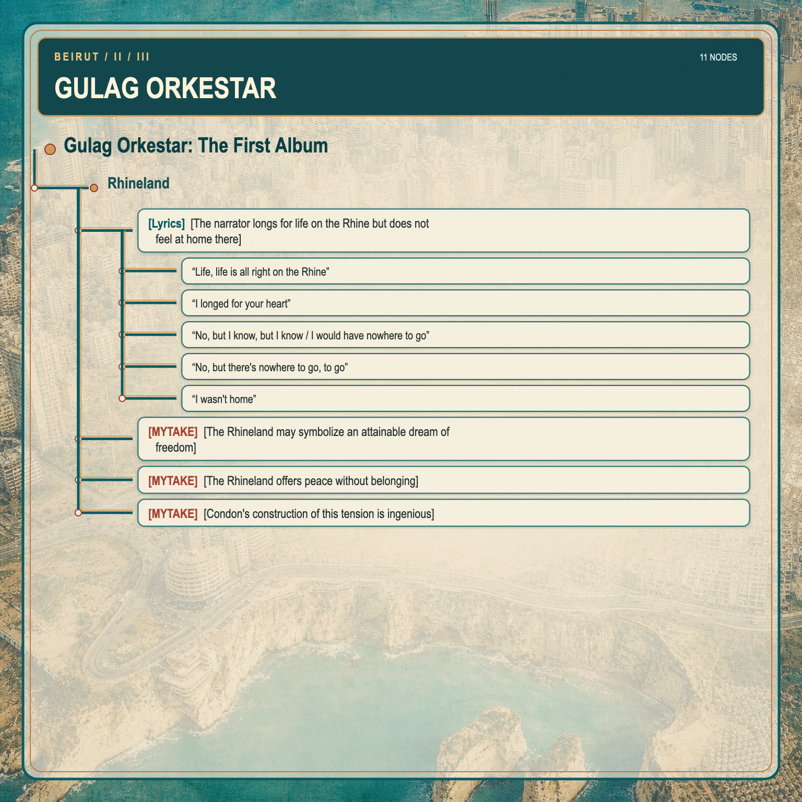
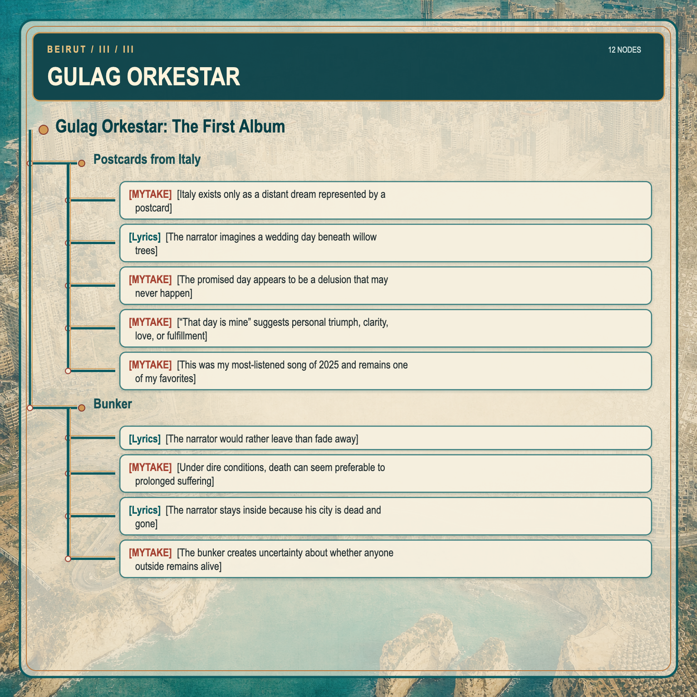
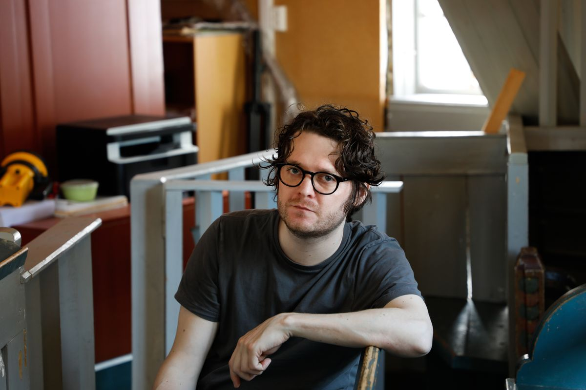
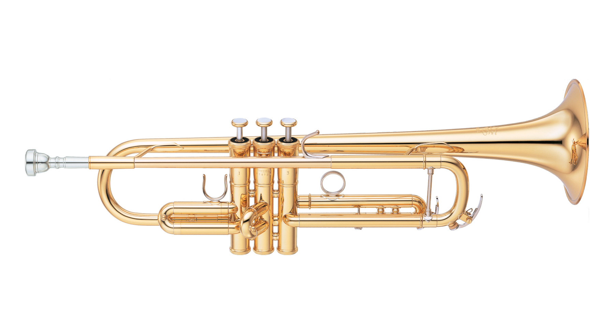
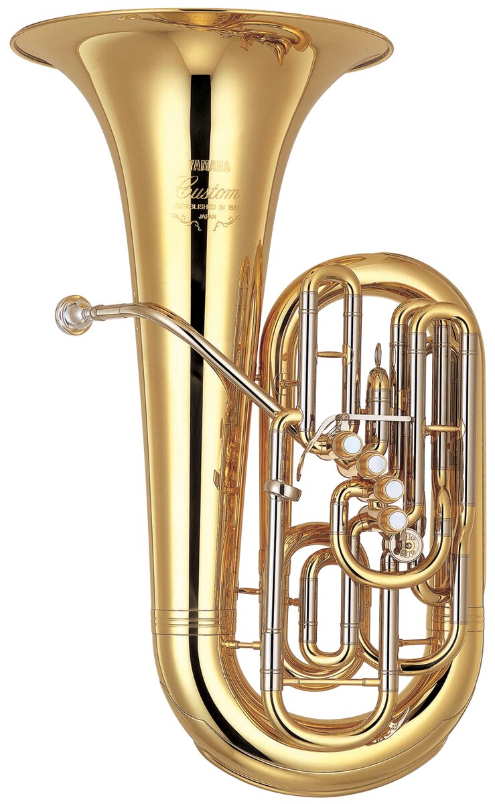
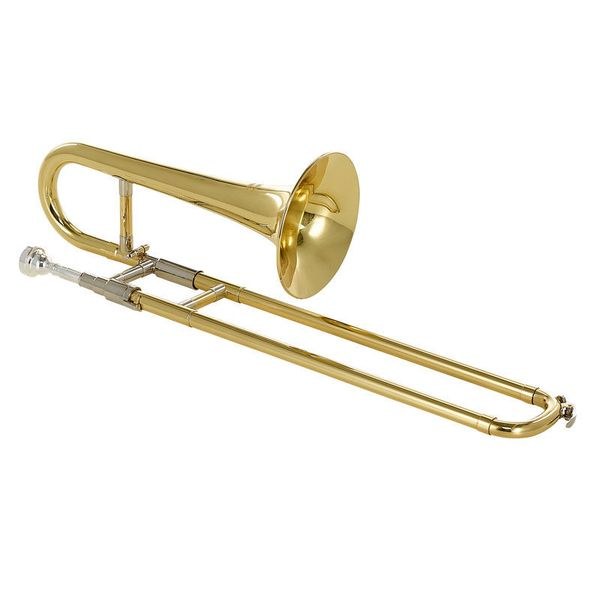

# Beirut: Origins

- [MYTAKE] [Beirut is one of my ten favorite bands]
- [Name origin] [The band takes its name from a city where cultures and conflicts collide] Beirut's music combines indie rock, Balkan folk, and world music.

## Zach Condon

- [Influence] [Work at an international cinema exposed Condon to Fellini arias, Sicilian funeral brass, and Balkan music]
- [Education] [After returning from Europe, Condon studied Portuguese and photography at the University of New Mexico]
- [MYTAKE] [Condon's personal history helps explain Beirut's European influences]

## Brass

- [Definition] [Brass-driven music places brass instruments in a leading rather than supporting role]
- [Distinctive sound] [Many Beirut songs are brass-driven]
- [Influence] [Condon repeatedly identified brass-driven Balkan music as a major influence]

### Trumpet

- [Instrument] [The trumpet contributes to Beirut's brass palette]

### Trombone

- [Instrument] [The trombone contributes to Beirut's brass palette]

### Tuba

- [Instrument] [The tuba contributes to Beirut's brass palette]

# Gulag Orkestar: The First Album

<iframe data-testid="embed-iframe" style="border-radius:12px" src="https://open.spotify.com/embed/album/4yP7cyoeE3F6EyJPZ9v47V?utm_source=generator" width="100%" height="352" frameBorder="0" allowfullscreen="" allow="autoplay; clipboard-write; encrypted-media; fullscreen; picture-in-picture" loading="lazy"></iframe>

## Album Name

- [Definition] [A gulag was the Soviet forced-labor prison-camp system] It was used to punish and control millions of people, especially under Stalin.
- [Translation] [Orkestar means orchestra in Serbo-Croatian]
- [MYTAKE] [The title evokes an orchestra flowering under dire conditions] I enjoy the album's dramatic theme: a flower growing in a gulag.

## Interesting Fact

- [Composition history] [Condon wrote most of *Gulag Orkestar* before visiting Eastern Europe]
  - [MYTAKE] [The imagined Europe strengthens the album's dreamlike atmosphere] His understanding of Europe was, after all, largely imagined.

## Map

- [Resource] [The linked map locates cities after which Beirut songs are named] It includes places connected to *Gulag Orkestar*: https://www.google.com/maps/d/edit?mid=1V3z98ZN6Ti67hXb6I39wbnGrDk5jhI4&usp=sharing

## Rhineland

<iframe data-testid="embed-iframe" style="border-radius:12px" src="https://open.spotify.com/embed/track/6SP4q0W1VrusEMfZRQIYXf?utm_source=generator" width="100%" height="352" frameBorder="0" allowfullscreen="" allow="autoplay; clipboard-write; encrypted-media; fullscreen; picture-in-picture" loading="lazy"></iframe>

- [Lyrics] [The narrator longs for life on the Rhine but does not feel at home there]
  - “Life, life is all right on the Rhine”
  - “I longed for your heart”
  - “No, but I know, but I know / I would have nowhere to go”
  - “No, but there's nowhere to go, to go”
  - “I wasn't home”
- [MYTAKE] [The Rhineland may symbolize an attainable dream of freedom] Unlike most places named on the album, it was not in a Soviet satellite state. From a gulag prisoner's imagined perspective, it could be a place to rest freely.
- [MYTAKE] [The Rhineland offers peace without belonging] The narrator longs for it, yet “there's nowhere to go” because it is not his homeland. It resembles what the countryside represents to city dwellers: peaceful and desirable, but neither eventful nor home.
- [MYTAKE] [Condon's construction of this tension is ingenious]

## Postcards from Italy

<iframe data-testid="embed-iframe" style="border-radius:12px" src="https://open.spotify.com/embed/track/7H0UxIN751StFi2tznmHlg?utm_source=generator" width="100%" height="352" frameBorder="0" allowfullscreen="" allow="autoplay; clipboard-write; encrypted-media; fullscreen; picture-in-picture" loading="lazy"></iframe>

- [MYTAKE] [Italy exists only as a distant dream represented by a postcard] From the imagined perspective of someone in a gulag, the Rhineland remains a possible place to live, while Italy is so remote that it can only be visited in fantasy.
- [Lyrics] [The narrator imagines a wedding day beneath willow trees]
- [MYTAKE] [The promised day appears to be a delusion that may never happen]
- [MYTAKE] [“That day is mine” suggests personal triumph, clarity, love, or fulfillment]
- [MYTAKE] [This was my most-listened song of 2025 and remains one of my favorites]

## Bunker

<iframe data-testid="embed-iframe" style="border-radius:12px" src="https://open.spotify.com/embed/track/27eX7w4g7cJErljKpiH1YK?utm_source=generator" width="100%" height="352" frameBorder="0" allowfullscreen="" allow="autoplay; clipboard-write; encrypted-media; fullscreen; picture-in-picture" loading="lazy"></iframe>

- [Lyrics] [The narrator would rather leave than fade away]
- [MYTAKE] [Under dire conditions, death can seem preferable to prolonged suffering]
- [Lyrics] [The narrator stays inside because his city is dead and gone]
- [MYTAKE] [The bunker creates uncertainty about whether anyone outside remains alive]
