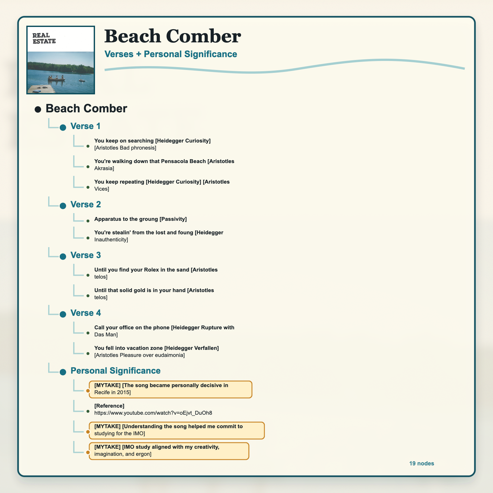
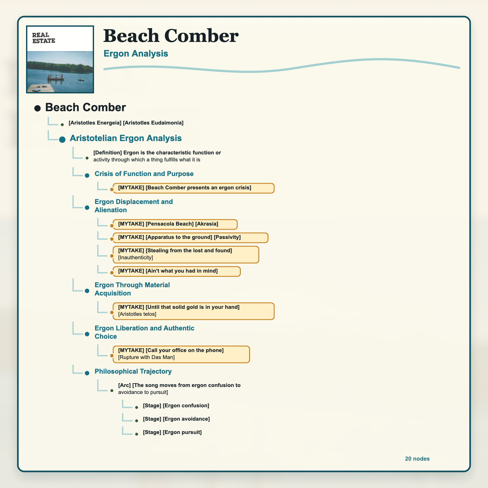

<iframe data-testid="embed-iframe" style="border-radius:12px" src="https://open.spotify.com/embed/track/3tPh7vkXySn2lUEH1NEPyO?utm_source=generator" width="100%" height="352" frameBorder="0" allowfullscreen="" allow="autoplay; clipboard-write; encrypted-media; fullscreen; picture-in-picture" loading="lazy"></iframe>

# Lyrics

## Verse 1

What you want is just outside your reach         

You keep on searching    [Heidegger Curiosity] [Aristotles Bad phronesis]      

You're walking down that Pensacola Beach [Aristotles Akrasia]       

You keep repeating     [Heidegger Curiosity] [Aristotles Vices]

## Verse 2

While you're waiting for that sound        

Apparatus to the groung    [Passivity]

You're stealin' from the lost and foung    [Heidegger Inauthenticity]

And what you find       

Ain't what you had in mind      

## Verse 3

Until you find your Rolex in the sand     [Aristotles telos]  

You won't be stopping       

Until that solid gold is in your hand     [Aristotles telos]

You won't be happy      

## Verse 4

Call your office on the phone     [Heidegger Rupture with Das Man]

Say you won't be coming home        

You fell into vacation zone      [Heidegger Verfallen] [Aristotles Pleasure over eudaimonia]

---

[Aristotles Energeia] -> [Aristotles Eudaimonia]

# Personal Significance

- [MYTAKE] [The song became personally decisive in Recife in 2015] I remember first hearing it in Recife in 2015 through an episode of the sixth season of *How I Met Your Mother*. Also because *How I Met Your Mother* has a special placement in my heart
- - [Reference] https://www.youtube.com/watch?v=oEjvt_DuOh8
- [MYTAKE] [Understanding the song helped me commit to studying for the IMO] Listening to and understanding "Beach Comber" helped me decide to commit fully to IMO study.
- [MYTAKE] [IMO study aligned with my creativity, imagination, and ergon] The decision mattered because mathematical creativity and imagination felt like core aspects of my true calling.

# Aristotelian Ergon Analysis
- [Definition] Ergon is the characteristic function or activity through which a thing fulfills what it is

## Crisis of Function and Purpose

- [MYTAKE] [Beach Comber presents an ergon crisis] The song can be read as a disconnection between one's essential function/purpose and one's actual activities.

## Ergon Displacement and Alienation

- [MYTAKE] [Pensacola Beach] [Akrasia] The repeated walk along the beach replaces the pursuit of purpose by circular unfulfilling habits.
- [MYTAKE] [Apparatus to the ground] [Passivity] Expecting a salvation can operate as a psychological defense against the pain of confronting true purpose.
- [MYTAKE] [Stealing from the lost and found] [Inauthenticity] The image suggests constructing identity from other people's wants and dreams rather than from one's own ergon/calling. I love this part.
- - [MYTAKE] [Ain't what you had in mind] In the end, the problem of inauthenticity is that is ultimately meaningless and unlfilling

## Ergon Through Material Acquisition

- [MYTAKE] [Until that solid gold is in your hand] [Aristotles telos] The gold matters less as luxury than as a concrete target that organizes the search.

## Ergon Liberation and Authentic Choice

- [MYTAKE] [Call your office on the phone] [Rupture with Das Man] Refusing to go to work represents a break from work obligations that conflict with one's proper function. This is my favourite phemenological part of the song because I have a true calling to not following social constructions.

## Philosophical Trajectory

- [Arc] [The song moves from ergon confusion to avoidance to pursuit]
  - [Stage] [Ergon confusion] The speaker does not yet know what his life is about.
  - [Stage] [Ergon avoidance] The speaker hides from existential truth and searches through displaced objects.
  - [Stage] [Ergon pursuit] The speaker seeks fulfillment through a material goal that may or may not express his true function.
