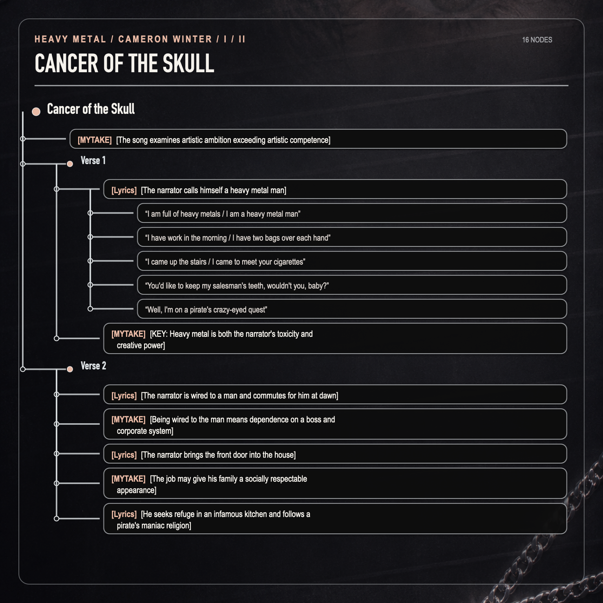
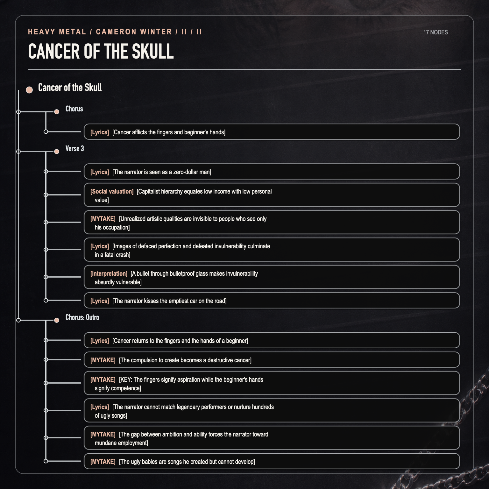
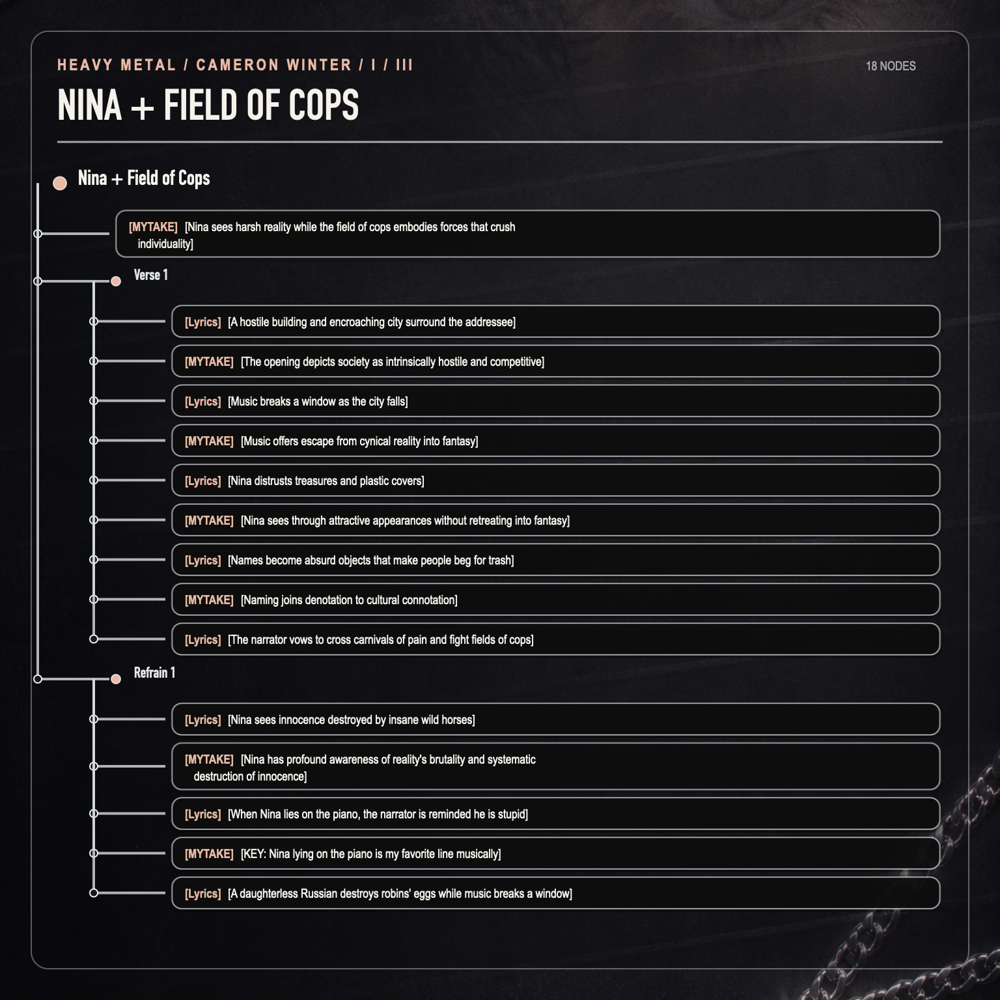
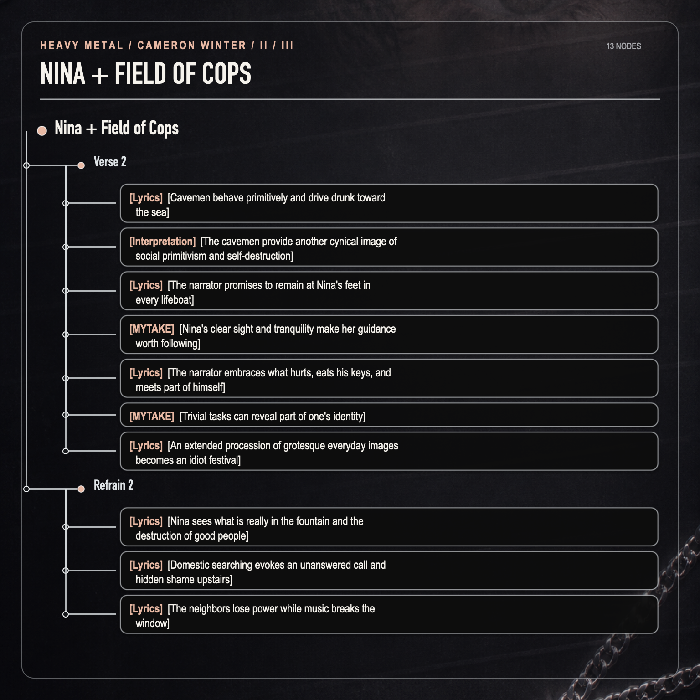
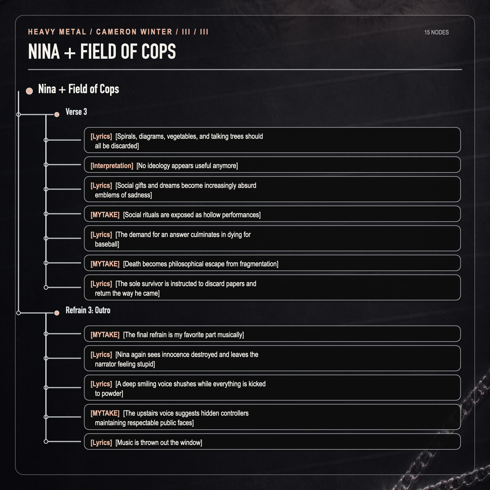

# Cancer of the Skull

- [MYTAKE] [The song examines artistic ambition exceeding artistic competence] The narrator aspires to greatness while believing he lacks the ability to achieve it.

<iframe data-testid="embed-iframe" style="border-radius:12px" src="https://open.spotify.com/embed/track/1RkuN09alt0DLZ9PlplUcc?utm_source=generator" width="100%" height="352" frameBorder="0" allowfullscreen="" allow="autoplay; clipboard-write; encrypted-media; fullscreen; picture-in-picture" loading="lazy"></iframe>

## Verse 1

- [Lyrics] [The narrator calls himself a heavy metal man]
  - “I am full of heavy metals / I am a heavy metal man”
  - “I have work in the morning / I have two bags over each hand”
  - “I came up the stairs / I came to meet your cigarettes”
  - “You'd like to keep my salesman's teeth, wouldn't you, baby?”
  - “Well, I'm on a pirate's crazy-eyed quest”
- [MYTAKE] [KEY: Heavy metal is both the narrator's toxicity and creative power] Heavy metals possess high energy, bind to organic matter, and resist chemical reactions. Likewise, the “heavy metal man” resists social norms and assimilation; the same stubborn nature becomes the root of both his virtues and vices.

## Verse 2

- [Lyrics] [The narrator is wired to a man and commutes for him at dawn]
- [MYTAKE] [Being wired to the man means dependence on a boss and corporate system] He fulfills social expectations despite his artistic nature.
- [Lyrics] [The narrator brings the front door into the house]
- [MYTAKE] [The job may give his family a socially respectable appearance]
- [Lyrics] [He seeks refuge in an infamous kitchen and follows a pirate's maniac religion]

## Chorus

- [Lyrics] [Cancer afflicts the fingers and beginner's hands] The songs are for bad singers; the narrator cannot reach the music of the 1980s and cannot feed what he creates.

## Verse 3

- [Lyrics] [The narrator is seen as a zero-dollar man]
- [Social valuation] [Capitalist hierarchy equates low income with low personal value]
- [MYTAKE] [Unrealized artistic qualities are invisible to people who see only his occupation] Because his art could not become a career, observers reduce him to a “zero-dollar man.”
- [Lyrics] [Images of defaced perfection and defeated invulnerability culminate in a fatal crash]
- [Interpretation] [A bullet through bulletproof glass makes invulnerability absurdly vulnerable]
- [Lyrics] [The narrator kisses the emptiest car on the road]

## Chorus: Outro

- [Lyrics] [Cancer returns to the fingers and the hands of a beginner]
- [MYTAKE] [The compulsion to create becomes a destructive cancer]
- [MYTAKE] [KEY: The fingers signify aspiration while the beginner's hands signify competence] The image compresses the song's central conflict into a visceral ambition constrained by novice ability.
- [Lyrics] [The narrator cannot match legendary performers or nurture hundreds of ugly songs]
- [MYTAKE] [The gap between ambition and ability forces the narrator toward mundane employment] He cannot equal musicians such as the Beatles or Led Zeppelin.
- [MYTAKE] [The ugly babies are songs he created but cannot develop] After making hundreds, he lacks the competence to help them blossom.

# Nina + Field of Cops

- [MYTAKE] [Nina sees harsh reality while the field of cops embodies forces that crush individuality]

<iframe data-testid="embed-iframe" style="border-radius:12px" src="https://open.spotify.com/embed/track/78ugJH8q6W3kiGLwM2K7Lg?utm_source=generator" width="100%" height="352" frameBorder="0" allowfullscreen="" allow="autoplay; clipboard-write; encrypted-media; fullscreen; picture-in-picture" loading="lazy"></iframe>

## Verse 1

- [Lyrics] [A hostile building and encroaching city surround the addressee]
- [MYTAKE] [The opening depicts society as intrinsically hostile and competitive]
- [Lyrics] [Music breaks a window as the city falls]
- [MYTAKE] [Music offers escape from cynical reality into fantasy]
- [Lyrics] [Nina distrusts treasures and plastic covers]
- [MYTAKE] [Nina sees through attractive appearances without retreating into fantasy]
- [Lyrics] [Names become absurd objects that make people beg for trash]
- [MYTAKE] [Naming joins denotation to cultural connotation] The passage recalls Lévi-Strauss: names carry ideological baggage that shapes reality and incentivizes people to pursue trash.
- [Lyrics] [The narrator vows to cross carnivals of pain and fight fields of cops]

## Refrain 1

- [Lyrics] [Nina sees innocence destroyed by insane wild horses]
- [MYTAKE] [Nina has profound awareness of reality's brutality and systematic destruction of innocence]
- [Lyrics] [When Nina lies on the piano, the narrator is reminded he is stupid]
- [MYTAKE] [KEY: Nina lying on the piano is my favorite line musically]
- [Lyrics] [A daughterless Russian destroys robins' eggs while music breaks a window]

## Verse 2

- [Lyrics] [Cavemen behave primitively and drive drunk toward the sea]
- [Interpretation] [The cavemen provide another cynical image of social primitivism and self-destruction]
- [Lyrics] [The narrator promises to remain at Nina's feet in every lifeboat]
- [MYTAKE] [Nina's clear sight and tranquility make her guidance worth following]
- [Lyrics] [The narrator embraces what hurts, eats his keys, and meets part of himself]
- [MYTAKE] [Trivial tasks can reveal part of one's identity]
- [Lyrics] [An extended procession of grotesque everyday images becomes an idiot festival] The passage moves through gardens, groceries, cornfields, planes, tomatoes, dogs, a kitten, and empty chairs.

## Refrain 2

- [Lyrics] [Nina sees what is really in the fountain and the destruction of good people]
- [Lyrics] [Domestic searching evokes an unanswered call and hidden shame upstairs]
- [Lyrics] [The neighbors lose power while music breaks the window]

## Verse 3

- [Lyrics] [Spirals, diagrams, vegetables, and talking trees should all be discarded]
- [Interpretation] [No ideology appears useful anymore]
- [Lyrics] [Social gifts and dreams become increasingly absurd emblems of sadness]
- [MYTAKE] [Social rituals are exposed as hollow performances]
- [Lyrics] [The demand for an answer culminates in dying for baseball]
- [MYTAKE] [Death becomes philosophical escape from fragmentation] This resembles Camus's account of philosophical suicide as flight from the “nostalgia for unity.”
- [Lyrics] [The sole survivor is instructed to discard papers and return the way he came]

## Refrain 3: Outro

- [MYTAKE] [The final refrain is my favorite part musically]
- [Lyrics] [Nina again sees innocence destroyed and leaves the narrator feeling stupid]
- [Lyrics] [A deep smiling voice shushes while everything is kicked to powder]
- [MYTAKE] [The upstairs voice suggests hidden controllers maintaining respectable public faces]
- [Lyrics] [Music is thrown out the window]
