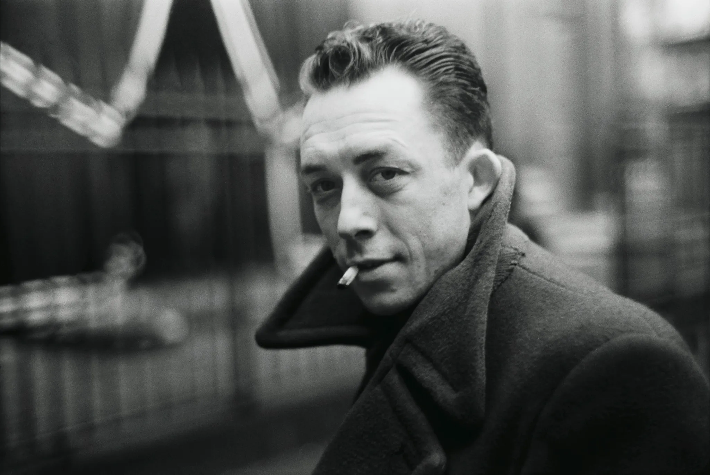
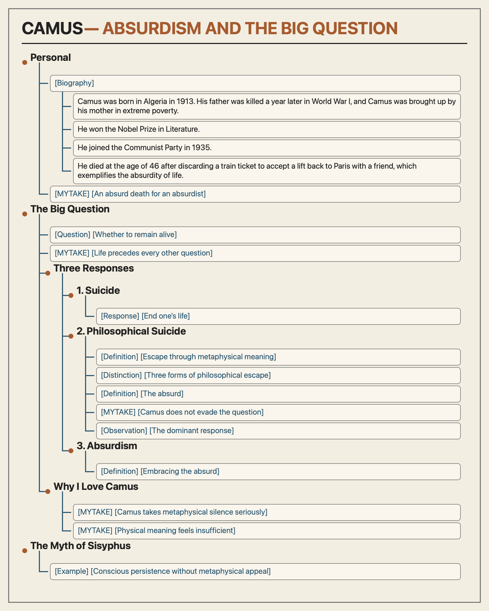
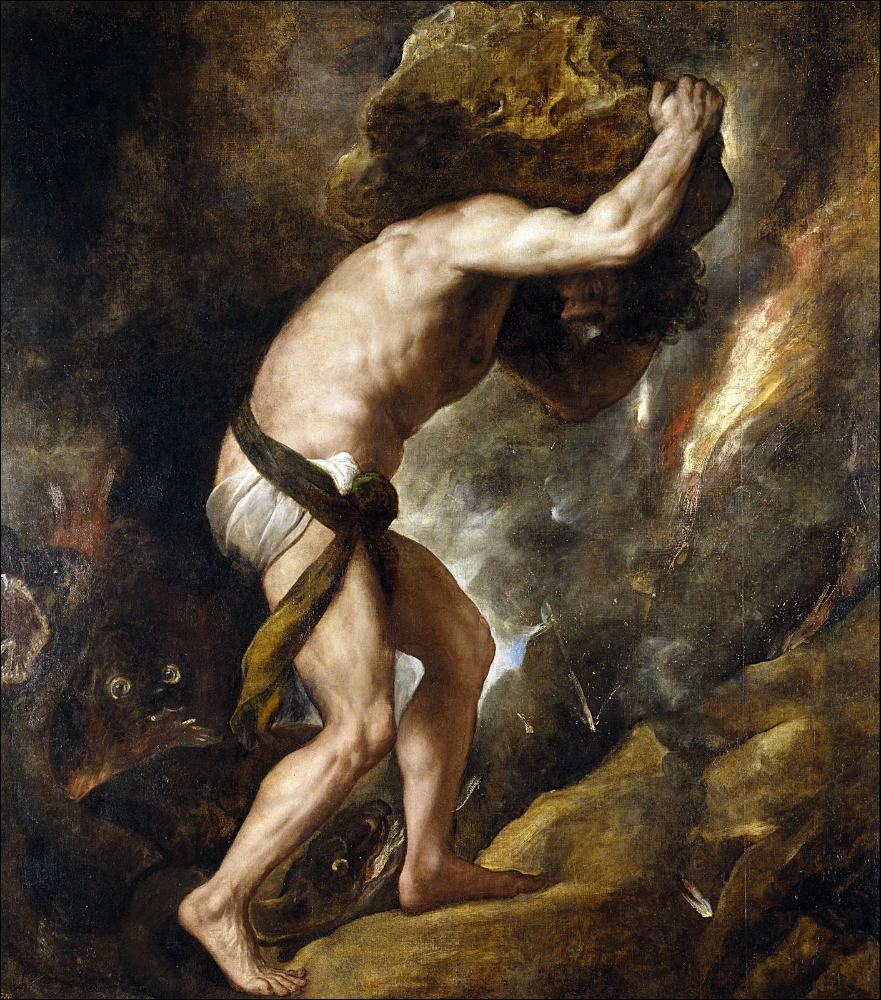

# Personal

[Biography]

1. Camus was born in Algeria in 1913. His father was killed a year later in World War I, and Camus was brought up by his mother in extreme poverty.
2. He won the Nobel Prize in Literature.
3. He joined the Communist Party in 1935.
4. He died at the age of 46 after discarding a train ticket to accept a lift back to Paris with a friend, which exemplifies the absurdity of life.

- [MYTAKE] [An absurd death for an absurdist] KKKKKKKKKKKKK, what a perfect way for the founder of absurdism to die. It is incredibly ironic that he died in such an absurd way.

# The Big Question

- [Question] [Whether to remain alive] There is one truly philosophical problem: whether to commit suicide.
- [MYTAKE] [Life precedes every other question] The reason this is such a relevant philosophical question is that before attempting to answer any other question, such as what is right or wrong, you first have to choose to stay alive. A latent decision underlying all other decisions.

## Three Responses

### 1. Suicide

- [Response] [End one’s life] Suicide is the first response to the problem.

### 2. Philosophical Suicide

- [Definition] [Escape through metaphysical meaning] There are many types of philosophical suicide, but they all escape the absurd by affirming a metaphysical meaning: a meaning that exists beyond human consciousness, biological processes, and chemical reactions in the brain.
- [Distinction] [Three forms of philosophical escape] Philosophical suicide can take at least three forms: believing that one’s personal meaning is grounded in a real metaphysical meaning; believing that a meaning without metaphysical grounding still possesses some nonphysical relevance; or simply ignoring the distinction between metaphysical meaning and meaning produced by physical processes.
- [Definition] [The absurd] For Camus, the absurd arises when the human demand for metaphysical meaning confronts a universe that provides no knowable answer beyond the meanings generated within human life.

- [MYTAKE] [Camus does not evade the question] IMPORTANT: I love this about Camus because he does not run from the main question—the question that got me into studying philosophy in the first place. In the end, Nietzsche commits philosophical suicide when he talks about the will to power, just as Sartre commits philosophical suicide when he talks about living an authentic life.
- [Observation] [The dominant response] 99.99999999999999999% of people choose this option, including myself.

### 3. Absurdism

- [Definition] [Embracing the absurd] Embracing the absurd means continuing to live without claiming access to a metaphysical meaning beyond human existence. We may still create values and experience meaning, but we remain lucid that these arise within embodied human life rather than from a knowable transcendent order. The tension between our metaphysical demand and the universe’s silence is preserved rather than resolved.

## Why I Love Camus

- [MYTAKE] [Camus takes metaphysical silence seriously] I think many philosophers, such as Sartre, are full of bullshit because they act as though the absence of metaphysical meaning is irrelevant and humanly created meaning is good enough. This is ridiculous in my opinion. A meaning produced by consciousness or chemical reactions in the brain does not answer the demand for a meaning that exists beyond us. Camus at least gives proper importance to the despair created by the absence of belief in metaphysical meaning.
- [MYTAKE] [Physical meaning feels insufficient] At first, living through self-created meaning may seem like an acceptable response to the absence of metaphysical meaning. But once I fully realize what that absence implies, every meaning I assign appears to be only physical: a configuration of neurons, chemical reactions, emotions, and learned associations occurring in my brain. Calling one of those reactions “my purpose” does not make it exist beyond the physical process producing it. From this perspective, pursuing a self-created meaning can feel circular, kind of stupid, and not ultimately worth the effort.

# The Myth of Sisyphus

- [Example] [Conscious persistence without metaphysical appeal] For Camus, this myth encapsulates the big question. Sisyphus performs his task without any metaphysical purpose that redeems it, fully aware that no transcendent meaning guarantees its value, yet he continues. This lucid persistence epitomizes the absurdity of our lives.
