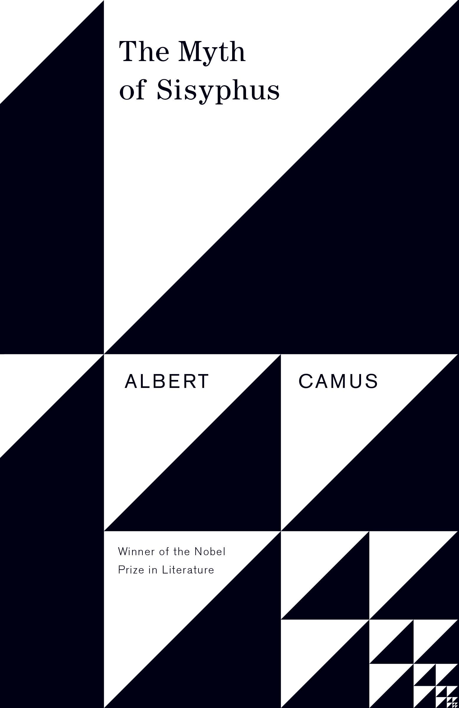
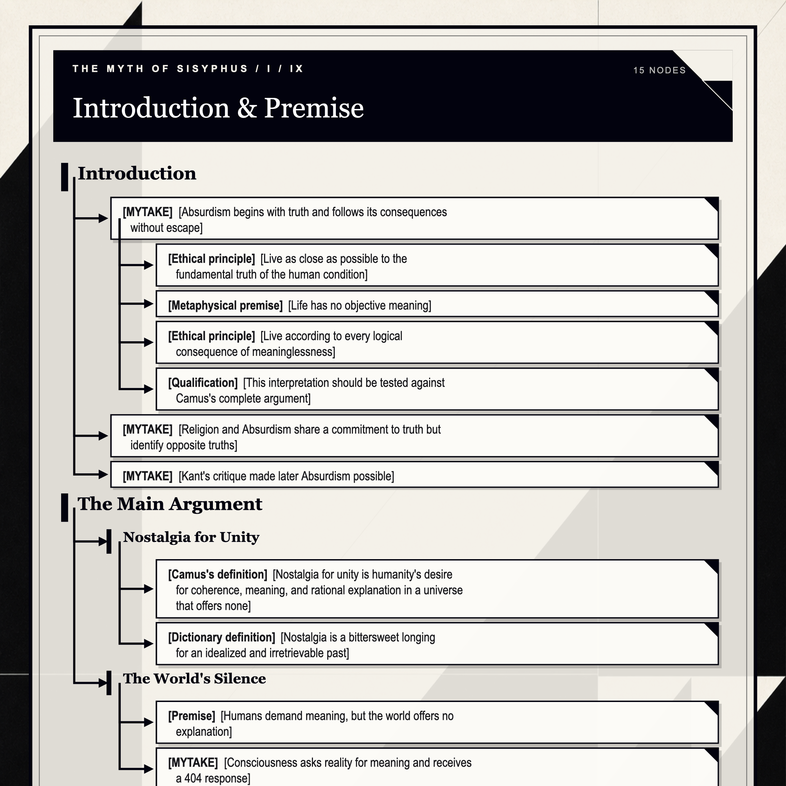
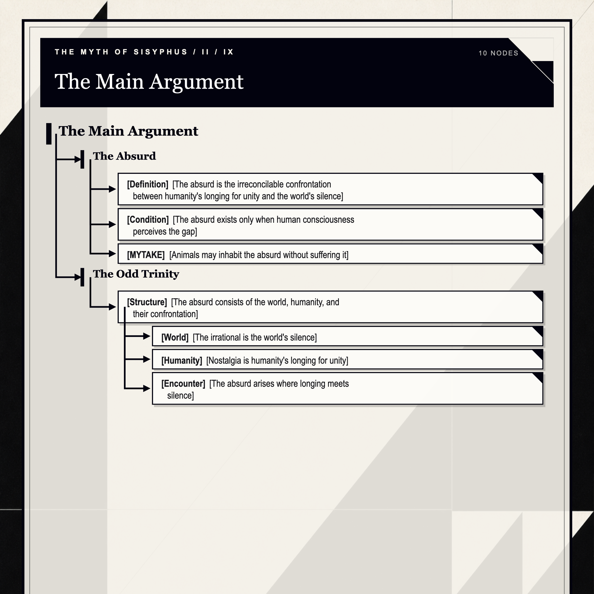
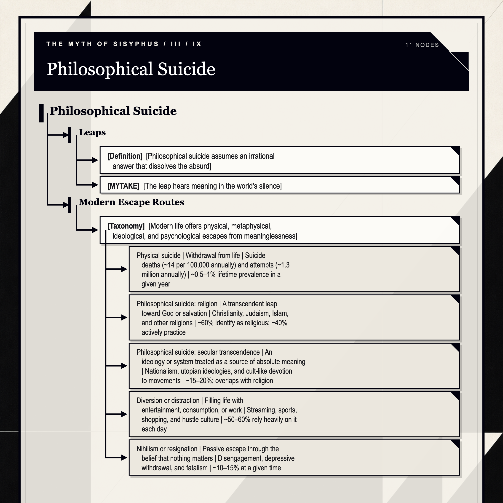
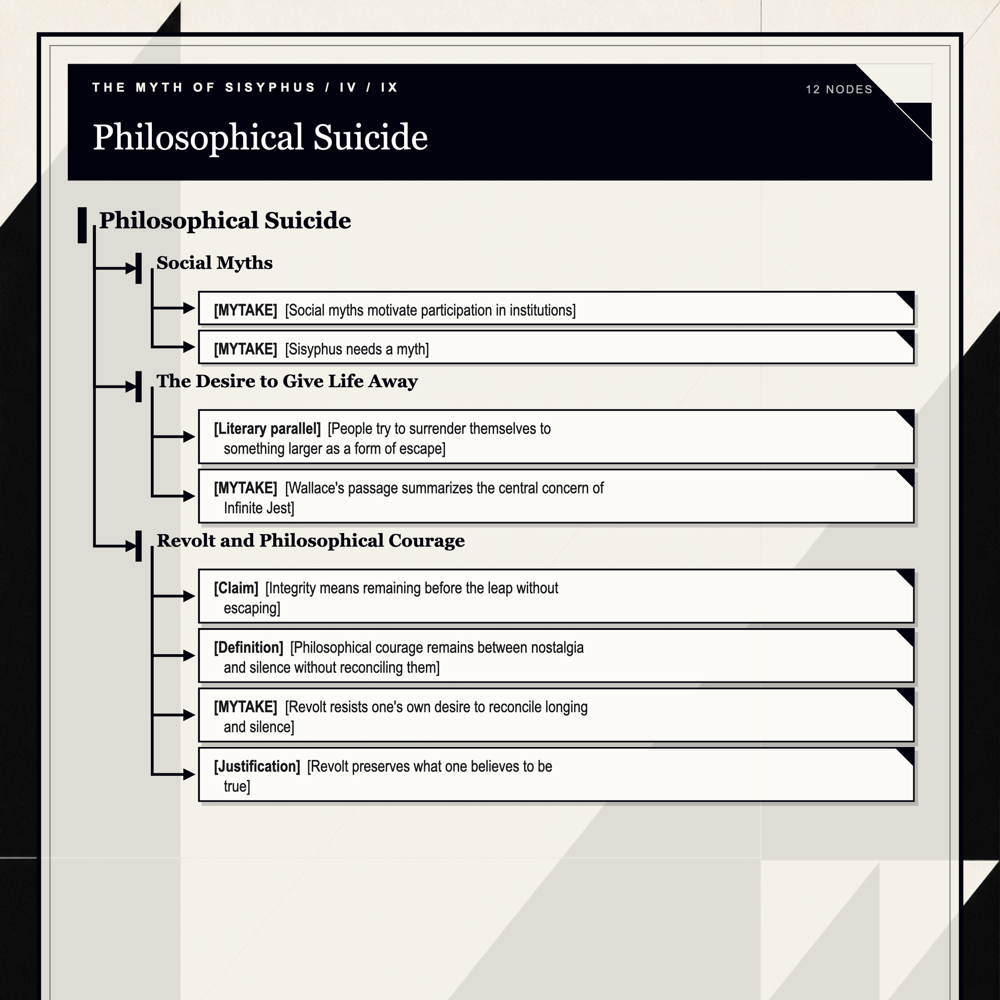
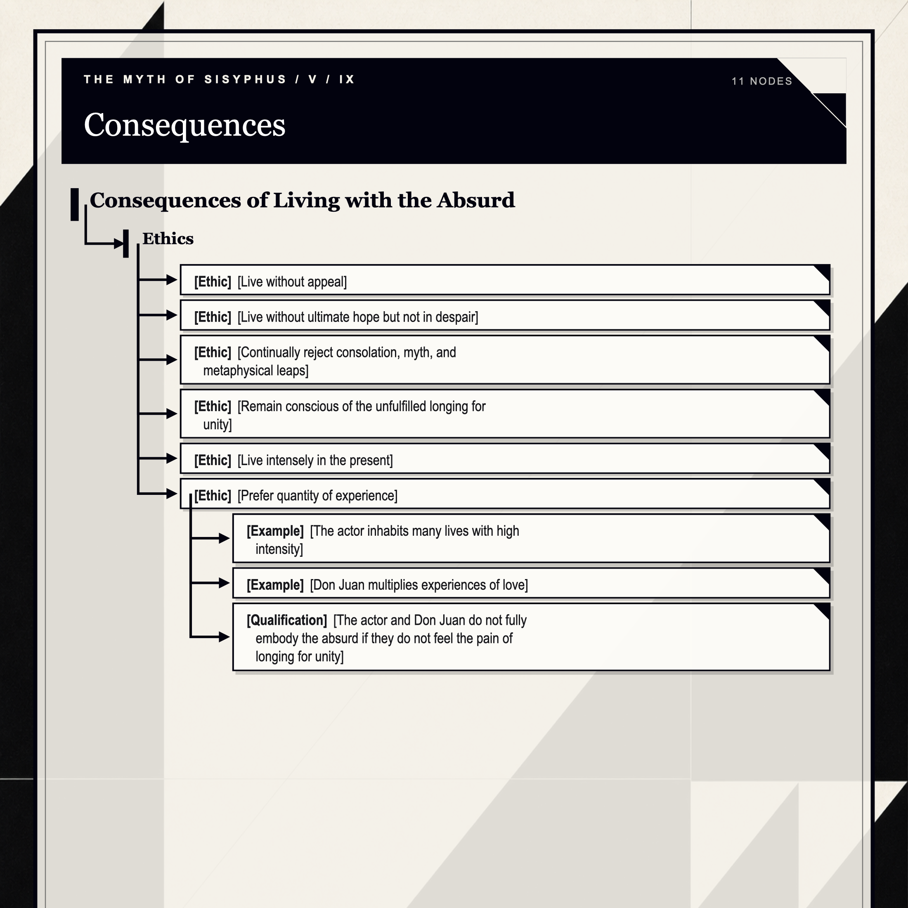
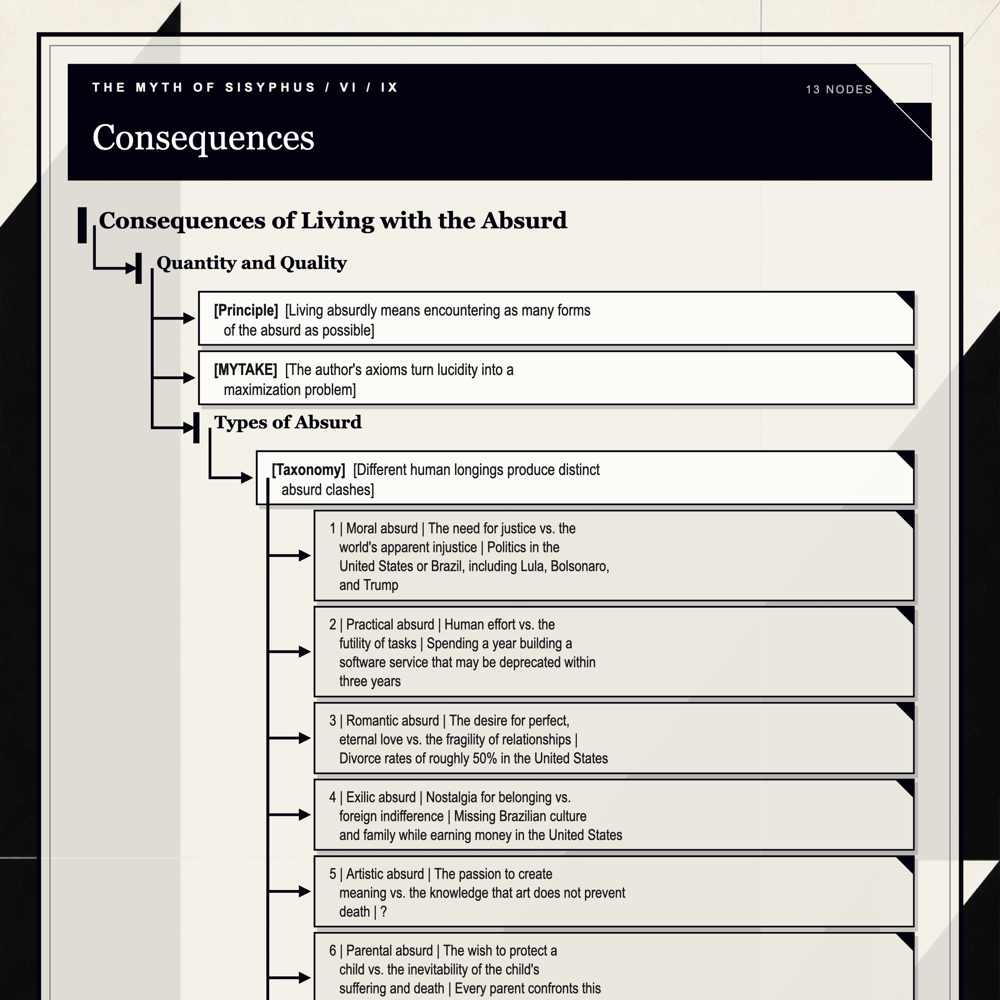
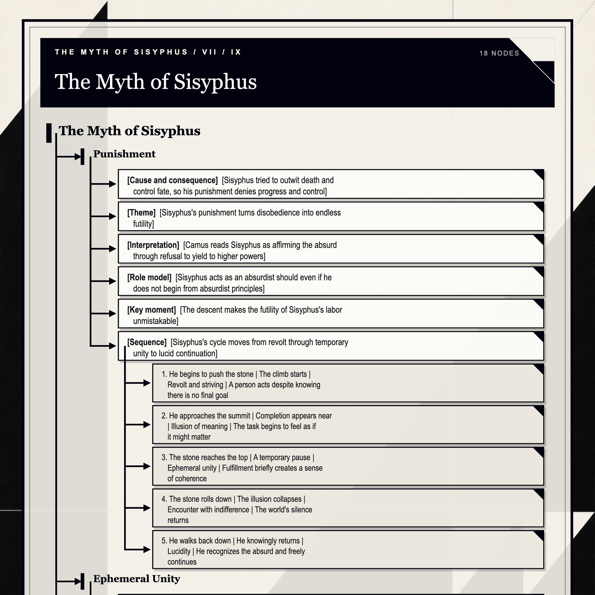
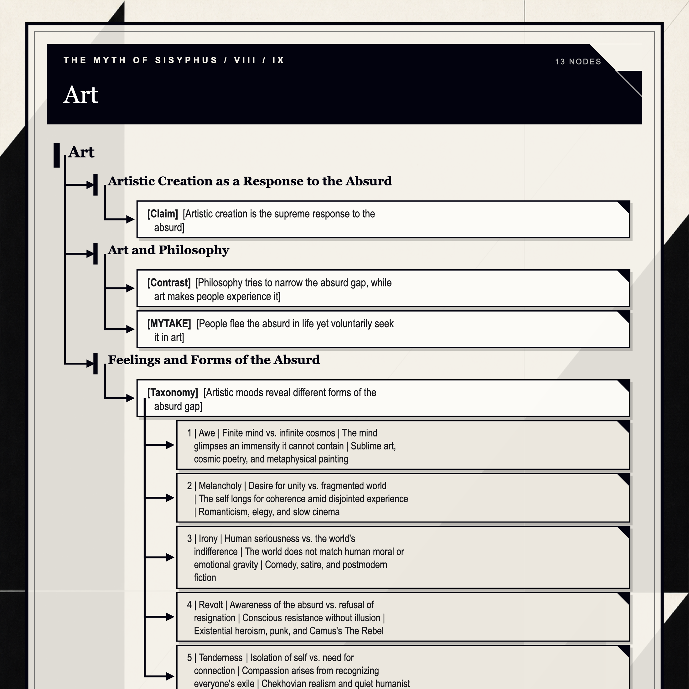
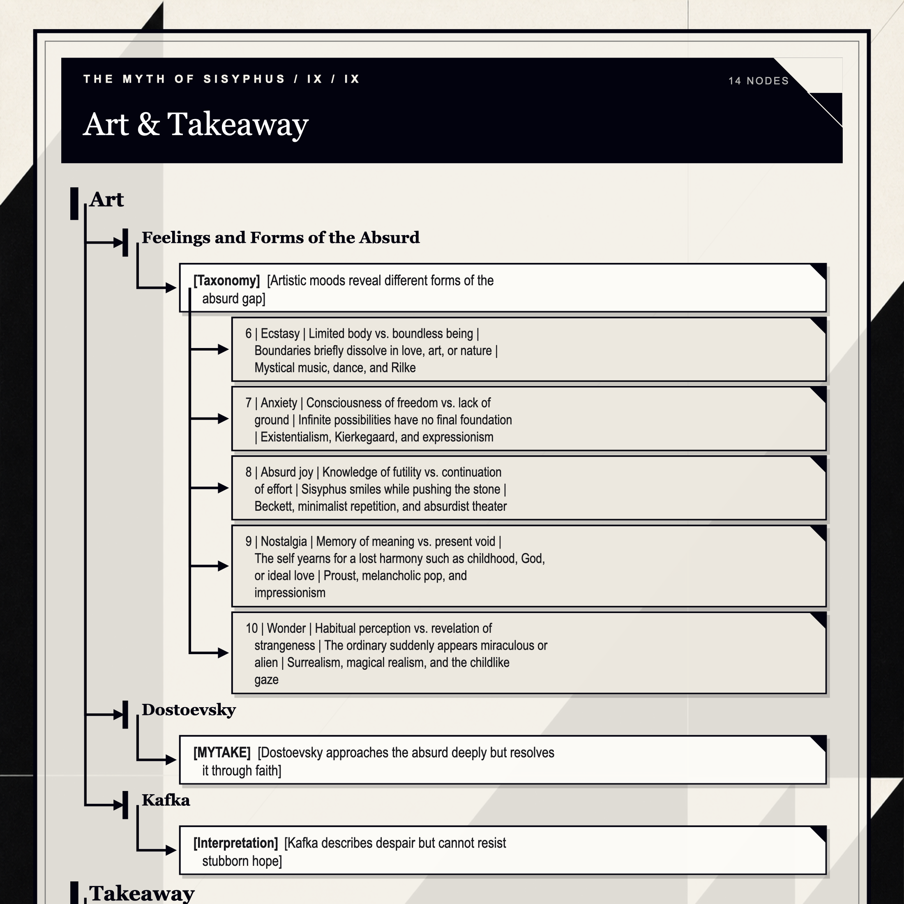

# Introduction

- [MYTAKE] [Absurdism begins with truth and follows its consequences without escape]
  - [Ethical principle] [Live as close as possible to the fundamental truth of the human condition]
  - [Metaphysical premise] [Life has no objective meaning]
  - [Ethical principle] [Live according to every logical consequence of meaninglessness]
  - [Qualification] [This interpretation should be tested against Camus's complete argument]
- [MYTAKE] [Religion and Absurdism share a commitment to truth but identify opposite truths] Both demand total commitment, but religion affirms transcendent meaning while Absurdism denies it.
- [MYTAKE] [Kant's critique made later Absurdism possible] Kant's influence on subsequent philosophy resembles the influence of the paper *Attention Is All You Need* on software engineering after GPT-3: much of what follows can feel like a consequence of the original breakthrough.

# The Main Argument

## Nostalgia for Unity

- [Camus's definition] [Nostalgia for unity is humanity's desire for coherence, meaning, and rational explanation in a universe that offers none]
- [Dictionary definition] [Nostalgia is a bittersweet longing for an idealized and irretrievable past]

## The World's Silence

- [Premise] [Humans demand meaning, but the world offers no explanation] The universe simply exists: indifferent, mute, and resistant to the coherence people seek.
- [MYTAKE] [Consciousness asks reality for meaning and receives a 404 response] In a client-server metaphor, consciousness is the client, reality is the server, and every request for a reason returns “not found.”

## The Absurd

- [Definition] [The absurd is the irreconcilable confrontation between humanity's longing for unity and the world's silence]
- [Condition] [The absurd exists only when human consciousness perceives the gap]
- [MYTAKE] [Animals may inhabit the absurd without suffering it] They are not conscious of the confrontation between the demand for meaning and the world's silence.

## The Odd Trinity

- [Structure] [The absurd consists of the world, humanity, and their confrontation]
  - [World] [The irrational is the world's silence]
  - [Humanity] [Nostalgia is humanity's longing for unity]
  - [Encounter] [The absurd arises where longing meets silence]

# Philosophical Suicide

## Leaps

- [Definition] [Philosophical suicide assumes an irrational answer that dissolves the absurd]
- [MYTAKE] [The leap hears meaning in the world's silence] It treats an indifferent universe as if it had supplied the answer consciousness wanted.

## Modern Escape Routes

- [Taxonomy] [Modern life offers physical, metaphysical, ideological, and psychological escapes from meaninglessness] The proportions below are rough 2025 estimates recorded in the source note and may overlap.

| Escape route | Modern equivalent | Examples in U.S. life | Rough share of adults recorded in the source note |
| --- | --- | --- | --- |
| **Physical suicide** | Withdrawal from life | Suicide deaths (~14 per 100,000 annually) and attempts (~1.3 million annually) | ~0.5–1% lifetime prevalence in a given year |
| **Philosophical suicide: religion** | A transcendent leap toward God or salvation | Christianity, Judaism, Islam, and other religions | ~60% identify as religious; ~40% actively practice |
| **Philosophical suicide: secular transcendence** | An ideology or system treated as a source of absolute meaning | Nationalism, utopian ideologies, and cult-like devotion to movements | ~15–20%; overlaps with religion |
| **Diversion or distraction** | Filling life with entertainment, consumption, or work | Streaming, sports, shopping, and hustle culture | ~50–60% rely heavily on it each day |
| **Nihilism or resignation** | Passive escape through the belief that nothing matters | Disengagement, depressive withdrawal, and fatalism | ~10–15% at a given time |

## Social Myths

- [MYTAKE] [Social myths motivate participation in institutions] Belief in school, university, and corporate careers may help society function by giving people reasons to act.
- [MYTAKE] [Sisyphus needs a myth]

## The Desire to Give Life Away

- [Literary parallel] [People try to surrender themselves to something larger as a form of escape] In *Infinite Jest*, David Foster Wallace describes the urge to give life away completely to God or Satan, politics or grammar, topology or philately, games or needles, or another person. What appears to be a plunge is actually a form of flight.
- [MYTAKE] [Wallace's passage summarizes the central concern of Infinite Jest]

## Revolt and Philosophical Courage

- [Claim] [Integrity means remaining before the leap without escaping] Camus locates the danger in the instant before the leap, when one faces the void and can still choose either direction; every evasion after that point is self-deception.
- [Definition] [Philosophical courage remains between nostalgia and silence without reconciling them]
- [MYTAKE] [Revolt resists one's own desire to reconcile longing and silence]
- [Justification] [Revolt preserves what one believes to be true] “What I believe to be true I must therefore preserve.”

# Consequences of Living with the Absurd

## Ethics

- [Ethic] [Live without appeal] Accept a world stripped of ultimate purpose.
- [Ethic] [Live without ultimate hope but not in despair] Lucidity means recognizing that no final meaning is waiting to be discovered.
- [Ethic] [Continually reject consolation, myth, and metaphysical leaps]
- [Ethic] [Remain conscious of the unfulfilled longing for unity] Stay awake to the contradiction instead of closing it.
- [Ethic] [Live intensely in the present]
- [Ethic] [Prefer quantity of experience]
  - [Example] [The actor inhabits many lives with high intensity]
  - [Example] [Don Juan multiplies experiences of love]
  - [Qualification] [The actor and Don Juan do not fully embody the absurd if they do not feel the pain of longing for unity]

## Quantity and Quality

- [Principle] [Living absurdly means encountering as many forms of the absurd as possible] A greater variety of experiences reveals more of the absurd as a whole.
- [MYTAKE] [The author's axioms turn lucidity into a maximization problem] If one should live according to existential truth, one should also maximize contact with that truth.

### Types of Absurd

- [Taxonomy] [Different human longings produce distinct absurd clashes]

| # | Absurd type | Clash | Everyday example |
| --- | --- | --- | --- |
| 1 | Moral absurd | The need for justice vs. the world's apparent injustice | Politics in the United States or Brazil, including Lula, Bolsonaro, and Trump |
| 2 | Practical absurd | Human effort vs. the futility of tasks | Spending a year building a software service that may be deprecated within three years |
| 3 | Romantic absurd | The desire for perfect, eternal love vs. the fragility of relationships | Divorce rates of roughly 50% in the United States |
| 4 | Exilic absurd | Nostalgia for belonging vs. foreign indifference | Missing Brazilian culture and family while earning money in the United States |
| 5 | Artistic absurd | The passion to create meaning vs. the knowledge that art does not prevent death | ? |
| 6 | Parental absurd | The wish to protect a child vs. the inevitability of the child's suffering and death | Every parent confronts this clash |
| 7 | Senescent absurd | A lifetime of projects vs. retirement and approaching death | Every retired person confronts this clash |

# The Myth of Sisyphus

## Punishment

- [Cause and consequence] [Sisyphus tried to outwit death and control fate, so his punishment denies progress and control]
- [Theme] [Sisyphus's punishment turns disobedience into endless futility]
- [Interpretation] [Camus reads Sisyphus as affirming the absurd through refusal to yield to higher powers]
- [Role model] [Sisyphus acts as an absurdist should even if he does not begin from absurdist principles]
- [Key moment] [The descent makes the futility of Sisyphus's labor unmistakable] He sees that his effort has no final meaning, accepts this condition, and returns to the stone.
- [Sequence] [Sisyphus's cycle moves from revolt through temporary unity to lucid continuation]

| Stage | Literal action | Psychological state | Philosophical meaning |
| --- | --- | --- | --- |
| 1. He begins to push the stone | The climb starts | Revolt and striving | A person acts despite knowing there is no final goal |
| 2. He approaches the summit | Completion appears near | Illusion of meaning | The task begins to feel as if it might matter |
| 3. The stone reaches the top | A temporary pause | Ephemeral unity | Fulfillment briefly creates a sense of coherence |
| 4. The stone rolls down | The illusion collapses | Encounter with indifference | The world's silence returns |
| 5. He walks back down | He knowingly returns | Lucidity | He recognizes the absurd and freely continues |

## Ephemeral Unity

- [MYTAKE] [The summit creates a temporary illusion of meaning] Near fulfillment, people may misread the world's silence as an answer and briefly experience unity, as when falling in love. When the stone rolls down, indifference becomes visible again.

## Digressions

- [Observation] [People watch plays to glimpse other lives without suffering them] They want to witness the absurd without having to live it.
- [Claim] [Camus finds nobility in living the absurd without philosophical suicide] Its nobility comes from logical coherence and the willingness to face every consequence of refusing escape.

# Art

## Artistic Creation as a Response to the Absurd

- [Claim] [Artistic creation is the supreme response to the absurd] Recreating an experience through art partially preserves the absurdity of the original moment.

## Art and Philosophy

- [Contrast] [Philosophy tries to narrow the absurd gap, while art makes people experience it] This contrast applies to most philosophy rather than every philosophical project.
- [MYTAKE] [People flee the absurd in life yet voluntarily seek it in art] People pursue careers, education, marriage, and family partly to establish meaning, then choose artworks that return them to the very contradiction they otherwise avoid.

## Feelings and Forms of the Absurd

- [Taxonomy] [Artistic moods reveal different forms of the absurd gap]

| # | Feeling or mood | Absurd gap | Description | Typical artistic expression |
| --- | --- | --- | --- | --- |
| 1 | Awe | Finite mind vs. infinite cosmos | The mind glimpses an immensity it cannot contain | Sublime art, cosmic poetry, and metaphysical painting |
| 2 | Melancholy | Desire for unity vs. fragmented world | The self longs for coherence amid disjointed experience | Romanticism, elegy, and slow cinema |
| 3 | Irony | Human seriousness vs. the world's indifference | The world does not match human moral or emotional gravity | Comedy, satire, and postmodern fiction |
| 4 | Revolt | Awareness of the absurd vs. refusal of resignation | Conscious resistance without illusion | Existential heroism, punk, and Camus's *The Rebel* |
| 5 | Tenderness | Isolation of self vs. need for connection | Compassion arises from recognizing everyone's exile | Chekhovian realism and quiet humanist film |
| 6 | Ecstasy | Limited body vs. boundless being | Boundaries briefly dissolve in love, art, or nature | Mystical music, dance, and Rilke |
| 7 | Anxiety | Consciousness of freedom vs. lack of ground | Infinite possibilities have no final foundation | Existentialism, Kierkegaard, and expressionism |
| 8 | Absurd joy | Knowledge of futility vs. continuation of effort | Sisyphus smiles while pushing the stone | Beckett, minimalist repetition, and absurdist theater |
| 9 | Nostalgia | Memory of meaning vs. present void | The self yearns for a lost harmony such as childhood, God, or ideal love | Proust, melancholic pop, and impressionism |
| 10 | Wonder | Habitual perception vs. revelation of strangeness | The ordinary suddenly appears miraculous or alien | Surrealism, magical realism, and the childlike gaze |

## Dostoevsky

- [MYTAKE] [Dostoevsky approaches the absurd deeply but resolves it through faith] Camus mentions him repeatedly because he enters the psychology of the absurd but ultimately takes the religious leap—as if he “fica na cara do gol e chuta para fora.”

## Kafka

- [Interpretation] [Kafka describes despair but cannot resist stubborn hope]

# Takeaway

- [Conclusion] [One must imagine Sisyphus happy]
