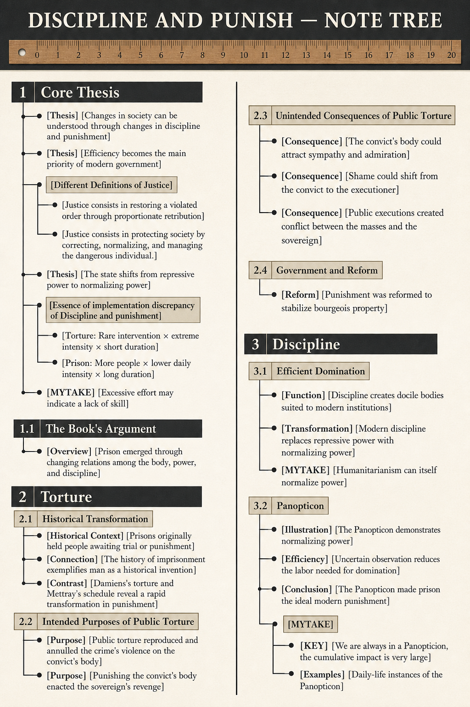
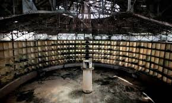

# Core Thesis

- [Thesis] [Changes in society can be understood through changes in discipline and punishment]

- [Thesis] [Efficiency becomes the main priority of modern government] The new main axiom of government and society is efficiency, which revolves around Foucault’s idea that knowledge is power. Whereas before it used to be 'demonstration of sovereignty'. The event that marks the division between modern state and pre-modern state is the French Revolution.

- [Different Definitions of Justice] My interpretation is that these different definitions of justice are downstream of efficiency/demonstration of sovereignty.
- - [Justice consists in restoring a violated order through proportionate retribution] For example torture
- - [Justice consists in protecting society by correcting, normalizing, and managing the dangerous individual.]

- [Thesis] [The state shifts from repressive power to normalizing power] A consequence of the previous ideas is that the state will use normalizing power instead of repressive power.

- [Essence of implementation discrepancy of Discipline and punishment] 
- - [Torture: Rare intervention × extreme intensity × short duration]
- - [Prison: More people × lower daily intensity × long duration]

- [MYTAKE] [Excessive effort may indicate a lack of skill] I remember my father once telling me that excessive effort is a sign of a lack of skill, which is a common sense idea. But we can apply that idea to evaluate how governments discipline and punish their citizens.

## The Book's Argument

- [Overview] [Prison emerged through changing relations among the body, power, and discipline] The book analyzes the social and theoretical mechanisms behind changes in Western penal systems during the modern age, based on historical documents from France. Foucault argues that prison did not become the principal form of punishment merely because of reformers’ humanitarian concerns. He traces the cultural shifts that led to the predominance of prison through the body and power. Prison is used by the “disciplines”—new technologies of power also found in schools, hospitals, and military barracks.

# Torture

## Historical Transformation

- [Historical Context] [Prisons originally held people awaiting trial or punishment] From the Middle Ages through the sixteenth and seventeenth centuries in Europe, imprisonment was rarely used as a punishment in its own right. Prisons mainly held people awaiting trial and convicts awaiting punishment.

- [Connection] [The history of imprisonment exemplifies man as a historical invention] This statement is one of the great examples of Foucault’s main theory that man is a historical invention. Because most of us would believe that prisions have existed forever, but Foucualt shows that they are a relatively recent invention. We always have the illusion that the premises of our time are eternal, but they are not. Foucault always shows that the premises of our time are not eternal, but rather a historical invention.

- [Contrast] [Damiens's torture and Mettray's schedule reveal a rapid transformation in punishment] Foucault begins by contrasting two forms of penalty: the violent and chaotic public torture of Robert-François Damiens, convicted of attempted regicide in the mid-eighteenth century, and the highly regimented daily schedule for inmates at the early-nineteenth-century prison of Mettray. These examples show how profoundly Western penal systems changed in less than a century. Foucault asks what caused these changes and how Western attitudes shifted so radically.

## Intended Purposes of Public Torture

- [Purpose] [Public torture reproduced and annulled the crime's violence on the convict's body] Torture reflected the violence of the original crime onto the convict’s body for everyone to see, manifesting and then annulling it by reciprocating the crime’s violence against the criminal.

- [Purpose] [Punishing the convict's body enacted the sovereign's revenge] Torture enacted revenge upon the convict’s body because the monarch had been injured by the crime. Foucault argues that the law was considered an extension of the sovereign’s body, so revenge had to take the form of harming the convict’s body; this personified the law.

## Unintended Consequences of Public Torture

- [Consequence] [The convict's body could attract sympathy and admiration] Public torture provided a forum in which the convict’s body became a focus of sympathy and admiration.

- [Consequence] [Shame could shift from the convict to the executioner] The executioner, rather than the convict, could become the focus of shame, redistributing blame.

- [Consequence] [Public executions created conflict between the masses and the sovereign] Torture created a site of conflict between the masses and the sovereign around the convict’s body. Foucault notes that public executions often led to riots supporting the prisoner. Frustration with the inefficiency of this economy of power could be directed toward and coalesce around the site of torture and execution.

## Government and Reform

- [Reform] [Punishment was reformed to stabilize bourgeois property] Punishment had to be reformed to allow greater stability of property for the bourgeoisie.

# Discipline

## Efficient Domination

- [Function] [Discipline creates docile bodies suited to modern institutions] Foucault argues that discipline creates “docile bodies” ideal for the economics, politics, and warfare of the modern industrial age—bodies that function in factories, ordered military regiments, and school classrooms.

- [Transformation] [Modern discipline replaces repressive power with normalizing power] Modern domination relies less on repressive power and more on normalizing power.

- [MYTAKE] [Humanitarianism can itself normalize power] One could argue that humanitarianism itself is part of the normalization of power: if the state is “human,” then it is good; if it is good, then I am more willing to follow its orders.

## Panopticon

- [Illustration] [The Panopticon demonstrates normalizing power] The Panopticon is a strong illustration of normalizing power because the mind is controlled completely by psychological stimuli rather than actual physical effort.

- [Efficiency] [Uncertain observation reduces the labor needed for domination] The Panopticon is very efficient because you do not know whether someone is watching, which reminds me of school, the teacher may or not care about what you are doing. Therefore, fewer “employees” are needed to dominate. If someone were visibly watching at all times, people would be overwhelmed. This supports Foucault’s view of the modernization of the state.

- [Conclusion] [The Panopticon made prison the ideal modern punishment] Prisons—especially those following the Panopticon’s model—provided the ideal form of modern punishment. Foucault argues that this is why generalized, “gentle” punishment through public work gangs gave way to prison. Prison represented the ideal modernization of punishment because it's more efficient, so its eventual dominance was natural.
- - [MYTAKE] It's kind of a genius idea in a way. You could be 'discipling' individuals with the cost of 0 people, because you don't need to have someone watching all the time. You just need to make people think that they are being watched all the time. This is a very efficient way of disciplining people.

- [KEY] [We are always in a Panopticion, the cumulative impact is very large] The Panopticon is a metaphor for modern society, where we are always being watched and judged. The cumulative impact of this constant surveillance is very large, as it shapes our behavior and internalizes discipline.

- [Examples] [Daily-life instances of the Panopticon] Foucault notes that the Panopticon is not merely a prison design but a model for modern society. Before the expansion of schools, hospitals, factories, offices, prisons, and barracks, much of life occurred in households, farms, small workshops, markets, churches, and local communities. People were certainly watched by relatives, neighbors, clergy, masters, and local authorities, but this observation was generally direct, personal, reciprocal, and intermittent: one could usually tell when an observer was present. Modern institutions make observation centralized, asymmetrical, documented, and potentially continuous. Students, patients, prisoners, and workers know that their attendance, conduct, performance, health, or productivity may be examined without knowing exactly when. Because they must behave as though observation is always possible, they internalize supervision and discipline themselves, allowing domination to operate continuously with less direct labor.