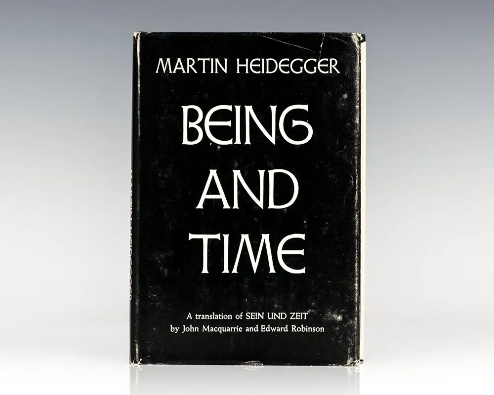
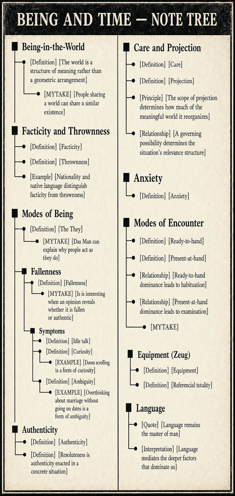

# Being-in-the-World

- [Definition] [The world is a structure of meaning rather than a geometric arrangement] Being-in-the-world understands the world not as a geometric disposition of objects, but through the meaning of each part of the world.

- - [MYTAKE] [People sharing a world can share a similar existence] I think this is very interesting. For example, in Vancouver, my friends and I at the timet had a very similar existence because we lived in the same spatial world and attached the same meanings to things: Panorama Ridge, visas, the same *Sorge* (concern), team onboarding, learning Azure, and the same meaning for things in general.

# Facticity and Thrownness

- [Definition] [Facticity] Facticity is the given conditions of your existence. Whether it is objective facts like your nationality, or the current meaning of things to you

- [Definition] [Thrownness] Thrownness is finding yourself already in those conditions.

- [Example] [Nationality and native language distinguish facticity from thrownness] Facticity: you are Brazilian, and Portuguese is your native language. Thrownness: you find yourself already Brazilian and Portuguese-speaking without having chosen your birth or first language.

# Modes of Being

- [Definition] [The They] *The They* (*Das Man*) is the anonymous social force that shapes our beliefs, values, and behaviors. It is the collective voice of society that tells us what is normal, acceptable, and desirable.

- - [MYTAKE] [Das Man can explain why people act as they do] For any person doing anything, if you ask, “Why did they do X?”, one answer is that they did X because *Das Man* expected it. It's one of the most common reason why anyone did anything.

## Fallenness

- [Definition] [Fallenness] Fallenness (*Verfallen*) is letting what *Das Man* defines as normal determine your goals and interpretations without personally examining and owning them.

- - [MYTAKE] [Is is interesting when an opinion reveals whether it is fallen or authentic] When talking with someone and hearing their opinion, I think the most interesting thing is determining whether they hold it because of fallenness or authenticity. Example when brazilians hate Argentina because *Das Man* says so, or when someone hates a political party because *Das Man* says so, or when someone hates a political party because they have personally examined and owned their opinion.

### Symptoms 
- [Definition] [Idle talk] Idle talk (*Gerede*) consists of speaking in clichés, unexamined opinions, or gossip.

- [Definition] [Curiosity] Curiosity (*Neugier*) is a superficial interest in things that does not lead to understanding.
- - [EXAMPLE] [Doom scrolling is a form of curiosity] Doom scrolling is a form of curiosity because it is a superficial interest in things that does not lead to understanding.

- [Definition] [Ambiguity] Ambiguity (*Zweideutigkeit*) is a lack of clarity about what is important, what to do, and what to expect.
- - [EXAMPLE] [Overthinking about marriage without going on dates is a form of ambiguity] Overthinking about marriage without going on dates is a form of ambiguity because it is a lack of clarity about what is important, what to do, and what to expect.

## Authenticity

- [Definition]  Authenticity (*Eigentlichkeit*) is the ability to take ownership of your own existence your world and to live in accordance with your own values and goals.

- [Definition] [Resoluteness is authenticity enacted in a concrete situation] Commit to a life project that reflects your own values. Take decisive, clear action even amid uncertainty. Do not be swayed by the anonymous voice of “the They” (*Das Man*).

# Care and Projection

- [Definition] [Care] Care (*Sorge*) is the structure of being that makes it possible to be concerned about the world and to have a meaningful existence

- [Definition] [Projection] Projection is understanding yourself through what you could become.

- [Principle] [The scope of projection determines how much of the meaningful world it reorganizes] Projection exists at every level; its scope determines how much of the meaningful world it reorganizes.

- [Relationship] [A governing possibility determines the situation's relevance structure] Governing possibility → relevance structure of the situation. For example, if you are a high school student, the governing possibility is which university you will attend, and that determines the relevance structure of your situation, if you go to Dartmouth instead of Pomona, then East Coast will be home, instead of West Coast, more academic will be your identity instead of relaxed, and so on.

# Anxiety

- [Definition] [Possibility of collapse in the network of meanings] Heideggerian anxiety occurs when the familiar network of meanings that normally tells me what matters and what to do loses its authority—not merely when I doubt one particular choice.

# Modes of Encounter
- [Definition] Ready-to-hand (*Zuhanden*) is the mode of encountering things as tools in use, where their significance is derived from their role in a meaningful context.

- [Definition]  Present-at-hand (*Vorhanden*) is the mode of encountering things as objects, where their significance is derived from their properties and relations.

- [Relationship] [Ready-to-hand dominance leads to habituation]

- [Relationship] [Present-at-hand dominance leads to examination]
- - [MYTAKE] This is very similar to the concept of mindfulness 

## Equipment (*Zeug*)

- [Definition] [Equipment] We engage with things as tools in use, not merely as objects.

- [Definition] [Referencial totality] Equipment is part of a referential totality, which is a network of meaning that gives the equipment its significance. In other words, the its meaning is downstream of the world.

# Language

- [Quote] [Language remains the master of man] “Man acts as though he were the shaper and master of language, while in fact language remains the master of man.”

- [Interpretation] [Language mediates the deeper factors that dominate us] Language is usually the medium through which deeper factors dominate us—not the independent master. Examples of dominant factors would be our family, country and what not.

Human being, in Heideggerian terms, can be formalized as care operating inside a disclosed world: Dasein always finds
  itself already thrown into facticity, public meanings, and practical involvements, while also projecting itself
  toward possible ways of being.

  The key variable is what governs care. When care is governed mainly by Das Man, unexamined facticity, and thrown
  meanings, Dasein falls into fallenness: it speaks through idle talk, seeks stimulation through curiosity, and lives
  in ambiguity, where things seem understood because public meanings are available but nothing is genuinely
  appropriated.

  The authentic route begins when anxiety weakens the authority of those inherited/public meanings and exposes Dasein
  to the fact that its life is its own to take up. Authenticity is care reorganized around owned projection: Das Man
  and facticity still condition life, but they no longer function as the primary source of meaning, action, and self-
  understanding.

  Resoluteness is authenticity enacted in a concrete situation: Dasein takes an owned possibility and acts through it
  under uncertainty, instead of waiting for public permission or perfect clarity.

  The modes of encounter describe how the world appears within this structure of care. In ready-to-hand encounter,
  things show up practically, as tools embedded in projects; in present-at-hand encounter, things show up
  theoretically, as objects with properties. A fallen life usually inherits these meanings passively from the public
  world, while an authentic life reappropriates them through owned projection

  IMPORTANT: Verfallen is the pull of everyday existence, he thinks we are for the most part, always already falling, LIKE A GRAVITATIONAL FORCE.

  Living as Das Man vs being-a self

  KEY Deciding factor: who is answerable for the choice? Is it your owned judgement, is it das man, is it the facticity, is it your autopilot?

resolve or owned decision

KEY OF LIFE: Gewissen-haben-wollen

Fallenness is being carried along—either by one’s everyday routines or by the anonymous norms of das Man—rather than owning one’s possibilities.

Eigenste Möglichkeit ("ownmost possibility") — the possibility that is authentically yours, as opposed to one handed to you by das Man. This is the key qualifier: not just any possibility counts, only the one you've made your own by facing it resolutely.

so Eigenste Möglichkeit  leaves out of falleness