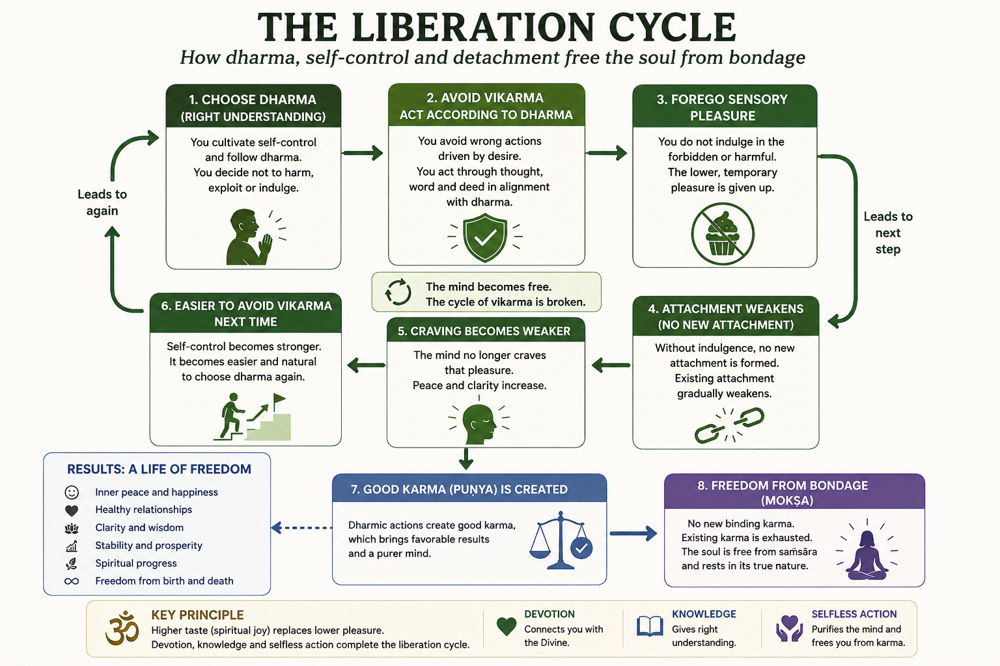

- [MYTAKE] From an Aristotelian perspective, devotion seems to cultivate a fuller set of virtues rather than one isolated trait.

[MYTAKE] Since spiritual truth is highly qualitative and non-objective, direct access to a realized sage is the most effective path.

Bondage Cycle: A self-reinforcing causal loop in which a response to pressure produces an immediate benefit that strengthens the tendency/capacity to repeat that response, while simultaneously generating latent costs that later create additional pressure for further responses.
	​

| Scope            | Pressure           | Response                    | Immediate benefit                  | Reinforcement                             | Latent cost                      |
| ---------------- | ------------------ | --------------------------- | ---------------------------------- | ----------------------------------------- | -------------------------------- |
| **Behavior**     | Work stress        | Eat                         | Relief                             | Food becomes coping mechanism             | Health/weight problems           |
| **Individual**   | Anxiety/insecurity | Seek status                 | Validation                         | Identity becomes status-dependent         | Competition, dissatisfaction     |
| **Relationship** | Fear of conflict   | Avoid discussion            | Immediate peace                    | Avoidance becomes normal                  | Resentment accumulates           |
| **Organization** | Falling revenue    | Cut R&D                     | Better quarterly numbers           | Cost-cutting rewarded                     | Weaker future products           |
| **Society**      | Crime              | Excessive punitive response | Perceived security                 | Punitive institutions expand              | Social alienation                |
| **State**        | Security threat    | Military intervention       | Threat reduced / political benefit | Intervention capacity/doctrine reinforced | Blowback, costs, new instability |
