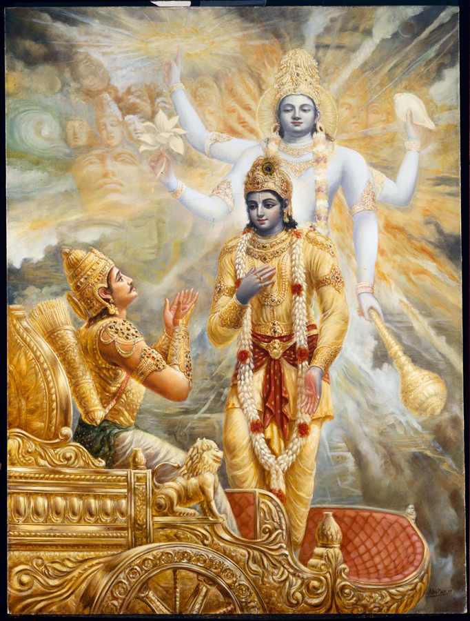
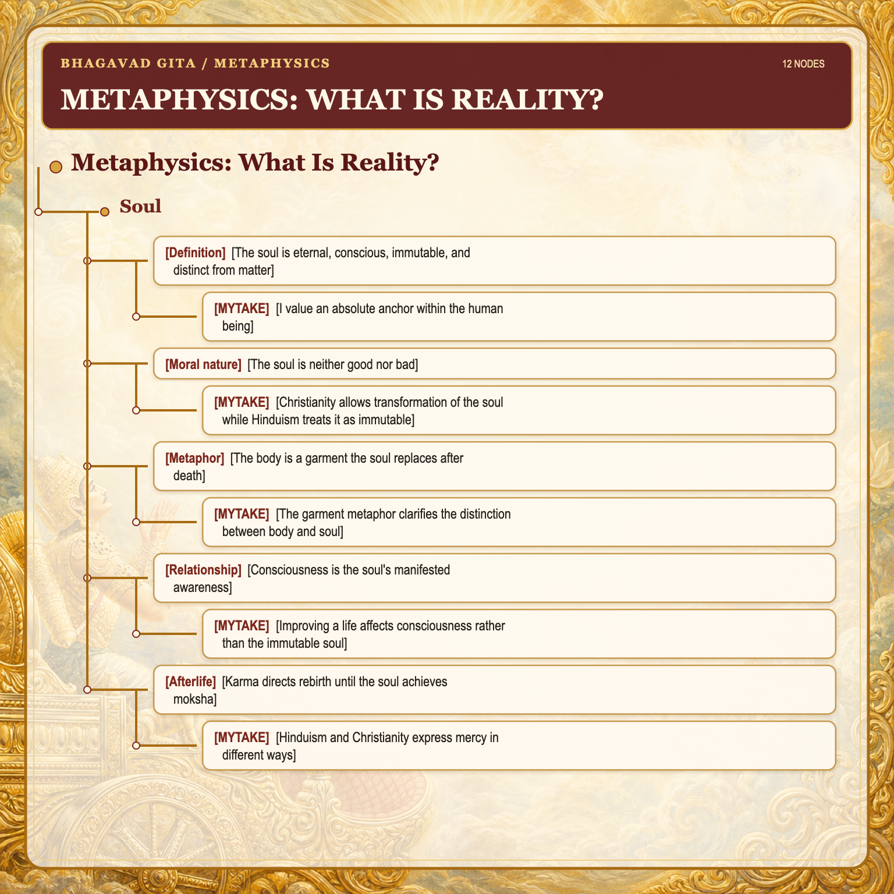
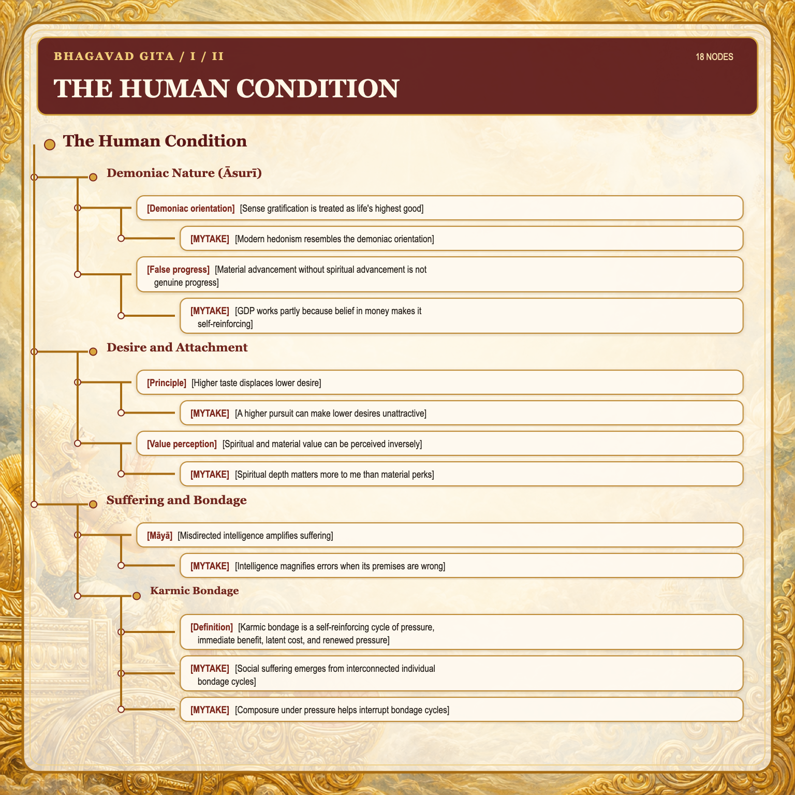
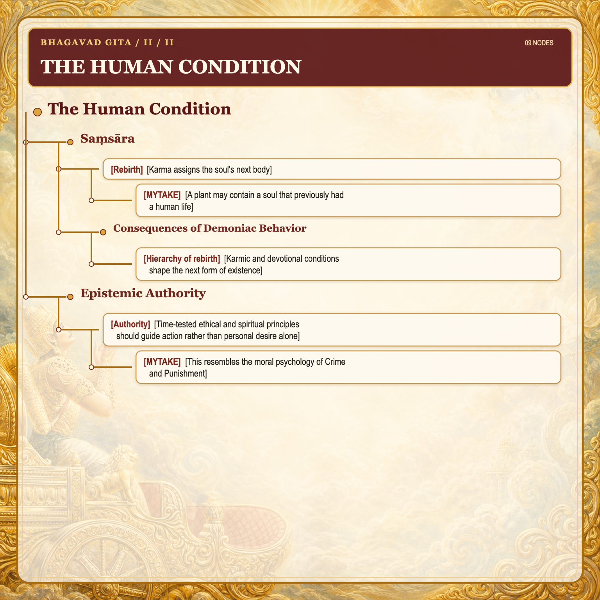
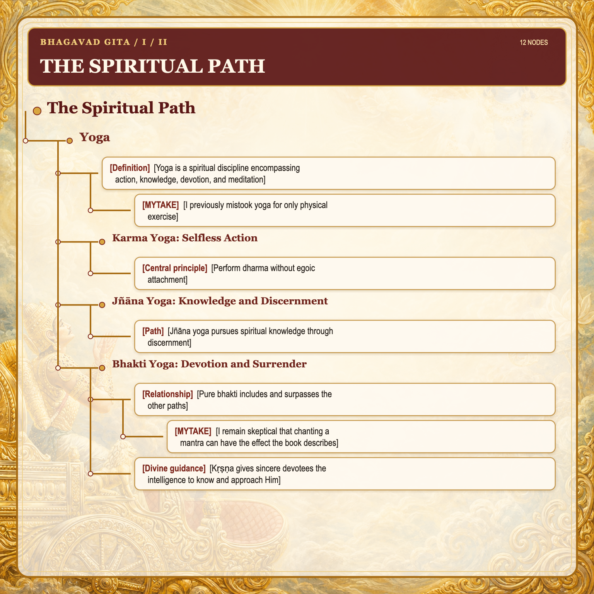
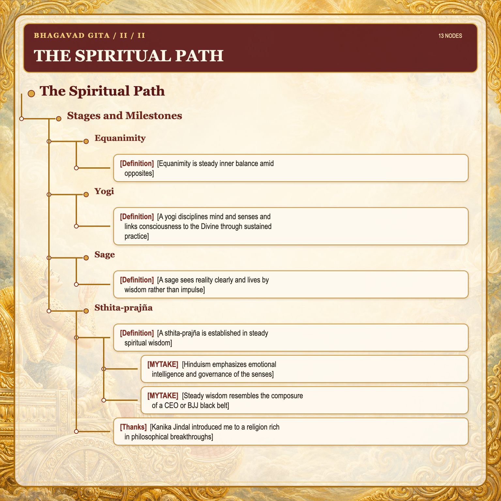
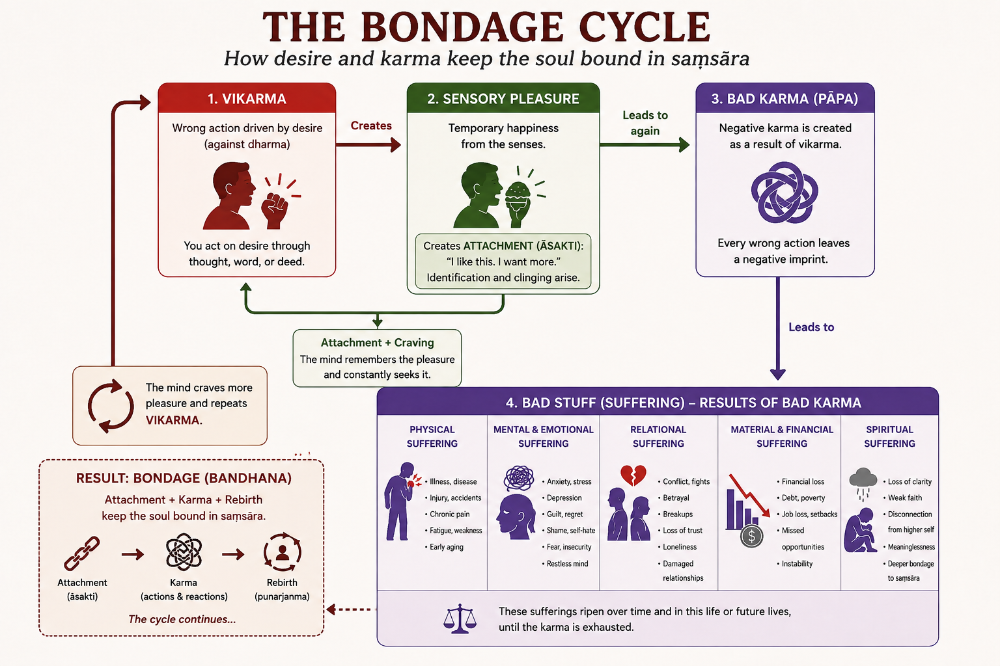

# Metaphysics: What Is Reality?

## Soul

- [Definition] [The soul is eternal, conscious, immutable, and distinct from matter] In Hinduism, the soul is the true self of every living being: the absolute core beneath the changing body and mind, untouched by decay, pleasure, pain, and death. Across lifetimes, the body and conditioning change, but the soul does not.
  - [MYTAKE] [I value an absolute anchor within the human being] Because so much in life is ephemeral, I value the search for an absolute human component. It makes me take the human being more seriously; otherwise, human existence can seem meaningless, like a wind that comes and goes.
- [Moral nature] [The soul is neither good nor bad] The soul (*ātman*) is intrinsically spiritual and pure. Moral corruption belongs to conditioned consciousness and action, not to the soul's essence: soul ≠ character.
  - [MYTAKE] [Christianity allows transformation of the soul while Hinduism treats it as immutable] In Christianity, the soul can be spiritually and morally transformed by sin, grace, and sanctification; after death, it is judged and sent to heaven or hell. In Hinduism, the soul itself is immutable. I cannot see a practical difference in how people live from these premises, but the metaphysical difference interests me.
- [Metaphor] [The body is a garment the soul replaces after death]
  - [MYTAKE] [The garment metaphor clarifies the distinction between body and soul]
- [Relationship] [Consciousness is the soul's manifested awareness] The soul (*ātman*) is the conscious self, while consciousness (*cetanā*) is its manifested awareness.
  - [MYTAKE] [Improving a life affects consciousness rather than the immutable soul] Improving someone's life does not affect their soul, but it does affect consciousness, the soul's manifested awareness. The impact is therefore not absolute, but it is more than merely material.
- [Afterlife] [Karma directs rebirth until the soul achieves moksha] The eternal soul continues after bodily death and is reborn according to its karma until liberation (*moksha*) ends the cycle of birth and death (*saṃsāra*).
  - [MYTAKE] [Hinduism and Christianity express mercy in different ways] Hinduism offers repeated chances through *saṃsāra*, although *moksha* is rarely reached in practice. Christianity offers one life, followed by permanent salvation or final damnation. I find it difficult to judge which is more merciful.

# The Human Condition

## Demoniac Nature (*Āsurī*)

- [Demoniac orientation] [Sense gratification is treated as life's highest good]
  - [MYTAKE] [Modern hedonism resembles the demoniac orientation] Expressive individualism and hedonism—especially the contemporary “cult of happiness” among young people—treat the senses as the source of truth and life's highest goal. Hinduism instead treats the senses as fallible references and pure consciousness as the source of truth.
- [False progress] [Material advancement without spiritual advancement is not genuine progress]
  - [MYTAKE] [GDP works partly because belief in money makes it self-reinforcing] People often assume GDP is a sound political and social indicator, although that is far from obvious. Its usefulness depends in part on widespread faith in money, making it a self-fulfilling measure.

## Desire and Attachment

- [Principle] [Higher taste displaces lower desire]
  - [MYTAKE] [A higher pursuit can make lower desires unattractive] While some of my friends focused on debauchery in their twenties, I studied mathematics. Because I had a higher taste, the lower desires did not appeal to me; similarly, truly seeing Kṛṣṇa makes materially lower desires unattractive.
- [Value perception] [Spiritual and material value can be perceived inversely]
  - [MYTAKE] [Spiritual depth matters more to me than material perks] At Microsoft headquarters, the Hindu religion and its account of ultimate reality interested me more than compensation and other worldly benefits, while some peers cared more about skiing and money. My experience illustrates an inverse perception of spiritual and material value.

## Suffering and Bondage

- [Māyā] [Misdirected intelligence amplifies suffering]
  - [MYTAKE] [Intelligence magnifies errors when its premises are wrong] Intelligence helps only when guided by sound premises. Without emotional intelligence, someone may pursue more money despite already having plenty and neglect their family, producing suffering for themselves and others.

### Karmic Bondage

- [Definition] [Karmic bondage is a self-reinforcing cycle of pressure, immediate benefit, latent cost, and renewed pressure] A response to pressure creates an immediate benefit that strengthens the tendency or capacity to repeat it, while also generating latent costs that later produce further pressure.

- [MYTAKE] [Social suffering emerges from interconnected individual bondage cycles] In Caruaru, unstable families, absent father figures, debauchery, lack of meaningful work, and weak economic planning reinforce one another. Punishing debauched youth alone cannot solve this network; meaningful projects, stable families, and supportive social conditions are also needed. A single bondage cycle may cause limited harm, but the aggregation of 400,000 people's cycles creates extensive suffering.
- [MYTAKE] [Composure under pressure helps interrupt bondage cycles] Composure makes a considered response possible in place of a reactive one. In this sense, Brazilian jiu-jitsu can contribute to a good life because it trains composure under pressure.

## Saṃsāra

- [Rebirth] [Karma assigns the soul's next body]
  - [MYTAKE] [A plant may contain a soul that previously had a human life] This possibility changes how I see plants.

### Consequences of Demoniac Behavior

- [Hierarchy of rebirth] [Karmic and devotional conditions shape the next form of existence]

| Type of birth | Relative status | Typical experience | What leads there |
| --- | --- | --- | --- |
| **Liberated soul** (beyond *saṃsāra*) | Highest | Eternal existence, knowledge, and bliss; no rebirth | Pure devotion (*bhakti*) and complete surrender to Kṛṣṇa |
| **Celestial being (*deva*)** | Very high | Long life, refined pleasures, and higher intelligence | Great piety (*puṇya*), charity, sacrifice, self-control, and virtue, often mixed with desire for heavenly enjoyment |
| **Human** | High; best for liberation | A mixture of pleasure and suffering, with the greatest freedom to choose | Mixed karma and sufficient piety and consciousness to receive a human birth |
| **Higher animals** | Medium | Limited reasoning and instinct-driven life | Mixed karma dominated by ignorance or attachment |
| **Ordinary animals** | Lower | Survival, fear, and instinct | Strong ignorance (*tamas*), violence, and uncontrolled desires |
| **Plants and trees** | Very low | Minimal awareness and highly restricted activity | Heavy tamasic karma and deep unconsciousness |
| **Hellish conditions** (temporary) | Lowest experience | Intense suffering before another rebirth | Extremely harmful karma, such as cruelty, severe violence, or exploitation |

## Epistemic Authority

- [Authority] [Time-tested ethical and spiritual principles should guide action rather than personal desire alone]
  - [MYTAKE] [This resembles the moral psychology of *Crime and Punishment*] It evokes the long-term optimization of good emotions.

# The Spiritual Path

## Yoga

- [Definition] [Yoga is a spiritual discipline encompassing action, knowledge, devotion, and meditation]
  - [MYTAKE] [I previously mistook yoga for only physical exercise]

### Karma Yoga: Selfless Action

- [Central principle] [Perform *dharma* without egoic attachment]

### Jñāna Yoga: Knowledge and Discernment

- [Path] [Jñāna yoga pursues spiritual knowledge through discernment]

### Bhakti Yoga: Devotion and Surrender

- [Relationship] [Pure *bhakti* includes and surpasses the other paths]
  - [MYTAKE] [I remain skeptical that chanting a mantra can have the effect the book describes]
- [Divine guidance] [Kṛṣṇa gives sincere devotees the intelligence to know and approach Him]

## Stages and Milestones

### Equanimity

- [Definition] [Equanimity is steady inner balance amid opposites] It is the ability to act without being emotionally destabilized by success and failure, pleasure and pain, or praise and blame.

### Yogi

- [Definition] [A yogi disciplines mind and senses and links consciousness to the Divine through sustained practice]

### Sage

- [Definition] [A sage sees reality clearly and lives by wisdom rather than impulse]

### Sthita-prajña

- [Definition] [A *sthita-prajña* is established in steady spiritual wisdom] Such a person is free from restless desires and stable in devotion.
  - [MYTAKE] [Hinduism emphasizes emotional intelligence and governance of the senses] Many life philosophies rationalize desire and impulse even when these create suffering. I appreciate Hinduism's emphasis on governing the senses rather than merely suppressing them.
  - [MYTAKE] [Steady wisdom resembles the composure of a CEO or BJJ black belt] Each must remain composed under intense pressure.

- [Thanks] [Kanika Jindal introduced me to a religion rich in philosophical breakthroughs] I will always be grateful to her.
