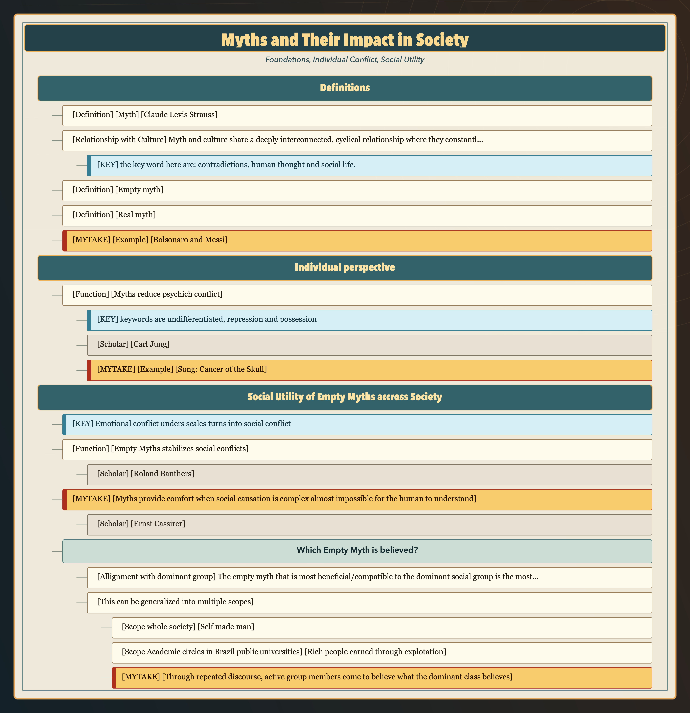
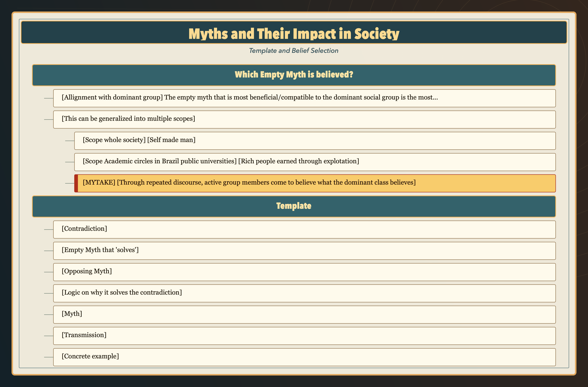
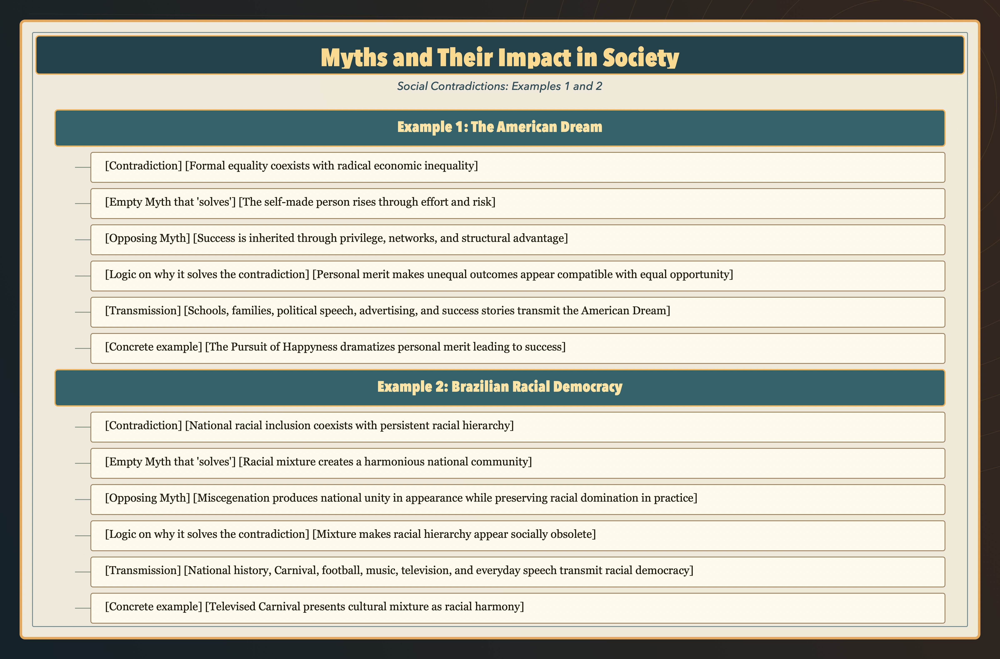
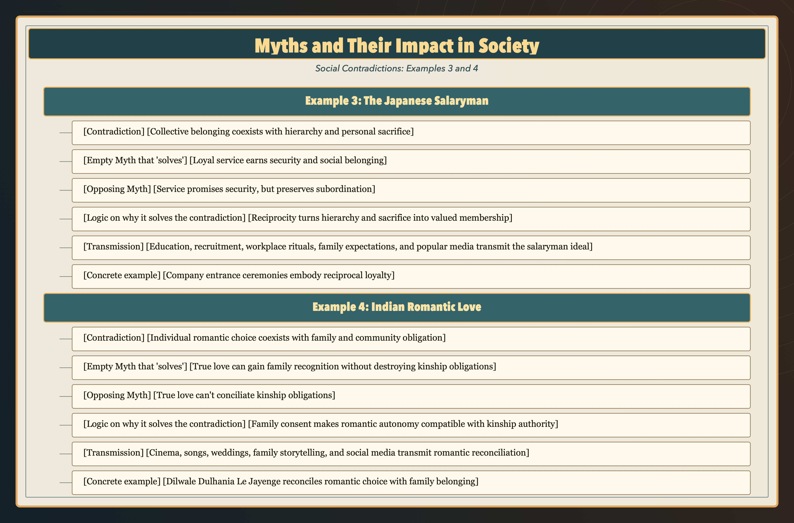

# Definitions
- [Definition] [Myth] [Claude Levis Strauss] [Mediates fundamental contradictions not resolution] A myth is a symbolic narrative whose function is to mediate fundamental contradictions in human thought and social life, translating oppositions such as nature/culture, life/death, raw/cooked, or kinship/desire into a structured story that makes them thinkable without literally resolving them.
- [Relationship with Culture] [Myth serves as the symbolic blueprint of a culture] Myth and culture share a deeply interconnected, cyclical relationship where they constantly shape and mirror each other. Myth serves as the symbolic blueprint of a culture, while culture provides the living context that keeps myths relevant.
- - [KEYWORDS] [Contradictions, social life] 
- [Definition] [Empty myth] [Doesn't solve contradiction] This is a myth that doesn't solve any contradiction, even though it states that it did so.
- [Definition] [Real myth] [Solves contradiction] This is a myth actually solves a real contradiction.
- [MYTAKE] [Example] [Bolsonaro and Messi] Bolsonaro is a myth intended to solve the contradiction between the Brazilian potential, and its unfulfillement. Messi is a myth intended to solve the Argentinian football potential, and its unfulfillement. One is a Real myth, it solved the contradiction, and the other is a Empty Myth, it didn't solve the contradiction.

# Individual perspective
- [Function] [Myths reduce psychich conflict] Unconscious conflict produces overwhelming, undifferentiated affect. Myth converts it into differentiated symbolic experience, allowing consciousness to relate to it without either repressing it completely or being possessed by it
- - [KEYWORDS] [undifferentiated, repression and possession]
- - [Scholar] [Carl Jung] Symbols of Transformation (1912; substantially revised in 1952)
- - [MYTAKE] [Example] [Song: Cancer of the Skull] You are able to see your internal contradictions/conflicts from a distance. One example that I really like is Cancer of the Skull, because it shows the internal conflict of a person who aspires for a certain type of greatness but doesn't have the talent to achieve it. I myself have this same conflict, and relate a lot in the song.

# Social Utility of Empty Myths accross Society

- [KEY] [Emotional conflict unders scales turns into social conflict]
- [Function] [Empty Myths stabilizes social conflicts] The relevant contradiction is not a harmless inconsistency, such as liking both warm and cold food. It is an experienced conflict, such as believing that people are equal while seeing one person possess extraordinary wealth and another possess nothing.
- - [Scholar] [Roland Banthers] Mythologies, 1968
- [MYTAKE] [Myths provide comfort when social causation is complex almost impossible for the human to understand] When thinking how to approach social inequality. We can see from so many angles, and change is frightening Economic outcomes can arise from work, disciplined investment, if nothing is done social inequality continues, if you try to make a revolution, people will probably get killed, but thinking long term it might be worth it, but only if the revolution succeeds, it's hard to test prepare a revolution that has empirical proof that it will succeed, and if it fails. If you try to do through social democratic manners, it might take forever and since the bourgeoisie is so powerful, it might never happen because they can always elect a fascist and overdo everything you did. Social inequality impacts so many people, criminality, bad health due to bad education, people get addicted to drugs because they didn't receive a good education. Given this complexity of this issue, it might be easier to just believe that free market is the best answer but it never solves the problem because not enough people believe in it.
- - [Scholar] [Ernst Cassirer]

## Which Empty Myth is believed?
-  [Allignment with dominant group] The empty myth that is most beneficial/compatible to the dominant social group is the most believed under a specific group of people
- [This can be generalized into multiple scopes] 
- - [Scope whole society] [Self made man] The myth of the self-made man is most beneficial to the dominant social group because it legitimizes economic inequality as a natural outcome of individual effort, rather than as a result of structural advantage or inherited privilege.
- - [Scope Academic circles in Brazil public universities] [Rich people earned through explotation] This myth is more compatible the incentives of the dominant social group in the university, since it's publicly funded, and the more the myth is believed, the more wealth will be taken away from the rich and spread to the public institutions
- - [MYTAKE] [Through repeated discourse, active group members come to believe what the dominant class believes]

# Social Contradictions and Their Solving Myths

## Template
- [Contradiction]
- [Empty Myth that 'solves']
- [Opposing Myth]
- [Logic on why it solves the contradiction]
- [Myth]
- [Transmission]
- [Concrete example of transmission]

## Example 1: The American Dream

- [Contradiction] [Formal equality coexists with radical economic inequality] Americans are considered equal even though they occupy radically unequal economic positions.
- [Empty Myth that 'solves'] [The self-made person rises through effort and risk] The American Dream narrates economic ascent as the result of individual work, initiative, and willingness to take risks.
- [Opposing Myth] [Success is inherited through privilege, networks, and structural advantage] Including the fatal outline theory of expecation of Pierre Bourdieu
- [Logic on why it solves the contradiction] [Personal merit makes unequal outcomes appear compatible with equal opportunity] The myth of the self-made person reconciles formal equality with economic inequality by portraying success as a matter of personal merit rather than structural advantage. It suggests that anyone can prosper through hard work, thereby legitimizing existing disparities as the natural outcome of individual effort.
- [Transmission] [Schools, families, political speech, advertising, and success stories transmit the American Dream] The myth is passed through lessons about national history, parental advice about hard work, political promises of opportunity, advertising that associates consumption with achievement, biographies of entrepreneurs and celebrities, and films or sports stories in which perseverance produces upward mobility.
- [Concrete example] [The Pursuit of Happyness dramatizes personal merit leading to success] The film portrays a struggling salesman who overcomes homelessness and secures a career in finance through determination and hard work, embodying the myth of personal merit as the route to prosperity.

## Example 2: Brazilian Racial Democracy

- [Contradiction] [National racial inclusion coexists with persistent racial hierarchy] Brazil presents itself as a society formed through racial mixture and shared national belonging, yet race remains strongly associated with unequal income, status, exposure to violence, and access to opportunity.
- [Empty Myth that 'solves'] [Racial mixture creates a harmonious national community] Racial democracy narrates Brazil's mixed population and shared cultural life as evidence that racial divisions have been overcome.
- [Opposing Myth] [Miscegenation produces national unity in appearance while preserving racial domination in practice]
- [Logic on why it solves the contradiction] [Mixture makes racial hierarchy appear socially obsolete] The myth reconciles national inclusion with persistent racial hierarchy by treating mixture and everyday sociability as proof that race no longer structures Brazilian society. Inequalities can therefore be explained as isolated prejudice or class difference rather than as evidence of a racial system, preserving the image of one integrated people.
- [Transmission] [National history, Carnival, football, music, television, and everyday speech transmit racial democracy] The myth is passed through accounts of Brazil as a successfully mixed nation, public celebrations presenting diverse groups as one people, nationally shared forms such as samba and football, television narratives of conviviality, and everyday claims that Brazilians are too mixed for racial division.
- [Concrete example] [Televised Carnival presents cultural mixture as racial harmony] National Carnival broadcasts bring performers of different racial backgrounds together under samba-school and Brazilian symbols, presenting mixture and collective celebration as a concrete image of racial harmony even while racial inequalities persist outside the spectacle.

## Example 3: The Japanese Salaryman

- [Contradiction] [Collective belonging coexists with hierarchy and personal sacrifice] Japanese corporate culture can emphasize group harmony and membership while placing workers within steep hierarchies and demanding long hours, obedience, and sacrifices in family or personal life.
- [Empty Myth that 'solves'] [Loyal service earns security and social belonging] The salaryman ideal portrays discipline, endurance, and commitment to the company as a meaningful exchange for recognition, stability, and membership.
- [Opposing Myth] [Service promises security, but preserves subordination]
- [Logic on why it solves the contradiction] [Reciprocity turns hierarchy and sacrifice into valued membership] The myth reconciles collective belonging with hierarchy by presenting unequal authority and personal hardship as parts of a reciprocal relationship. The employee gives loyalty and labour, while the company supposedly provides identity, protection, advancement, and long-term security.
- [Transmission] [Education, recruitment, workplace rituals, family expectations, and popular media transmit the salaryman ideal] The myth is passed through schools that prepare students for organizational life, competitive recruitment, induction ceremonies, after-work socializing, stories of parental sacrifice, and television dramas, manga, and advertising portraying the dependable company employee as a respectable adult.
- [Concrete example] [Company entrance ceremonies embody reciprocal loyalty] Formal speeches, matching suits, and pledges present newly hired graduates as members of a collective mission: recruits offer loyalty and discipline while the organization promises identity, development, and a secure place in adult society.

## Example 4: Indian Romantic Love

- [Contradiction] [Individual romantic choice coexists with family and community obligation] Contemporary Indian culture celebrates romantic love while marriage can remain shaped by family expectations, caste, religion, class, and obligations to a wider kinship group.
- [Empty Myth that 'solves'] [True love can gain family recognition without destroying kinship obligations] The Bollywood romantic ideal portrays sincere love as capable of overcoming opposition while preserving the couple's relationship with the family.
- [Opposing Myth] [True love can't conciliate kinship obligations]
- [Logic on why it solves the contradiction] [Family consent makes romantic autonomy compatible with kinship authority] The myth turns family resistance into a test of the couple's sincerity rather than an irreconcilable conflict. When perseverance and moral conduct win parental consent, romantic choice is affirmed without requiring permanent rejection of the family.
- [Transmission] [Cinema, songs, weddings, family storytelling, and social media transmit romantic reconciliation] The myth is passed through Bollywood films and songs, wedding performances, family stories about courtship and marriage, celebrity romances, and social-media narratives in which couples prove their love while seeking familial blessing.
- [Concrete example] [Dilwale Dulhania Le Jayenge reconciles romantic choice with family belonging] Raj and Simran's romantic choice conflicts with her father's arranged plans. Raj refuses simply to elope and instead seeks the family's approval, embodying the myth that true love can prevail while preserving kinship bonds.
