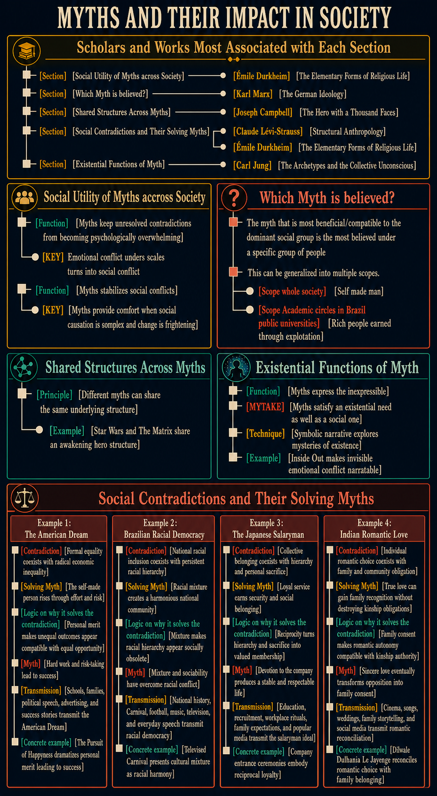

# Scholars and Works Most Associated with Each Section

- [Section] [Social Utility of Myths across Society] [Émile Durkheim] [The Elementary Forms of Religious Life] This section fits Durkheim most closely because it treats myth as a social institution that stabilizes collective life, channels contradiction, and maintains emotional equilibrium.
- [Section] [Which Myth is believed?] [Karl Marx] [The German Ideology] The claim that the dominant myth is the one most useful to the ruling class aligns with Marx's account of ideology and the material interests of dominant groups.
- [Section] [Shared Structures Across Myths] [Joseph Campbell] [The Hero with a Thousand Faces] The emphasis on recurring mythic patterns and universal structures is closest to Campbell's theory of archetypal hero narratives.
- [Section] [Social Contradictions and Their Solving Myths] [Claude Lévi-Strauss] [Structural Anthropology] and also [Émile Durkheim] [The Elementary Forms of Religious Life] This section is broader than social inequality: it concerns any hard social contradiction—such as sacred/profane, nature/culture, order/chaos, or life/death—that myth resolves by giving the conflict a symbolic and narratively intelligible form.
- [Section] [Existential Functions of Myth] [Carl Jung] [The Archetypes and the Collective Unconscious] The emphasis on myths as symbolic forms for inexpressible emotional and existential experiences fits Jung particularly well.

# Social Utility of Myths accross Society

- [Function] [Myths keep unresolved contradictions from becoming psychologically overwhelming] By transforming contradictions and existential problems into characters, symbols, and stories, myths give people a concrete form through which to experience and think about conflicts that cannot be fully resolved. In this sense, myths prevent people from going crazy: they make otherwise intolerable tensions narratable and psychologically manageable.
- [KEY] Emotional conflict unders scales turns into social conflict
- [Function] [Myths stabilizes social conflicts] The relevant contradiction is not a harmless inconsistency, such as liking both warm and cold food. It is an experienced conflict, such as believing that people are equal while seeing one person possess extraordinary wealth and another possess nothing.
- [KEY] [Myths provide comfort when social causation is complex and change is frightening] Economic outcomes can arise from work, disciplined investment, inheritance, luck, skill, and structural advantage in combinations that are difficult to disentangle. Correcting injustice may require slow reform or frightening conflict against groups that defend their advantages, so myths provide a simpler and more comforting answer.

# Which Myth is believed?
- The myth that is most beneficial/compatible to the dominant social group is the most believed under a specific group of people
- This can be generalized into multiple scopes. 
- - [Scope whole society] [Self made man] The myth of the self-made man is most beneficial to the dominant social group because it legitimizes economic inequality as a natural outcome of individual effort, rather than as a result of structural advantage or inherited privilege.
- - [Scope Academic circles in Brazil public universities] [Rich people earned through explotation] This myth is more compatible the incentives of the dominant social group in the university, since it's publicly funded, and the more the myth is believed, the more wealth will be taken away from the rich and spread to the public institutions

# Shared Structures Across Myths

- [Principle] [Different myths can share the same underlying structure] Although myths vary greatly, they can express the same underlying structure.
  - [Example] [Star Wars and The Matrix share an awakening hero structure] *Star Wars* and *The Matrix* differ in setting and imagery, but both center on an apparently ordinary young man who discovers a hidden reality, receives guidance from an older mentor, joins a struggle against an oppressive system, and assumes an exceptional role that transforms both himself and his community.

# Existential Functions of Myth

- [Function] [Myths express the inexpressible] Myths address existential questions and human dilemmas that cannot easily be explained or resolved in literal terms.
  - [MYTAKE] [Myths satisfy an existential need as well as a social one] Myths do more than explain social structures; they also give form to private emotions and existential experiences.
  - [Technique] [Symbolic narrative explores mysteries of existence] Myths use symbolic language and narrative to explore the mysteries of existence.
  - [Example] [Inside Out makes invisible emotional conflict narratable] *Inside Out* transforms a child's internal emotional life into characters, places, and journeys. By personifying Joy, Sadness, Fear, Anger, and Disgust, the film gives visible narrative form to grief, emotional ambivalence, and the loss involved in growing up.

# Social Contradictions and Their Solving Myths

## Example 1: The American Dream

- [Contradiction] [Formal equality coexists with radical economic inequality] Americans are considered equal even though they occupy radically unequal economic positions.
- [Solving Myth] [The self-made person rises through effort and risk] The American Dream narrates economic ascent as the result of individual work, initiative, and willingness to take risks.
- [Logic on why it solves the contradiction] [Personal merit makes unequal outcomes appear compatible with equal opportunity] The myth of the self-made person reconciles formal equality with economic inequality by portraying success as a matter of personal merit rather than structural advantage. It suggests that anyone can prosper through hard work, thereby legitimizing existing disparities as the natural outcome of individual effort.
- [Myth] [Hard work and risk-taking lead to success] The American Dream myth narrates that diligent, enterprising, and risk-taking people will achieve upward mobility and prosperity.
- [Transmission] [Schools, families, political speech, advertising, and success stories transmit the American Dream] The myth is passed through lessons about national history, parental advice about hard work, political promises of opportunity, advertising that associates consumption with achievement, biographies of entrepreneurs and celebrities, and films or sports stories in which perseverance produces upward mobility.
- [Concrete example] [The Pursuit of Happyness dramatizes personal merit leading to success] The film portrays a struggling salesman who overcomes homelessness and secures a career in finance through determination and hard work, embodying the myth of personal merit as the route to prosperity.

## Example 2: Brazilian Racial Democracy

- [Contradiction] [National racial inclusion coexists with persistent racial hierarchy] Brazil presents itself as a society formed through racial mixture and shared national belonging, yet race remains strongly associated with unequal income, status, exposure to violence, and access to opportunity.
- [Solving Myth] [Racial mixture creates a harmonious national community] Racial democracy narrates Brazil's mixed population and shared cultural life as evidence that racial divisions have been overcome.
- [Logic on why it solves the contradiction] [Mixture makes racial hierarchy appear socially obsolete] The myth reconciles national inclusion with persistent racial hierarchy by treating mixture and everyday sociability as proof that race no longer structures Brazilian society. Inequalities can therefore be explained as isolated prejudice or class difference rather than as evidence of a racial system, preserving the image of one integrated people.
- [Myth] [Mixture and sociability have overcome racial conflict] The myth of racial democracy narrates Brazil's racial mixture as the foundation of a harmonious national community.
- [Transmission] [National history, Carnival, football, music, television, and everyday speech transmit racial democracy] The myth is passed through accounts of Brazil as a successfully mixed nation, public celebrations presenting diverse groups as one people, nationally shared forms such as samba and football, television narratives of conviviality, and everyday claims that Brazilians are too mixed for racial division.
- [Concrete example] [Televised Carnival presents cultural mixture as racial harmony] National Carnival broadcasts bring performers of different racial backgrounds together under samba-school and Brazilian symbols, presenting mixture and collective celebration as a concrete image of racial harmony even while racial inequalities persist outside the spectacle.

## Example 3: The Japanese Salaryman

- [Contradiction] [Collective belonging coexists with hierarchy and personal sacrifice] Japanese corporate culture can emphasize group harmony and membership while placing workers within steep hierarchies and demanding long hours, obedience, and sacrifices in family or personal life.
- [Solving Myth] [Loyal service earns security and social belonging] The salaryman ideal portrays discipline, endurance, and commitment to the company as a meaningful exchange for recognition, stability, and membership.
- [Logic on why it solves the contradiction] [Reciprocity turns hierarchy and sacrifice into valued membership] The myth reconciles collective belonging with hierarchy by presenting unequal authority and personal hardship as parts of a reciprocal relationship. The employee gives loyalty and labour, while the company supposedly provides identity, protection, advancement, and long-term security.
- [Myth] [Devotion to the company produces a stable and respectable life] The salaryman myth narrates organizational loyalty as the path to adulthood, social recognition, material security, and belonging.
- [Transmission] [Education, recruitment, workplace rituals, family expectations, and popular media transmit the salaryman ideal] The myth is passed through schools that prepare students for organizational life, competitive recruitment, induction ceremonies, after-work socializing, stories of parental sacrifice, and television dramas, manga, and advertising portraying the dependable company employee as a respectable adult.
- [Concrete example] [Company entrance ceremonies embody reciprocal loyalty] Formal speeches, matching suits, and pledges present newly hired graduates as members of a collective mission: recruits offer loyalty and discipline while the organization promises identity, development, and a secure place in adult society.

## Example 4: Indian Romantic Love

- [Contradiction] [Individual romantic choice coexists with family and community obligation] Contemporary Indian culture celebrates romantic love while marriage can remain shaped by family expectations, caste, religion, class, and obligations to a wider kinship group.
- [Solving Myth] [True love can gain family recognition without destroying kinship obligations] The Bollywood romantic ideal portrays sincere love as capable of overcoming opposition while preserving the couple's relationship with the family.
- [Logic on why it solves the contradiction] [Family consent makes romantic autonomy compatible with kinship authority] The myth turns family resistance into a test of the couple's sincerity rather than an irreconcilable conflict. When perseverance and moral conduct win parental consent, romantic choice is affirmed without requiring permanent rejection of the family.
- [Myth] [Sincere love eventually transforms opposition into family consent] The romantic myth narrates personal choice and family belonging as ultimately compatible when the couple proves the authenticity of its love.
- [Transmission] [Cinema, songs, weddings, family storytelling, and social media transmit romantic reconciliation] The myth is passed through Bollywood films and songs, wedding performances, family stories about courtship and marriage, celebrity romances, and social-media narratives in which couples prove their love while seeking familial blessing.
- [Concrete example] [Dilwale Dulhania Le Jayenge reconciles romantic choice with family belonging] Raj and Simran's romantic choice conflicts with her father's arranged plans. Raj refuses simply to elope and instead seeks the family's approval, embodying the myth that true love can prevail while preserving kinship bonds.
