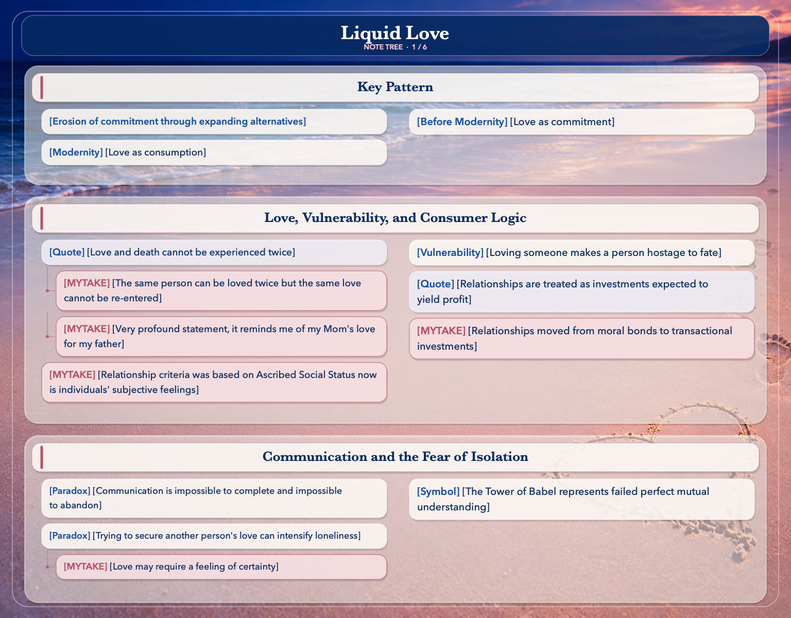
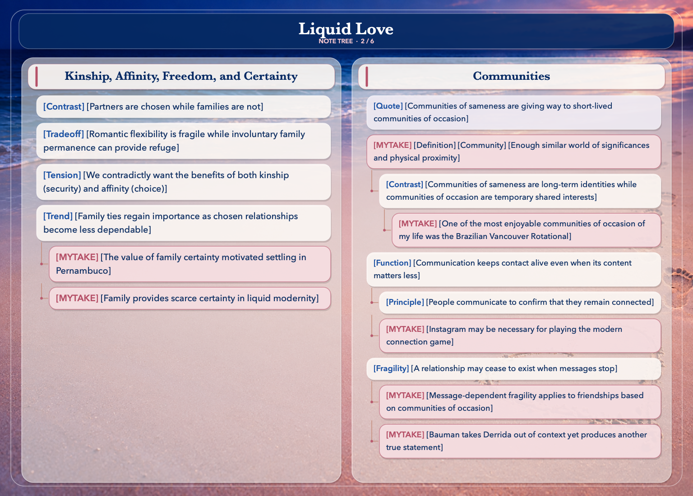
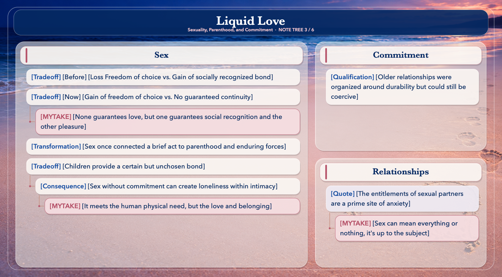
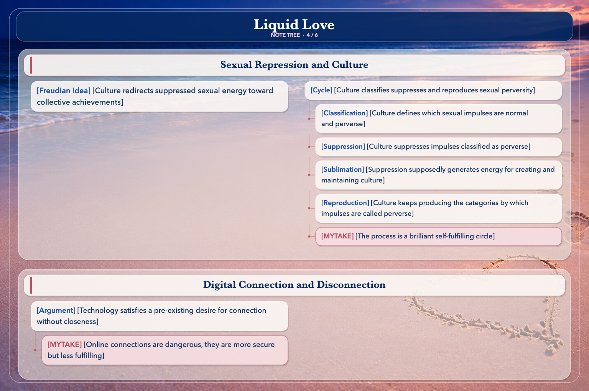
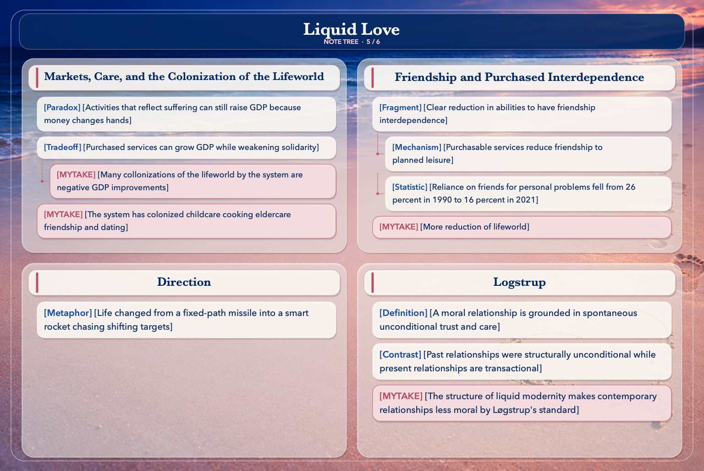
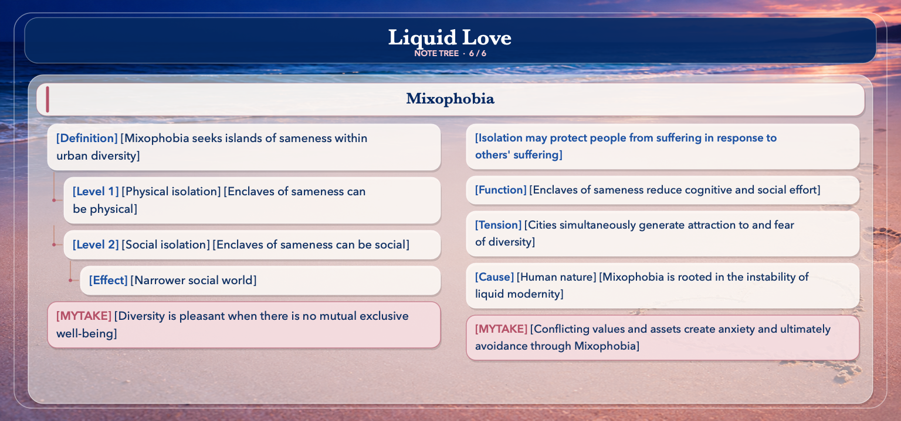
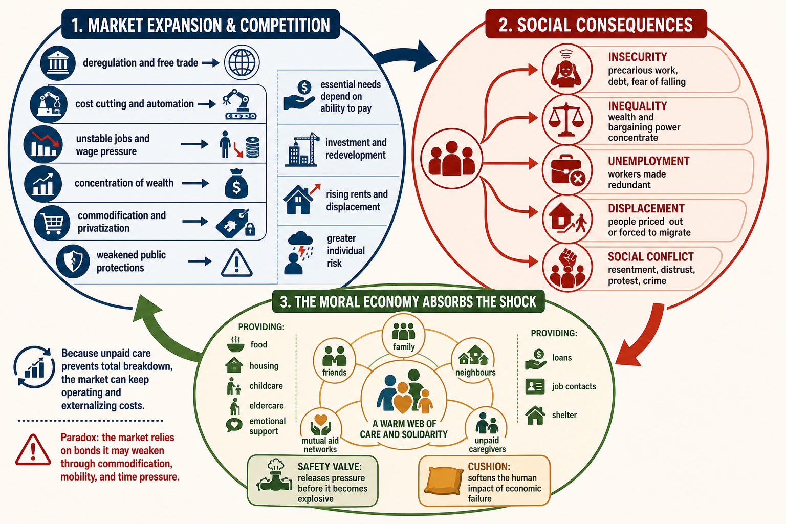

# Key Pattern
- [Erosion of commitment through expanding alternatives] More alternatives → more switching → less predictability → lower investiment in commitment.
- [Before Modernity] [Love as commitment] “Your well-being matters to me, even when caring for you is difficult.”
- [Modernity] [Love as consumption] “Your well-being matters insofar as this relationship makes me feel good.”

# Love, Vulnerability, and Consumer Logic

- [Quote] [Love and death cannot be experienced twice] “Neither love nor death can be entered twice; even less so than Heraclitus’ river.”
  - [MYTAKE] [The same person can be loved twice but the same love cannot be re-entered] This is a very strong statement, but in theory you can fall in love for the same person twice, but you can't enter the same love twice I suppose.
  - [MYTAKE] [Very profound statement, it reminds me of my Mom's love for my father]
- [Vulnerability] [Loving someone makes a person hostage to fate] When you love someone you become A “hostage to fate” is something precious whose well-being now depends partly on chance. Once you love someone, their illness, loss, rejection, or suffering can deeply wound you. You have effectively handed fate a way to hurt you.
- [Quote] [Relationships are treated as investments expected to yield profit] “A relationship, the expert will tell you, is an investment like all the others: you put in time, money, efforts that you could have turned to other aims but did not, hoping that you were doing the right thing and that what you’ve lost or refrained from otherwise enjoying would be in due course repaid – with profit.”
- [MYTAKE] [Relationships moved from moral bonds to transactional investments] Relationships used to be grounded in moral obligations and enduring commitments, but in liquid modernity, they are increasingly treated as investments expected to yield personal profit.
- [MYTAKE] [Relationship criteria was based on Ascribed Social Status now is individuals' subjective feelings] Ascribed social status — partner selection determined by criteria assigned at birth or fixed by social structure, independent of the individuals' personal feelings toward each other: caste, family lineage, religion, wealth/class, and endogamy (rules requiring marriage within one's own group). The decision was typically made or heavily constrained by family/community, not the individuals themselves. Individual romantic attraction — partner selection determined by the two individuals' own subjective feelings toward each other: personal chemistry, emotional connection, and perceived compatibility, chosen autonomously by the individuals involved rather than assigned by family or social category.

# Communication and the Fear of Isolation

- [Paradox] [Communication is impossible to complete and impossible to abandon]
- [Symbol] [The Tower of Babel represents failed perfect mutual understanding] Languages divide us, people misunderstand one another, and no person can fully enter another’s inner world (Heidegger's world).
- [Paradox] [Trying to secure another person's love can intensify loneliness]
  - [MYTAKE] [Love may require a feeling of certainty] Is love without feeling certainty actually love? I think that love is a feeling of certainty, and without it, it might be just a desire to be loved.

# Kinship, Affinity, Freedom, and Certainty

- [Contrast] [Partners are chosen while families are not]
- [Tradeoff] [Romantic flexibility is fragile while involuntary family permanence can provide refuge] Yet the passage suggests that people need both. Romantic relationships are flexible but fragile; family ties may be burdensome and involuntary, but their very permanence makes them a possible refuge when chosen relationships collapse.
- [Tension] [We contradictly want the benefits of both kinship (security) and affinity (choice)] We want affinity to offer the security of kinship, while preserving our freedom to choose—and possibly unchoose—it. That combination produces the recurring tension between freedom and certainty.
- [Trend] [Family ties regain importance as chosen relationships become less dependable]
  - [MYTAKE] [The value of family certainty motivated settling in Pernambuco] Oh my god this is exactly the conclusion that reached in my life, and was the main cause that triggered one of my life greatest decisions which was to settle down in Pernambuco.  
  - [MYTAKE] [Family provides scarce certainty in liquid modernity]

# Communities

- [Quote] [Communities of sameness are giving way to short-lived communities of occasion] “The ‘communities of sameness’, pre determined but waiting to be revealed and filled with substance, are giving way to ‘communities of occasion’, expected to self- compose around events, idols, panics or fashions: most diverse as focal points, yet sharing the trait of short, and shortening, life expectation.”
- [MYTAKE] [Definition] [Community] [Enough similar world of significances and physical proximity]
  - [Contrast] [Communities of sameness are long-term identities while communities of occasion are temporary shared interests]
  - - [MYTAKE] [One of the most enjoyable communities of occasion of my life was the Brazilian Vancouver Rotational]
- [Function] [Communication keeps contact alive even when its content matters less] Bauman adds that this interaction is not necessarily pointless. It has one crucial function: keeping contact alive.
  - [Principle] [People communicate to confirm that they remain connected]
  - [MYTAKE] [Instagram may be necessary for playing the modern connection game] This makes me think that maybe I should start using Instagram, because after all if this is the modern way to stay connected, then I should play the game exactly as it is.
- [Fragility] [A relationship may cease to exist when messages stop]
  - [MYTAKE] [Message-dependent fragility applies to friendships based on communities of occasion] This is so true for friendships based on communities of occasion.
  - [MYTAKE] [Bauman takes Derrida out of context yet produces another true statement] “there is nothing outside the text.” This is funny, I feel like he took away the statement completely out of context, but the statement is still true, for completely different reasons but still true.

# Sexuality, Parenthood, and Commitment

## Sex
- [Tradeoff] [Before] [Loss Freedom of choice vs. Gain of socially recognized bond]
- [Tradeoff] [Now] [Gain of freedom of choice vs. No guaranteed continuity]
- - [MYTAKE] [None guarantees love, but one guarantees social recognition and the other pleasure] For those are skilled enough to seduce woman

- [Transformation] [Sex once connected a brief act to parenthood and enduring forces] Sexual encounters once carried the possibility of fatherhood or motherhood. That possibility connected a brief physical act with:
- [Tradeoff] [Children provide a certain but unchosen bond] This tradeoff of kinship vs affinity is once again seen in having children, because they have full certainty of the bond, but the bond is not chosen.
  - [Consequence] [Sex without commitment can create loneliness within intimacy] Each partner may remain guarded, calculating, and ready to leave. To preserve an easy exit, they avoid becoming too dependent or vulnerable. Thus two bodies may be extremely close while the two people remain emotionally separate.
  - - [MYTAKE] [It meets the human physical need, but the love and belonging] Maybe the first level of the hierarchy of maslow is met, but not the third level, which involves love and belonging.

## Commitment
- [Qualification] [Older relationships were organized around durability but could still be coercive] Bauman is not necessarily claiming that older relationships actually lasted happily forever. They could be coercive or oppressive. Modern relationships, by contrast, may be evaluated less like buildings to maintain and more like products to keep only while they remain satisfying.

## Relationships
- [Quote] [The entitlements of sexual partners are a prime site of anxiety] entitlement = the legitimate claims a partner can make on the other within the relationship
  - [MYTAKE] [Sex can mean everything or nothing, it's up to the subject] This is interesting, what does it mean to have sex with someone it could mean anything, it could mean a lot or nothing.

# Sexual Repression and Culture

- [Freudian Idea] [Culture redirects suppressed sexual energy toward collective achievements] Society obtains energy for art, work, religion, science, and other cultural achievements by suppressing or redirecting sexual impulses.
- [Cycle] [Culture classifies suppresses and reproduces sexual perversity]
  - [Classification] [Culture defines which sexual impulses are normal and perverse]
  - [Suppression] [Culture suppresses impulses classified as perverse]
  - [Sublimation] [Suppression supposedly generates energy for creating and maintaining culture]
  - [Reproduction] [Culture keeps producing the categories by which impulses are called perverse]
  - [MYTAKE] [The process is a brilliant self-fulfilling circle] I have never thought about this, but it is a brilliant idea, I am so impressed, one more self fulfilling circle,

# Digital Connection and Disconnection

- [Argument] [Technology satisfies a pre-existing desire for connection without closeness] It is as if humans have a need for social interaction, and belonging, and computers satisfy them in a fake way which is dangerous. The passage says that withdrawal from close personal contact began before smartphones and constant internet access. Technology did not create the desire for distance; it supplied an especially convenient way to satisfy it. Technology succeeded because it matched an already existing desire—to remain connected while limiting the demands, risks, and obligations of closeness.
  - [MYTAKE] [Online connections are dangerous, they are more secure but less fulfilling]  This is another very interesting insight. But that is so dangerous because it can create strong loneliness, because you get the half of the good with out any bad, which is easier than the whole good with the bad.

# Markets, Care, and the Colonization of the Lifeworld

- [Paradox] [Activities that reflect suffering can still raise GDP because money changes hands]
- [Tradeoff] [Purchased services can grow GDP while weakening solidarity] When neighbourly help and family care are replaced by purchased services, economic activity may increase, but the repeated acts that create solidarity disappear.
  - [MYTAKE] [Many collonizations of the lifeworld by the system are negative GDP improvements] The system is not colonizing the lifeworld by accident, it is doing it on purpose, because it is more profitable to have people isolated and lonely, because they will spend more money on services that they could have gotten for free from their friends and family.

- [MYTAKE] [The system has colonized childcare cooking eldercare friendship and dating] These areas of human activity have been colonized by the system (in Habermas fashion). I have NEVER THOUGHT ABOUT THAT: Childcare, Cooking, Aging and elder care, Friendship and dating. Me paying for tinder gold is a sign of the colonization of the lifeworld, there can't be something more life world than that.

# Friendship and Purchased Interdependence

- [Fragment] [Clear reduction in abilities to have friendship interdependence] 
  - [Mechanism] [Purchasable services reduce friendship to planned leisure] Today, many of these functions can be purchased through Uber, delivery apps, childcare platforms, handymen, storage companies, and short-term rentals. As a result, friendship is more easily reduced to planned leisure—having drinks, exchanging messages, sharing entertainment.
  - [Statistic] [Reliance on friends for personal problems fell from 26 percent in 1990 to 16 percent in 2021] In 1990, 26% of Americans said a friend was the first person they would approach with a personal problem. By 2021, only 16% said so.
- [MYTAKE] [More reduction of lifeworld]

# Direction

- [Metaphor] [Life changed from a fixed-path missile into a smart rocket chasing shifting targets] The rocket vs. missile metaphor: life once resembled a ballistic missile on a fixed, predictable path to a known target; now it resembles a "smart rocket" constantly redirecting itself toward shifting, elusive, short-lived targets — movement without a stable destination.

# Logstrup

- [Definition] [A moral relationship is grounded in spontaneous unconditional trust and care] Løgstrup's definition of a moral relationship: one built on spontaneous, unconditional trust and care — free of any ulterior motive, calculation, or expectation of return; the moment self-interest or "what's in it for me" enters, the relationship's moral character is corrupted.
- [Contrast] [Past relationships were structurally unconditional while present relationships are transactional] Now vs. then: "before," relationships (kinship, marriage-till-death) were structurally unconditional — sustained by obligation and spontaneous trust rather than ongoing cost-benefit assessment; "now," relationships are explicitly transactional — evaluated by entitlements, "payoff," and the standing option to exit if the balance tips unfavorably.
- [MYTAKE] [The structure of liquid modernity makes contemporary relationships less moral by Løgstrup's standard] Conclusion: by Løgstrup's own standard, our relationships today are less moral — not because people are worse, but because the social structure of liquid modernity (calculation, revocability, self-interest) is precisely the ulterior-motive-driven orientation Løgstrup says destroys genuine moral relation.

# Mixophobia

- [Definition] [Mixophobia seeks islands of sameness within urban diversity] This is the impulse to seek out enclaves of sameness and familiarity as refuge from the surrounding diversity — carving out "islands" of the similar within an increasingly mixed and varied urban sea.
- - [Level 1] [Physical isolation] [Enclaves of sameness can be physical] People can seek physical isolation from diversity by moving to gated communities, suburbs, or rural areas.
- - [Level 2] [Social isolation] [Enclaves of sameness can be social] People can seek social isolation from diversity by forming tight-knit social circles that exclude outsiders or by participating in exclusive clubs and organizations.
- - - [Effect] [Narrower social world] I think if someone asked me how often cheating and promiscuity was, I am not sure how I would answer, but I would probably guess it wasn't that often. But when you look at how many people exist in Recife I think the answer speaks for itself.
- [Isolation may protect people from suffering in response to others' suffering]
- [Function] [Enclaves of sameness reduce cognitive and social effort]
- [Tension] [Cities simultaneously generate attraction to and fear of diversity] Two opposing impulses at once: cities generate mixophilia (attraction to diversity and difference) just as much as mixophobia (fear of it) — the two forces operate simultaneously rather than one replacing the other.
- [Cause] [Human nature] [Mixophobia is rooted in the instability of liquid modernity] Those roots run into the broader existential condition of people living in liquid modernity — a deregulated, individualized world of constant, diffuse, accelerating change — meaning mixophobia is ultimately a symptom of deeper social and existential instability, not just bad urban design.
- [MYTAKE] [Diversity is pleasant when there is no mutual exclusive well-being] A conservative person may think that a 'porra louca' is corrupting our society, and a 'porra louca' may think that a conservative person is delaying our development
- [MYTAKE] [Conflicting values and assets create anxiety and ultimately avoidance through Mixophobia] People have different conflicting values: family, castity, work, investing, social status, healthy, you have certain values because you think others create suffering. So seen others can create anxiety, because if yours are better or worse, it triggers discomfort and a desire to avoid confrontation or comparison. And assets are are also conflicting, maybe your asset is that your dad was a faifhtful husband, if you think that at any given year there are finite quote of faithful husbands, then maybe you having that asset, it's what prohibited others from having that asset as well.
