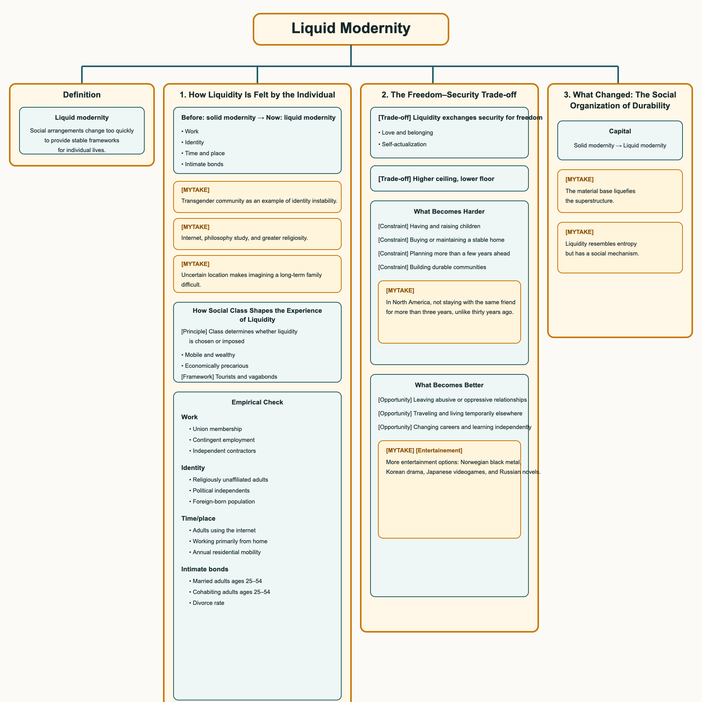

# Liquid Modernity

[Definition] [Liquid modernity] A condition in which social arrangements change too quickly to provide stable frameworks for individual lives.

## 1. How Liquidity Is Felt by the Individual

| Area | Before: solid modernity | Now: liquid modernity |
|---|---|---|
| Work | A person could expect to remain in the same occupation or organization for much of their working life and follow a relatively predictable career path. | A person expects to change jobs, organizations, or skills repeatedly and treats each position as temporary rather than permanent. |
| Identity | A person was more likely to describe who they were through lasting affiliations such as class, occupation, religion, family, and community. | A person is more likely to treat identity as something continually assembled and revised through choices about work, relationships, beliefs, and lifestyle. |
| Time and place | Work, communication, and participation usually occurred in specific places and through repeated contact with the same people. | Work, communication, and participation can continue across locations and through changing networks, so fewer activities depend on remaining physically present in one place. |
| Intimate bonds | Relationships were more commonly approached as long-term commitments whose continuation was assumed. | Relationships are more commonly approached as commitments that continue while they satisfy both people and may be reconsidered when circumstances or preferences change. |
- [MYTAKE] One of the eptimozations of the liquid modernity is the transgender community, can you imagine so much instability to the point of changing your gender identity? This is a clear example.
- [MYTAKE] I in another hand, due to the internet (related to liquid modernity), studied a lot of philosophy and therefore became way more religious.
- [MYTAKE] I struggled a lot in thinking on how to have a long term family, because I couldn't barely imagine my constant placement in city, which seems like a basic requirement for a family, and I don't know where I am going how would I find some that does as well?

### How Social Class Shapes the Experience of Liquidity

[Principle] [Class determines whether liquidity is chosen or imposed] For Bauman, people do not experience mobility, flexibility, and uncertainty in the same way. A person's resources determine whether they can use changing conditions to preserve options or must continually adapt to decisions made by others.

| Social position | Control over mobility | Experience of work and change | Relationship to place |
|---|---|---|---|
| Mobile and wealthy | Can move capital, change locations, leave commitments, and choose among alternatives. | Change appears as a set of options. Flexibility means being able to enter or exit arrangements when circumstances change. | Can remain connected across distance and is less dependent on any particular employer, institution, or locality. |
| Economically precarious | May be required to relocate, change jobs, or accept new conditions, while lacking the resources to move when doing so would be useful. | Change appears as an external demand. Flexibility means remaining available and adjusting to conditions set by employers, markets, or institutions. | Remains dependent on local employment, housing, public services, and personal networks, even when those arrangements are unstable. |

[Framework] [Tourists and vagabonds] Bauman describes this difference through two ideal types. “Tourists” move because they have the resources and permission to choose where to go. “Vagabonds” move because staying is not viable, or remain confined because movement requires resources they do not possess. Both inhabit a mobile world, but only one controls the movement. Bauman develops this contrast most explicitly in *Globalization: The Human Consequences* (1998), and it clarifies the class asymmetry underlying *Liquid Modernity*.

### Empirical Check

| Domain | Indicator | Earlier figure | Recent figure | Relation to Bauman |
|---|---|---:|---:|---|
| **Work** | Union membership | 15.5% of workers (1994) | 9.9% (2024) | Collective protection weakened; workers increasingly negotiate risk individually. |
| **Work** | Contingent employment | 4.9% (1995) | 4.3% (2023) | **Counterevidence:** temporary employment did not expand as dramatically as “liquid work” might suggest. |
| **Work** | Independent contractors | 6.7% (1995) | 7.4% (2023) | A modest shift toward individualized employment, but not a wholesale transformation. |
| **Identity** | Religiously unaffiliated adults | 9% (1993) | 29% (2023–24) | Religious identity became less inherited and more open to personal revision. |
| **Identity** | Political independents | 38% (1994) | 43% (2024) | More people reject a fixed party label, although many still lean toward one party. |
| **Identity** | Foreign-born population | 7.9% (1990) | 13.9% (2022) | More people construct lives across national and cultural boundaries. This indicates pluralization, not moral decline. |
| **Time/place** | Adults using the internet | 14% (1995) | 96% (2024) | Interaction became increasingly immediate and detached from physical location. |
| **Time/place** | Working primarily from home | 3.0% (1990) | 13.8% (2023) | Home and workplace became less clearly separated; employment became more spatially flexible. |
| **Time/place** | Annual residential mobility | Approximately 17% (1990) | Below 10% by the early 2020s | **Strong counterevidence:** Americans became less geographically mobile, despite greater digital mobility. |
| **Intimate bonds** | Married adults ages 25–54 | 67% (1990) | 53% (2019) | Marriage became less compulsory as the standard adult life course. |
| **Intimate bonds** | Cohabiting adults ages 25–54 | 4% (1990) | 9% (2019) | Partnership became less dependent upon a permanent legal commitment. |
| **Intimate bonds** | Divorce rate | 4.7 per 1,000 people (1990) | 2.4 (2023) | **Counterevidence:** existing marriages are not simply dissolving at ever-increasing rates. |

## 2. The Freedom–Security Trade-off

[Trade-off] [Liquidity exchanges security for freedom] Applied to Maslow's hierarchy, liquidity affects each need differently. This is an interpretation combining Maslow and Bauman, not Bauman's own formulation.

| Human need | How liquidity can help | How liquidity can harm | Net effect |
|---|---|---|---|
| Love and belonging | People can choose relationships and communities instead of accepting bonds imposed by family, religion, class, or geography. | Secure attachment requires repeated encounters, reliability, mutual dependence, and commitment through periods of dissatisfaction. Provisional bonds make these conditions harder to establish. | **Usually loses:** choice expands, but stable belonging becomes harder to sustain. |
| Self-actualization | More choices of career, identity, relationship, lifestyle, and location increase opportunities for experimentation and self-realization. | Endless choice can turn self-realization into a compulsory project that is never complete; changing conditions may prevent plans from maturing. | **Main winner in opportunity, but not necessarily in fulfillment.** |

[Trade-off] [Higher ceiling, lower floor] The advantage of liquidity is more options across areas of life, producing more variation in life outcomes. The disadvantage is more uncertainty and risk, which can be stressful and undermine long-term planning.

### What Becomes Harder

- [Constraint] [Having and raising children] Children require predictable income, housing, childcare, time, and confidence that someone will share responsibilities for years. Flexible employment may benefit employers, but irregular schedules and uncertain income make parenthood harder to plan: insecure work → uncertain income and housing → delayed partnership → delayed or forgone children.
- [Constraint] [Buying or maintaining a stable home] Workers may need to change jobs or cities, while housing increasingly functions as an investment asset. Temporary contracts and variable earnings also make mortgages harder to obtain. A person may be geographically free but unable to establish a lasting home.
- [Constraint] [Planning more than a few years ahead] Career ladders are less predictable, technologies make skills obsolete, and employers reorganize frequently. People must continually retrain and present themselves as adaptable. Choosing one professional identity for life becomes riskier.
- [Constraint] [Building durable communities] Long working hours, digital interaction, frequent career changes, and the disappearance of shared institutions reduce repeated contact with the same people. It becomes easier to accumulate contacts but harder to build relationships involving mutual obligation—such as caring for a neighbor during illness.
- - [MYTAKE] This is something that I struggled a lot during my stay in North America, because I don't think I have ever stayed with the same friend for more than 3 years, which is a huge difference compared to 30 years ago for sure

### What Becomes Better

- [Opportunity] [Leaving abusive or oppressive relationships] A durable relationship is not necessarily a good relationship. Economic independence, weaker divorce stigma, and alternative social networks make it more possible to leave an abusive partner or controlling family.
- [Opportunity] [Traveling and living temporarily elsewhere] Cheap flights, online booking, translation tools, remote work, and platforms such as Airbnb make unfamiliar places more accessible. Someone can arrange transportation, accommodation, and local information almost instantly. The qualification is that platforms such as Airbnb can also reduce local housing availability and transform neighborhoods into temporary markets.
- [Opportunity] [Changing careers and learning independently] People are less confined to the occupation chosen in early adulthood. Online courses, remote employment, professional networks, and accessible information make it easier to acquire skills and enter a different field.
- [MYTAKE] [Entertainement] Definetly it's a big winner, nowadays there so many infinite possibilities for enjoyment, you can listen Norwegein black metal, watch a Korean drama, play a Japanese videogame, and read a Russian novel all in the same day. In the past, you would have to choose one or two of these options because of the limited availability of media.

## 3. What Changed: The Social Organization of Durability

| Actor | Solid modernity | Liquid modernity |
|---|---|---|
| Capital | Factories, machinery, and local labor tied capital to a place. | Capital can relocate, outsource, and disinvest. |

[MYTAKE] [The material base liquefies the superstructure] Materialist historical dialectic explains why the superstructure became much more liquid: the economic base of society changed.

[MYTAKE] [Liquidity resembles entropy but has a social mechanism] This could be a trivial consequence of the second law of thermodynamics: the universe tends toward entropy. But it is also a social consequence of the global economy, which allows capital to move faster than people, institutions, or communities can adapt.
