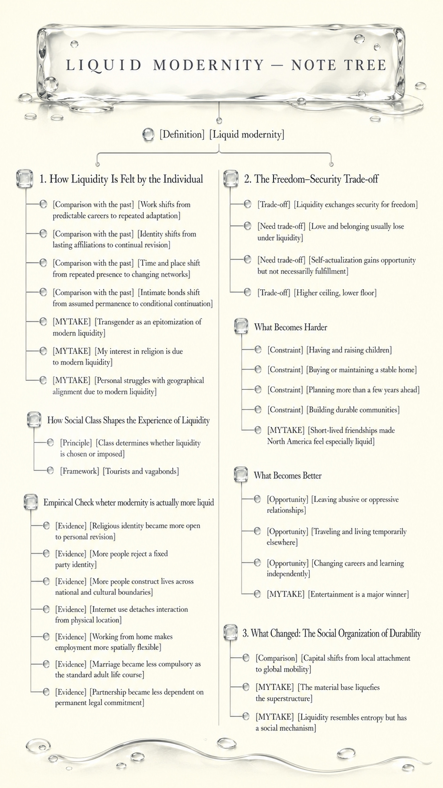

# Liquid Modernity

- [Definition] [Liquid modernity] A condition in which social arrangements change too quickly to provide stable frameworks for individual lives.

## 1. How Liquidity Is Felt by the Individual

- [Comparison with the past] [Work shifts from predictable careers to repeated adaptation] In solid modernity, a person could expect to remain in the same occupation or organization for much of their working life and follow a relatively predictable career path. In liquid modernity, a person expects to change jobs, organizations, or skills repeatedly and treats each position as temporary rather than permanent.
- [Comparison with the past] [Identity shifts from lasting affiliations to continual revision] In solid modernity, a person was more likely to describe who they were through lasting affiliations such as class, occupation, religion, family, and community. In liquid modernity, a person is more likely to treat identity as something continually assembled and revised through choices about work, relationships, beliefs, and lifestyle.
- [Comparison with the past] [Time and place shift from repeated presence to changing networks] In solid modernity, work, communication, and participation usually occurred in specific places and through repeated contact with the same people. In liquid modernity, they can continue across locations and through changing networks, so fewer activities depend on remaining physically present in one place.
- [Comparison with the past] [Intimate bonds shift from assumed permanence to conditional continuation] In solid modernity, relationships were more commonly approached as long-term commitments whose continuation was assumed. In liquid modernity, relationships are more commonly approached as commitments that continue while they satisfy both people and may be reconsidered when circumstances or preferences change.
- [MYTAKE] [Transgender as an epitomization of modern liquidity] One of the eptimozations of liquid modernity is the transgender community; can you imagine so much instability that it extends to changing your gender identity? This is a clear example.
- [MYTAKE] [My interest in religion is due to modern liquidity] I, on the other hand, studied a lot of philosophy due to the internet—which is related to liquid modernity—initially as entertainment, and therefore became much more religious.
- [MYTAKE] [Personal struggles with geographical alignment due to modern liquidity] I struggled a lot with thinking about how to have a long-term family because I could barely imagine remaining in one city, which seems like a basic requirement for a family. If I do not know where I am going, how would I find someone who does?

### How Social Class Shapes the Experience of Liquidity

- [Principle] [Class determines whether liquidity is chosen or imposed] For Bauman, people do not experience mobility, flexibility, and uncertainty in the same way. A person's resources determine whether they can use changing conditions to preserve options or must continually adapt to decisions made by others.
- [Framework] [Tourists and vagabonds] Bauman describes this difference through two ideal types. “Tourists” move because they have the resources and permission to choose where to go. “Vagabonds” move because staying is not viable, or remain confined because movement requires resources they do not possess. Both inhabit a mobile world, but only one controls the movement. In our scenario, the tourists would be the wealthy and the vagabonds would be the poor. 

### Empirical Check wheter modernity is actually more liquid

- [Evidence] [Religious identity became more open to personal revision] Religiously unaffiliated adults increased from 9% in 1993 to 29% in 2023–24, indicating that religious identity became less inherited and more open to personal revision.
- [Evidence] [More people reject a fixed party identity] Political independents increased from 38% in 1994 to 43% in 2024, although many still lean toward one party.
- [Evidence] [More people construct lives across national and cultural boundaries] The foreign-born population increased from 7.9% in 1990 to 13.9% in 2022. This indicates pluralization, not moral decline.
- [Evidence] [Internet use detaches interaction from physical location] Adults using the internet increased from 14% in 1995 to 96% in 2024, making interaction increasingly immediate and detached from physical location.
- [Evidence] [Working from home makes employment more spatially flexible] People working primarily from home increased from 3.0% in 1990 to 13.8% in 2023. Home and workplace became less clearly separated, and employment became more spatially flexible.
- [Evidence] [Marriage became less compulsory as the standard adult life course] Married adults ages 25–54 decreased from 67% in 1990 to 53% in 2019.
- [Evidence] [Partnership became less dependent on permanent legal commitment] Cohabiting adults ages 25–54 increased from 4% in 1990 to 9% in 2019.

## 2. The Freedom–Security Trade-off

- [Trade-off] [Liquidity exchanges security for freedom] Applied to Maslow's hierarchy, liquidity affects each need differently. This is an interpretation combining Maslow and Bauman, not Bauman's own formulation.
- [Need trade-off] [Love and belonging usually lose under liquidity] Liquidity allows people to choose relationships and communities instead of accepting bonds imposed by family, religion, class, or geography. However, secure attachment requires repeated encounters, reliability, mutual dependence, and commitment through periods of dissatisfaction, and provisional bonds make these conditions harder to establish. Choice expands, but stable belonging becomes harder to sustain.
- [Need trade-off] [Self-actualization gains opportunity but not necessarily fulfillment] More choices of career, identity, relationship, lifestyle, and location increase opportunities for experimentation and self-realization. However, endless choice can turn self-realization into a compulsory project that is never complete, while changing conditions may prevent plans from maturing. Self-actualization is the main winner in opportunity, but not necessarily in fulfillment.
- [Trade-off] [Higher ceiling, lower floor] The advantage of liquidity is more options across areas of life, producing more variation in life outcomes. The disadvantage is more uncertainty and risk, which can be stressful and undermine long-term planning.

### What Becomes Harder

- [Constraint] [Having and raising children] Children require predictable income, housing, childcare, time, and confidence that someone will share responsibilities for years. Flexible employment may benefit employers, but irregular schedules and uncertain income make parenthood harder to plan: insecure work → uncertain income and housing → delayed partnership → delayed or forgone children.
- [Constraint] [Buying or maintaining a stable home] Workers may need to change jobs or cities, while housing increasingly functions as an investment asset. Temporary contracts and variable earnings also make mortgages harder to obtain. A person may be geographically free but unable to establish a lasting home.
- [Constraint] [Planning more than a few years ahead] Career ladders are less predictable, technologies make skills obsolete, and employers reorganize frequently. People must continually retrain and present themselves as adaptable. Choosing one professional identity for life becomes riskier.
- [Constraint] [Building durable communities] Long working hours, digital interaction, frequent career changes, and the disappearance of shared institutions reduce repeated contact with the same people. It becomes easier to accumulate contacts but harder to build relationships involving mutual obligation—such as caring for a neighbor during illness.
- [MYTAKE] [Short-lived friendships made North America feel especially liquid] This is something I struggled with a lot during my stay in North America because I do not think I ever stayed with the same friend for more than three years, which is a huge difference compared with 30 years ago.

### What Becomes Better

- [Opportunity] [Leaving abusive or oppressive relationships] A durable relationship is not necessarily a good relationship. Economic independence, weaker divorce stigma, and alternative social networks make it more possible to leave an abusive partner or controlling family.
- [Opportunity] [Traveling and living temporarily elsewhere] Cheap flights, online booking, translation tools, remote work, and platforms such as Airbnb make unfamiliar places more accessible. Someone can arrange transportation, accommodation, and local information almost instantly. The qualification is that platforms such as Airbnb can also reduce local housing availability and transform neighborhoods into temporary markets.
- [Opportunity] [Changing careers and learning independently] People are less confined to the occupation chosen in early adulthood. Online courses, remote employment, professional networks, and accessible information make it easier to acquire skills and enter a different field.
- [MYTAKE] [Entertainment is a major winner] It is definitely a big winner. Nowadays, there are nearly infinite possibilities for enjoyment: you can listen to Norwegian black metal, watch a Korean drama, play a Japanese video game, and read a Russian novel all on the same day. In the past, you would have had to choose one or two of these options because of the limited availability of media.

## 3. What Changed: The Social Organization of Durability

- [Comparison] [Capital shifts from local attachment to global mobility] In solid modernity, factories, machinery, and local labor tied capital to a place. In liquid modernity, capital can relocate, outsource, and disinvest.
- [MYTAKE] [The material base liquefies the superstructure] Materialist historical dialectic explains why the superstructure became much more liquid: the economic base of society changed.
- [MYTAKE] [Liquidity resembles entropy but has a social mechanism] This could be a trivial consequence of the second law of thermodynamics: the universe tends toward entropy. But it is also a social consequence of the global economy, which allows capital to move faster than people, institutions, or communities can adapt.
