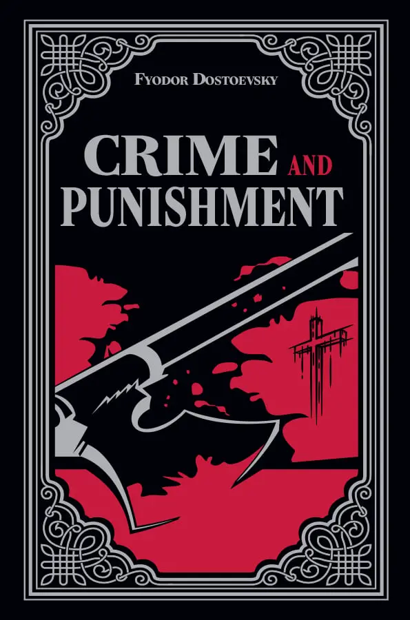
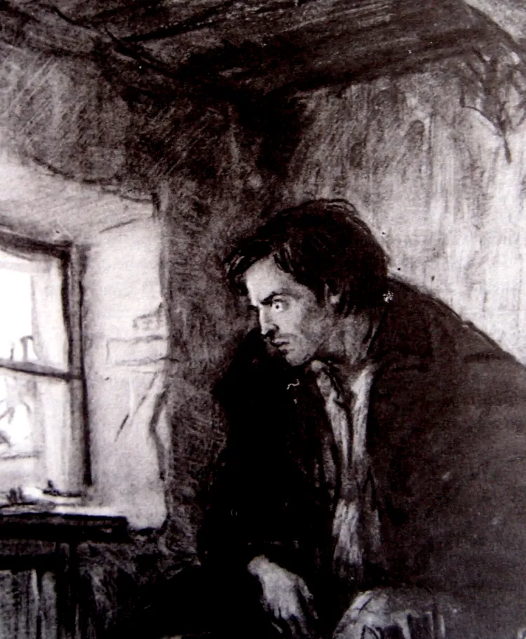
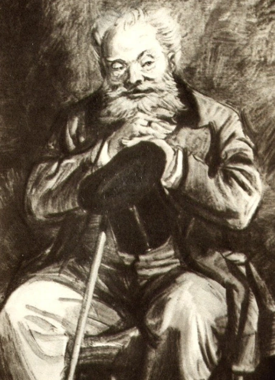
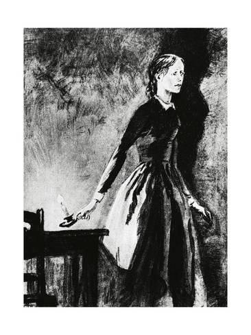

)

# Memory Trigger

## What is a Crime? [Philosophy]
- The concept of crime is explored through the lens of modern relativism.
- Raskolnikov's victim, the old pawnbroker, is portrayed as an annoying and unpleasant person. This raises the question: is it truly so bad that he killed her? Does her character justify the act in any way?
- The philosophical undertone of the book delves into the moral ambiguity of crime, questioning whether morality is absolute or subjective.

## What is a Punishment? [Psychology]
- Punishment is intricately tied to the definition of crime. The novel suggests that if you are suffering from punishment, then you have likely committed a crime, whether by societal standards or your own conscience.
- The psychological depth of the book reveals how punishment manifests internally, regardless of external judgment or societal norms.
- The novel intertwines philosophical and psychological perspectives, making the reader question the true nature of justice and retribution.

# Main Characters

- **Rodion Romanovich Raskolnikov**  
  A former student living in poverty, Raskolnikov is the protagonist of the novel. He formulates a theory about extraordinary people being above the law, which leads him to commit a murder.

- **Sofya Semyonovna Marmeladov (Sonya)**  
  A meek and devout young woman forced into prostitution to support her family. She becomes Raskolnikov's confidante and moral compass.

- **Avdotya Romanovna Raskolnikova (Dunya)**  
  Raskolnikov's proud and strong-willed sister. She is pursued by two very different men: the manipulative Luzhin and the noble Razumikhin.

- **Pulcheria Alexandrovna Raskolnikova**  
  Raskolnikov's doting mother, deeply concerned with her son’s future and emotional well-being.

# Plot Summary

## Part 1: The Crime and Psychological Collapse

- **Rodion Raskolnikov**, a destitute ex-student in St. Petersburg, believes certain "extraordinary" people can commit crimes if it leads to a greater good.
- To prove this theory, he murders **Alyona Ivanovna**, a pawnbroker, intending to use her money for noble purposes.
- The plan goes awry when he also kills her innocent sister, **Lizaveta**, who walks in on the scene.
- After the murders, Raskolnikov becomes deeply ill, both physically and mentally, and begins to unravel under the weight of guilt and paranoia.
- He isolates himself, suffering from delirium and emotional instability.

## Part 2: Encounters, Conflicts, and Moral Struggle

- Raskolnikov is drawn to **Sofya (Sonya) Marmeladov**, a humble and devout young woman who has turned to prostitution to support her family. She becomes his confidante.
- **Porfiry Petrovich**, the sly and philosophical detective, begins to suspect Raskolnikov and subtly pressures him through psychological games.
- **Razumikhin**, Raskolnikov’s loyal friend, tries to help him and becomes romantically involved with **Dunya**, Raskolnikov’s strong-willed sister.
- Tensions rise with **Luzhin**, a pompous suitor of Dunya, and **Svidrigaïlov**, her sinister former employer who harbors disturbing intentions.
- Raskolnikov is torn between confessing and holding onto his philosophical justification for the crime.

## Part 3: Confession, Redemption, and Transformation

- As guilt overwhelms him, Raskolnikov’s internal conflict reaches its peak. Sonya urges him to confess and face his punishment.
- Svidrigaïlov, after a series of disturbing revelations and acts, dies by suicide — underscoring a path Raskolnikov might have taken.
- Raskolnikov finally confesses to the murders and is sentenced to **Siberian penal servitude**.
- Sonya follows him to Siberia, offering support and spiritual strength.
- In the epilogue, Raskolnikov begins to feel the first signs of **spiritual awakening and redemption**, suggesting that suffering and love can lead to salvation.

# Philosophy

## Existentialism and Morality in Crime and Punishment

### What is Existentialism?
- [Definition] Dostoevsky was part of the existentialist movement—a group of writers and philosophers who explored profound questions about the meaning of life, morality, and the existence of God. All of Dostoevsky's works revolve around these existential themes, with *Crime and Punishment* focusing particularly on morality. The novel examines the tension between rationality and morality, challenging readers to confront the complexities of human existence.

### Consequences of Darwin's theory
[MYTAKE] [Assessing refusal of absolute moralism through a test] *Crime and Punishment* was written during a time when Nietzsche's ideas were gaining prominence. The rejection of God, fueled by the Enlightenment and Darwinian morality, led to the rise of relativism—the belief that there is no absolute right or wrong, only subjective morality. Without an objective reference frame, such as God's nature, morality becomes a matter of personal preference. Dostoevsky critiques this relativism by illustrating its destructive consequences on the human soul.

### Philosophical Archetypes in the Characters
[MYTAKE] Each major character in *Crime and Punishment* embodies a distinct philosophical perspective:
- **Raskolnikov**: Defies Christianity
- **Sonya**: Represents Christianity, embodying unconditional love, forgiveness, and moral objectivism.
- **Svidrigailov**: Represents hedonism, living a life driven by pleasure and self-will, yet haunted by guilt and despair.
- **Luzhin**: Rational egoism

## Morality

### What is Morality?
- [What is crime] Did Raskolnikov truly commit a crime? Why would his actions be considered a crime? The novel challenges readers to reflect on the nature of morality and justice.

### The “Extraordinary Man” theory
- [Definition] The theory suggests that the world is divided between ordinary people and extraordinary people, with the extraordinary ones being entitled to commit crimes if it serves a higher purpose.
- [Theory Test by Raskolnikov] Raskolnikov's belief in this theory drives his actions, as he seeks to prove whether he is extraordinary by stepping over moral boundaries. This internal conflict mirrors the struggles of individuals who grapple with their own sense of purpose and identity.
- - An amazing evidence that he killed the old lady not to gain money, but to prove his theory, is that he never uses that money in a real sense.
- [MYTAKE] [Correlation of this theory with my life] Personally, I once resonated with this theory, especially during university when I resisted the idea of becoming a software engineer. At my mind, being a software engineering was only about solving intellectually irrelevant practical problems, and I was being worth much more than that one. Perhaps I was more ordinary than extraordinary, contrary to what I had initially believed.

### Consequences of Rejecting Christian Morality
- [MYTAKE] [Consequences of Rejecting Christian Morality] Dostoevsky illustrates that the desire to assert oneself above morality ultimately destroys the soul, creating extremely strong psychological consequences. Whether you are a psychopath like Svidrigailov or a seemingly normal person like Raskolnikov, rejecting moral absolutes leads to despair and self-destruction

# Psychology

## Punishment

- [MYTAKE] [Psychological realism after murder] One of the aspects that makes *Crime and Punishment* a masterpiece is Dostoevsky's realistic portrayal of Raskolnikov's behavior after the murder. His actions align closely with the psychological tendencies of the average murderer, as later psychoanalytic studies have shown.
- - His mental and physical health deteriorates rapidly after the crime, manifesting in severe illness and psychological torment.
- Raskolnikov's neurotic tendencies lead to overwhelming feelings of guilt that cannot be eradicated. These feelings explain his subconscious desire for punishment even before he commits the crime. He engages in self-sabotaging behavior, almost as if he wants to be caught, because he believes suffering will alleviate his guilt.
- This guilt and subsequent yearning for punishment become so overpowering that they drive him to commit the murder in the first place.

## Healing

### Part 1: Confronting the Problem
- [MYTAKE] A key theme in *Crime and Punishment* is the danger of internalizing one's struggles. Raskolnikov, due to his arrogance and mistrust of others, isolates himself and keeps everything bottled up. He constructs a single, obsessive narrative in his mind, which perpetuates his misery and psychological turmoil.
- [MYTAKE] It is only when he confesses to Sonya that he begins to confront the things that have been haunting him. This act of opening up marks the first step toward his healing, as it allows him to break free from the prison of his own thoughts.

### Part 2: The Power of Love
- [MYTAKE] [Loves creation redemption] Raskolnikov's ultimate redemption comes through the unconditional love of Sonya. Even after being sentenced to Siberia, he initially views his crime as merely a mistake, continuing to rationalize his actions. This rational mindset prevents him from fully confronting the moral and spiritual implications of his deeds.

# Characters

## Raskolnikov

- [MYTAKE] [Weird] After the crime, he lies repeatedly; yet whenever a lie would compromise his sense of dignity, he refuses it—even when telling the truth risks exposing him as the murderer. This is evident when the investigator asks whether he considers himself extraordinary, and he answers yes
- [MYTAKE] [Internal Conflict] It is interesting the his lack of emotional intelligence. He in the whole book he refues to let go rationalism, he refues to accept that his idea is wrong, even though he is suffering a lot. His is always in denial.
- [Misguided revolutionary protest] The motivation of the student revo lutionary is quite evident. Raskolnikov killed an old lady in ineffectual fury, to protest the
condition of the insulted and the injured. He killed the old woman to
protest the wretched conditions of the Marmeladovs, his own wretched
condition, and the co ndition of man who from poverty of soul and
body strikes in frustration at the symbol of the wre tchedness which
chains him. Motivated thus by social consc iousness, Raskolnikov
emerges as a scapegoat figure, carrying on his back to the martyrdom of
Siberia the accumulated guilt, shame, and injustice of the social order. 
- Alienation is the primary theme of Crime and Punishment. At first, Raskolnikov's pride separates him from society. He sees himself as superior to all other people and so cannot relate to anyone.
- to me it is crazy the consequences of a murder in someone's mind,
as discussed many times in the novel, Raskolnikov is correct, he has
the good reasons, but still in the end he doesn't turn himself in 
because of fear of getting caught, he turns himself in because of guilt.
The joy of Raskolnikov kissing the ground (in the end of the book), shows
that us as human beings have an instictive way of write and wrong,
regardless of our own reasoning
- The growing guilt, to the point that he hides the stolen money and doesn't touch them at all, along with the urge to confess his crimes, are highly typical of criminals.
- - [MYTAKE] this is very crazy because in fact he the trauma is so big of the murderer that he doesn't even want to take a look at the money
- Why did he kill her?
- - he became Sulky, he says that when he is explaning to Sonya
- - "Then I saw, Sonia, that if one waits for 
everyone to get wiser it will take too long.... Afterwards I 
understood that that would never come to pass, that men 
won't change and that nobody can alter it and that it's not 
worth wasting effort over it. Yes, that's so. That's the law 
of their nature, Sonia,... that's so!... And I know now, Sonia, 
that whoever is strong in mind and spirit will have power 
over them. Anyone who is greatly daring is right in their 
eyes. He who despises most things will be a lawgiver 
among them and he who dares most of all will be most in 
the right! So it has been till now and so it will always be. A 
man must be blind not to see it!"  
Though Raskolnikov looked at Sonia as he said this, he 
no longer cared whether she understood or not. The fever 
had complete hold of him; he was in a sort of gloomy 
ecstasy (he certainly had been too long without talking to 
anyone). Sonia felt that his gloomy creed had become his 
faith and code.  "
- "I divined then, Sonia," he went on eagerly, "that power 
is only vouchsafed to the man who dares to stoop and pick 
it up. There is only one thing, one thing needful: one has 
only to dare! Then for the first time in my life an idea took 
shape in my mind which no one had ever thought of before 
me, no one! I saw clear as daylight how strange it is that 
not a single person living in this mad world has had the 
daring to go straight for it all and send it flying to the 
devil! I... I wanted to have the daring... and I killed her. I 
only wanted to have the daring, Sonia! That was the whole 
cause of it!"
- - Perhaps I should never have committed a murder again. I 
wanted to find out something else; it was something else 
led me on. I wanted to find out then and quickly whether I 
was a louse like everybody else or a man. Whether I can 
step over barriers or not, whether I dare stoop to pick up 
or not, whether I am a trembling creature or whether I 
have the right..."

## Svidragaliov

[Character as proof that hedonism is bad] Dostoevisky uses svidrgaliov as a way to show how bad the consequences of strictly following hedonism
- [List of bad acts]
- - He doesn't rape Dunia
- - He kills himself
- - He raped a 5 year old, male prostitution
- Svidrigailov and Raskolnikov both crossed moral lines. Both felt guilty, though Svidrigailov less so. The nightmare he had shows that it still bothered him
- [Inescapable moral residue] We often imagine “terrible” figures—such as Hitler—as cold, regretless beings, stripped of any moral feeling. This character challenges that assumption. Even when morality is repressed, it persists at least at the subconscious level, as seen in Svidrigailov’s dreams of the abused girl. They reveal that moral awareness does not disappear simply because someone commits evil acts. Moreover, the novel shows that even someone like Svidrigailov is not reducible to pure appetite. When I first read the book, I was astonished that he does not rape Dunya. Now, this no longer surprises me: it reflects the fact that he remains human, capable of sensing that there is something beyond mere pleasure. With Dunya, he briefly touches that deeper possibility. Realizing that he will never be able to live in that moral or emotional dimension, he chooses suicide
- [Svidragaliov Crime and Punishment] Metaphysical Punishment (Meaning Collapse). Suffers from existential saturation: nothing matters anymore.
- - [MYTAKE] I think this makes sense because since he has no resentment, no internal conflict. Showing that he is already dead inside.
 
## Sonya

**Epitomization of christ**
- [Defnition] Christianity = loves, maximize love in no matter circustance
- [Contrast of appearance and reality] She is the epitomization of christ internally, but externally she is just a whore
- [Christ allegory] Not too sure how accurate my reading of Sonya's character is, but from my understanding she's something of an allegory for Christ. Unconditional love, her position of freedom from bondage, the reception of confessions, and her otherwise unlikely position to be in a genuine caring relationship with someone as misguided as Raskolnikov all seem to point to this.
- [Contrast of what she believes and what she does] It is interesting that fact that Sonya is very religious and a prostitute, which is a very big contradiction, and for sure created a lot of suffering for her
- [Raskolnikov and Sonya form a bond of mutual understanding] Rodya defended Sonya publicly, and most important is this: Rodya is the only one who does not look down on Sonya, as Sonya is the only one who does not seek to condemn Rodya. Whereas every character contains the seed of blame, and would out Rodya as soon as they learned he murdered the pawnbroker (and her sister!), just as how all of them would dismiss sonya as a prostitute, the couple fully accept and understand one another. They can only find true consolation in one another
- [Jesus functions as a substitutionary sacrifice] We could never a life worthy of God on our own. So Jesus lived a life without sin on our behalf. And then he died the painful death our sins deserve. John 3:17 says, “God did not send the Son into the world to condemn the world, but in order that the world might be saved through him.” By sacrificing himself for us on the cross, he took the punishment for all of our sins at once. This made him the ultimate sacrifice —once and for all satisfying the demands God’s justice required. That is why we call Jesus “Lamb of God.”
- - Maybe that's why Sonya suffered to much, this is alligned with the idea that she is a Christ type.

### Details
- [MYTAKE] [Her name's etymology] It is fascinating that her name, "Razumihin," translates to "reason" or "intellect," yet she is not portrayed as particularly intelligent in the conventional sense. This contrast highlights an important theme: wisdom transcends mere intelligence. Her profound wisdom and emotional depth enable her to guide and ultimately redeem Raskolnikov. This serves as a reminder that true wisdom often lies in understanding, compassion, and the ability to inspire change in others.

## Marmeladov
- Marmeladov is a very peculiar character. Despite being a drunkard, there are still remnants of the great man he once was, especially evident when he speaks. His eloquence and depth of thought shine through his intoxicated state, revealing a tragic complexity to his character.
- His speeches often carry a sense of profound despair and self-awareness, as he acknowledges his own failures and the suffering he has caused his family. Yet, within this despair, there is also a glimmer of hope and a yearning for redemption, making him one of the most human and relatable characters in the novel.
- Marmeladov's character serves as a poignant commentary on the destructive nature of addiction and poverty, as well as the resilience of the human spirit in the face of overwhelming adversity.
- His interactions with Raskolnikov provide critical insights into the themes of guilt, suffering, and the possibility of salvation, which are central to the novel's philosophical and moral exploration.

# Symmetries

[MYTAKE]

Perhaps many of the symmetries in *Crime and Punishment* are related to **Hegelian dialectics**—characters arranged as opposing moral and psychological poles.

### Raskolnikov ↔ Sonya
- **Choice vs. Necessity**: chooses crime ↔ forced into crime (prostitution)
- **Ethics**: moral relativism ↔ moral objectivism
- **Salvation**: he saves her (against Luzhin) ↔ she saves him (from himself)
- **Orientation**: fully rational / modern ↔ emotional / religious

### Raskolnikov ↔ Razumikhin
- **Action**: murderer ↔ naïve / innocent
- **Sociality**: isolated ↔ deeply social
- **Truthfulness**: liar ↔ radical honesty

### Svidrigailov ↔ Dunya  
*(mirrored again in Raskolnikov ↔ Dunya)*
- **Purity**: impure ↔ pure
- **Erotics**: sex / blackmail ↔ love

# Topics

### The Escalation of Problems

Dostoevsky masterfully illustrates how unresolved issues can spiral out of control, especially when they are not confronted or discussed openly.

### Final Reflection

*Crime and Punishment* is a visceral and thought-provoking exploration of human nature, morality, and the consequences of poverty. It forces readers to confront uncomfortable truths about themselves and society, making it a timeless masterpiece that continues to resonate across generations.
