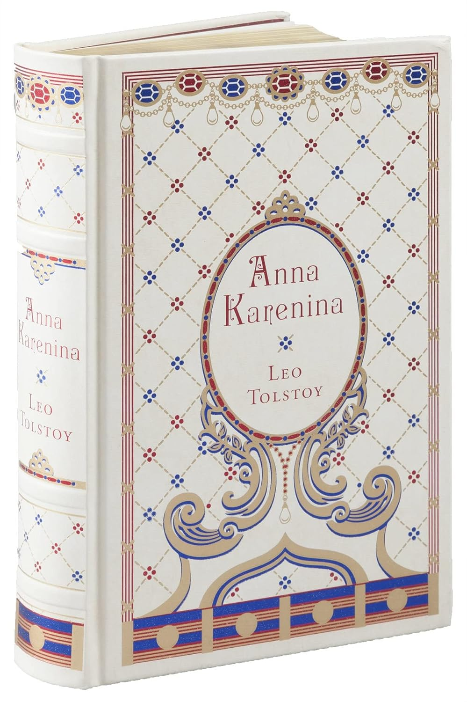
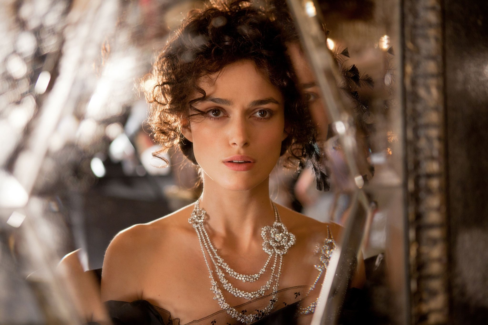
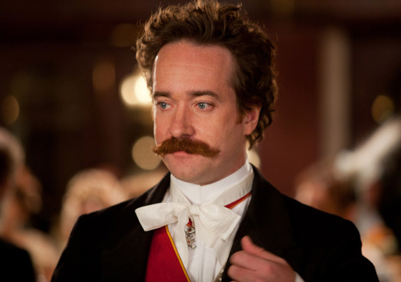
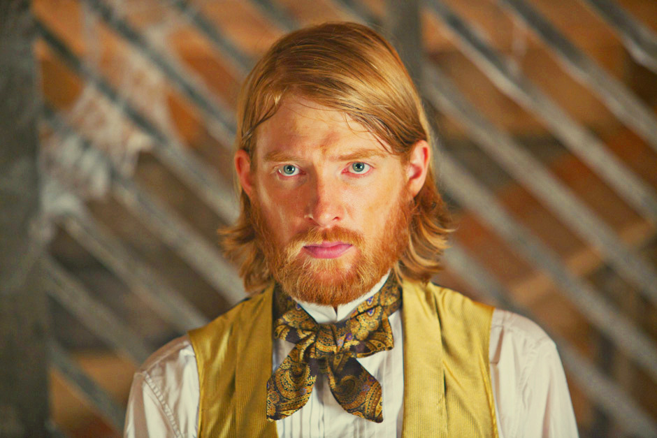
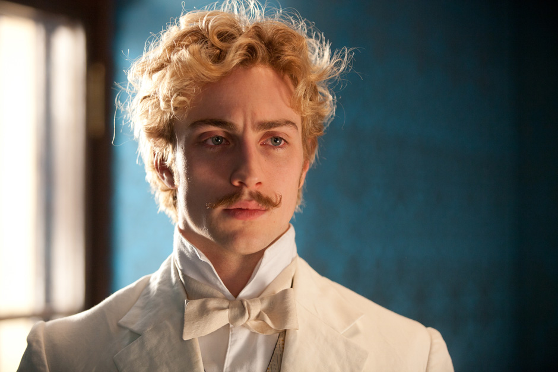
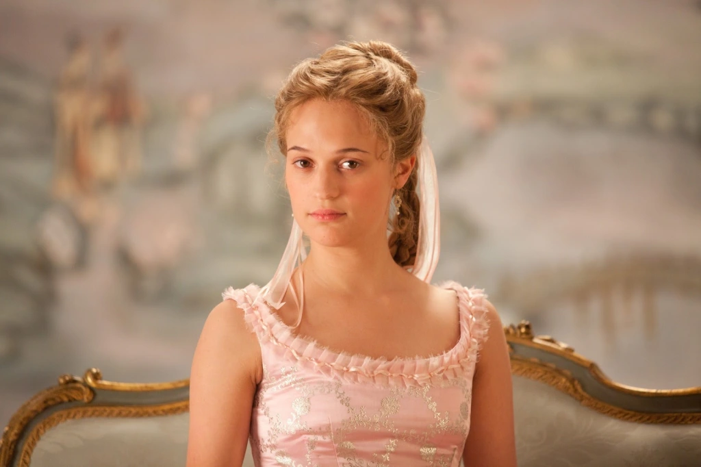
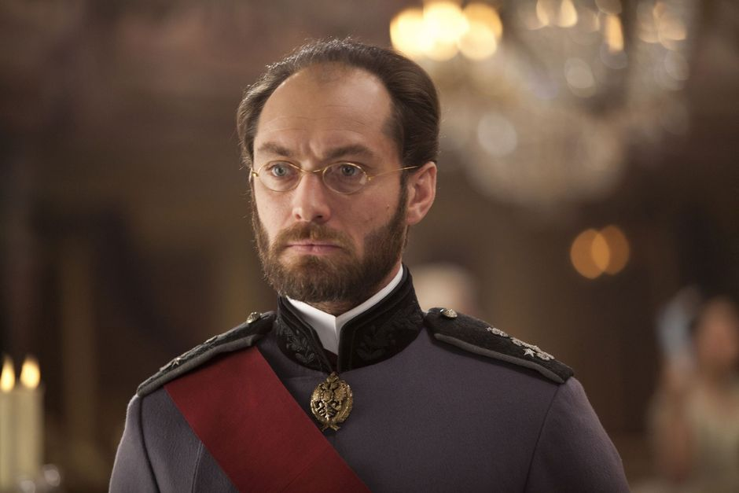
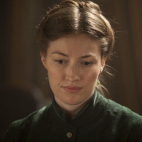

Page 690

# 👩‍🦰 Anna Arkadyevna Karenina – The Passionate / Tragic Woman

| Dr. Jekyll (Light Side)                                                        | Mr. Hyde (Dark Side)                                                      |
| ------------------------------------------------------------------------------ | ------------------------------------------------------------------------- |
| Loving, passionate, capable of deep feeling and defiance of societal hypocrisy | Jealous, self-destructive, emotionally unstable, loses touch with reality |

## Tolstoy is sexist or stoic?
- [MYTAKE] I find interesting that in many stories, a woman as virtuous as Anna should receive a higher reward in the end then dying by suicide. Is Tolstoy sexist for suggesting that a woman that seeks the standard male virtues such as 'courage', 'intelligence', 'authenticity' ends suffering in the end. Or is he stoic for saying that in a pathriarchal society, a woman that challenges the structure is doomed to fail

## She represents what is th best about the high class
- The nobility, the compuser

## She also represents what is the worst about being at the high class
- The loliness

## Feminism
- [Reproductive reductionism] "Her husband might put her to shame and turn her out, Vronsky might grow cold to her and go on living his own life apart (she thought of him again with bitterness and reproach); she could not leave her son. She had an aim in life."
- - [MYTAKE] Isn't the dreadful the situation of women in a patriarchal society
- "She would never know freedom in love, but would remain forever a guilty wife, with the menace of detection hanging over her at every instant; deceiving her husband for the sake of a shameful connection with a man living apart and away from her, whose life she could never share. She knew that this was how it would be, and at the same time it was so awful that she could not even conceive what it would end in. And she cried without restraint, as children cry when they are punished."
- - [MYTAKE] This resonates with my own life experience. When you are in a deadend, you can keep iterating through the same situation, the same problem all the time. Probably because, you don't want to do the RCA, and actually change the same thing.   

## Anna has the will to live
- If she read that the heroine of the novel was nursing a
sick man, she longed to move with noiseless steps about the room of a sick man; if
she read of a member of Parliament making a speech, she longed to be delivering
the speech; if she read of how Lady Mary had ridden after the hounds, and had
provoked her sister-in-law, and had surprised every one by her boldness, she too
wished to be doing the same. But there was no chance of doing anything; and
twisting the smooth paper knife in her little hands, she forced herself to read.
- - This is a very interesting point, because many times while we read the book it is layed upon us the idea that Anna is just a poor guy that life problems were layed upon her, and not a real protagonist.
- Though she could not recall her own words or his, she realized instinctively
that the momentary conversation had brought them fearfully closer; and she was
panic-stricken and blissful at it.
- It's crazy that probably Vronsky made her feel alive for the first time, which is crazy And amazing at the same time.

## Escapism
- And her son, like her husband, aroused in Anna a feeling akin to disappointment. She had imagined him better than he was in reality. She had to let herself
drop down to the reality to enjoy him as he really was.
- Interesting how cheating can be simply as a way to run away from life.

## Ubermensch woman
- She was standing holding herself, as always, very erect, and when Kitty drew
near the group she was speaking to the master of the house, her head slightly
turned towards him.
- In some ways, Anna Karenina sees in Vronsky a copy of herself, in terms not necessarily of will to power but in elegance, beauty, strongness. Maybe that's why she fell in love for him.

## This affair consumates her whole life
- “But you’re ill or worried,” he went on, not letting go her hands and bending
over her. “What were you thinking of?”
“Always the same thing,” she said, with a smile.
She spoke the truth. If ever at any moment she had been asked what she was
thinking of, she could have answered truly: of the same thing, of her happiness and
her unhappiness.

## Unhapiness
- “I unhappy?” she said, coming closer to him, and looking at him with an
ecstatic smile of love. “I am like a hungry man who has been given food. He may
be cold, and dressed in rags, and ashamed, but he is not unhappy. I unhappy? No,
this is my unhappiness.

## She is authentic and sincere
- “No, you were not mistaken,” she said deliberately, looking desperately into his cold face. “You were not mistaken. I was, and I could not help being in despair. I hear you, but I am thinking of him. I love him, I am his mistress; I can’t bear you; I’m afraid of you, and I hate you.... You can do what you like to me.”

# 🕺 Stiva Oblonsky – The Hedonist / Social Man (ESFP)

| Dr. Jekyll                                     | Mr. Hyde                                                            |
| ---------------------------------------------- | ------------------------------------------------------------------- |
| Charismatic, affable, sociable, loves pleasure | Irresponsible, adulterous, avoids consequences, emotionally shallow |

## Ambiguous morality
- "Ah, ah, ah! OO!..." he muttered, reaclling everything that had happened. And again every detail of this quarrel with this wife was present to his imagination, all the hopelessness of his position, and worst of all, his own fault."
- - Even though he is not the most moral of the characters, we can see that he in fact has some level of morality.

## Lack of authenticity
- Stepan Arkadyevitch had not chosen his political opinions or his views; these
political opinions and views had come to him of themselves, just as he did not
choose the shapes of his hat and coat, but simply took those that were being worn.
- [MYTAKE] He seems to be a character with minimum intellectual ability, that doesn't seem to care too much about life in general, he represents a type of mindless hedonism

## ADHD (avoiding tough feelings)
- “Dolly!” he said in a subdued and timid voice. He bent his head towards his
shoulder and tried to look pitiful and humble, but for all that he was radiant with
freshness and health.
- He is so pathethic, he is running away from the fact that he cheated on her, by playing with her emotionally by making her feel pitty.
- "Towards the end of May, when everything had been more or less satisfactorily arranged, she received her husband’s answer to her complaints of the disorganized state of things in the country. He wrote begging her forgiveness for not having thought of everything before, and promised to come down at the first chance. This chance did not present itself, and till the beginning of June Darya Alexandrovna stayed alone in the country."

## Empty suit / Nepotism beneficiary
- This post he had received through his sister Anna’s husband, Alexey Alexandrovitch Karenin,
who held one of the most important positions in the ministry to whose department
the Moscow office belonged. But if Karenina had not got his brother-in-law this
berth, then through a hundred other personages—brothers, sister, cousins, uncles,
and aunts—Stiva Oblonsky would have received this post, or some other similar one.
- Half Moscow and Petersbur were friends and relations of Stepan Arkadyvetich
- [MYTAKE] This man is so pathethic, he is weak because he received everything without any effort, and therefore he has no real skill.
- [MYTAKE] We can see how much success in life is about social connections, specially at that time.

## Dumb / Superficial knowledge
- “Oh, well, the higher power of Ryabinin can. Not a single merchant ever buys
a forest without counting the trees, unless they get it given them for nothing, as
you’re doing now. I know your forest. I go there every year shooting, and your
forest’s worth a hundred and fifty roubles and acre paid down, while he’s giving
you sixty by installments. So that in fact you’re making him a present of thirty
thousand.”

## Hedonism
- "He had bachelor tastes, and it was in accordance with them that he shaped his life."

# 🌾 Konstantin Dmitrievich Levin – The Seeker / Integrated Man

| Dr. Jekyll                                                              | Mr. Hyde                                                               |
| ----------------------------------------------------------------------- | ---------------------------------------------------------------------- |
| Honest, hardworking, philosophically searching, loves nature and family | Prone to depression, self-doubt, existential despair, socially awkward |

## Why Levin is my favourite character
- [MYTAKE] He is authenthic, whereas others follow guidelines and principles either because they are easy, because they feel like doing so, or because they have been told to do so, Levin follows them because he believes on them. Not only that, but he also recognizes his own flaws after a lot of pain, and therefore it is willing to fix them in end

## True love
- "Stepan Arkadyevitch, who had long known that Levin was in love with his
sister-in-law, Kitty, gave a hardly perceptible smile, and his eyes sparkled merrily."
- "When Oblonsky asked Levin what had brought him to town, Levin blushed,
and was furious with himself for blushing, because he could not answer, “I
have come to make your sister-in-law an offer,” though that was precisely what he
had come for."
- [MYTAKE] One of the first interactions we have with Levin is him suggesting proposal to Kitty, showing what a beautiful soul he has. And that he is very straightforward, incapable of the mannerisms required to be successful in social life. 

## His love for Kitty is so pure and beautiful.
- "But Levin was in love, and so it seemed
to him that Kitty was so perfect in every respect that she was a creature far above
everything earthly; and that he was a creature so low and so earthly that it could
not even be conceived that other people and she herself could regard him as worthy
of her."
- "When he thought of her, he could call up a vivid picture of her to himself,
especially the charm of that little fair head, so freely set on the shapely girlish
shoulders, and so full of childish brightness and good-humor. The childishness of
her expression, together with the delicate beauty of her figure, made up her special
charm, and that he fully realized."
- [MYTAKE] Bro, his inability to express his love properly is so sad, because it is very intense. I can definetly relate a lot with this character.
- "Seeing her, he found himself face to face with one of the pictures of his daydream of family life."
- “Darya Alexandrovna,” he said dryly, “I appreciate your confidence in me; I believe you are making a mistake. But whether I am right or wrong, that pride you so despise makes any thought of Katerina Alexandrovna out of the question for me,—you understand, utterly out of the question.”
- "He could not be mistaken. There were no other eyes like those in the world. There was only one creature in the world that could concentrate for him all the brightness and meaning of life. It was she. It was Kitty."
- - [MYTAKE] Isn't this what every man has always wanted in their life?

## Levin is cute, Oblonsky is not
- “I’ll tell you. Suppose you’re married, you love your wife, but you’re fascinated by another woman. . . ” “Excuse me, but I’m absolutely unable to comprehend how. . . just as I can’t
comprehend how I could now, after my dinner, go straight to a baker’s shop and
steal a roll.”
- [MYTAKE] It's so funny this friendship between Stiva and Levin. Because they are so different, not only in the sense that their lives are governed by different philosophies, but in that Levin is so strict with those axioms, whereas Stiva is so relaxed.

## Achilles hell
- "Instead of a lively, healthy visitor, some outsider who would, he hoped, cheer him up in his uncertain humor, he had to see his brother, who knew him through and through, who would call forth all the thoughts nearest his heart, would force him to show himself fully. And that he was not disposed to do."
- - [MYTAKE] He is so prideful, but his pride comes from a lack of flexibility, something about an excessive rationalism
- "In the mother’s eyes there could be no comparison between Vronsky and
Levin. She disliked in Levin his strange and uncompromising opinions and his
shyness in society, founded, as she supposed, on his pride and his queer sort of
life, as she considered it, absorbed in cattle and peasants. She did not very much
like it that he, who was in love with her daughter, had kept coming to the house
for six weeks, as though he were waiting for something"
- [MYTAKE]  He is so autistic, and pitiful. It's so funny his asymmetry with Stiva, because Stiva demands pitifulness but it's not worth of it, whereas Levin is but doesn't demand it even though he deserves it. This is funny.
- “I work, I want to do something, but I had forgotten it must all end; I had forgotten—death.”. He sat on his bed in the darkness, crouched up, hugging his knees, and holding his breath from the strain of thought, he pondered. But the more intensely he thought, the clearer it became to him that it was indubitably so, that in reality, looking upon life, he had forgotten one little fact—that death will come, and all ends; that nothing was even worth beginning, and that there was no helping it anyway. Yes, it was awful, but it was so.
[MYTAKE] He is so autistic. This is an advantage that normal people will always have over us, life is not rational, it doesn't make sense from beginning until the end. But they don't care about that, ignorance is truly a bless

## He faces his achilles heel
- “No; I don’t know whether you know it or not, but I don’t care. And I tell
you—I did make an offer and was rejected, and Katerina Alexandrovna is nothing
now to me but a painful and humiliating reminiscence.”
- [MYTAKE] it is so cute when he faces his "achilles heel"
- [MYTAKE] What distinguishes Levin from the other characters is that love forces him to face his main achilles heel, and that's why he is the truly rewarded one from God

## "F" from INFP
- Konstantin Levin did not like talking and hearing about the beauty of nature. Words for him took away the beauty of what he saw.

# 🏇 Count Alexei Kirillovich Vronsky - The Romantic / Ambitious Man

| Dr. Jekyll                                            | Mr. Hyde                                                                     |
| ----------------------------------------------------- | ---------------------------------------------------------------------------- |
| Brave, loyal, initially idealistic and deeply in love | Self-centered, shallow, unable to commit when love turns into responsibility |

## Character introduction
- “Vronsky is one of the sons of Count Kirill Ivanovitch Vronsky, and one of
the finest specimens of the gilded youth of Petersburg. I made his acquaintance in
Tver when I was there on official business, and he came there for the levy of recruits. Fearfully rich, handsome, great connections, an aide-de-camp, and with all
that a very nice, good-natured fellow. But he’s more than simply a good-natured
fellow, as I’ve found out here—he’s a cultivated man, too, and very intelligent; he
a man who’ll make his mark.”
- We see Nietzsche's ubermensch right from his character introduction

## Will to power
- She looked round, and the same instant recognized Vronsky’s face
- - this happened right before he left Moscow, what the fack, that guy when he wants something, he can do anything that is possible.

## Will to power
- “What am I coming for?” he repeated, looking straight into her eyes. “You
know that I have come to be where you are,” he said; “I can’t help it.”
- [MYTAKE] mano o maluco eh muito foda, how did he have the courage to say that? With Alexey nearby

## Spousal choice
- "Women are the chief stumbling block in a man’s career. It’s hard to love a woman and do anything. There’s only one way of having love conveniently without its being a hindrance—that’s marriage"
- - [IMPORTANT] [MYTAKE] This is one of my favourite quotes on the book. Tolstoy is well known to applying stoicism to marriage problems. Nonetheless, I have to admit, this is one of the things I can agree the most because finding girlfriend is harder than a full time job.

## Not attatched
- "VRONSKY had never had a real home life. His mother had been in her youth a
brilliant society woman, who had had during her married life, and still more
afterwards, many love affairs notorious in the whole fashionable world. His father
he scarcely remembered, and he had been educated in the Corps of Pages."

## Will to power in love
- "He did not know that his mode of behavior
in relation to Kitty had a definite character, that it is courting young girls with no
intention of marriage, and that such courting is one of the evil actions common
among brilliant young men such as he was. It seemed to him that he was the first
who had discovered the pleasure, and he was enjoying his discovery."
- [MYTAKE] Interesting how Vronsky changes his intent from Anna to Kitty, it is as if for the girls before Anna. They were simply prizes, we can clearly see that Vronsky is not a super moral character, which is contradictory for his care for Anna.

## Things
- Vronsky, standing beside Oblonsky, watched the carriages and the passengers,
totally oblivious of this mother. What he had just heard about Kitty excited and
delighted him. Unconsciously he arched his chest, and his eyes flashed. He felt
himself a conqueror.
- Vronsky can symbolizes the spirit of masculine dominance, but also the silliness in that endeavour. On the contrary of Nietzsche, Tolstoy laughs on the idea of the Ubermensch.

## Selfish people also love
- He knew only that he had told her the truth, that he had come where she was, that
all the happiness of his life, the only meaning in life for him, now lay in seeing
and hearing her. And when he got out of the carriage at Bologova to get some
seltzer water, and caught sight of Anna, involuntarily his first word had told her
just what he thought. And he was glad he had told her it, that she knew it now and
was thinking of it. He did not sleep all night.

## Me diga com quem tu andas e eu direi quem tu es
- "You see, I’m engrossed
with business! I want a lawsuit, because I must have my property. Do you understand the folly of it, that on the pretext of my being unfaithful to him,” she said
contemptuously, “he wants to get the benefit of my fortune.”

## Will to power
- But in spite of
that, his love was known to all the town; every one guessed with more or less
confidence at his relations with Madame Karenina. The majority of the younger
men envied him for just what was the most irksome factor in his love—the exalted
position of Karenin, and the consequent publicity of their connection in society.
- he is so chad

## Lack of moral
- Yashvin, a gambler and a rake, a man not merely without moral principles,
but of immoral principles, Yashvin was Vronsky’s greatest friend in the regiment.

## Has some moral
- “Yes, she was unhappy before, but proud and at peace; and now she cannot be
at peace and feel secure in her dignity, though she does not show it. Yes, we must
put an end to it,” he decided.

## Existential crisis by defiance
- Yashvin overtook him with his cap, and led him home, and half an hour later
Vronsky had regained his self-possession. But the memory of that race remained
for long in his heart, the cruelest and bitterest memory of his life.
- How will he react upon this? Will he realize his finite limitations, or continue to disregard them.

## Vronsky's fall from the horse. One of the most memorable moments in Literature
- "She flew over the ditch as though not noticing it. She flew over it like a bird; but at the same instant Vronsky, to his horror, felt that he had failed to keep up with the mare’s pace, that he had, he did not know how, made a fearful, unpardonable mistake, in recovering his seat in the saddle. All at once his position had shifted and he knew that something awful had happened. He could not yet make out what had happened, when the white legs of a chestnut horse flashed by close to him, and Mahotin passed at a swift gallop. Vronsky was touching the ground with one foot, and his mare was sinking on that foot. He just had time to free his leg when she fell on one side, gasping painfully, and, making vain efforts to rise with her delicate, soaking neck, she fluttered on the ground at his feet like a shot bird. The clumsy movement made by Vronsky had broken her back. But that he only knew much later. At that moment he knew only that Mahotin had flown swiftly by, while he stood staggering alone on the muddy, motionless ground, and Frou-Frou lay gasping before him, bending her head back and gazing at him with her exquisite eyes. Still unable to realize what had happened, Vronsky tugged at his mare’s reins. Again she struggled all over like a fish, and her shoulders setting the saddle heaving, she rose on her front legs but unable to lift her back, she quivered all over and again fell on her side. With a face hideous with passion, his lower jaw trembling, and his cheeks white, Vronsky kicked her with his heel in the stomach and again fell to tugging at the rein. She did not stir, but thrusting her nose into the ground, she simply gazed at her master with her speaking eyes."

# 👧 Kitty Shcherbatsky – The Innocent / Growing Woman

| Dr. Jekyll                                               | Mr. Hyde                                                  |
| -------------------------------------------------------- | --------------------------------------------------------- |
| Innocent, kind, nurturing, emotionally mature by the end | Initially superficial, naive, wounded by social rejection |

## Too pure
- It was Levin’s face, with his scowling brows, and his
kind eyes looking out in dark dejection below them, as he stood listening to her
father, and glancing at her and at Vronsky. And she felt so sorry for him that
tears came into her eyes. But immediately she thought of the man for whom she
had given him up.
- [MYTAKE] Can you imagine, she is so pure that she cries for the other peoples sufferings

## Downside of pure heart
- Kitty looked into his face, which was so close to her own, and long afterwards—for
several years after—that look, full of love, to which he made no response, cut her
to the heart with an agony of shame.

## Goodside of pure heart
- No one but she herself understood her position; no one knew that she had just
refused the man whom perhaps she loved, and refused him because she had put
her faith in another.
- It is interesting because her heart is so pure and beautiful, that she is able to realize that beauty on Levin's heart.

# 🧊 Alexei Alexandrovich Karenin – The Rationalist / Bureaucratic Man

| Dr. Jekyll                                                         | Mr. Hyde                                                                  |
| ------------------------------------------------------------------ | ------------------------------------------------------------------------- |
| Dutiful, rational, emotionally controlled, seeks moral high ground | Cold, repressed, prideful, more concerned with reputation than compassion |

## Despair of defiance
- This guy lost his marriage because he wasn't able to express his feelings, and his lack of it. It looks very pathethic, but the same thing happened for me in Waterloo.

## Great intro
- “I know him by reputation and by sight. I know that he’s clever, learned,
religious somewhat. . . But you know that’s not. . . not in my line,” said Vronsky in
English.
- [MYTAKE] It is interesting because Alexey's intro is exactly what he is.

## Achilles heel
- ALEXEY Alexandrovitch came back from the meeting of the ministers at four
o’clock, but as often happened, he had not time no come in to her. He went
into his study to see the people waiting for him with petitions, and to sign some
papers brought him by his chief secretary.
- - he is a man incapable of expressing love
- “Unhasting and unresting,”
was his motto. He came into the dining hall, greeted everyone, and hurriedly sat
down, smiling to his wife.
- - he uses his work as means of running away from his marriage.
- ALEXEY Alexandrovitch had seen nothing striking or improper in the fact that
his wife was sitting with Vronsky at a table apart, in eager conversation with
him about something. But he noticed that to the rest of the party this appeared
something striking and improper, and for that reason it seemed to him too to be
improper. He made up his mind that he must speak of it to his wife.
- - he is such a poor man, he is so strict, he cannot set himself let loose. I can relate to him as well.
- Thinking over what he would
say, he somewhat regretted that he should have to use his time and mental powers
for domestic consumption, with so little to show for it, but, in spite of that, the
form and contents of the speech before him shaped itself as clearly and distinctly
in his head as a ministerial report. 
- For an instant her face fell, and the mocking gleam in her eyes died away; but
the word love threw her into revolt again. She thought: “Love? Can he love? If he
hadn’t heard there was such a thing as love, he would never have used the word.
He doesn’t even know what love is.”
- - [MYTAKE] I feel very sorry for him.
- That’s what will
happen. He’s not a man, but a machine, and a spiteful machine when he’s angry,”
- “No honor, no heart, no religion; a corrupt woman. I always knew it and always saw it, though I tried to deceive myself to spare her,” he said to himself.
- - [MYTAKE] I feel sorry for him, he is completely blind, his mind protects him from doing the 5 Whys, the root cause analysis, airgo he is destined to forever face the same mistakes until the end of times
- “He’s not a man, not a human being—he’s a doll! No one knows him; but I know him. Oh, if I’d been in his place, I’d long ago have killed, have torn to pieces a wife like me. I wouldn’t have said, ‘Anna, ma chère’! He’s not a man, he’s an official machine. He doesn’t understand that I’m your wife, that he’s outside, that he’s superfluous.... Don’t let’s talk of him!...”
- - [MYTAKE] KKKKKKKKKKKKKKKKK

## He knows he is being cheated on
- He did not realize it, because it was too terrible to him to realize his actual position, and he shut down and locked and sealed up in his heart that secret place where lay hid his feelings towards his family, that is, his wife and son. He who had been such a careful father, had from the end of that winter become peculiarly frigid to his son, and adopted to him just the same bantering tone he used with his wife. “Aha, young man!” was the greeting with which he met him.
- He did not allow himself to think about it, and he did not think about it; but all the same though he never admitted it to himself, and had no proofs, not even suspicious evidence, in the bottom of his heart he knew beyond all doubt that he was a deceived husband, and he was profoundly miserable about it.
- [MYTAKE] It's interesting how powerful is the defensive mechanisms of a human being for it's major weakness

## Vronsky fall down from the horse
- "He examined that face again, trying not to read what was so plainly written on it, and against his own will, with horror read on it what he did not want to know"
- [MYTAKE] I just love this moment. In fact, it's so epic that even when he tries as much as possible to hide itself from the truth, he is forced to face it, sooner or later.

# 👩‍👧‍👦 Darya Alexandrovna (Dolly) – The Dutiful / Resigned Woman

## Low self esteem
- Dolly could not help sighing. Her dearest friend, her sister, was going away.
And her life was not a cheerful one. Her relations with Stepan Arkadyevitch after their reconciliation had become humiliating. The union Anna had cemented
turned out to be of no solid character, and family harmony was breaking down
again at the same point. There had been nothing definite, but Stepan Arkadyevitch
was hardly ever at home; money, too, was hardly ever forthcoming, and Dolly was
continually tortured by suspicions of infidelity, which she tried to dismiss, dreading the agonies of jealousy she had been through already.
- - I can relate to Dolly, because once one person gets used to be a bad life, then it's very comfortable to get used to it. She is a very likable and relatable character and powerless of mankind.

# Alexey and Vronsky

[MYTAKE] I find it poetic that both are in fact under despair of defiance. One doesn't want to change or admit that his lack of emotion on the marriage is runing his life

# Levin and Oblonsky

[MYTAKE] Even though he is close friends with Oblonsky, it's insane how different they are, and how Levin is a man capable of true love, and true integrity, whereas Oblonsky is not.