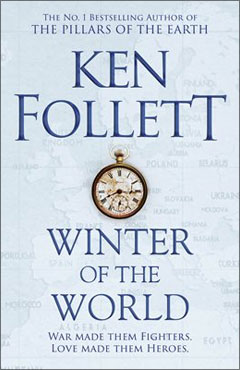

)

## Women and Gender Roles
- [MYTAKE] It's truly insane to think that women during the war spent five years without seeing their husbands, like Carla's parents.
- Since childhood, Carla was very brave: “She hesitated. You were not supposed to sound the alarm unless there was a fire, and a notice on the wall warned of dire penalties.”
- There is an interesting historical parallel here: both Carla in Nazi Germany, who was rejected from medical school for being a woman, and Daisy, married to one of the greatest aristocrats but rarely able to see her husband, suffered because they were women.
- It is shocking how childish Daisy was. Of course, her husband was going to cheat on her.

## Fascism and Authoritarianism
- When Carla asks what makes someone intelligent, her father doesn't know how to answer. This is also a great advantage of fascism: simple answers.
- Couldn't agree more: “You overrate freedom. It doesn’t make people happy. They prefer leadership. I want Werner and Frieda and poor Axel to grow up in a country that is proud, and disciplined, and united.”
- The perfect moment for radicalism to arise is during hard times. When everything is easy, it's very simple to be conservative.
- “Fascism is on the march,” Lloyd began. “And it is dangerously attractive. It gives false hope to the unemployed. It wears a spurious patriotism, as the Fascists themselves wear imitation military uniforms.”
- [MYTAKE] It is fascinating how time changes political opinions. A few years later, Daisy feels ashamed of having supported the fascists—unbelievable! It’s as if nothing had happened. And the funny thing is that this still happens today, after all we see a similar behaviour towards Trump and Bolsonaro.

## Social Classes and Status
- It's very interesting to see the life of the upper class. Not that they are extremely wealthy, but they are at the top of the hierarchy among the humanities crowd.
- Life in high society is sometimes very empty. Deep down, they have nothing to do—after all, there wassn't so much wide spread entertainement as there is today.
- But social classes were very rigid at that time. It's as if people could tell just by looking at someone which class they belonged to. At least today, with money, no one finds it strange.
- It is fascinating how money was not enough back then, and even today, social status is something that cannot be bought. For example, being an L5 at Google might earn you less money than in the market, but my social circle has more respect for the L5.  
“That prospect frightened Daisy. She had made up her mind to marry Boy. She wanted to be Viscountess Aberowen, and then one day Countess Fitzherbert. She had always been rich, but she craved the respect and deference that went with social status.”
- “Daisy and Boy were married at St Margaret’s Church, Westminster, on Saturday, 3 October 1936. Daisy was disappointed it was not Westminster Abbey, but she was told that was for the royal family only.”
- It is impressive how certain traits pass down to the next generation. Daisy has the same cunning and scheming nature as her father, Lev Peshkov.

A beautiful description of Lloyd: “A real grown-up, when the rest of us were just pretending.”

## Politics and Economy

When Carla's brother says that Black people are inferior, I think this wouldn't hold up in modern times because of science. But after watching Bolsonaro on Flow, we see that even the most absurd theses can be seen as true, as long as they: have some kernel of truth and people remain isolated, seeing only one perspective.

I think something very profound that authoritarian movements have to teach us is that everything comes down to people's perception and the economy. Together, these things make a government electorally successful.

It's interesting because this attachment to democracy that people have only exists in favorable economic situations. When you have a currency that is worthless, no one cares about democracy anymore.

## Personal Drama and Relationships
- The pace of events is sometimes a bit too fast, as if the author is in a hurry to establish the narrative's foundation, which is strange for a 1,000-page book.
- At this point, the book feels less engaging because nothing directly related to the war is happening. The drama involving characters unrelated to the war is not very compelling.
- The excess of coincidences makes the book feel somewhat unrealistic.

Additionally, the fact that much of the book focuses on the characters' personal drama makes me want to skip ahead to the parts directly related to the war.

## Historical and Cultural Observations

The truth is that this time (early 20th century) wasn't very good. I only value it because, back then, there was a concern with maintaining a refined and beautiful appearance. But in reality, it was pure aesthetics; that era was actually quite difficult.

It is interesting how things in that era were purely about appearances. For example: “But Bea was not taken in. ‘I can’t recall a family called Peshkov in St Petersburg or Moscow,’ she had said, hardly pretending to be puzzled; and Daisy had forced herself to smile as if it was of no consequence what the princess could remember.”

A humorous moment: “He had said: ‘I don’t want to keep you from your friends – I just wanted to ask about the New Deal,’ and she had replied: ‘Oh, boy, you really know how to flatter a girl.’”

It is remarkable how snobby people were back then. A man couldn’t even admit he was the son of a maid without facing severe judgment.

## Corruption and Power

Lev Peshikov is a very bad man. He sabotaged a competitor's industry to buy it. Truly, we can never trust those who hold great power.

The senator, Woody's father, was engaged to Olga. Then Lev, who was her chauffeur, made her pregnant.

Even though senators were corrupt and did shady things, it's interesting how senators are respected in America: “His mother smiled and said: ‘But, Ursula dear, I was a journalist.’ ‘That’s different, you’re a girl,’ Grandmama replied. ‘Woodrow must become a man of distinction, like his father and grandfather before him.’”

Woody takes pictures of protests showing police brutality. However, the newspaper publishes it as if it were a riot. This makes me reflect on the role of the press. It's impressive how everything it does becomes the truth.

Lev tells a story where an English aristocrat killed his father, and he recounts this story in front of her. This is very interesting because the upper class often projects noble values such as elegance, morality, and respect. However, behind closed doors, they treat the lower classes with values diametrically opposed to those they outwardly express.

## War and Conflict

The war has just begun.

“Maud’s tone became emotional. ‘My husband has dedicated himself, his life, his entire being to making this country free and prosperous. I will not be the cause of his giving up his life’s work. If he loses that, he loses his soul.”

Buffalo 1935: “It doesn’t mean a thing. In this town it’s about how long you’ve been rich. You’re nobody if you work. The superior people are those who live on the millions left by their great-grandparents.”

Daisy (daughter of Lev), Eva, and her mother are now in England. They were in Buffalo in chapter 2.

Context: Eva was Jewish.  
“At the wedding, Daisy had been told that Eva was ‘exotic,’ Jimmy was ‘courageous,’ and the Murrays were ‘marvellously broad-minded,’ all ways of making the best of an unsuitable match.”

