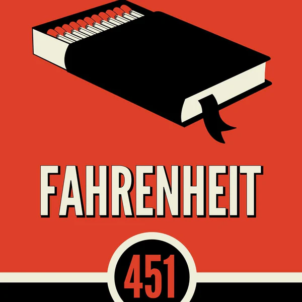

OBSERVATION: This note is highly unstructed, it still needs to be rewritten

# Main Characters in *Fahrenheit 451*

## 1. **Guy Montag**
- The protagonist of the novel.
- A "fireman" whose job is to burn books.
- Begins to question the society he lives in and seeks knowledge and truth.

## 2. **Mildred Montag**
- Montag’s wife.
- Obsessed with television and conforming to societal norms.
- Emotionally disconnected and indifferent to Montag's growing unrest.

## 3. **Captain Beatty**
- Montag’s boss at the firehouse.
- Well-read but cynical; defends censorship and the status quo.
- Acts as both a mentor and antagonist to Montag.

## 4. **Clarisse McClellan**
- A curious and free-spirited teenage girl.
- Introduces Montag to new ways of thinking.
- Her disappearance sparks Montag's transformation.

## 5. **Faber**
- A former English professor.
- Helps Montag understand the value of

# Detailed Summary

## Part 1: *The Hearth and the Salamander*

In a bleak future where books are outlawed and independent thought is suppressed, Guy Montag works as a fireman—but in this world, firemen don't extinguish fires, they start them. Montag’s job is to burn books, which are seen as dangerous sources of conflicting ideas and unhappiness. He takes pride in his work and lives a relatively unthinking life with his emotionally disconnected wife, Mildred.

Montag’s worldview begins to crack when he meets Clarisse McClellan, a 17-year-old girl who is curious, reflective, and full of wonder about the world. She asks him questions no one else dares to, such as whether he is truly happy. Her presence awakens something dormant in Montag. As they talk more, Clarisse tells Montag about her odd, thoughtful family and her habit of walking and observing the world—activities that are frowned upon in their society.

Soon after, Clarisse disappears, presumed dead. Around the same time, Montag witnesses a shocking event: a woman chooses to be burned alive with her hidden books rather than live without them. Deeply disturbed, Montag begins to steal and hide books in his own home, driven by a growing sense of emptiness and curiosity about what knowledge might lie within them.

Montag’s inner conflict deepens, and he becomes increasingly alienated from his wife, who is obsessed with television “parlor walls” and addicted to sleeping pills. The distance between them grows as Montag begins to question not just his job, but the entire foundation of the society he lives in.

---

## Part 2: *The Sieve and the Sand*

Haunted by his experiences and desperate to understand the meaning behind books, Montag contacts Faber, a former English professor he once met in a park. Though initially reluctant, Faber agrees to help Montag learn how to read and interpret books. They develop a plan to undermine the fireman system by reproducing books and planting them in the homes of firemen to discredit the institution from within.

Montag's rebellion begins to take form, but his growing restlessness becomes obvious to those around him. His conversations with Mildred become more strained, and she is horrified when he starts reading aloud in front of her friends. The confrontation drives a deeper wedge between them, and she eventually betrays him to the authorities.

Captain Beatty, Montag’s superior, grows increasingly suspicious and confronts Montag with philosophical quotes and literary allusions, challenging him and trying to confuse and intimidate him. Beatty represents the voice of the oppressive regime, defending censorship as a means to keep society comfortable and avoid controversy.

As Montag’s internal conflict reaches a boiling point, the firemen receive an alarm call—to Montag’s own house. Beatty forces Montag to burn down his home himself, and when pushed too far, Montag turns the flamethrower on Beatty, killing him.

---

## Part 3: *Burning Bright*

Now a fugitive, Montag escapes the Mechanical Hound—a robotic enforcer used to hunt down those who break the law—and flees the city. He finds refuge in the countryside, where he meets a group of intellectual outcasts led by a man named Granger. These individuals have committed entire books to memory, preserving literary knowledge orally in hopes that society may someday value it again.

As Montag integrates with this group, he begins to find peace and a new sense of purpose. Meanwhile, the city he fled from is destroyed in a nuclear war, symbolizing the complete collapse of the society that rejected knowledge and truth.

In the aftermath, Montag and the others walk toward the ruins of the city, prepared to help rebuild civilization. The novel ends with a note of cautious hope—through memory and reflection, a new beginning may arise from the ashes.

### Themes and Analysis

#### Clarisse and Individuality
- The character Clarisse is fascinating—original, exciting, and peculiar. She embodies the "manic pixie dream girl" archetype in a refreshing way.
- Certain people ask profound questions that linger in our minds, shaping our thoughts. Clarisse, despite being vastly different, has a presence akin to Coach Carter—memorable and impactful.
- When Clarisse mentions that pictures once talked, it serves as a compelling commentary on how we approximate probabilities based on past events, often overlooking the potential for unexpected outcomes with significant consequences.

#### Education and Indoctrination
- The government's approach to education reminds me of Taleb's theory: a willingness to suppress an entire system to eliminate volatility, which ultimately harms humanity.
- Montag's wife and her friends in the parlor seem utterly indoctrinated, living in a "matrix" of their own making. They choose to ignore reality and embrace mundane lives.
- Mildred's disdain for the past, particularly books, is nonsensical. Her beliefs are clearly the result of indoctrination.
- The normalization of absurdities, like a mother interacting with her children only three days a month, is chilling. This book vividly illustrates humanity's capacity to adapt to anything.

#### Books and Intellectual Freedom
- Faber's explanation of why books are valuable is thought-provoking. He highlights that reading is an active process, unlike passive media like TV. This resonates with me; consuming commentary on platforms like YouTube often leads to uncritically accepting the narrator's opinions. Reading, by contrast, fosters critical thinking and resists indoctrination.
- It's fascinating that people in the story stopped reading books on their own, not solely due to top-down enforcement.
- The story of how books became forbidden, while exaggerated, resonates with modern trends. Today, there are far more trivial forms of entertainment than intellectual pursuits, even if we don't read more than previous generations.

#### Totalitarianism and Society
- The elections are a farce, designed to ensure a predetermined outcome by pitting a "loser" against a "winner."
- The idea that firemen once prevented fires rather than starting them is a striking reversal of expectations.
- The looming war creates a sense of shared ignorance with the characters, as both they and the readers are left in the dark about the unfolding events.
- The image of a looming war, with bombs about to fall while people remain oblivious in their parlors, is hauntingly powerful.

#### Montag's Journey and Awakening
- Montag's wife's reaction to discovering his hidden books is both humorous and intriguing, treating them as if they were the ultimate taboo.
- When Montag confesses to his wife about burning a woman, her indifference is unsettling. It aligns with the notion that human behavior is largely constructed and that people can adapt to almost anything.
- Montag and Faber's awakening mirrors my own feelings of occasionally "sleepwalking" through life. Taking risks and doing what feels right can be profoundly liberating.
- The plot twist where Montag is ordered to burn his own house is gripping.
- Montag's escape from the Hound is beautifully written: "he felt as if he had left a stage behind and many actors."

#### Technology and Its Dangers
- The mechanical hound evokes the chilling potential of technology to worsen our lives. With great power comes great responsibility.

#### Hope and Renewal
- The depiction of country life offers a refreshing escape from indoctrination, even in our real world.
- The ending, though inconclusive, is unusually optimistic for a dystopian novel. The totalitarian society has seemingly destroyed itself, leaving room for a wiser, more humane world to emerge from the survivors.

#### Miscellaneous Observations
- The portrayal of professors as both sexy and dangerous is intriguing.
- The line about "old Harvard degrees" being hunted is a stark reminder of how society can irrationally vilify or revere certain things.
- It seems contradictory that Mildred showed poetry to her friends. Their ignorance and conformity are both frustrating and tragic.
- The depiction of how books became forbidden resonates with modern trends, where trivial entertainment often overshadows intellectual pursuits.

