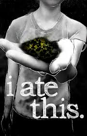

# Memory Trigger

1. Dense and Detailed Prose: The narrative is packed with intricate descriptions and an "encyclopedic display of knowledge," incorporating themes like media theory, addiction, and national identity.
2. Loneliness: Tennis as a Metaphor, The sport symbolizes the isolating nature of modern life, where individuals compete in solitude.
3. Addiction: Addiction is a central theme, explored not just in terms of substances but also behaviors, entertainment, and societal dependencies. It expanded my understanding of addiction.
- For example the girl that kept her baby even though it was dead already
4. Literary Significance: Frequently cited as one of the most difficult books to read of the 20th century due to its complexity and depth.
5. Hedonism and Its Consequences: The book exaggerates—or perhaps accurately portrays—the dangers of hedonism through "The Entertainment," a film so pleasurable it renders viewers incapable of doing anything else.
6. I love how it relates to the whole history of mankind's philosophy
7. Platos' dialogue mockery
- And the disbelief over american philosophy on present times (or any time really)

# Basics

https://www.youtube.com/watch?v=yPgANelYih0&ab_channel=CalebSmith

## What This Book is about
- *"I think that if there is a sort of sadness for people under 45, it has something to do with pleasure, achievement, and entertainment."*
- This book is about everything and nothing. It asks the question, "Why?" Why do we consume endless entertainment? Why do we engage in behaviors that harm us? And what makes this distinctly American?
- It critiques how technology increasingly makes it easier and more pleasurable to consume media, often at the expense of meaningful human connection.
- “We are all dying to give our lives away to something, maybe. God or Satan, politics or grammar, topology or philately - the object seemed incidental to this will to give ourselves away, utterly. To games or needles, to some other person. Something pathetic about it. A flight-from in the form of a plunging-into. Flight from exactly what? These rooms, blandly filled with excrement and heat? To what purpose?”
- - The best summary I have seen so far on the meaning of this book

## My Interpretation of the Big Picture

### Literary Overdose
- Reading this book feels like a literary overdose. Every aspect of contemporary life is quintessentially epitomized. The experience of reading it mirrors the overwhelming nature of modern existence, akin to the highs and lows of drug use. I find this book "irritatingly perfect."

### Infinity
- The concept of infinity is explored both mathematically and emotionally. While mathematically infinite numbers dwarf any conceivable quantity, Wallace's hyperrealistic approach makes the reader feel the infinite complexity of the world. The book conveys a sense of boundless information and experience.

## The Entertainment

- **“Infinite Jest”**  
  A mysterious and fatally entertaining film cartridge — so captivating that viewers lose all interest in anything else, including survival.

# Plot Summary

## Part 1: The Setup – Institutions, Addiction, and the Entertainment

- The story is set in an alternate near-future North America under the Organization of North American Nations (O.N.A.N.), where time is subsidized by corporations.
- The narrative orbits two main institutions in Enfield, Massachusetts:
  - **Enfield Tennis Academy (ETA)**: an elite prep school for young tennis players.
  - **Ennet House Drug and Alcohol Recovery House**: a nearby halfway house for addicts.
- The **Incandenza family**—Hal (gifted student/tennis prodigy), his filmmaker father James O. Incandenza (creator of ETA and a mysterious film), and his domineering mother Avril—are at the story’s core.
- A lethal film cartridge, known as **"Infinite Jest"**, surfaces. It’s so entertaining that anyone who watches it loses the will to do anything else.
- Several groups—including U.S. government agents and a Québécois separatist group (Les Assassins des Fauteuils Rollents)—are trying to locate the master copy.

## Part 2: Collapse – Addiction, Loss, and Conspiracy

- **Don Gately**, a recovering addict and staffer at Ennet House, becomes a key figure. Through his recovery, we see the struggle for meaning and the power of communal support.
- **Hal**, once brilliant, begins to emotionally and cognitively unravel, possibly from drug use or deeper psychological issues.
- Characters from both ETA and Ennet House become increasingly intertwined, especially as their lives orbit the missing film.
- **Joelle Van Dyne**, a veiled woman and former lover of JOI, enters Ennet House. She may be the star of "Infinite Jest" and holds clues about its origin.
- Political tension builds as the separatists plot to use the film as a weapon of mass entertainment, threatening the stability of O.N.A.N.

## Part 3: Fragmentation and Unanswered Questions

- The narrative becomes increasingly fractured, with events told out of sequence and major plot points implied rather than shown.
- Don Gately lies gravely wounded, possibly hallucinating a vision of redemption and memory.
- Hal’s descent continues—by the novel’s opening scene (chronologically set after most events), he is nearly catatonic, unable to express himself despite mental clarity.
- The whereabouts of the master copy of "Infinite Jest" remain unknown—though hints suggest it was buried with JOI's head.
- The book ends midstream, requiring readers to piece together its cyclical structure and central mysteries from scattered fragments.

# Hyper realism

Gives an insane amount of details about something to the point that it conveys perfectly how it feels like. A great tool for epitomization
- (End of parties) "Você pode estar em certas festas e não estar lá de verdade. Você pode ouvir como certas festas têm os seus próprios fins implicados já embutidos na coreografia da própria festa. Um dos momentos mais tristes que Joelle van Dyne sente em qualquer lugar é aquele eixo invisível onde uma festa acaba — até uma festa ruim —, aquele instante de tácita aquiescência em que todo mundo começa a juntar isqueiros e namorados, jaqueta ou casacão, aquela última cerveja presa ao plástico que viu outras cinco saírem, diz certas coisas perfunctórias para a anfitriã de uma maneira que ela reconhece essa perfunctoriedade sem parecer insincera, e sai normalmente fechando a porta. Quando a voz de todo mundo vai sumindo no corredor. Quando a anfitriã se vira depois de fechar a porta e vê a bagunça e o V de silêncio total se expandindo na esteira da festa."

# Humour
## Humor in *Infinite Jest*

The humor in *Infinite Jest* primarily revolves around exposing the absurdities of contemporary society. Wallace masterfully highlights these issues in ways that are both exaggerated and eerily realistic, creating a unique blend of satire and hyperrealism.

### Metamodernism
- The book employs extensive footnotes, which serve as a metafictional device. These footnotes mimic the back-and-forth rhythm of a tennis match, reflecting the book's recurring themes of competition and disconnection.

### Terrorists as Philosophers
- In the world of *Infinite Jest*, the philosophers of society are portrayed as terrorists. This is both a critique and a darkly humorous inversion of traditional roles.
- The terrorist groups, known as the "Wheelchair Assassins," are literally in wheelchairs. 
    - One particularly absurd yet chilling scene describes the assassins killing a cartridge shop owner in Quebec. The narrative builds tension by describing the eerie squeaking of their wheelchairs, which initially feels terrifying. However, upon reflection, the idea of wheelchair-bound assassins becomes darkly comedic due to its inherent contradiction.
- Wallace also parodies philosophical dialogues, reminiscent of Plato, through a bizarre conversation between a trans triple agent and a quadruple agent assassin in a wheelchair. This dialogue unfolds as they watch catapults hurl garbage into the northwest, adding another layer of absurdity.

### Addiction and Recovery
- Wallace frequently juxtaposes harrowing stories of addiction with moments of dark humor. For instance:
    - The Alcoholics Anonymous (AA) meetings are portrayed as gatherings of individuals who are, in their own way, "badasses." Many of them have contemplated suicide, yet they sit through the meetings, enduring what they perceive as politically correct platitudes.
    - The humor lies in the raw, unfiltered honesty of these characters, who are simultaneously tragic and resilient.

### Struggles with Connection
- The book poignantly explores the difficulty of forming genuine human connections:
    - In one scene, Orin talks to Hal about their father's suicide (via a microwave), while Hal nonchalantly clips his nails. The juxtaposition of such a heavy topic with mundane behavior underscores the characters' emotional detachment.
    - Another example is Hal's relationship with his father, who once dressed as a therapist to get Hal to open up. When Hal realizes the connection between his father and the wardrobe, he immediately stops talking and becomes mute.
- Ultimately, *Infinite Jest* is about people who are desperately hungry for connection but are profoundly bad at achieving it. This tragicomic struggle is central to the book's narrative.

### Chronology and Structure
- The book's structure itself is a source of humor and frustration:
    - The first chapter is chronologically the last, creating a circular narrative that leaves readers chasing an ending that has already occurred.
    - A character introduced in the second chapter never reappears in the novel, further subverting traditional storytelling expectations.

### Satire of American Culture
- Wallace's critique of American culture is both scathing and absurd:
    - Canada and Mexico are merged with the United States into an organization called ONAN, a name that references masturbation, symbolizing a culture of self-indulgence.
    - The U.S. produces so much garbage that it elects a president who promises to "clean up America." His solution? Dump all the waste into Canada and construct massive fans

# Philosophy

## Marathe critizes hedonism
- "Then in such a case your temple is self sentiment. THen in such an instance you are fanatico of desire, a slave to your individual sentiment"

## Illusion of freedom
- "Marathe estava disposto a que a sua voz não se elevasse. 'Pois esta escolha determina todo o resto. Não? Todas as outras escolhas que vocês dizem que são livres decorrem disto: qual é o nosso templo. Qual é o templo, portanto, para os EUA? O que acontece, quando você teme ter que protegê-los de si mesmos, se os perversos quebequenses conspiram para trazer o entretenimento para seus lares acolhedores?"
- If large corporations or society dictate what we worship, can we truly claim to be free?

## Genealogy of American Values
- The American philosophy is the British one according to their own culture
- There was some silence
for thinking until Marathe finally said, looking up and off to think: 'This U.S.A. type of person and desires appears to me like
almost the classic, how do you say, uti-litaire.
- The American genius lies in the realization that, at some point in history, the pursuit of individual good by each American collectively contributes to maximizing the greater good for everyone.

## Criticism to American philosophy
- What if someone's hapiness matter more than others
- "Good. This is well. Delayed gratification. How does my U.S.A.-type mind calculate long-term overall pleasure and then decide to sacrifice this intense, immediate craving for soup in favor of the greater, long-term benefit?"

## Philsophical value of the Entertainement
- It's kind of a thought experiment, kinda of similar to the experience machine from Robert Nozick.
- "Are you understanding? I am asking between only us.
How could it be that A.F.R. malice could hurt all of the U.S.A. culture by making available something as momentary and free as
the choice to view only this one Entertainment? You know there can be no forcing to watch a thing. If we disseminate the
samizdat, the choice will be free, no? Free from force, no? Yes? Freely chosen?"

# Addiction

## What is addiction?
- David Foster Wallace (DFW) broadens the definition of addiction, framing it as anything one relies on to make time pass.

## What is the key problem of us at a society of handling addiction
- "A maneira como ela balançou a cabeça de repente foi veemente, exasperada. 'O sentimento é o motivo 
pelo qual eu quero. O sentimento é a razão pela qual quero morrer. Estou aqui porque quero morrer. Por 
isso estou num quarto sem janelas e com gaiolas sobre as lâmpadas e sem fechadura na porta do 
banheiro. Por que levaram meus cadarços e meu cinto. Mas noto que eles não tiram o sentimento, não é?"

## What people do in a society of overstimulation
- Kate is now the third character in the book with a serious marijuana addiction, which is strange considering that (as Kate herself points out) marijuana is not considered to be a highly addictive or debilitating drug. The fact that so many characters are addicted to weed suggests that something about the world of the novel compels people to seek out a calming, numbing effect more than a stimulating one.

## The control of the addiction over us
- (Joel is in a party bathroom using drugs) "Chega de apertar o coração toda noite. O que parece ser a saída da jaula é na verdade as barras da jaula. As malhas do entardecer. A entrada diz SAÍDA. Não há saída. A fusão anular final: entre animal exibido e jaula. O próprio Jaula III: Espetáculo gratuito. Foi a jaula que entrou nela, de alguma maneira. A engenhosidade da coisa toda está além da compreensão dela. A Diversão faz tempo abandonou o Demais. Ela perdeu a capacidade de mentir a si própria sobre a sua capacidade de parar ou até de gostar daquilo, ainda. Ela não delimita e preenche o buraco mais. Ela não delimita mais o buraco. Há um certo cheiro que têm os véus molhados de chuva. Alguma coisa de um telefonema e da lua, dizendo que a lua nunca virava a cara. Em revolução mas ainda assim não. Ela tinha saído correndo no último T da noite e ido para casa e pelo menos finalmente não tinha desviado o rosto da situação, da questão de que ela não amava mais aquilo, mas odiava e queria parar e também não conseguia parar ou imaginar parar ou viver sem aquilo. Ela tinha de certa forma feito como tinham feito o Jim fazer perto do fim e admitido a sua impotência diante dessa jaula, desse espetáculo ingratuito, chorando, literalmente apertando o coração, fumando primeiro os restos de esponja de aço que tinha usado para prender os vapores e formar uma resina fumável, depois pedacinhos de carpete e a calcinha de acetato com que tinha filtrado a solução horas antes, chorando, desvelada e descabelada, como um palhaço grotesco, em todos os quatro espelhos das paredes do seu quartinho.
- (Joel is in a party bathroom using drugs) Foi quando as mãos dela começaram a tremer durante essa parte do procedimento de preparo que ela percebeu pela primeira vez que gostava disso mais do que alguém pode gostar de alguma coisa e ainda continuar vivo. Ela não é boba"
- Chapter 44 the story of the girl that would carry the dead infant around, those scenes are pretty wild
- "Ela pega a vareta negra de arame do cabide e
começa a mexer e amassar o conteúdo recém-borbulhado do tubo, sentindo ele se espessar
rapidamente e crescer sua resistência aos minúsculos círculos do arame. Foi quando as mãos
dela começaram a tremer durante essa parte do procedimento de preparo que ela percebeu
pela primeira vez que gostava disso mais do que alguém pode gostar de alguma coisa e ainda
continuar vivo. Ela não é boba."
- "aí mais Perdas, com a Substância parecendo ser o único consolo para a dor das Perdas
que se acumulam, e claro que você fecha os olhos para o fato de que é a Substância que está
causando essas mesmas Perdas de que ela te consola"
- “Quando eu estava bêbado eu queria ficar sóbrio e quando eu estava sóbrio eu queria ficar
bêbado”, John L. diz; “Eu vivi desse jeito durante anos, e eu digo a vocês que isso não é vida,
isso é uma porra de uma morte-em-vida.”
- "aí ultimatos vocacionais, inempregabilidade, ruína financeira, pancreatite, uma culpa
atordoante, vômito com sangue, neuralgia cirrótica, incontinência, neuropatia, nefrite,
depressões profundas, uma dor lacerante, com a Substância concedendo períodos cada vez
menores de alívio;"
- "aí você está ferrado, bem ferrado, e sabe, finalmente, totalmente ferrado, porque essa
Substância que você achava que era o seu único amigo, pela qual você desistiu de tudo, feliz,
que por tanto tempo te propiciou um alívio da dor das Perdas que o seu amor por esse alívio
causou, a sua mãe, a sua amante e o seu deus e camarada, finalmente retirou sua máscara de
smiley pra revelar olhos sem centro e uma bocona faminta, e caninos até aqui ó, é o Rosto no
Chão, a sorridente face lívida dos seus piores pesadelos, e o rosto é o seu próprio rosto no
espelho, agora, é você, a Substância devorou ou substituiu e virou você, e a camiseta
encrustada de vômito, baba e Substância"

## Rehab

What do you need in rehab
- "Pat told Gately that grim
honesty and hopelessness were the only things you need to start recovering from Substance-addiction, but that without these
qualities you were totally up the creek. Desperation helped also, she said."

## God
- "His sole experience so far is that he takes
one of AA's very rare specific suggestions and hits the knees in the a.m. and asks for Help and then hits the knees again at bedtime
and says Thank You, whether he believes he's talking to Anything/body or not, and he somehow gets through that day clean. This,
after ten months of ear-smoking concentration and reflection, is still all he feels like he 'understands' about the 'God angle.'
Publicly, in front of a very tough and hard-ass-looking AA crowd, he sort of simultaneously confesses and complains that he feels
like a rat that's learned one route in the maze to the cheese and travels that route in a ratty-type fashion and whatnot. W/ the God
thing being the cheese in the metaphor. Gately still feels like he has no access to the Big spiritual Picture. He feels about the
ritualistic daily Please and Thank You prayers rather like like a hitter that's on a hitting streak and doesn't change his jock or socks
or pre-game routine for as long as he's on the streak. W/ sobriety being the hitting streak and whatnot, he explains. The whole
church basement is literally blue with smoke. Gately says he feels like this is a pretty limp and lame understanding of a Higher
Power: a cheese-easement or unwashed athletic supporter. He says but when he tries to go beyond the very basic rote automatic
get-me-through-this-day-please stuff, when he kneels at other times and prays or meditates or tries to achieve a Big-Picture
spiritual understanding of a God as he can understand Him, he feels Nothing — not nothing but Nothing, an edgeless blankness
that somehow feels worse than the sort of unconsidered atheism he Came In with. H"
- "It was the first time he'd been out of this kind of mental cage since he was maybe ten. He couldn't believe it.
He wasn't Grateful so much as kind of suspicious about it, the Removal. How could some kind of Higher Power he didn't even
believe in magically let him out of the cage when Gately had been a total hypocrite in even asking something he didn't believe in
to let him out of a cage he had like zero hope of ever being let out of? When he could only get himself on his knees for the prayers
in the first place by pretending to look for his shoes? He couldn't for the goddamn life of him understand how this thing worked,
this thing that was working. It drove him bats."
- "That was months ago. Gately usually no longer much cares whether he understands or not. He does the knee-and-ceiling thing
twice a day, and cleans shit, and listens to dreams, and stays Active, and tells the truth to the Ennet House residents, and tries to
help a couple of them if they approach him wanting help. And when Ferocious Francis G. and the White Flaggers presented him,
on the September Sunday that marked his first year sober, with a faultlessly baked and heavily frosted one-candle cake, Don
Gately had cried in front of nonrelatives for"

# Tennis

## Tennis as a metaphor for life in capitalism
- It seems that the kids in E.T.A are actually rich, because apparently someone mentioned except Pemus and Wayne, the other kids can be sent to any college. If that's the case why are they doing this?
- - Which is a metaphor why people keep climbing the ladder
- [MYTAKE] The choice of tennis as a central theme is insightful, as it mirrors the isolating effects of capitalism. It individualizes people, placing them in separate competitions where they must face opponents they neither know nor wish to confront. This metaphor highlights how modern systems often prioritize individual success over collective connection.

## Success as a need
- This is exagerated through Clipperton
- Clipper-ton climbs up the rungs of the lifeguardish chair the umpire in his blue blazer158148
sits in and uses the umpire's mike to make public his intention of blowing his personal brains out all over the court with the
hideous Clock, should he lose.

## Psychological burdens due to succes
- "Clipperton places to his
right — not left — temple, as in with his good right stick-hand, closes his eyes and scrunches up his face and blows his
legitimated brains out for real and all time, eradicates his map and then some; and there's just an ungodly subsequent mess in
- This is ironic and darkly humorous because everyone assumed he would end up killing others, but instead, he tragically killed himself."
- The tennis player who committed suicide:
- "With a ghastly mouthful of lethal Quik, and apparently his dad hears the thump."
of the kid keeling over and rushes into the kitchen in his bathrobe and leather slippers and tries to give the kid mouth-to-mouth
resuscitation, and but gets the odd bit of NaCN-laced Quik in his own mouth, from the kid, and also keels over and turns bright
blue, and dies, and then the mom rushes in in a mud-mask and fluffy slippers and sees them both lying there bright blue and
stiffening, and she tries giving the architect dad mouth-to-mouth and is of course in short order also lying there keeled over and
blue, wherever she's not mud-colored, from the mask, and but anyway dead as a rivet. And since the family has six more variousaged kids who as the night wears on come in from dates or patter down the stairs in little pajamas with adorable little pajama-feet
attached to them, drawn by the noise of all the cumulative keeling over, plus I should mention the odd agonized gurgle-sound, and
but since all six kids had gone through a four-hour Rotary-sponsored CPR course at Fresno's YMCA, by the end of the night the 
whole family's lying there blue-hued and stiff as posts, with incrementally tinier amounts of lethal Quik smeared around their
rictus-grimaced mouths; and in sum this whole instance of unprepared-goal-attaintment-trauma is unbelievably gruesome and sad,
and it's one historical reason why all accredited tennis academies have to have a Ph.D.-level counselor on full-time staff, to screen
student athletes"

## Competition

Capitalism and competition
- [MYTAKE] One striking aspect of this book is its portrayal of the immense suffering and emotional toll embedded in the pursuit of excellence within capitalist entertainment. For someone like Federer to emerge, countless young tennis players undergo grueling training, with only a rare few achieving greatness. It’s akin to squeezing 10,000 oranges to extract a single drop of exceptional talent, discarding all the rest in the process.

## Potential

### Lost Potential
- Jim's father: "O talento eh a expectativa do proprio talento, Jim: ou voce vive o talento ou ele te acena de lencinho, pra sempre se afastando. Eh teu ou adues, ele dizia por cima do jornal. Eu... eu so tenho medo de ter uma lapide que diga aqui jaz um velho promissor. Eh.... potencial pode ser pior que falta, Jim."
- - This is a very strong learning, and very sad, as marshall sad there is a sort of sadness related to achievement, and I completely understand that because of the IMO, this quote really has a lot to do with me
- Jim: "you either live up to it or it waves a hankie, receding forever. Use it or lose it, he say over the newspaper. I’m…I’m just afraid of having a tombstone that says HERE LIES A PROMISING OLD MAN. Potential maybe worse than none, Jim. Than no talent to fritter in the first place, lying around guzzling because I haven’t the balls to…God I’m I’m so sorry Jim. You don’t deserve to see me like this. I’m so scared, Jim. I’m so scared of dying without ever really being seen. Can you understand? Are you enough of a big thin prematurely stooped young bespectacled man, even with your whole life still ahead of you, to understand? Can you see I was giving it all I had?"

### Failure
- [MYTAKE] It is very emblematic and epic, that the moment where Jim's cold grand father sad "Eh, mas ele nunca vai ser grande" is the exact moment where he fails because he tropecou on something, as Jim's father sad: "Num minuto eu estava numa desbalada e linda carreira rumo a bola, no minuto segunite havia maos nas minhas costas e nada embaixo dos pes como um empurrao numa escadaria"

# American Culture

## Loneliness
- [MYTAKE] The choice of tennis as the central sport is particularly insightful, as it mirrors the competitive nature of modern life—a relentless race where individuals strive to accumulate capital. In this isolating pursuit, the only semblance of community arises from shared struggles, such as skyrocketing rent prices, healthcare costs, and other systemic challenges. While the book hints at the possibility that these shared problems are intentionally designed to foster a sense of connection, I remain skeptical of such a deliberate orchestration.

## Ad Campaign
- "The NoCoat campaign had three major consequences. The first was that horrible year Hal vaguely recalls when a nation
became obsessed with the state of its tongue, when people would no sooner leave home without a tongue-scraper and an
emergency backup tongue-scraper than they'd fail to wash and brush and spray. The year when the sink-and-mirror areas of public
restrooms were such grim places to be."

## American Culture
- Did not both Iraq and Iran call U.S.A the Very Large Satan
- "Marathe fazia pequenos círculos enfáticos e cortes no ar enquanto falava: “Esses fatos da
situação, que dizem com tanta clareza o medo do seu Bureau desse samizdat: agora é o que
aconteceu quando um povo não escolhe nada mais para amar além de si próprio, cada um. Um
EUA que morreria — e deixaria seus filhos morrerem, cada um — pelo suposto perfeito
Entretenimento, por esse filme. Que morreria por essa chance de receber de bandeja essa
morte de prazer, em seus lares quentinhos, sozinhos, imóveis: Hugh Steeply, com completa
seriosidade como cidadão de seu vizinho eu te digo: esqueça por um só momento o
Entretenimento e pense em vez disso em EUA onde uma tal coisa pode ser possível a ponto de
seu Escritório ter medo: será que tal EUA pode ter esperança de sobreviver muito tempo? De
sobreviver como uma nação de povos? De menos ainda exercer um domínio sobre outras
nações de outros povos? Se esses são outros povos que ainda sabem o que é escolher? que
aceitam morrer por algo maior? Que sacrificam o lar quentinho, a mulher amada em casa, as
pernas, até a vida, por uma coisa maior que os próprios desejos de sentimento deles? que
escolheriam não morrer de prazer, sozinhos?”.
-  "Para manter vocês juntos, o ódio de um outro. Gentle é louco dentro da cabeça, mas nessa ‘culpa de alguém’ ele estava correto em dizer. Un ennemi commun. Mas não alguém fora de você, esse inimigo. Alguém ou algum povo dentro de sua própria história um dia matou já sua nação EUA, Hugh. Alguém que tinha autoridade, ou devia ter tido autoridade, e não exercitou autoridade. Eu não sei. Mas alguém em algum momento deixou vocês esquecerem como escolher, e o quê. Alguém deixou seus povos esquecerem que era a única coisa de importância, escolher. Tão completamente esquecendo que quando eu digo escolher para você você faz expressões com o rosto como que ‘Láááá se vamos nós’. Alguém ensinou que templos são para fanáticos só, tirou os templos e jurou que não havia necessidade de templos. E agora não há abrigo. E não há mapa para achar o abrigo de um templo. E vocês todos andam tateando no escuro, nessa confusão de permissões. A sem-fim busca da felicidade da qual alguém deixou vocês esquecerem as velhas coisas que
possibilitam a felicidade. Como é que vocês dizem: ‘Está valendo tudo’?”
- “Não existem escolhas sem liberdade pessoal, rapá. Não somos nós que estamos mortos por
dentro. Essas coisas que vocês acham tão fracas e desprezíveis em nós — elas são só os
riscos da liberdade.”

## Politics

Prediction of global need for anti establishment
- "Johnny Gentle's campaign positions him as an outsider, rejecting traditional left or right political alignments. He claims that the real issue lies with the current political establishment and promises to bring entirely unconventional solutions. Interestingly, Johnny Gentle is a television personality, drawing parallels to figures like Donald Trump."

# Statistics

1. 60% of the people that are arrested for crimes realtead to drug and alcohol mentioned that they sufered domestic abuse

2. That some prostitutes addicted to drugs have more trouble leaving the prostitution than leaving the drugs

3. 50% of the people with addiction to substances suffer also from some othe type of recognizable psychiatric problem

4. Some prostitutes use enemas so much that they can't poop without one anymore

5. It is statistically easier for someone with low QI to stop a vice  than some with a hjigher QI

6. Ainda que dos alcoólicos e drogados que
compõem mais de setenta por cento dos suicidas 
