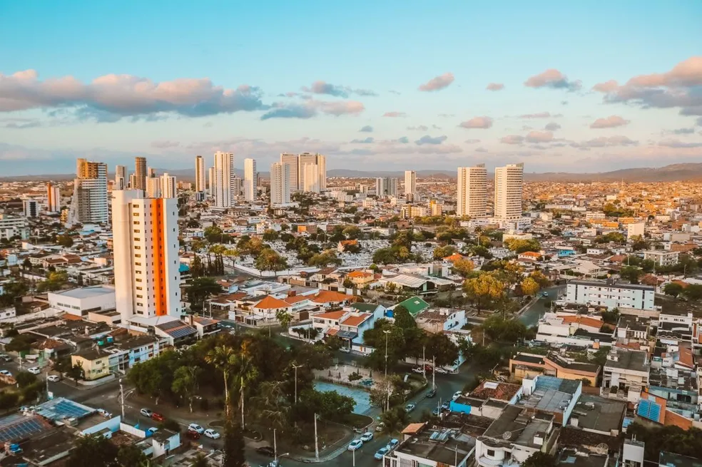

Podias ter saído de uma música de Bruce Springsteen,  
Freehold New Jersey num sabor pernambucano  

És uma cidade sem metas, sem futuro, onde as ruas  
permanecem as mesmas por décadas, e o tempo escorre  
que nem a música "como os nossos pais" de Elis Regina 

Nessa imobilidade, evidencias o absurdismo que é a vida,  
demonstrando que nossas existências se reduzem a tempo mal gasto  
e dores sem significado algum  

E ainda assim, tua pequena burguesia se embevece por pecar  
com o pouco dinheiro que possui,  ignorando que  
aquilo que mais admiram não vale nada / fora destes trópicos esquecidos 

Mas eu te amo apesar de tudo isso, pois tu és minha Penny Lane,  
do Diocesano ao Quintas da Colina. És única justamente  
por não ter nada além de pessoas que vivem e sonham  
como em qualquer outro lugar do planeta.