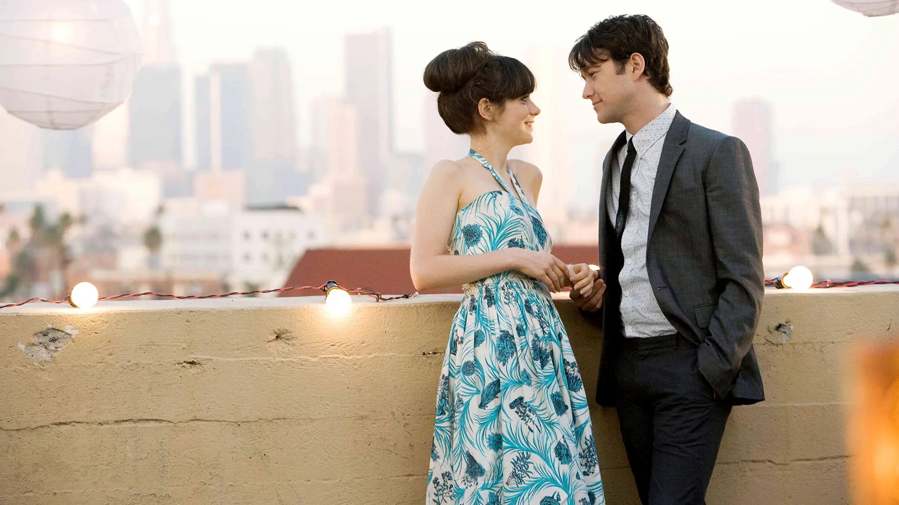
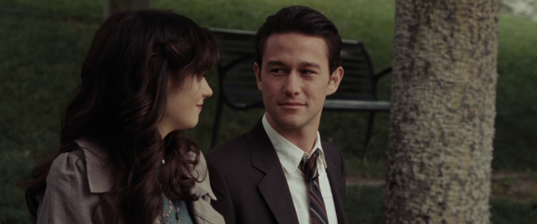
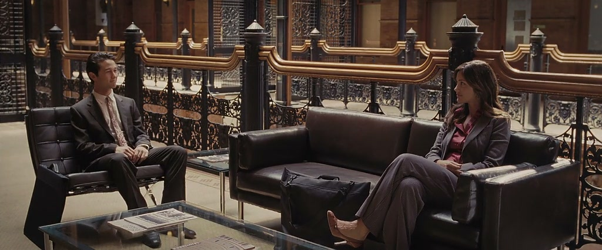

# 500 Days of Summer: When Fantasy Meets Reality

I've always been drawn to the unconventional. As a Brazilian who supports the Argentinian national team, I find something inherently stifling about following prescribed paths. There's beauty in adding unexpected color to our lives, in seeing what emerges when we deviate from expectations. "500 Days of Summer" embodies this spirit of contradiction.

The film speaks directly to every Smiths fan who has crafted their own "Summer" in their head. It asks: what if this idealized person actually materialized in the real world? How would we respond when our fantasy becomes flesh and blood? Tom represents the quintessential dreamer in all of us, while Summer embodies the classic manic pixie dream girl archetype—except the film cleverly subverts this trope. Like "The Boys" deconstructs superheroes by bringing them into reality, "500 Days of Summer" reveals how these romantic idealizations crumble when exposed to the complexities of actual human beings.

Tom learns through heartache that his perfect match isn't the enigmatic girl he's constructed in his imagination, but someone authentic who brings genuine value to his life—like Autumn. The director does all of us "Toms" a profound service by encouraging us to abandon our fantasies and embrace reality, which ultimately offers much richer rewards.

No matter how desperately Tom tries to make Summer value what he values, she maintains her autonomy. She doesn't listen to the Spearmint tape with the same reverence; she never validates his tastes in the way he craves. Summer's defining characteristic is her authenticity and independence, which reveals the fundamental flaw in the manic pixie dream girl fantasy: how can someone simultaneously be "perfect for you" while remaining fiercely independent? These contradictory expectations demonstrate how what we desire most passionately can sometimes be precisely what's wrong for us. Summer will never provide to you a key aspect of a relationship, comfort and security, something that Tom needs the most.

The final scenes have captivated me countless times. I'm particularly struck by the visual and emotional asymmetry between Tom's interactions with Summer versus Autumn. When Tom meets Summer at the end, they present the dark side of their faces to each other, while in his encounter with Autumn the bright side of their faces face each other. This light contrast illustrates how one relationship brought out the worst in both parties, while the new possibility promises to elicit their best selves.

This narrative brilliantly embodies the Rolling Stones wisdom that "you can't always get what you want, but you might just get what you need." Tom wanted Summer—the season most universally adored—while underestimating Autumn, a season often overlooked. He dreamed of bringing his love to Angels Plaza but instead meets someone new at the Bradbury Building. Since Autumn works in architecture, she may provide exactly the catalyst he needs to pursue his own dreams. What Tom lacks most is self-confidence, representing a classic Kierkegaardian existential crisis by weakness.

This makes me think about my own ex girl friend. Coincidentally, I met Qiannan while wearing a Smiths shirt, similarly how Tom met Summer when he was listening to The Smiths. Yet despite our time together, she never connected with that part of me. She existed as a complete individual with her own preferences, not as someone designed to validate my tastes.

There's a poignant irony in having visited Los Angeles with Qiannan, touring landmarks from the film like the Bradbury Building and Angeles Plaza, while she remained unaware of their significance to me. For her, these were mere tourist destinations. Perhaps what will distinguish a future partner isn't necessarily sharing identical interests, but understanding and honoring the meaning these things hold for me. In retrospect, Qiannan may have been my "Summer," and the closed Angeles Plaza seemed to symbolize the shadowy aspects of our connection, much like Tom and Summer's relationship. As Autumn wisely observed, "You must have not been looking"—Tom, like many idealistic INFJs and me, constructs an internal reality that doesn't always align with what exists before him.

## The Architecture of Growth

"500 Days of Summer" functions as a modern Aristotelian narrative about virtue and growth. Aristotle's concept of eudaimonia—flourishing through virtuous action—is embodied in Tom's journey toward authentic self-improvement. The Bradbury Building featured in the final scene carries its own symbolic weight: once considered unremarkable in film noir's heyday, it has since been recognized for its distinctive beauty. Similarly, Tom himself transforms from someone defined by disappointment to someone open to genuine possibility.

The film ultimately teaches us that personal growth often requires abandoning our carefully constructed fantasies. Tom's evolution doesn't come from finding someone who fits his predetermined idea of love, but from allowing his ideals to evolve through experience. In architecture, as in relationships, true beauty emerges not from rigid adherence to blueprints but from adaptation to the materials and circumstances at hand. 

By the film's conclusion, we understand that Tom's journey isn't about finding the right person so much as becoming the right person—someone who can appreciate reality's imperfect splendor rather than chasing idealized fantasies. And perhaps that's the most romantic notion of all: that in learning to see the world as it truly is, we discover it's more beautiful than anything we could have imagined.