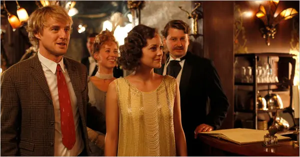

---
title: Midnight in Paris
order: 4
description: I love Woody Allen
types: Cinema
publishDate: 2025-03-02
--- 

What can I say, Woody just hits differently. When I first watched this movie, I liked it, but I couldn't understand
why it is a 3.5 Roger Ebert stars. I mean the movie barely has an actual plot, the conflict is just a passatempo, every
thing in the movie doesn't feel very important. But as time progressed, I understood more and more about why this movie
is good. And the key to understand, is that it is a Woody FUCKING Allen movie. To a certain extent, the movie is just an experience.
I have this prejudice that a good movie, needs to be "serious", not like spider man, or a marvel movie, it needs to have great acting,
climax, conflict, plot, and overall the movies needs to have a lot of substance, and provoke strong feelings at the audience. Midnight in Paris though, breaks this good movie standard, it doesn't generate any strong feelings, it simply makes
you feel light, and passionate, which is a different feeling of what I am used to

In my personal opinion Woody does two great things in this movie:
1. He chose a very good cast
2. He managed to extract the magic of Paris

In this movie, Woody doesn't intend to add any value to the world, it simply exhibits the magic Paris
has. As of now, I feel deeply touched by the movie, in fact one of the best parts of this movie is the beginning, even though
I have never been to Paris, so many things are evident simply by looking to a set of pictures. It is old, but not "just old" like
nature, but old in a sense it has reached its peak in a long time before I was born, and by simply looking at the picture,
it is impossible not think about that time, that's why this movie is a perfect fit for Paris. Paris is a live museum, fossils
of an era that has been long gone, Europe in general has that vibe.

I have great Empathy towards Owen in this movie, because in the end of the day, when I go shopping, when I go to beach,
supermarket, anywhere, everyone is a FUCKING Rachel, those type of people. If they go to Paris, the most they can think about is
Prada and Luis Vitton, those people don't care 0.1 mm below the surface (Rachel does a good job acting on that movie,
even though I wouldn't say it is a masterpiece), every movement, everything she does, every look and anything, it all convey the same
thing, it doesn't matter where you go, if it is Brazil, France or US, a burguesia fede, they have the same smell, they
just like being superior for the sake of being superior. A great scene is when Rachael can't for some reason time travel
which is perfect, the magic of Paris does not show itself for everyone, you need to have a good heart, you need to t
least be somehow open to it. The scene is so real, it's for the ISTJs that can't see anything before what the surface

I love Adriana (Picasso's mistress), she is simply the worst and best you could possibly have in a woman, she is mysterious,
her soul is as deep as an iceberg, you never know if she every truly loved you, just like Capitu, you don't know what she
thinks about, or whether she is interested in you, in fact, for her life is just a game, and you are her toy. Adriana brings
a mythological tone to the movie, she plays a key role in Parisiense society, she is not the most important figure
but she is everywhere and with everyone, she brings life and problems to Paris

The girl Owen ends up with, they don't have that much in common, they simply have a deep love for Paris, and they
look at each other, they know they have the same diligence in their heart, which is to keep Paris's memories in their soul

Precisely in the middle of the movie, there is a great dialogue (I have the impression Woody always does that, I think he
does that in Manhattan too). This movies definitely justifies Paris's nickname (city of lights)

As a conclusion, this movie has a strong side: which is good acting, and oh my god I love Paris kinda of feeling,
and it also has overall some scenes that seem a bit too much without purpose, and some dialogues that seem outright not interesting.
In the end, Woody is a master, and he can still make us fall in love with the city of lights, and feel for a second that
we are in the la Belle Époque. And more so, as Rachel points out, Owen has "um parafuso a menos", this movie is for all
of us that feel the same way, that when we go to Paris we can actually feel Hemingway, it feels so good to know that we are not alone