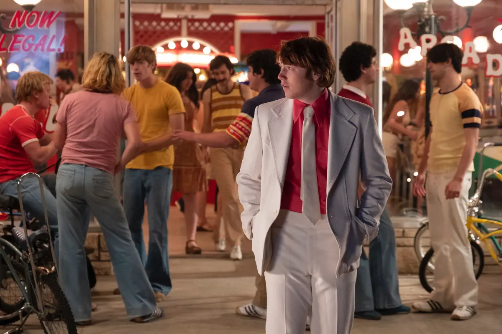

Every good film — or at least almost every one — has her. Women carry the responsibility of lighting up the screen with their beauty, sweetness, and often a touch of madness. I love her face because there’s something tense about it — an irritation, an anger — but beneath that, a deep sensitivity layered with sorrow. It’s something very Jewish, really (and her nose doesn’t lie).

The central couple is fascinating precisely because they’re so incompatible. There's a clear age gap, a difference in temperament: Gary is joyful, upbeat, full of life. She, on the other hand, carries something heavier, more shadowed. But that dissonance only adds to the beauty of their connection. Their relationship shifts between desire, sibling-like affection, caretaking, and love — a blend that defies easy categorization. It’s dysfunctional, yes, but with the asymmetrical, clashing beauty of a Pollock painting.

At first, I thought the film had some flaws — the scene where he gets arrested, or the sudden reveal that the political candidate is gay. It all felt a bit random. But now I realize that randomness was intentional. It comes from a desire to make the film more surreal, more emotionally driven. Licorice Pizza succeeds because it doesn’t take its narrative too seriously. Instead, it becomes a chain of emotions, one feeling leading to the next, making the experience dreamlike — revealing how much fantasy lies within everyday life. Maybe, like real life, nothing really makes sense. What matters are the emotions, and the context in which they emerge.

The film has a hypnotic quality — a slow pace, a nostalgic tone, a sense of something old and timeless. Paul Thomas Anderson reminds us why we fell in love with America — in a way more powerful than any “Make America Great Again” slogan. He takes us back to a simpler time, before Google, before Facebook — when the most sophisticated product you could buy was a water bed. His emotional connection with the San Fernando Valley is palpable. Every shot holds a touch of magic. The shadows, the colors, the framing — they all evoke the feeling of a distant summer, like going to a beach house in the ’70s. Everything is real, yet the cinematography casts a light of enchantment over it, as if we’re seeing the world through the eyes of a young person, full of hope and infinite possibilities.

In the end, Licorice Pizza is a small masterpiece — a film that brings emotion, feeling, and a dreamlike spirit to everyday life. Still, for me, it’s not quite a 4/4. It lacks a certain seriousness — not because it was supposed to have it, but because for me, that kind of emotional depth is part of what defines a truly great movie.