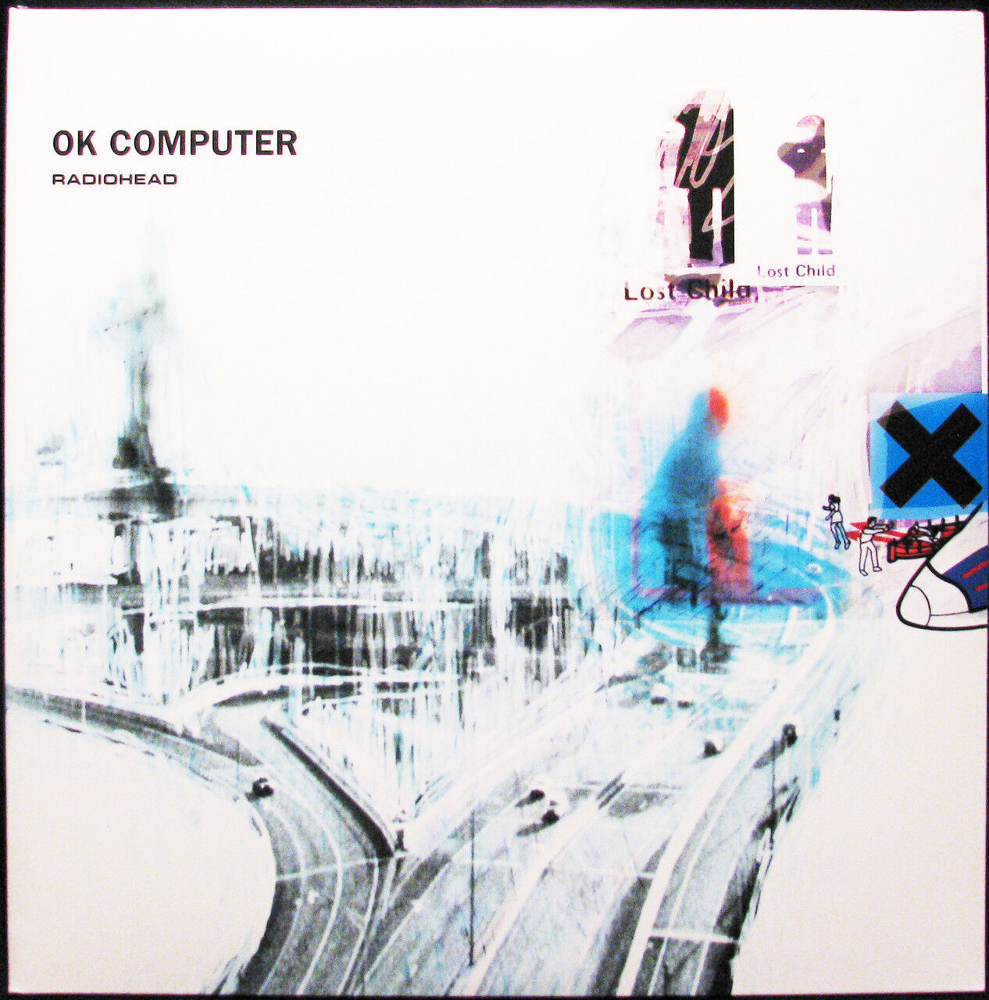
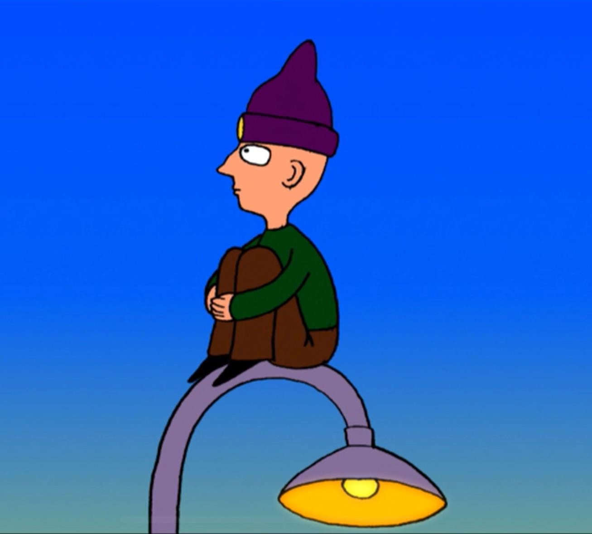
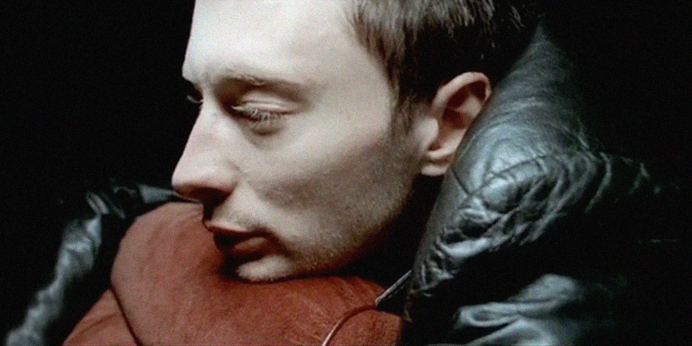
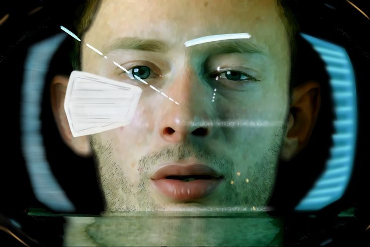

# Executive Summary

# Best songs

https://www.theguardian.com/music/2020/jan/23/radioheads-40-greatest-songs-ranked

# OK Computer

https://www.youtube.com/watch?v=nYYMIYWEdwQ

What is it about
- Thom Yorke had anxiety and depression while he was producing OK COMPUTER, the album has a lot to do with his personal struggles
- This album is about a criticism of late capitalism and its relationship to technology
- At the time it launched, it sounded like it had dropped from a another planet
- It is very prophetic
- I love this album because it dialogues with 'Brave new world', 'Infinite Jest'
- The title OK Computer is taken from the 1978 radio series Hitchhiker's Guide to the Galaxy, in which the character Zaphod Beeblebrox speaks the phrase "Okay, computer, I want full manual control now."

## Rolling stone

42th best album on the 500 best albums all time
- OK is where the band began pulling at its sound like taffy, seeing what happened, not worrying if it was still “rock.” What resulted is a slow, haunting album with unforgettable tracks such as “Karma Police.” Guitarist Jonny Greenwood said, “I got very excited at the prospect of doing string parts that didn’t sound like ‘Eleanor Rigby,’ which is what all string parts have sounded like for the past 30 years.… We used violins to make frightening white-noise stuff, like the last chord of ‘Climbing Up the Walls.’”

## Paranoid android

Android = an automaton that resembles a human being

Basics
- People and their loss of their individuality
- Progressive rock
- https://www.youtube.com/watch?v=TGmh_6Yf5GI
- Its title and lyrics are a reference to Marvin the Paranoid Android

Comparison with bohemian rapsody
- In some ways this song is the opposite of bohemian rapsody. Whatever happens in bohemian rapsody, the same is translated to paranoid android by replacing the human by the machine. For example, instead of talking about us being angry about what we have done, it's about us being angry about the system. It's about the human being transformed in the supporting actor
- This song is about some people that he met in Los Angeles, that were superficial
- The reduction of the human being to a paranoid android

### Section one (Revolt)

Prelude
- In bohemians rapsody this is the stage of confession, which is in some ways symmetrical to revolt

Desperate to find some solace in a world of mass 

Please could you stop the noise?

I'm tryna get some rest
- [MYTAKE] That's the key the difference compared to Bohemian Rhapsody. He is angry about the system. This is the opposite of bohemain rhapsody when the character kills someone, thus he is angry about hiself, not the system

From all the unborn chicken

Voices in my head

What's that? (I may be paranoid, but not an android)

What's that? (I may be paranoid, but not an android)

### Section two (Rage)

When I am king

You will be first against the wall
- This is opposite of bohemain rhapsody where the character has guilty, once again showing that mankind has lost the protagnoism

With your opinion

Which is of no consequence at all

What's that? (I may be paranoid, but no android)

What's that? (I may be paranoid, but no android)

La-la-la-la-la-la

La-la-la-la-la-la

La-la-la-la-la-la

La, la

Ambition makes you look pretty ugly

Kicking, squealing, Gucci little piggy
- Critique of the superficiality in burgeousie societe

La-la-la-la-la-la

La-la-la-la-la-la

La-la-la-la-la-la

La-la-la

You don't remember, you don't remember

Why don't you remember my name?

Off with his head, man, off with his head, man

Why don't you remember my name?

I guess he does

### Section three (Resignation)

Rain down, rain down
- rain would be the problems in ok computer society
- rain comes from capitalism, but capitalism comes from god, so in the end the rain comes from god
- it could be that capitalism is separating us from god, from our own humanity, and replcaing god itself

Come on, rain down on me

From a great height

From a great height, height

Rain down, rain down

Come on, rain down on me

From a great height

From a great height, height

that's it, sir, you're leaving
- That's probably mentioning that god has abondoned us into this distopic society
- Which is similar to bohemian rapsody, because in that song the angles leave him to the devil

The crackle of pigskin (rain down)

(Come on rain down) the dust and the screaming

The yuppies networking

The panic, the vomit (from a great height)

The panic, the vomit (from a great height)

God loves his children

God loves his children, yeah
- Presents a disbelief on God's love after all, after all if he really loved, why would he leave us in a world like this

## Karma Police

### Prelude

Thom Yorke quote
- Karma is important. The idea that something like karma exists makes me happy. It makes me smile. “Karma Police” is dedicated to everyone who works for a big firm. It’s a song against bosses
- For me this song is about hope, because it could mean that finally the people that created the OK COMPUTER society will be punished 
- This song has so much energy, happiness due to vengance

### Lyrics
Karma police, arrest this man

He talks in maths, he buzzes like a fridge
- The use of rationality to use evil

He's like a detuned radio

Karma police, arrest this girl

Her Hitler hairdo is making me feel ill

And we have crashed her party

This is what you'll get

This is what you'll get

This is what you'll get

When you mess with us

Karma police, I've given all I can

It's not enough, I've given all I can

But we're still on the payroll
- KKKKKKKKKKKK, this is very funny

This is what you'll get

This is what you'll get

This is what you'll get

When you mess with us

For a minute there

I lost myself, I lost myself

Phew, for a minute there

I lost myself, I lost myself

For a minute there

I lost myself, I lost myself

Phew, for a minute there

I lost myself, I lost myself
- For me this sentence is ambiguous, and that's the mystery and suspense of the track, is he happy because those that deserved finally got their punishment? or did he loose his self in the sense that this punishment never really happened, and it was all just a dream

## No surprises

- The feels a bit like the last level hell in Dante's Aligheri Inferno, the cocito because it's so cold in there

### Prelude

It's a reference to "Wouldn't it be nice" by the Beach Boys, but it is a very smooth predictable version of it, which is a metaphor by our lives being programmed by computers
- In some ways this song is the opposite of bohemian rapsody. Whatever happens in bohemian rapsody, the same is translated to paranoid android by replacing the human by the machine
- it's a more montone version, as if the joy of life and the unpredictability of life has been removed
- Wouldn't it be nice is a very old song, which kind of makes us very nostalgic, in a way that oh my god, back then we life was good
- Wouldn't it be nice is a lot about a possible future, about surprises, about what good things could happen, whereas no surprises is about our loss of our humanity
- It's interesting the contrast of band's name: beach boys versus radiohead, and wouldn't it be nice vs no surprises, it's all a reference between the contrast between rationality and humanity
- For me this song feels a bit like what happens after paranoid android, because in paranoid android there is a revolt, a rebellion, but here they have already given up

### Lyrics

A heart that's full up like a landfill

A job that slowly kills you
- KKKKKKKKKKKKKK, that's so true

Bruises that won't heal

You look so tired, unhappy

Bring down the government
- KKKKKKKKKKKKKKKKKKK, we attempt to put our frustration of our lives to the governmnent

They don't, they don't speak for us

I'll take a quiet life

A handshake of carbon monoxide

And no alarms and no surprises

No alarms and no surprises

No alarms and no surprises

Silent, silent

This is my final fit

My final bellyache with

No alarms and no surprises

No alarms and no surprises

No alarms and no surprises, please

Such a pretty house

And such a pretty garden
- We have everyhing materially but we don't have our own humanity which is something much more important
- This reminds me a lot of Hal Incandenza from Infinite Jest, because he has everything single thing materially to he happy but he isn't

No alarms and no surprises (get me out of here)

No alarms and no surprises (get me out of here)

No alarms and no surprises, please (get me out of here)
- "get me out of here" is a silent scream of despair

## Electioneering

I will stop

I will stop at nothing

Say the right things

When electioneering

I trust I can rely on your vote

When I go forwards, you go backwards
- KKKKKKKKKKKK, class struggle

And somewhere we will meet
- It's funny because it makes no sense, but that's the joke, what they argue makes no sense beyond rhethoric

When I go forwards, you go backwards

And somewhere we will meet

Ha, ha, ha

Riot shields

Voodoo economics

It's life, it's life
- Capitalist realism
- Manufacturing consent from Chomsky

It's just business

Cattle prods and the I.M.F
- KKKKKKKKKKKKKKKKKKKK

I trust I can rely on your vote

When I go forwards, you go backwards

And somewhere we will meet

When I go forwards, you go backwards

And somewhere we will meet

# Appearances

https://www.youtube.com/watch?v=1wIkL0tPi-o

Clueless

black mirror

50/50
- high and dry

Vanilla Sky

Children men

Johnny Greenwood
- There will be blood