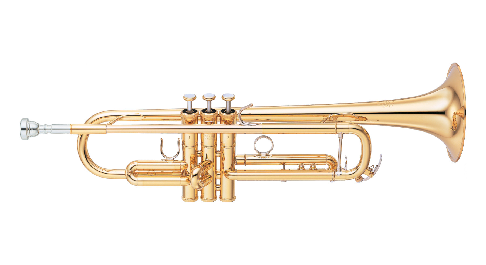
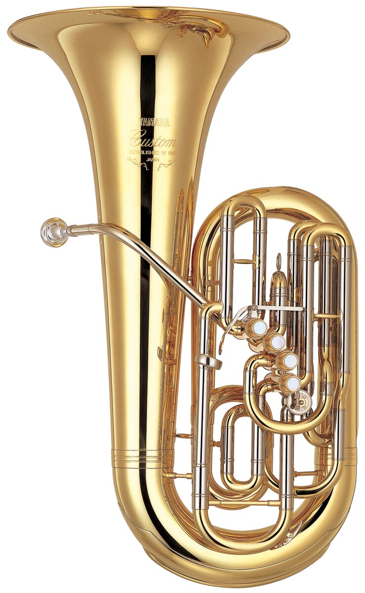
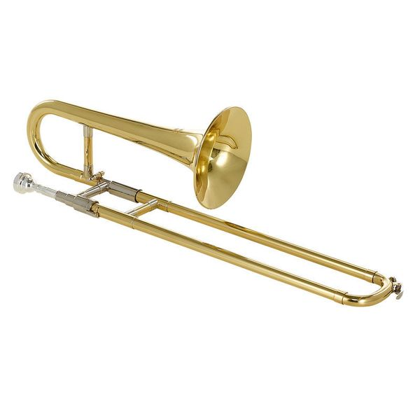

# Beirut (Section 1, Origins)
- Beirut is one of my 10 favorite bands

)
- The band is named after Lebanon's capital, due to the city's history of conflict and as a place where cultures collide, Beirut's music combines elements of indie rock, Balkan folk, and world music.

# Zach Condon
- He (the lead artist of the band) worked at a cinema showing international films, piqued his interest in Fellini arias, Sicilian funeral brass, and Balkan music.
- Returning from Europe, Condon enrolled at the University of New Mexico, where he studied Portuguese and photography.
- [MYTAKE] The relationship between his personal history and Europe, helps explain how and how Beirut's sounds got its european influences.

## What is Brass?
- Brass-driven songs are those that are driven by brass instruments, a few of them shown below. Note that in those songs, the brass is not a supporting actor, but a lead.
- Many Beirut songs are "brass-driven", which makes their sound unique.
- Zack Condon said multiple times, that Balkan music (which is brass-driven) is one of this major influences
### Trumpet

### Trombone

### Tuba

# Gulag Orkestar: Their First Album (Section 2)

<iframe data-testid="embed-iframe" style="border-radius:12px" src="https://open.spotify.com/embed/album/4yP7cyoeE3F6EyJPZ9v47V?utm_source=generator" width="100%" height="352" frameBorder="0" allowfullscreen="" allow="autoplay; clipboard-write; encrypted-media; fullscreen; picture-in-picture" loading="lazy"></iframe>

## The album name

### Gulag
- Definition: A Gulag was the Soviet Union's system of forced-labor prison camps used to punish and control millions of people, especially under Stalin.

### Orkestar
- Orchestra in 'Serbo-Croatian'

[MYTAKE] I enjoy the album's overall theme. The idea of creating an orchestra in a gulag. It's pretty dramatic. The classic idea that a flower can grow in the most dire conditions.

## Interesting fact
- Zach Condon has said in multiple interviews that **he wrote most of _Gulag Orkestar_ before ever going to Eastern Europe**.
- [MYTAKE] This adds to the dream-like atmosphere of the album. Because after all, all of his understanding of Europe is just his imagination.

## Map
- https://www.google.com/maps/d/edit?mid=1V3z98ZN6Ti67hXb6I39wbnGrDk5jhI4&usp=sharing
- The above map has the cities that the songs of Beirut are named after. Including the album Gulag Orkestar.

## Rhineland

<iframe data-testid="embed-iframe" style="border-radius:12px" src="https://open.spotify.com/embed/track/6SP4q0W1VrusEMfZRQIYXf?utm_source=generator" width="100%" height="352" frameBorder="0" allowfullscreen="" allow="autoplay; clipboard-write; encrypted-media; fullscreen; picture-in-picture" loading="lazy"></iframe>

- **Lyrics**
	- "Life, life is all right on the Rhine
	- I longed for your heart
	- No, but I know, but I know  
	- I would have nowhere to go  
	- No, but there's nowhere to go, to go
	- I wasn't home"
- [MYTAKE] It is one of the few songs that is not named after a place that wasn't a USSR satellite state. Therefore, maybe it symbolizes a dream/perfection. From the point of view of someone from a Gulag, all they could ever want is a place to chill with freedom, such as the Rhineland in Germany.
- [MYTAKE] But if the Rhineland is great, why he seems to partially dislike it? "there's no where to go".  Probably because it's not his heartland. For us that live in big cities, this song is what the country side represents. We long for its heart, life is alright over there. But there is nowhere to go, and we are not at home over there.
- [MYTAKE] This guy is an absolute genius.

## Postcards from Italy
<iframe data-testid="embed-iframe" style="border-radius:12px" src="https://open.spotify.com/embed/track/7H0UxIN751StFi2tznmHlg?utm_source=generator" width="100%" height="352" frameBorder="0" allowfullscreen="" allow="autoplay; clipboard-write; encrypted-media; fullscreen; picture-in-picture" loading="lazy"></iframe>

-[MYTAKE] I love the fact that Italy is only mentioned as a postcard. Once again, I interpret that the album Gulag Orkestar, is from a perspective of someone in a Gulag. Italy symbolizes a dream that is even more distant than the Rhineland, because the Rhineland is somewhere he at least considers living,  but Italy is just a place for his vacation, really. He probably only knows Italy from the postcards they receive inside the Gulag.
- **Lyrics**
	- "And I will love to see that day  
	- That day is mine  
	- When she will marry me outside with the willow trees  
	- And play the songs we made  
	- They made me so  
	- And I would love to see that day  
	- Her day was mine"
- [MYTAKE] We can clearly see that this "day" in Italy is just a delusion. It never happened, and probably never will. That's why he says "I will love to see that day."
- [MYTAKE] When he says "That day is mine", I think he means so something very deep. As if that day is a moment of personal triumph, clarity, love, or fulfillment. Maybe something to his happy place.
- [MYTAKE] For sure, one of my favourite songs. In 2025 it was the song i listened the most according to Spotify.

## Bunker

<iframe data-testid="embed-iframe" style="border-radius:12px" src="https://open.spotify.com/embed/track/27eX7w4g7cJErljKpiH1YK?utm_source=generator" width="100%" height="352" frameBorder="0" allowfullscreen="" allow="autoplay; clipboard-write; encrypted-media; fullscreen; picture-in-picture" loading="lazy"></iframe>

- "I would sooner go than fade away."
- [MYTAKE] Reflects the idea that in dire conditions, such as the Bunker, it's better to simply die than keep suffering
- "My cities dead, my cities gone. I'll stay away."
- [MYTAKE] The Bunker has this Schrodinger effect. Is everyone outside dead or not? Since the doubt, it's better to stay away