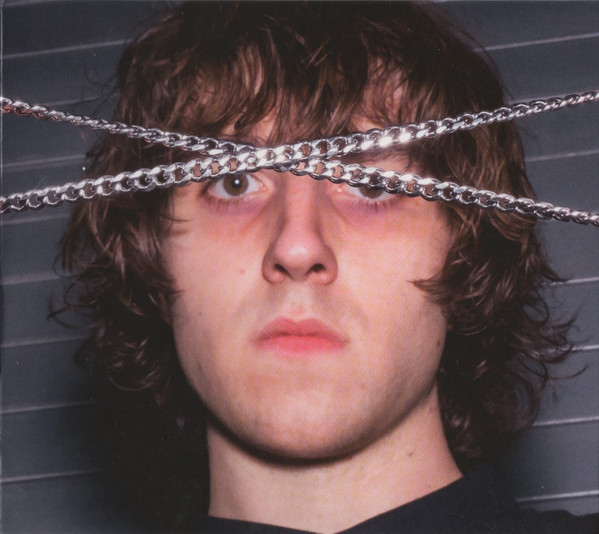

# Cancer of the Skull
> **[MYTAKE]** This song explores the eternal existential dilemma of artistic ambition versus insufficient competence - the struggle of aspiring to greatness while lacking the competence to achieve it.

<iframe data-testid="embed-iframe" style="border-radius:12px" src="https://open.spotify.com/embed/track/1RkuN09alt0DLZ9PlplUcc?utm_source=generator" width="100%" height="352" frameBorder="0" allowfullscreen="" allow="autoplay; clipboard-write; encrypted-media; fullscreen; picture-in-picture" loading="lazy"></iframe>

## Verse 1
I am full of heavy metals  
I am a heavy metal man
> **[MYTAKE]** [KEY] This brilliant metaphor captures the narrator's essence perfectly. Heavy metals possess high energy, bind to organic matter, and resist chemical reactions. Similarly, a "heavy metal man" is toxic to social norms - his stubborn character prevents normal behavior and cultural assimilation. Yet this very "heavy metalness" becomes the source of his creative power. The deep root of his virtues and vices.

I have work in the morning  
I have two bags over each hand, mm  
I came up the stairs  
I came to meet your cigarettes  
You'd like to keep my salesman teeth, wouldn't you, baby?  
Well, I'm on a pirate's crazy-eyed quest, mm

## Verse 2
I am wired to the man
> **[MYTAKE]** The narrator is literally "wired" to his boss and the corporate system, forced to fulfill societal expectations despite his artistic nature.

I take the train at dawn for him  
I threw the horrible secret out, mm  
I bring the front door into our house, mm  
> **[MYTAKE]** He brings a "good" appearance to his family amidst society through his job I assume.

I came up here freeze  
I came up here to sleep in your infamous kitchen  
You're holding out your baby's shoes, I can't take 'em  
I pray to a pirate's maniac religion

## Chorus
Oh, cancer of the fingers  
And the hands of a beginner  
These songs are meant for bad singers  
I can't reach cancer of the '80s  
I was beat with ukuleles  
These songs are a hundred replay  
I can't feed, mm

## Verse 3
My face is on the daughters  
I am one dollar in your hand  
I'd write a hell of a letter  
And anyone who doesn't know any better would tell you  
I am that zero dollar man
- In a capitalist society where social hierarchies are determined by income and capital, the narrator recognizes his complete lack of value.
> **[MYTAKE]** In some sense, he has high artistic qualities. But since they were insufficient to make a career, he had to settle to a "zero dollar man" job, and now anyone that sees him thinks he is a "zero dollar man" and nothing beyond that, that's why he mentions "And anyone who doesn't know any better would tell you".

Oh, I painted over the perfect nose  
That touches something you learned in 2000 with it  
I buckled up for the fatal crash  
Took a bullet through the bulletproof glass
- This darkly humorous image of invulnerability being defeated captures the absurdity of the narrator's feelings.

I kissed the emptiest car on the road

## Chorus (Outro)
Oh, cancer of the fingers
> **[MYTAKE]** The compulsive need to create music becomes a destructive force - a cancer that consumes him.

And the hands of a beginner  
> **[MYTAKE]** [KEY] The "fingers" represent the high aspiration, whereas the hands represent the competence. Here he perfectly communicates the root of the situation. A visceral aspiration, and the competence of a beginner.

Those songs of legendary swingers
> **[MYTAKE]** This is also very important in the song's central revelation: the narrator cannot match the skill of legendary musicians such as the Beatles or Led Zeppelin and must therefore resign himself to mundane employment. The gap between artistic ambition and actual ability becomes unbridgeable.

I can't keep cancer of the '80s  
I've been getting spanked with everybody lately  
All these songs are a hundred ugly babies
> [MYTAKE] The babies are his songs. After creating hundreds of them, he can't nurture them. He doesn't have the competence to actually make them blossom into high quality music.

# Nina + Field of Cops
> **[MYTAKE]** Nina represents clear-eyed awareness of harsh reality, while the "field of cops" symbolizes the overwhelming social forces and authority structures that crush innocence and individuality.

<iframe data-testid="embed-iframe" style="border-radius:12px" src="https://open.spotify.com/embed/track/78ugJH8q6W3kiGLwM2K7Lg?utm_source=generator" width="100%" height="352" frameBorder="0" allowfullscreen="" allow="autoplay; clipboard-write; encrypted-media; fullscreen; picture-in-picture" loading="lazy"></iframe>

## Verse 1
Your building is full of people who hate you  
And bite off fingers and eat from piles
> **[MYTAKE]** Opens with a cynical perspective on society's inherent hostility and competitiveness.

And someone's knocking  
All things spit towards and stutter at you  
Closer and closer until the whole city falls over  
While the music breaks a window
> **[MYTAKE]** Music serves as escapism from reality's cynicism, offering retreat into comfortable fantasy.

You're suspicious of treasures and plastic covers
> **[MYTAKE]** Nina possesses clear-eyed awareness - she sees reality without the distortion of either fantasy of things that look good on appearance.

All things flop over, the oven is open  
And the kitchen is lying  
My name is gonna sound old to you  
But names are donuts on the sea  
Names are peanuts in the trees  
Names bid you to beg for trash
> **[MYTAKE]** This passage brilliantly illustrates Lévi-Strauss's concept that in any given society, denotation and connotation are inseparable from the act of naming itself. Names carry cultural baggage that shapes our reality. Cultural naming creates ideologies that incentivize us to live our lives begging for trash.

Oh, I walk on everything  
On lucky dollars, baskets in the sand  
Sunglasses in the rain, tire tracks in caves  
I'll never send one more empty box  
I'll talk to every crowded room  
I'll go to the great carnivals of pain  
And fight entire fields of cops  
And keep a coconut in my hand

## Refrain 1
Nina knows the reason, and she's seen into the mouth  
Of what it is to be a mountain  
And she's seen all the good pigeon-like people shot down
And bones be kicked to powder by the insane wild horses 
> **[MYTAKE]** Nina possesses profound awareness of reality's brutality and the systematic destruction of innocence.

Nina I'm not nothing, but when you lie on the piano  
> **[MYTAKE]** [KEY] From a musical perspective, my favourite line of the song.

I am reminded I am stupid, and in every upstairs room  
A tall and daughterless Russian is kicking robins eggs to powder  
While the music breaks a window

## Verse 2
Cavemen are kissing, walking on logs  
Low enough to limbo cobwebs  
And watch the clouds blow away  
Drunk driving towards the sea
- Another cynical portrayal of society's primitive and self-destructive tendencies.

I'll be at your feet in every lifeboat
> **[MYTAKE]** Given the harsh reality Nina perceives and her tranquility while facing it, perhaps the wisest response is to follow her guidance and awareness.

I'll hold these lemons in my mouth and run  
One of the important people standing on your chest  
I'll love whatever kicks me hardest in the mouth  
I'm gonna eat my keys  
I've met a little bit of who I am  
- I can definitely relate to that, understanding more about who I am in these trivial tasks of life.
Backpacking upon the fingers of the real  
Barricading every garden gate  
Smiling into every cup of grapes  
I safari across the neighbor's yard  
Pushing groceries past pyramids of teeth  
With my hands on my hips  
Oh, this idiot festival, I man these cornfields for the banana-growing masses  
Getting naked on the plane, sunburned to shit in the rain  
Tomatoes in the missing barrels all have met many-handed boys  
With laughing brains and know gorilla-fingered yapping dogs  
The ugly kidney-needing kitten sees that the empty chairs want somebody

## Refrain 2
Nina isn't listening and she's seen into the mouth  
Of what is really in the fountain  
And she's seen all the good pigeon-like people shot down  
And bones be kicked to powder by the insane wild horses  
Nina I'm not nothing but when you check under cabinets  
I'm reminded someone's calling  
And in every upstairs room a dirty old man is blushing  
And the neighbors lose their power while the music breaks the window

## Verse 3
These great spirals, diagrams, and vegetables and talking red trees  
Throw it all away  
- No ideology seems to be very useful anymore.
Stupid paper gifts offered with both hands are  
Sadder than bald-headed haircut dreams
> **[MYTAKE]** Social rituals and gestures are revealed as hollow, meaningless performances.

Sadder than a paper-flat puppy in your pad  
Sadder than any featherless doer of math  
Sadder than the sad  
Microwave everything, add to the puddles  
Give me an answer, die for baseball
> **[MYTAKE]** Philosophical suicide as escape from Camus's "nostalgia for unity" - choosing death over confronting society's cynicism and fragmentation.

Motorcycle made of rocks eat this hotel key and ride away  
Stuff these papers down your pants  
And do the sole survivor's walk back down the way you came

## Refrain 3 (Outro)
- [MYTAKE] From a musical perspective, my favorite part of the song
Nina knows the reason that she's seen into the mouth  
Of what it is to be a mountain  
And she's seen all the good pigeon-like people shot down  
And bones be kicked to powder by the insane wild horses  
Nina, I'm not nothing but when you lie on the piano
I am reminded I am stupid, and in every upstairs room  
The deep and smiling voice is shushing
> **[MYTAKE]** Suggests the sinister presence of those that control the world (upstrairs room). Figures engaging in corrupt activities while maintaining public facades.

Kicking everything to powder  
Throwing music out the window  
Woah, woah