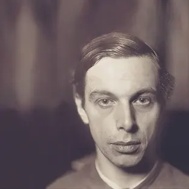
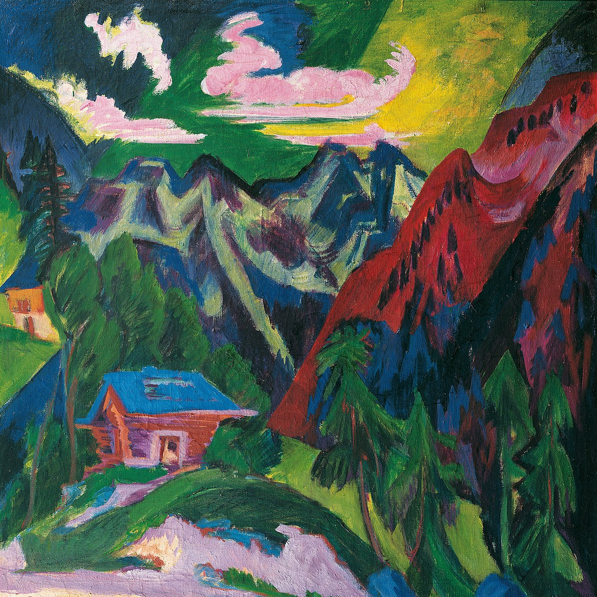
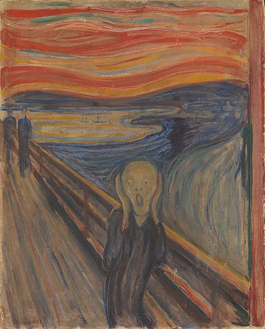
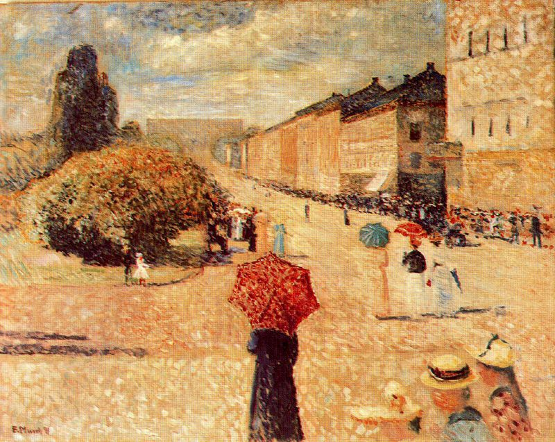

# Charateristics

The main goal is to express emotions, usually not very good ones

Influenced by psychonalasis (Freud)

Prelude to Surrealism

1. Flattened forms,
2. Distorted views
3. Garish colors
4. Impulsive brushstrokes
5. Simplified drawing
6. Vibrant colours (negative colours)

# Ernst Ludwig Kirchner

## Prelude
- Works were surreal in tone and portrayed characters in a world of despair and perplexity. As a man who lived life with depression lingering within his every move, it is no surprise that this sense of confusion was so incessant within his works

## Street, Dresden (1908)
- Museum of modern art (2023)
- Street, Dresden is Kirchner’s bold, discomfiting attempt to render the jarring experience of modern urban bustle. The scene radiates tension. Its packed pedestrians are locked in a constricting space; the plane of the sidewalk, in an unsettlingly intense pink (part of a palette of shrill and clashing colors), slopes steeply upward, and the exit to the rear is blocked by a trolley car. The street—Dresden’s fashionable Königstrasse—is crowded, even claustrophobically so, yet everyone seems alone. The women at right, one clutching her purse, the other her skirt, are holding themselves in, and their faces are expressionless, almost masklike. A little girl is dwarfed by her hat, one in a network of eddying, whorling shapes that entwine and enmesh the human figures

)

## Die Klosterser Berge

## Female Artist

## Station in Davos

# Edvard Murch

Norweigian

## Anxiety
- Munch Museum in Oslo
- Similar to the Scream

## Scream
- Most important work in expressionism
- The expression of Kevin McCallister (Macaulay Culkin) in the poster for the 1990 film Home Alone was inspired by The Scream
- [MYTAKE] In most renderings, the emoji U+1F631 😱 FACE SCREAMING IN FEAR is made to resemble the subject of the painting

## Despair

## Friederich Nietzsche

## Spring day on karl johan street

