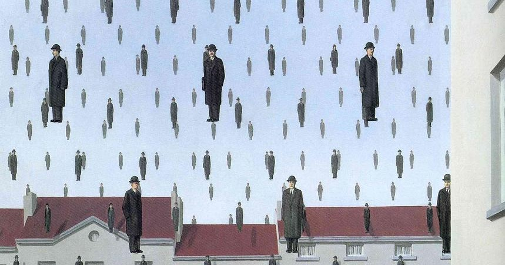

# History

## Charateristics
1. Bizzarre
2. Alucinatory
3. The fruits of human imagination freed from the task of imitating nature

[MYTAKE] Surrealism can be seen as an application of the Historical Materialism in art history. The material reality of the era—marked by world wars—shaped the superstructure of art, which adapted to reflect a world that had become more bizarre and horrifying. Surrealist art illustrates a reality so strange and unsettling that it defies rational explanation, mirroring the incomprehensibility of the times.

# Salvador dali

## Apparation Of The Town Of Delft
- 

# Magritte

## Prelude
- However, Magritte himself did not like the interpretations of his work, he used to say he was not a painter but a man who communicated his thought by painting
- He is Belgian

## Golconda
- Magritte tinha espírito travesso, e em 'A queda', os seus bizarros homens de chapéu-coco despencam do céu absolutamente serenos, expressando algo da vida como conhecemos
- [MYTAKE] I like this painting because it satirizes the corporate world and adult life. There appears to be a logical order, but the sight of people floating in the sky makes you question the purpose behind it all. It’s as if everything makes sense on the surface, but the deeper reason for our actions remains unclear.
- The painting is part of the Menil Collection in Houston, Texas.

)

## The Lovers
- When he was 14, he witnessed the body of his mother being taken out of the Sambre river, with her wet nightgown wrapped around her face. Some have speculated that the trauma of his mother's suicide inspired a series of works in which he obscured his subjects’ faces, but there's no evidence of this being true
- [MYTAKE] Others have interpreted it as a depiction of the inability to fully know our intimate companions, as we cannot unveil them completely

## The Princes of autumn
- [MYTAKE] I like this one because it feels dreamlike—the sky and ground look otherworldly, while the tree resembles something from Earth. It’s as if the painting takes me on a journey into my subconscious.

## The Son of a man
- At least it hides the face partly well, so you have the apparent face, the apple, hiding the visible but hidden, the face of the person. It's something that happens constantly. Everything we see hides another thing, we always want to see what is hidden by what we see. There is an interest in that which is hidden and which the visible does not show us. This interest can take the form of a quite intense feeling, a sort of conflict, one might say, between the visible that is hidden and the visible that is present

