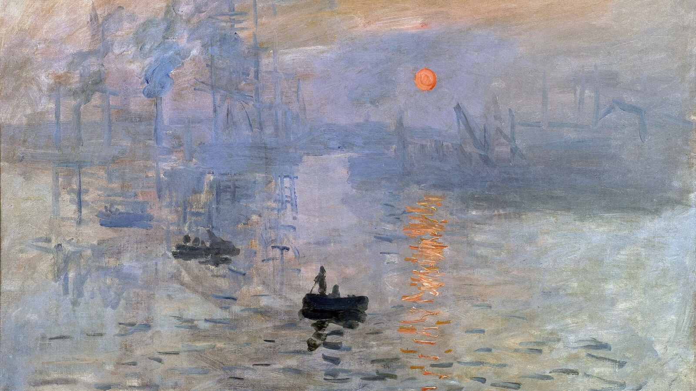
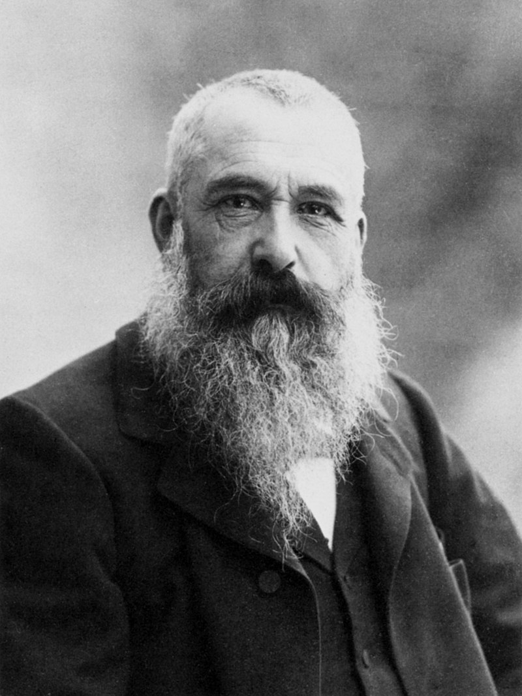
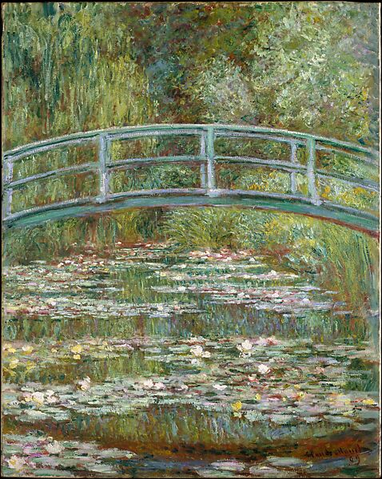
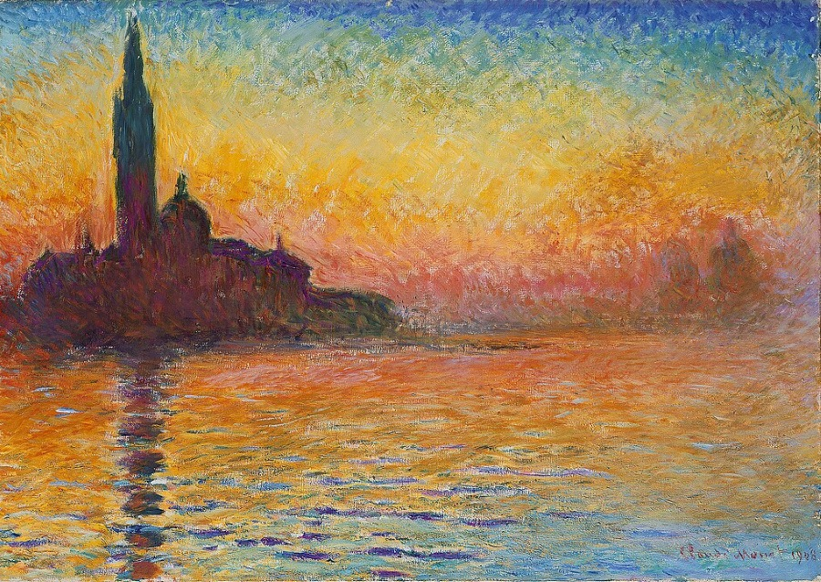
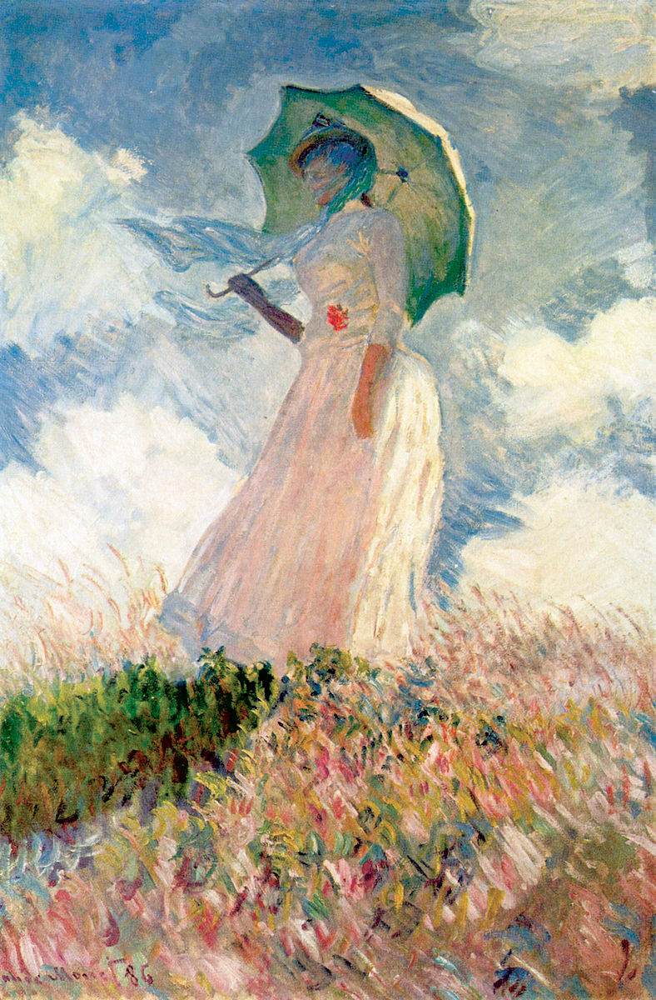
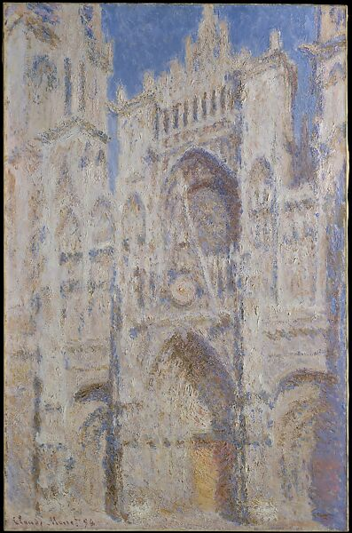
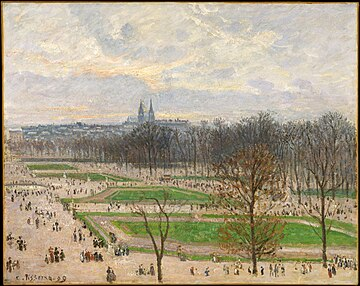
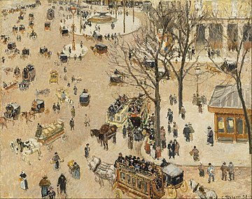
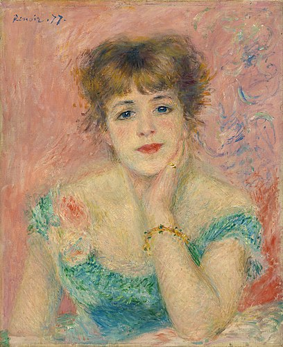
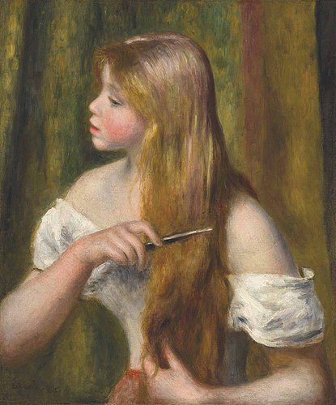

Impressionists were pioneers of modern art

Main painters
- Manet
- - Dejeuner sur l'Herbe
- Monet
- Degas
- Pisarro
- Renoir

# History

The best paintings were on the salon
- They loved grand historical subjects, mythological
- - They thought it would be boring to paint of regular people doing regular stuff (Seinfeld)
- The salon criticis were quite conservative
- - They wanted figures to be strongly defined
- - For that time it was very radical the impressionism

The first impressionistic exibhition was in Paris 1874
- The term impressionism came from the painting "impression sunrise"
- One of the critics labeled one of the monet's painting as an impression, unfinished, and that's where the name of movement came from
- This exibhition had very different rules than the ones from the salon, like no jury

Photography 
- The fact that at the time photography started to exist, it became a bit meaningless to have paintings to be realistic, since photographies did a better job doing that

# Charateristics

1. No black
- brighther pallet
2. Loosely defined forms
- quick loose bush strokes
3. A lot of light in the paintinig
- The Impressionists sought to use colour in a natural way, to capture the world they saw around them.
4. Painted en plair air (ao ar livre)

Themes
- Daily middle class life

Completementary colors
- If two complementary colors are mixed, they produce a dull brown or gray color. If, however, they are placed adjacent, they have the effect of intensifying one another: next to orange, blue appears brighter and more intense, and vice-versa

# Why is good

Why I like it
- The bright colors the fuzzyness gives me a feeling of warmth
- The fact that the impressionistic distances itself from realism, gives a unique portrait of a momment, which grants a feeling of intimacy, of sharing something unique to us
- As any form of art, it removes the imperfections of reality in order to reduce it to an idealized version [Plato]

Other perspectives
- Impressionism offers the best of both worlds — incorporating familiar day-to-day sceneries but reflecting them in a radical and innovative manner. It displays what we normally see in a different light, which enables us to appreciate it from a familiar but also refreshing point of view
- The Impressionists sought to express their perceptions of nature, rather than create exact representations
- Impressionist paintings are known for their emotional appeal. They often depict landscapes, seascapes, and cityscapes that are infused with bright colors, light, and movement. This creates a sense of vibrancy and liveliness that is both refreshing and invigorating
- Impressionism focused on everyday life and the ordinary experiences of people. This made it more accessible to a wider audience, as people could relate to the scenes depicted in the paintings

# Monet

Japanese Bridge over a Pond of Water Lilies’ (1899)
- Metropolitan museum of art

Charing Cross Bridge, London
- Today, the Charing Cross Bridge paintings are scattered in museums around the world. These include the Art Institute of Chicago,[3] the Baltimore Museum of Art,[4] the Museum of Fine Arts, Boston,[5] the Art Gallery of Ontario[6] and the Thyssen-Bornemisza Museum in Madrid

‘San Giorgio Maggiore at Dusk’ (1908 – 1912)
- National Museum Cardiff

Study of a Figure Outdoors: Woman with a Parasol, Facing Left
- Musée d'Orsay

La Gare Saint-Lazare
- Today, the Gare Saint-Lazare paintings are scattered in institutions all over the world, including Musée d'Orsay, Fogg Art Museum, Art Institute of Chicago, National Gallery, Musée Marmottan Monet, Pola Museum of Art, Lower Saxony State Museum, and other private collections

Rouen Cathedral
- Metropolitan

# Camille Pisarro

Relation to other painters

- Pissarro studied from great forerunners, including Gustave Courbet and Jean-Baptiste-Camille Corot
- He later studied and worked alongside Georges Seurat and Paul Signac when he took on the Neo-Impressionist style at the age of 54
- Art historian John Rewald called Pissarro the "dean of the Impressionist painters", not only because he was the oldest of the group, but also "by virtue of his wisdom and his balanced, kind, and warmhearted personality"
- Paul Cézanne said "he was a father for me. A man to consult and a little like the good Lord", and he was also one of Paul Gauguin's masters

Revolutionary
- In later years, Cézanne also recalled this period and referred to Pissarro as "the first Impressionist"

The Garden of the Tuileries on a Winter Afternoon,

La Place du Théâtre Français

# Renoir

Portrait of Jeanne Samary, 1877

Young Girl with Red Hair

