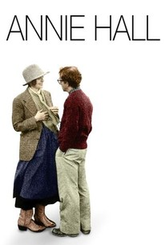
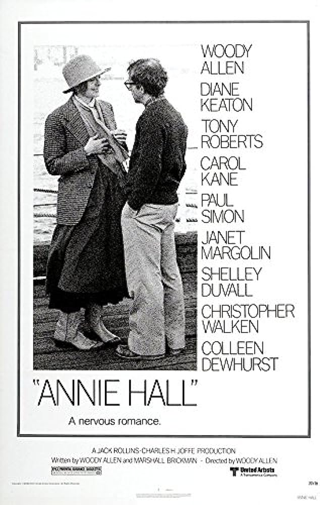
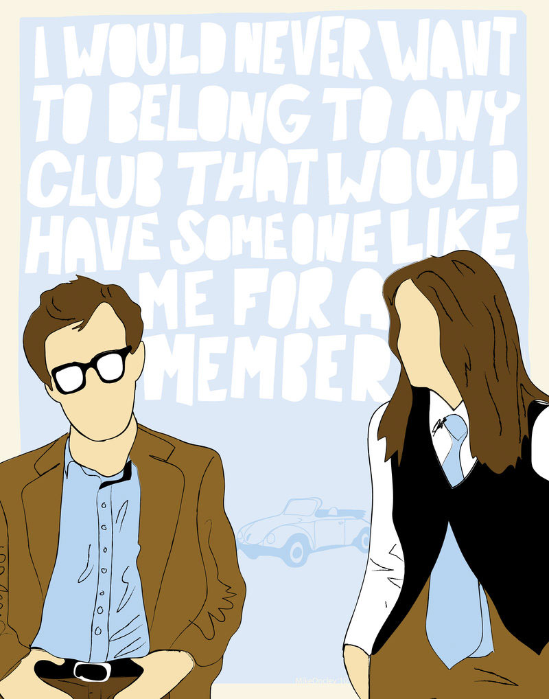
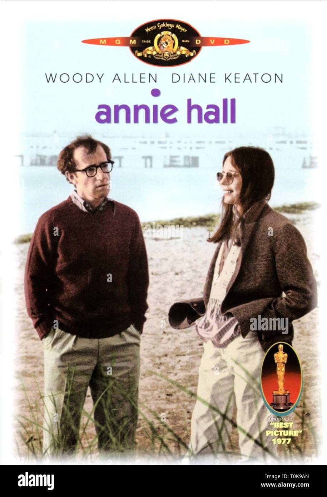
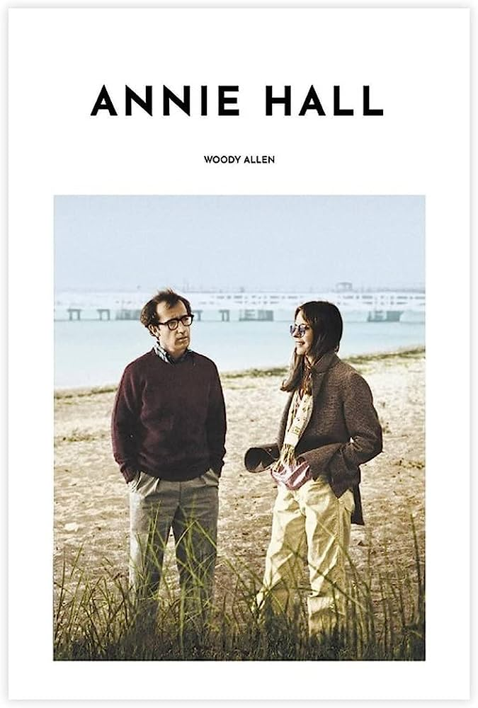

A million feelings come rushing in when I think about Annie Hall. This film holds a special place in my life—it was my first truly cinematic experience, and to this day, it's my all-time favorite movie. Watching it again now, for the second time—after first seeing it with my brother—I feel even more connected to it.

Woody Allen, in this film, becomes the embodiment of New York: anxious, intellectual, neurotic, unfaithful, melancholic, and deeply lonely. It’s not necessarily healthy to romanticize that kind of chaos, but there’s a strange beauty to it. His flaws make him captivating, like the title of that old Western: the good, the bad, and the ugly—all wrapped into one.

I’ve never lived in New York, and I wouldn’t be surprised if the real thing isn’t nearly as glamorous as the version I’ve built in my head. Still, I’d give anything to live in Woody Allen’s New York. The Upper East Side, the jazz playing softly in the background—it all has such an effortless charm. In my imagination, Woody is there, chatting with a New York Times food critic in a cozy café about Portuguese cuisine. For me, New York isn’t just a city—it’s the height of Western culture. Unlike Paris, which has become more of a museum, New York moves. It breathes. It’s alive with hundreds of little Woody Allen movies playing out every day. That’s what makes it so unique—not the place itself, but the people, the energy. And Woody channels that energy into every one of his films. Especially this one.

What I love most about Annie Hall is how iconic every scene feels. They’re like Messi’s 2010/2011 Champions League goals—pure classics. The first intimate conversation on her balcony, with subtitles showing their true inner thoughts. The sex scene where Annie’s body floats out of herself. The brilliant sequence with both characters talking to their therapists at the same time. And the unforgettable moment when Woody asks a couple how they stay happy, and they reply, “Because we’re dumb.” That line is one of my all-time favorites—it’s hilarious because it’s true. DFW would agree. It’s as if Woody sat silently, observing thousands of relationships, and distilled the truth from them all. Like Hegel’s “concrete universal,” he gives form to something abstract: modern romantic love. The film becomes a masterpiece of observation—every scene funny, relatable, specific, yet somehow universal.

Another theme that lingers in this film is happiness—and how hard it is to define. The movie doesn’t waste time getting to the point: part of being happy is learning to stop searching and appreciate what you have. But Woody’s character is wired to overanalyze. As he jokes in the opening line: “The food is terrible... and such small portions.” He’s programmed to find flaws in everything. He can’t enjoy a club he’s part of. And in a way, aren’t we all a little like that? Maybe that kind of dissatisfaction is what drives the world forward... or maybe it just makes us miserable. I’m not sure.

I see myself in this film, especially in the scene with his second wife. He’s with intellectuals but wants to watch the Knicks. He’s with normies but wants to talk philosophy. He’s always in the wrong room, always out of place. Too much or too little. Too bright or not bright enough. For most people, this dissonance is background noise. But for him, it’s torture. And with that mindset, how can you ever be happy? He constantly chooses dissatisfaction. He chooses unhappiness—almost on purpose.

I doubt this was Woody’s intended takeaway, but one of the conclusions I draw from the film is that dumb people are happier. Not because they’re simple—but because they’re not burdened by endless self-awareness. They don’t see the cracks, so they live more easily. They’re easier to please.

One of the most fascinating aspects of Annie Hall is its metalinguistic playfulness—totally expected in something so autobiographical. A standout moment is when Woody stages a play using the exact words Annie once said to him. The first time I saw it, I missed the weight of that scene. But after reading Roger Ebert, it hit me: when you lose the love of your life, you spend the rest of your days replaying what happened, rewriting the script in your head. In the final scene, when Annie leaves, his body language screams that he doesn’t want her to go. She’ll always linger in his mind. She’ll always be the maybe. Or maybe... he only loves her because she’s not with him anymore. Maybe he just keeps choosing the pain.

What makes Annie Hall truly timeless is its flawless dissection of romantic relationships. I’ve only had one real relationship in my life, and yet this film captures it all better than I ever could. Before I saw it, I didn’t even know how to define what a relationship was. And now? I feel like I do. That’s why it resonates so deeply. Because love hasn’t changed in a thousand years—and it won’t change in a thousand more. No matter how many books we read, or how many versions of ChatGPT get released… we’ll always need the eggs.

# Roger ebert

"Annie Hall" is a movie about a man who is always looking for loopholes in perfection. Who can turn everything into a joke and wish he couldn't?

Viewing the final cut, I sensed not only how well the remains hold together but how miraculously, since the parts would seem to be an ungainly fit. Consider Allen's astonishing range of visual tactics, including split screens in which the characters on either side directly address one another; a bedroom scene where Annie's spirit gets up during sex to sit, bored, in a chair by the bed; autobiographical flashbacks; subtitles that reveal what characters are really thinking; children who address us as if they were adults ("I'm into leather"); an animated sequence pairing Alvy with Snow White's wicked witch; and the way Alvy speaks directly out of the screen to the audience.

That Annie Hall is the great love of his life is immediately clear, and the movie is a flashback from the opening monologue in which he sadly notes that a year earlier they were in love; the movie is his analysis of what went wrong, and his answer is, he found happiness, but couldn't accept it. Groucho's line "is the key joke of my adult life, in terms of my relationships with women."

This is not merely dialogue, it is a double act in the process of discovering itself. The more we listen to Annie and Alvy talk, the more we doubt they meet many people who can keep up with them. When Alvy expresses reluctance to let Annie move in with him, she complains that her apartment is too small and has bad plumbing and bugs, but Alvy could take "bugs" as his cue and observe, "Entomology is a rapidly growing field." And only Annie could interpret this as "You don't want me to live with you."

The master of unhappiness

cara primeiros 5 segundos eh muito engracado

talk about the universe expanding
he exaggerates his childhood

I think it is interesting how he talks about his memories.

I also really like the jazz

He became a comedian

their first conversation is literally the most typical couple conversation

he can't get inside the movie after it started

in some ways, self-centeredness is one of the best ways to unhappiness, because you can overinflate problems

he thinks about hypothetical scenarios, like answering the teacher in primary school or making a director
answer someone cursing his movies

observe how saying one thing about their ex-wife, he starts remembering about her

He reminds us of the groucho marx joke, which means he was nice, thus he meant this movie to the average person

one of his ex wives was too intellectual

horrible and miserable division

this relationship is clearly a downgrade; he is dating someone lower 
in the intellectual level than usual
maybe he knows it is doomed to fail

Don't knock 
with 
masturbation it's sex with someone I love

a relationship is like a shark it has to constantly move forward, or it dies

he writes a play so that we can see his relationship working

My brother is crazy, he thinks he is a chicken. Why don't you turn him in?
Because I need the eggs