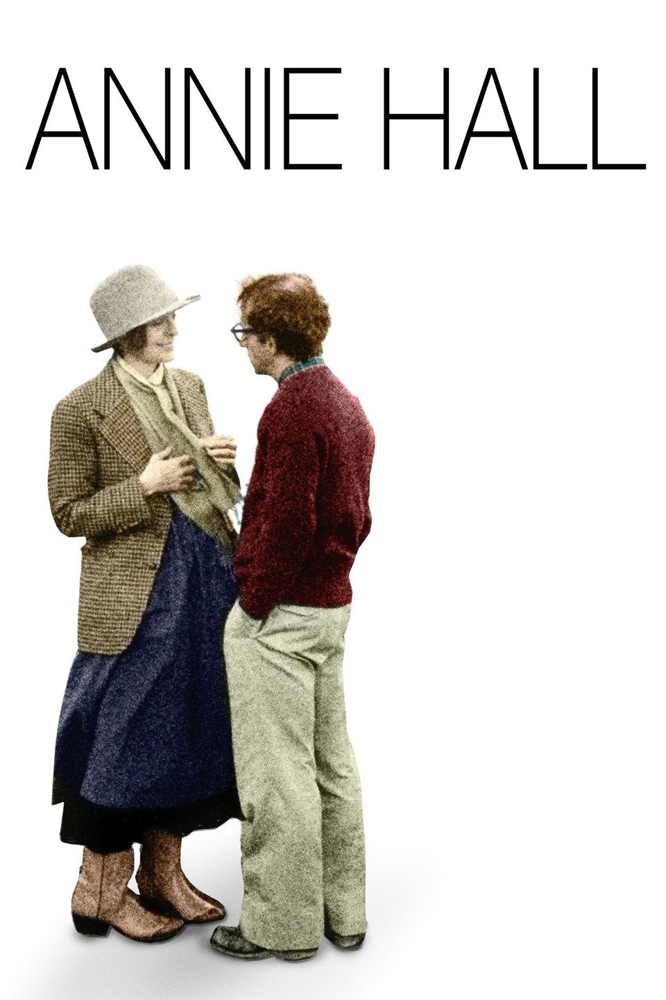

 
A million feelings run in my mind when it comes to Annie hall. This movie is really important in my life, since it was one of
my first truly cinematrophical experiencess, and my all time favourite movie.
This is my second time watching it, the first was with my brother.
Woody is a perfect personification of New York, he is anxious, intellectual,
confused, unfaithful, sad and lonely. I don't think it is healthy to idealize
this bad nature, but it is impossible to not awe it's beauty, the defects
are what makes him special, as the old fashion movie title goes: the good the bad and the ugly

I have never lived in New York, and I wouldn't be surprised if living
there is not as great as it is in my head, but I would do anything
to live in Woody Allen's New York. Whenever I think about Upper East side and the sound of Woody's jazz
side, it just hits different, for me it has so much style. In my imagination,
UES is where the real Woody lives, and goes to a cafe to talk with a times magazine
cook critic about portuguese culinary. For me New York is the pinnacle
of the western culture, unlike Paris which now is just a museum,
NYC is where things happen, hundreds of woody allen movies are happening
every day there (for this is magically insane), and that is what makes NYC so special to me.
In some sense, it is more about the people that live there
and what they represent, whether than the city itself.
Most importantly Woody manages to transmit thIS New York energy to
the audience. I personally feel that, on of every single of one his movies.
Nonetheless this one definetly stands out.

One of my favourite things about this movie is that it's
scenes are like Messi's 2010/2011 UCL goals, all of them
are classics, the scene where they have their first intimate talk (where the subtitles show what they are truly talking about)
in Annie's balcony, the sex scene where Annie's body get detached, the
scenes where both of them are talking to their respective therapists at the same time,
the scene where Woody asks how a couple can be so happy, and they answer -
because they are dumb (this one is one of my all time favorite scenes, it's funny because it's true DFW would agree with that). It is as if Woody silently watched thousands of relationships, and managed
to find the universal truths. He did what Hegel describes as the concrete universal, all modern romantic relationships (which is something abstract) materialized into a particular example, a pure masterpiece. All of its scenes are very funny,
relatable, universal and creative and that's why it makes them instant classics

Another important theme of this movie, that I can't not quite perfectly grasp is happiness.
The beginnig of the movie goes straight to the point, a major part of being
happy is stop looking around but learning to be happy with what you have.
Woody has a negative perspective on life, as he mentiones at the first line of the movie: "Two Elderly
woman are at the catskill mountain resort, one of them says "the food here is
terrible", and the other one says in such small portions"", which comes from
the fact that he over analyzes things, and see problems everywhere, it is
as if he was programmed to be unhappy, he cannot enjoy a club that he is part
of, and to a certain extent all of us are like that, and even though that
may make us unhappy, perhaps this what makes the world going forward, I don't know

I have to admit I see myself in this movie specially in the scene with his
second wife. He wants to watch the Knicks game when he is around intellectuals, on other hand, when he is around
normies he also wants to talk about something interesting, he feels like he is always on the
wrong spot, always innapropriate, he either too short or too tall, too smart or too
dumb, life is never perfect, and for the average person, that is unoticed, but
for him is a torture. With this mindset he will never be happy, in fact he will
constantly choose unhapiness over hapiness

Even though I am pretty sure that's not what woody meant for this movie, perhaps
one of the greatest lesson I take from it is that, dum bpeople are happier, simply
because they are not smart to see the problems with their current state, they
are easy to please

Something interesting about this movie is the amount of metalinguistics present
on it, which is more than natural since it is fucking autobiographical. One particular
metalinguistic that really stand out is when Woody conducts a play
that has the exact same lines of what she said to him. At the first time I watched
it I didn't realize, but after reading Roger Ebert, I realize how sad this scene is,
after you loose your chance of big love, you spend the rest of your life making
plays on your head, about what happened and what could have been.
Note as well, the moment where she leaves him on the last scene, his body language
clearly shows he doesn't want her to leave, Annie Hall will be forever in his mind,
she will always be his maybe. Or maybe he just keeps liking her because she is not with him
anymore, he just like her because he keeps choosing unhappiness over happiness

Overall, the greatest achievement of this movie is to be a perfect dissection
over what is a relationship, even though I only had one relationship
in my life, I can still tell that this movie perfectly describes
what is one, to be honest I could even tell before
I ever had a relationship, this is why this movie will always be
timeless, because relationships have been the same since the beginning
of times, and will continue to be the same years from now, it doesn't
matter how many books we read or how many Chat GPTs are launched, 
we will "always need the eggs"

# Roger ebert

"Annie Hall" is a movie about a man who is always looking for the loopholes in perfection. Who can turn everything into a joke, and wishes he couldn't.

Viewing the final cut, I sensed not only how well the remains hold together but how miraculously, since the parts would seem to be an ungainly fit. Consider Allen's astonishing range of visual tactics, including split screens in which the characters on either side directly address one another; a bedroom scene where Annie's spirit gets up during sex to sit, bored, in a chair by the bed; autobiographical flashbacks; subtitles that reveal what characters are really thinking; children who address us as if they were adults ("I'm into leather"); an animated sequence pairing Alvy with Snow White's wicked witch; and the way Alvy speaks directly out of the screen to the audience.

That Annie Hall is the great love of his life is immediately clear, and the movie is a flashback from the opening monologue in which he sadly notes that a year earlier they were in love; the movie is his analysis of what went wrong, and his answer is, he found happiness, but couldn't accept it. Groucho's line "is the key joke of my adult life, in terms of my relationships with women."

This is not merely dialogue, it is a double act in the process of discovering itself. The more we listen to Annie and Alvy talk, the more we doubt they meet many people who can keep up with them. When Alvy expresses reluctance to let Annie move in with him, and she complains that her apartment is too small and has bad plumbing and bugs, who but Alvy could take "bugs" as his cue, and observe, "Entomology is a rapidly growing field." And only Annie could interpret this as, "You don't want me to live with you."

the master of unhapiness

cara primeiros 5 segundos eh muito engracado

talk about universe expanding
he exagerates his childhood

I think it is interesting how he talks with his memories

also really like the jazz

he became a comendian

their first conversation is literraly the most typical couple conversation

he can't get inside the movie after it started

in some ways self centeredness is one of the best ways for unhapiness, because you can overinflate problems

he thinks about hypothetical scenarios, like answering the teacher in primary school or making a director
answer someone cursing his movies

observe how saying one thing about this ex wife, he starts remembering about her

he reminds us of groucho marx joke, which means he was nice, thus he meant this movie to the average person

one of his ex wifes was too intellectual

horrible and miserable division

this relationship is clearly a downgrade, he is dating someone lower in the intellectual level than usual
maybe he knows it is doomed to fail

Don't knock with masturbation it's sex with someone i love

a relationship is like a shark it has to constantly move forward or it dies

he writes a play so that we can see his relationship working

My brother is crazy, he thinks he is a chicken. Why don't your turn him in?
Because I need the eggs