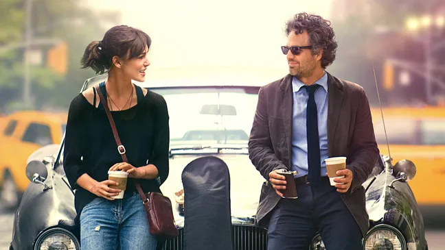

This movie really carries a strong theme of redemption. Even though Mark Ruffalo’s character starts off as a pretty awful person—lacking self-control and direction—there’s still the possibility of growth. He begins to adopt a "growth mindset," moving from terrible to simply "not that bad." And because his ex-wife and daughter are so used to his worst, even this modest improvement feels remarkable. It’s a testament to how change, however small, can still mean a lot.

The part about Dave cheating feels almost surreal to me. In real life, people don’t usually cheat within a month of relocating to a new city—it just doesn’t seem believable. But emotionally, it still works. They've been together for years, and she feels the weight of betrayal deeply. She learns, perhaps painfully, that material conditions shape the emotional structure of our lives. In contrast, Steve is her emotional anchor—the embodiment of loyalty. He stays by her side, no matter what. That contrast is powerful.

The cheating reveal scene is especially well done. The way she picks up on Dave’s expression—decoding his guilt from just a glance—says so much about her sensitivity. Most people would need more clues, more time. But her ability to perceive it instantly highlights how deeply attuned she is, how emotionally intelligent and intuitive her character is.

And that album idea—recording each song in a different location across New York—how did I never think of that? I literally I already wrote a million rom coms, how come I have never thought about that? KKKKKKKKKKKKKKKK. It’s so simple, yet brilliant. It feels adventurous and organic, giving the whole album a sense of authenticity that’s rare in today’s pop music. That kind of raw, spontaneous creativity is what makes the movie feel so fresh.

What I love most about this film is how unpolished and non-formalist it is. It mirrors real life—messy, chaotic, unstructured—yet it finds meaning and beauty in all that disorder. The film, true to its title, is about beginning again. It’s about finding magic and joy in the ruins, about rediscovering beauty when it feels like all hope is gone.

I absolutely love the ending. The scene where David Kohl sings the final part of "Lost Stars" and her expression changes—it’s subtle, but so telling. His falsetto, which became a defining trend in early 21st-century male pop, reflects his stardom and charisma. I find it fascinating how women can react to something both rationally and irrationally at the same time. For her, the lyrics weren’t just words—they were a symbol of the romance. And by altering them, he broke something sacred. Deep down, she knew: if he couldn’t honor that, he wouldn’t be able to hold onto the romance either.

It’s funny how this actress always ends up playing an ENFJ-type character. Why is that? Either way, I honestly think the song sounds better the new way. But in the end, that’s not the point. They’re incompatible. She’s a romantic; he isn’t—at least not anymore. And that’s okay. She finally finds closure, realizing that while he might look like the perfect match on the surface, he just isn’t real enough for her at the core.