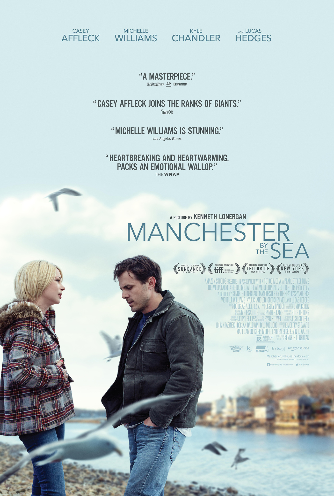

 
I didn't want to write any review about this movie, but it is literally impossible.
This movie got stuck in my mind. It starts well by introducing Lee to us.
At first, it is a bit of a mystery why he is the whay he is, he doesn't seem
to be interested in any woman, is it because he is gay (not that there is anything wrong with that)? And other unusual behaviour. The movie does a good job in adding some expactions to what is
wrong with Lee. Latter we realise that he indeed is a much more complicated
character than previously imagined, as the greatest movie line says:
"there is nothing there". Lee is dead from the inside, living in total
numbness, in a profound depression, one of the only ways he can feel
something is by hitting strangers in a masochist way

Affleck's acting is very truthful, whenever he says anything,
he says quitely and with so much effort that you can tell
that life for him is a struggle. The movie has no problem in showing
to us the bad things that Lee did during his life, but the trauma
that happened to him, is something that is inhuman, the truth is that
we all suffer quite a lot during our lives, as Woody allen would say
"such small portions", but what happened to him is something that nobody
would desire even for the greatest enemies

Randi seems to exist only for his own suffering (that could apply for anything but still)
Her baby and her husband, are a current reminder that even though the
trauma affected a lot of people, he is the one in charge of the eternal
grief for his daughters. In some ways, it feels like he is depressed for the rest
of his life, it's the way he can assure that his kids memories will always be
alive in some way

I am not sure what Lee sees in life, I don't know why he is even alive for,
he has a bad job where he basically does it only to keep his mind focused in
something else, and go after work get drunk and watch sports. If that's all
of life is, why even stay alive? The only reason is Patrick. In the end,
the baseball is a metaphor for
his life, he found it completely loose in a yard, and after playing a bit
with it, he was about easily largar it, but Patrick was
there to push him to keep playing, almost as if he was poking a dead body. Finally the movie ends
perfectly, as it began, with Patrick's only good memory in his entire life,
after all, the sea what what his brother loved the most, and perhaps the only
good part of Manchester that hasn't been floded with his kids death

# Other coments

Life with no narrative closure

flashbacks are realistic because it feels like the flashbacks happen when a real person
would think about the past, for example Lee remembers about his dead kids exactly in the
moment where he knows his brother told him to be his kid's guardian, that's very realistic

the way the flashbacks show up (very seamlessly) shows how Lee is still very much traumatized
about this past, and in some ways still lives in the past

the fact that there is some difficulties to bury his brother is a metaphor that he can't be
put to rest figuratively

He's a hollow shell and, as he tells Randi, “there's nothing there” – meaning, he can't feel anything. His tragic past as left him numb. That said, Lee isn't a bad guy. He made a tragic mistake (stupid even) but a mistake nonetheless. He isn't evil, he's broken, guilt-ridden and in pain.