# Romantic Comedies and Their Inspirations

## Movie Inspirations

500 Days of Summer             |  The real-life experiences of screenwriter Scott Neustadter
:-------------------------:|:-------------------------:
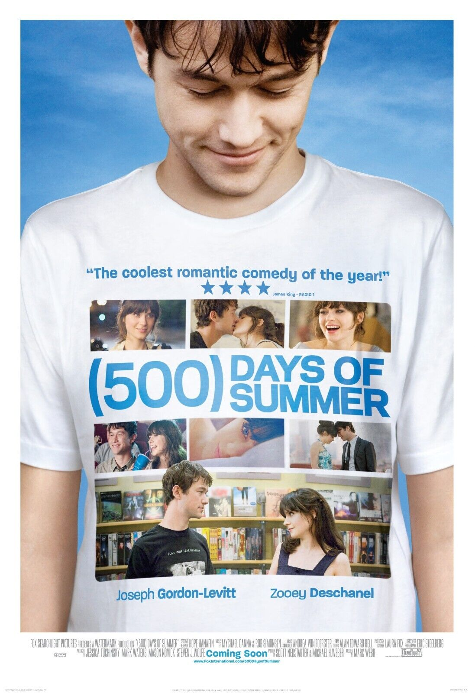 |  

The Graduate (1967)        |  The Huttinger family (that inspired the movie "The Graduate") (real) (1957)
:-------------------------:|:-------------------------:
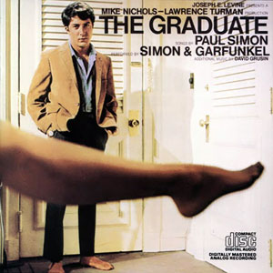 |  

Rumour Has It (2005)        |  The Huttinger family (that inspired the movie "The Graduate") (real) (1957)
:-------------------------:|:-------------------------:
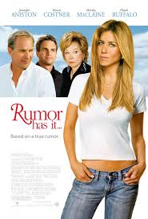 |  
- [MYTAKE] This family is so complicated that it inspired two of the most popular rom-coms of all time, a remarkable achievement, I must say.
- [MYTAKE] This is also proof of how influential "The Graduate" is; it was so impactful from a cultural perspective that it influenced another great movie.

She's All That            |  Pygmalion (play) by George Bernard Shaw (1913)
:-------------------------:|:-------------------------:
 |  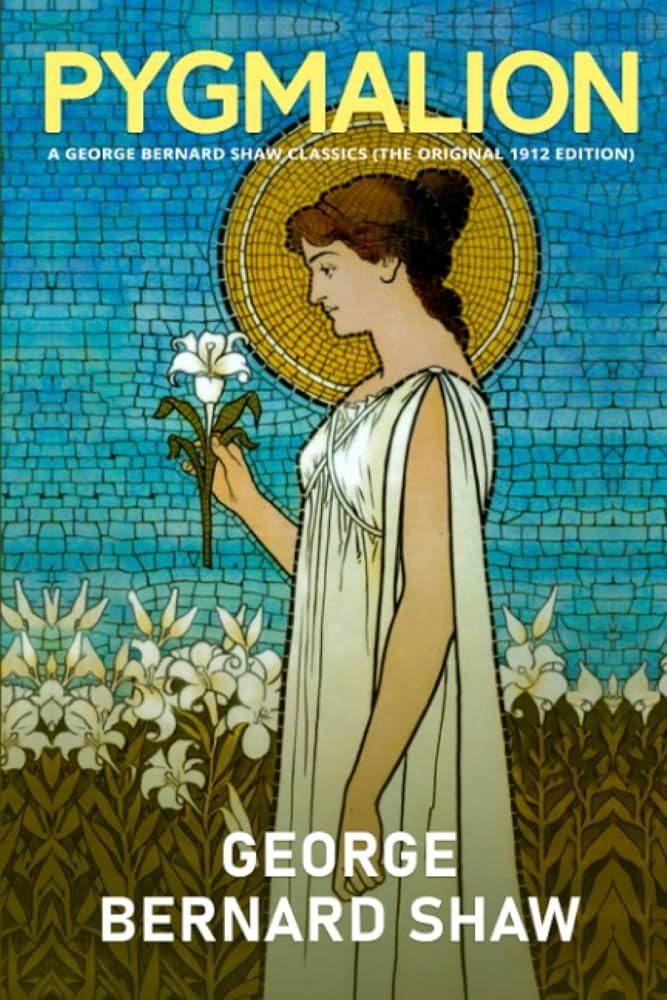

10 Things I Hate About You           |  The Taming of the Shrew (play) by Shakespeare (1623)
:-------------------------:|:-------------------------:
 |  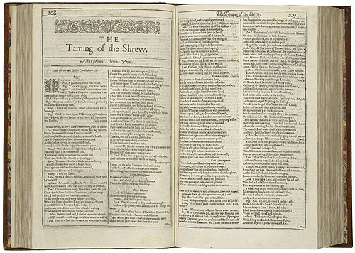
- [MYTAKE] This is crazy. When I watched "10 Things I Hate About You", I thought it was a good movie. But I could never have expected that it was based on Shakespeare. Oh my god.

Notting Hill         |  Uma Thurman's romance with a librarian
:-------------------------:|:-------------------------:
 |  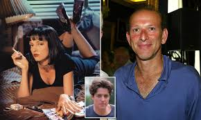
- [MYTAKE] How a librarian dared to make a move on Kill Bill is astonishing.

Bridget Jones's Diary        |  Pride and Prejudice (1813)
:-------------------------:|:-------------------------:
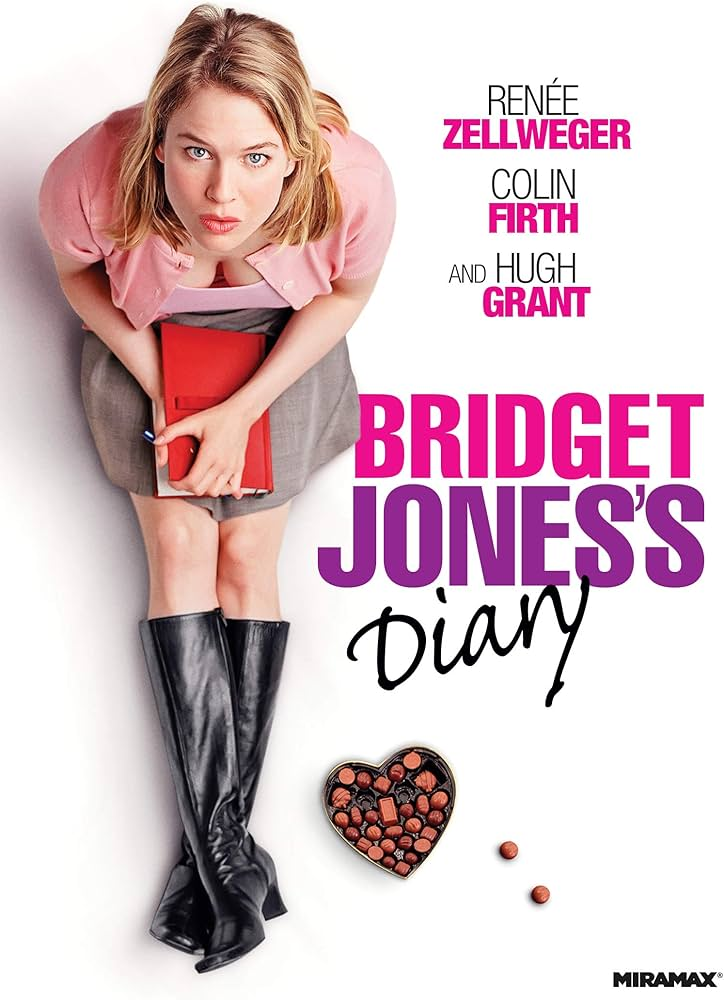 |  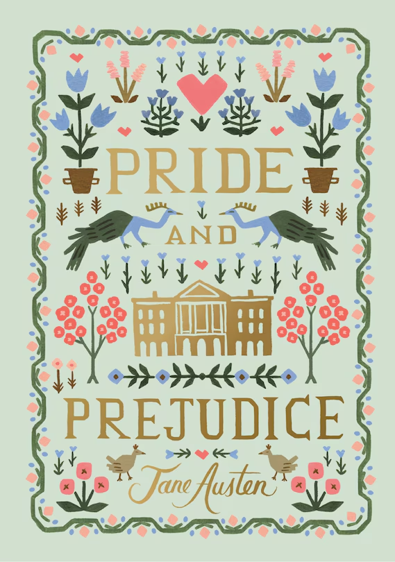
- [MYTAKE] Among all of the rom-coms in this list, Bridget Jones's diary is the one with the most in-your-face reference. As Chandler would say, could this BE any more Pride and Prejudice?

Clueless (1995)        |  Emma (1815)
:-------------------------:|:-------------------------:
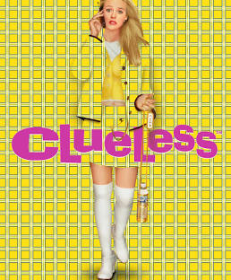 |  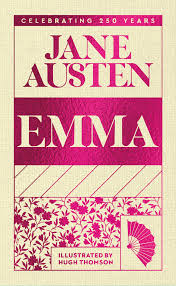

Mamma Mia! (2008)        |  Mamma Mia! (Musical) (1999)
:-------------------------:|:-------------------------:
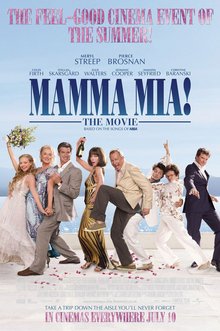 |  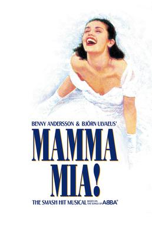

High Fidelity (2000)        |  High Fidelity (book) (1995)
:-------------------------:|:-------------------------:
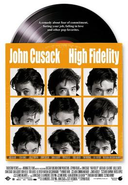 |  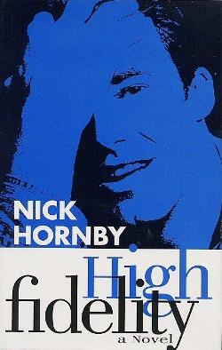

Yes Man (2008)        |  Yes Man (book) (2005)
:-------------------------:|:-------------------------:
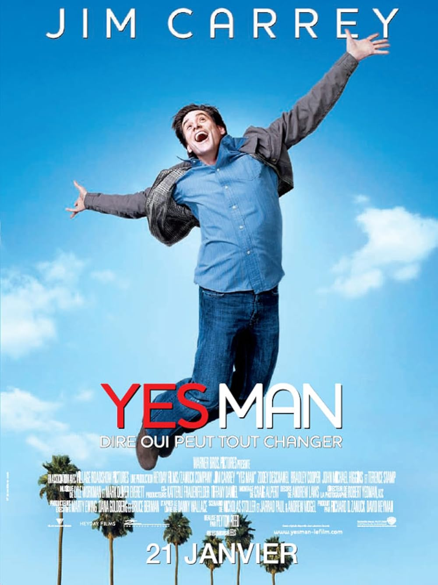 |  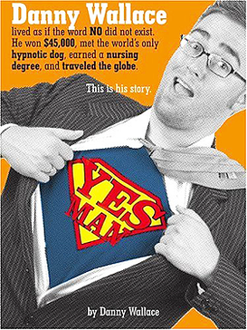

Sleepless in Seattle (2008)        |  An affair to remember (book) (1957)
:-------------------------:|:-------------------------:
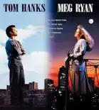 |  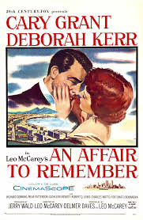

It's Kind of a Funny Story            |  It's Kind of a Funny Story
:-------------------------:|:-------------------------:
 |  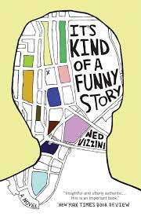

- [MYTAKE] I think every great author about mental illness ends up killing himself; DFW is another example; maybe the only way to write a great story about something is to know that something well, and if you do so for mental illness, then that's a free ticket for after life

You've Got Mail            |  The Shop Around the Corner (play) (1940)
:-------------------------:|:-------------------------:
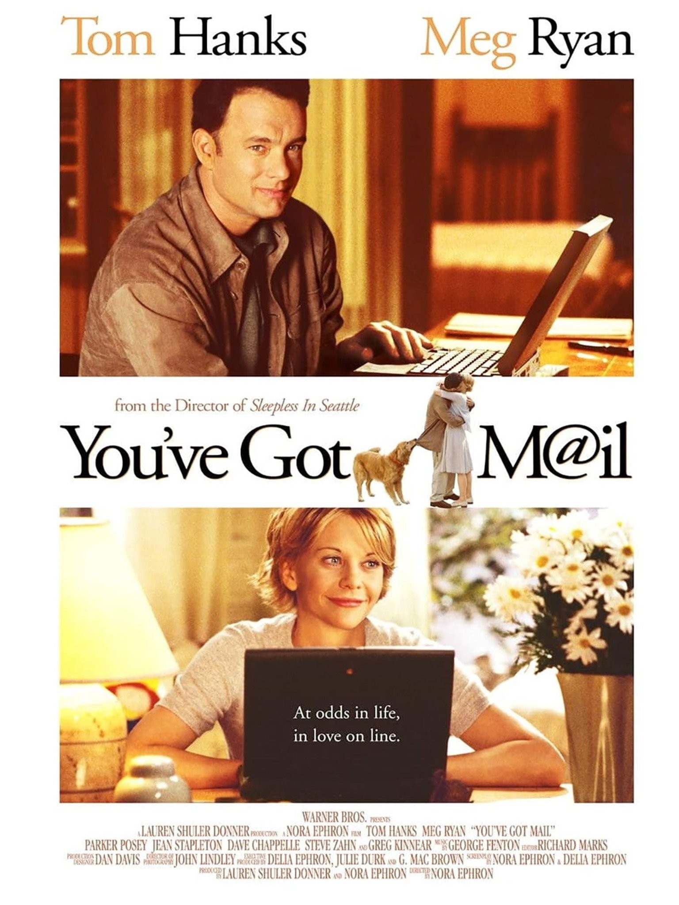 |  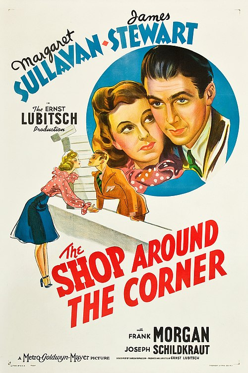

Princess Bride (1987)           |  The Princess Bride (book) (1973)
:-------------------------:|:-------------------------:
 |  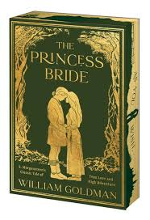

Jerry Maguire (1966)           |  Leigh Steinberg (real) 
:-------------------------:|:-------------------------:
 |  

50 first dates (2004)           |  Michelle Philpots (real) 
:-------------------------:|:-------------------------:
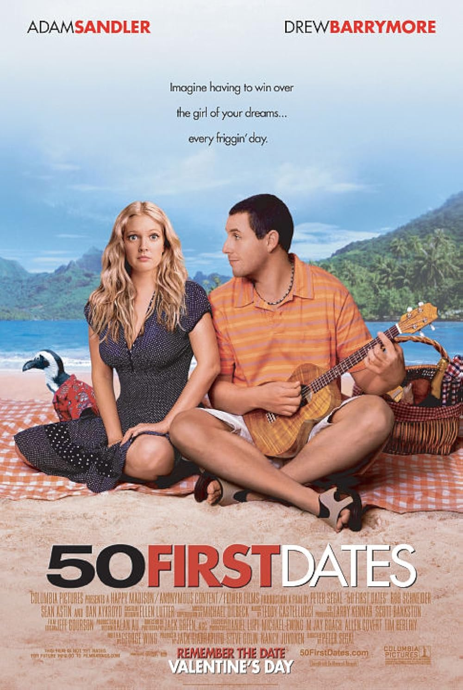 |  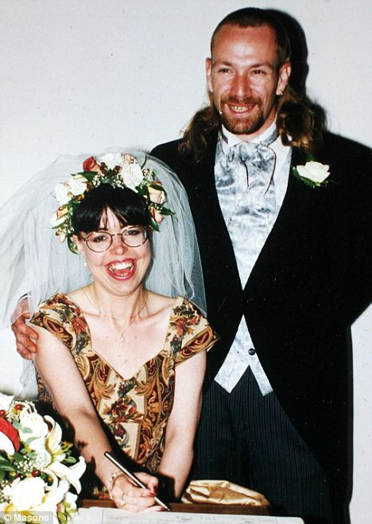
- [MYTAKE] It's more romantic because it's based on a true story. The fact that a real human being was able to keep a marriage with a person that forgets their memory daily is very warming