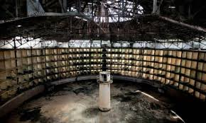

# When people ask me about it

Main idea 1: Changes in government/society can be understand by the change in forms of discipline and punishment

Main idea 2: The new main axiom of government/society is effeciency (which revolves around the idea that foucault has that knowledge is power)

Main idea 3: The consequences of the previous main ideas is that the state will use normalize power instead of repressive power. I remember my father tellilng me once that excessive effort is a sign of lack of skill

Book statement
- It is an analysis of the social and theoretical mechanisms behind the changes that occurred in Western penal systems during the modern age based on historical documents from France. Foucault argues that prison did not become the principal form of punishment just because of the humanitarian concerns of reformists. He traces the cultural shifts that led to the predominance of prison via the body and power. Prison is used by the "disciplines" – new technological powers that can also be found, according to Foucault, in places such as schools, hospitals, and military barracks

# Torture

Changes in state torture
- From the Middle Ages up to the 16th and 17th centuries in Europe, imprisonment was rarely used as a punishment in its own right, an d prisons were mainly to hold those awaiting trial and convicts awaiting punishment
- This statement is one of the great examples of foucault's main theory, which is that man is a historical invention
- Foucault begins by contrasting two forms of penalty: the violent and chaotic public torture of Robert-François Damiens, who was convicted of attempted regicide in the mid-18th century, and the highly regimented daily schedule for inmates from an early-19th-century prison (Mettray). These examples provide a picture of just how profound the changes in Western penal systems were after less than a century. Foucault wants the reader to consider what led to these changes and how Western attitudes shifted so radically

The intended purposes of torture (public) were
- (Visual proof of the power of the state) To make the secret public (according to Foucault, the investigation was kept entirely secret even from the accused). The secret of the investigation and the conclusion of the magistrates was justified by the publicity of the torture
- Reflecting the violence of the original crime onto the convict's body for all to see, in order for it to be manifested then annulled by reciprocating the violence of the crime on the criminal
- (Personfication of the law) Enacting the revenge upon the convict's body, which the monarch seeks for having been injured by the crime. Foucault argues that the law was considered an extension of the sovereign's body, and so the revenge must take the form of harming the convict's body

Some unintended consequences of torture were
- Providing a forum for the convict's body to become a focus of sympathy and admiration
- (Redistributing blame) the executioner rather than the convict becomes the focus of shame
- Creating a site of conflict between the masses and the sovereign at the convict's body. Foucault notes that public executions often led to riots in support of the prisoner. Frustration for the inefficiency of this economy of power could be directed towards and coalesce around the site of torture and execution

Changes in government personality -> changes in torture
- So it had to be reformed to allow for greater stability of property for the bourgeoisie
- It shows the impersonality of the state

# Discipline

More efficiency on the dominance
- Foucault's argument is that discipline creates "docile bodies", ideal for the new economics, politics and warfare of the modern industrial age – bodies that function in factories, ordered military regiments, and school classrooms
- Less use of repressive power and more of normalize power
- One could argue that the humanitarism itself is part of the normalization of power, because if the state is "human" then it's good, if it's good then I more willing to follow it's orders
- This reminds me a lot of Brave new world

Panopticon
- The Panopticon is a great illustration on the normalization of power, since the mind is completely controlled by psychological stimulus rather than actual physical effort
- The panopticion is a very efficient because you don't even know if there is somone watching, which reminds me of school. Therefore you don't need as many "employees" to domainte, but also if there was someone watching, people would be overwhelmed this is a proof of Foucault's idea of his vision on what is the modernization of the state.
- The panopticon was the ultimate realization of a modern disciplinary institution. It allowed for constant observation characterized by an "unequal gaze"; the constant possibility of observation. Perhaps the most important feature of the panopticon was that it was specifically designed so that the prisoner could never be sure whether they were being observed at any moment. The unequal gaze caused the internalization of disciplinary individuality, and the docile body required of its inmates. This means one is less likely to break rules or laws if they believe they are being watched, even if they are not. Thus, prisons, and specifically those that follow the model of the panopticon, provide the ideal form of modern punishment. Foucault argues that this is why the generalized, "gentle" punishment of public work gangs gave way to the prison. It was the ideal modernization of punishment, so its eventual dominance was natural

